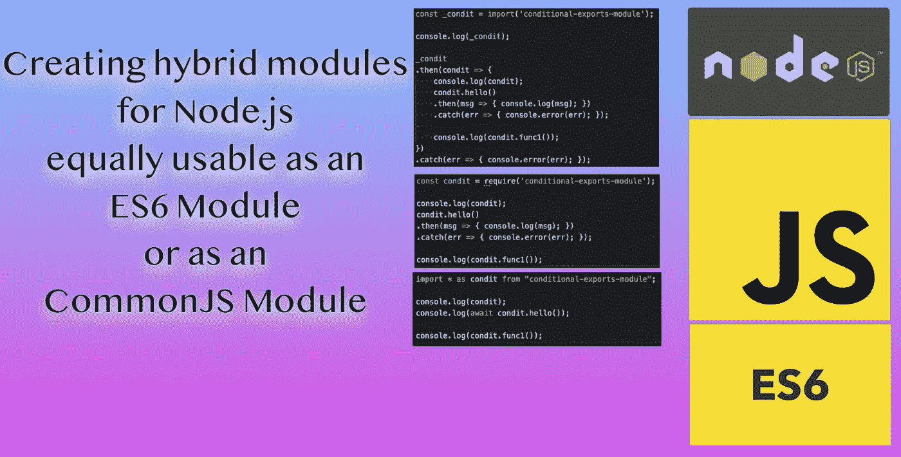

# 使用 ES6 模块创建 Node.js 包的完整指南，这些模块可从 CJS 模块轻松使用

> 原文：<https://levelup.gitconnected.com/complete-guide-to-creating-node-js-packages-with-es6-modules-that-are-easily-usable-from-cjs-module-db206e46fec9>



用 ES6 模块在 Node.js 上编写所有 JavaScript 代码是非常诱人的。但是这就产生了与大量现有 CJS 模块的互操作性问题。也就是说，很难从 CJS 模块使用 ES6 模块。Node.js 使得从一个 ES6 模块使用 CJS 和 ES6 模块变得很容易，CJS 模块可以很容易地使用 CJS 模块，但是 CJS 模块使用 ES6 模块是很痛苦的。与此同时，ES6 模块提供了足够吸引人的好处来保证重写我们的代码以从 CJS 转换到 ES6 模块。这意味着我们需要一种策略来方便地使用 CJS 模块中的 Node.js ES6 模块。

因为 Node.js 使用 Chrome 网络浏览器的 V8 JavaScript 引擎，所以它可以快速更新大多数最新的 JavaScript 特性。由于 V8 团队快速实现了新特性，Node.js 可以快速采用这些特性。例如，这意味着 Node.js 程序员可以快速采用最新的功能，如 ES6 模块，即使我们可能不愿意在浏览器端的 JavaScript 中这样做。

在 Node.js 的开始，我们使用的是 CommonJS (CJS)模块格式。在 Ryan Dahl 创建 Node.js 时，这是唯一可用的模块格式，所以这就是他所使用的。但是，ECMAScript 6 为 JavaScript 带来了许多奇妙的改进，其中之一是一种通用的模块格式 ES6 模块，它可以移植到浏览器端和服务器端的 JavaScript。如果没有其他原因，考虑将 CJS 模块重写为 ES6 模块的主要原因是为了从浏览器和服务器 JavaScript 中拥有相同的模块格式中获益。

但是软件工程的实用性在于 Node.js 上的 CommonJS 代码可能永远不会消失。重写工作代码的成本很高，而且不是所有的工程经理都会明白这样做的明智之处。这意味着我们必须制定出 ES6 和 CJS 模块之间兼容性的最佳实践。

ES6 和 CJS 模块之间的互操作性归结为:

*   在 ES6 模块中，我们使用`import`语句来加载 ES6 模块和 CJS 模块。
*   在 CJS 模块中，我们使用`require`语句来加载 CJS 模块。
*   在 CJS 模块中，我们通常不能加载 ES6 模块，但是*动态导入*特性给了我们可以加载 ES6 模块的`import()`功能。

你可能会想"*有什么问题吗？*“两种模块格式都可以加载另一种格式的模块。问题是`import()`函数返回一个承诺，这使得很难遵循将模块对象赋给全局变量的正常模式。有了`import`和`require`语句，将模块引用赋给一个易于使用的全局变量变得非常容易。但是因为`import()`是异步的，并且返回一个承诺，我们将使用的全局变量在一段时间内将具有值`undefined`，这是我们的代码必须适应的。

如果这是一个`require`语句，我们将能够立即使用该模块。这是因为`require`是同步操作，这意味着当`require`完成时，模块被完全加载。但是，使用`import()`加载 ES6 模块是异步的。实际上，在这个例子中，这意味着`es6module`将持有一个由`import()`函数返回的承诺。要使用这个承诺，要么需要`await`关键字，要么需要`.then`块。这两个都不方便。

使用 CJS 模块中的 ES6 模块有两种通用策略:

*   如果函数是异步的，它可以留在 ES6 模块中，可以使用`import()`导入。调用该函数可以适应由`import()`函数返回的承诺。
*   如果函数是异步的，实现函数的 ES6 模块必须重写为 CJS 模块，以便 CJS 模块可以使用`require`。最简单的方法是使用 transpiler，比如 Babel，来做这件事。

在本文中，我们将研究使用 ES6 和 CJS 模块的 Node.js 包的互操作性。特别是，我们将学习如何创建混合 Node.js 包，这些包使用 CJS 和 ES6 模块导出它们的 API。

有关一些背景信息，请参见以下文章:

[](https://techsparx.com/nodejs/esnext/dynamic-import-2.html) [## 通过在 Node.js 中使用动态导入，我们可以在 CommonJS 代码中导入 ES6 模块，并进行更多更新

techsparx.com](https://techsparx.com/nodejs/esnext/dynamic-import-2.html) [](https://techsparx.com/nodejs/esnext/esmodules-from-commonjs.html) [## 在 Node.js CommonJS 模块中加载 ES6 模块

techsparx.com](https://techsparx.com/nodejs/esnext/esmodules-from-commonjs.html) 

# 在 CJS 和 ES6 模块中加载模块

在继续之前，让我们回顾一下模块是如何在 CJS 和 ES6 代码中加载的。当 Ryan Dahl 创建 Node.js 时，CommonJS 模块格式(CJS)是唯一可用的选择。因为 CJS 模块格式是唯一可用的选择，所以它的使用有很大的惯性。

对于加载另一个 CJS 模块的 CJS 模块:

```
const fsextra = require('fs-extra'); 
const path = require('path'); 
const fs = require('fs/promises'); 
const apputil = require('./app-utils.js'); 
const myLocalModule = require('./path/myLocalModule'); 
const jsonData = require('./path/filename.json');
```

这些是使用 CJS 语句的几个例子。前三个加载包安装在一个`node_modules`目录下。接下来的三个引用本地模块文件。`require`不需要指定带有扩展名的完整文件名，因为 Node.js 会根据它在文件系统中找到的文件直觉地做什么。我们还可以使用`require`加载 JSON 数据。

`fs`包并不是唯一支持附属包的包。在 Node.js 中，访问子包需要正确的*需求说明符*，它遵循模式*模块名/子模块名*。

正如我们前面所说的，`require`语句是同步的，这意味着当`require`结束时模块被完全加载。该模块不是在后台延迟加载的，而是可以立即使用的。我们稍后会看到为什么这很重要。

对于 ES6 模块，我们使用`import`语句加载 CJS 或 ES6 模块:

```
import fsextra from 'fs-extra'; 
import path from 'path'; 
import { promises as fs } from 'fs'; // alternatively: import { * as fs } from 'fs/promises'; 
import { unlink as fsunlink } from 'fs/promises'; 
import apputil from './app-utils.js'; 
import myES6Module from './path/myES6Module/index.mjs';
```

ES6 `import`语句有很多功能，这些例子只触及了皮毛。像 CJS 一样，像`path`这样的简单模块说明符简单地加载已安装的`path`模块。`{ foo }`符号让您只能从指定的模块中加载特定的项目。`{ foo as foobar }`符号允许您给它一个不同的名称。例如，我们将来自`fs`模块的`promises`对象命名为`fs`，将来自`fs/promises`模块的`unlink`函数命名为`fsunlink`。

模块说明符实际上是一个 URL。Node.js 支持`file:` URL，出于安全原因不支持`http:` URL。如果你需要的话，你可以安装一个 HTTP URL 处理器。为了方便起见，Node.js 透明地将文件名转换成 URL。

要加载像 JSON 这样的数据文件，需要使用一个`data:` URL。我们不会在这里讨论这个。

回到 CJS 模块，我们说过加载一个 ES6 模块需要`import()`函数。为此:

```
import('./path/myES6Module/index.mjs') 
.then(myES6Module => {
     // use the module
})
.catch(err => { console.error(err); }); // Alternative 
(async () => {
   const myES6Module = await import('./path/myES6Module/index.mjs');
   // use the module
})()
.catch(err => console.error(err));// Alternative 
let myES6Module;
(async () => {
     myES6Module = await import('./path/myES6Module/index.mjs'); 
})().catch(err => console.error(err));
```

因为加载 ES6 模块是异步的，所以`import()`函数也是异步的。这意味着`import()`函数返回一个承诺。您可以使用`.then` / `.catch`块来处理承诺，或者在`async`函数中使用`await`关键字。在这两种情况下，模块引用都是在函数内部传递的，因此很难创建一个可靠地保存引用的全局变量。全局变量`myES6Module`要么有值`undefined`，要么是模块引用。任何使用该全局变量的代码都必须检测它当前拥有的值，并适应它不包含模块引用的时间。

前面提到了另一种模式:

```
const myES6Module = import('./path/myES6Module/index.mjs');
```

变量`myES6Module`将包含一个承诺，最终该承诺将转变为*已解决*或*已拒绝*状态。但是留给您的问题是等待模块完成加载，并在模块加载失败时处理任何错误。这意味着使用`.then` / `.catch`块，或者在`async`函数中使用`await`关键字。

现在我们已经设置了上下文，让我们探索解决方案。我们将首先学习如何适应模块引用，这些引用可以是未定义的、未解决的承诺或已解决的承诺。

# 使用 ES6 模块编写的混合 Node.js 包，其中 CJS 模块包含公共 API

有多种方法可以让 CJS 模块轻松使用 ES6 包。在这一节中，我们将从围绕 ES6 模块实现 CJS *包装模块*开始。也就是说，我们将使用 ES6 模块编写我们的代码，但为了从 CJS 模块使用，我们将提供一个瘦 CJS 模块，其函数只需调用 ES6 模块中的相应函数。加载 ES6 模块需要使用`import()`功能。

为了给我们提供一个讨论问题的坚实基础，让我们考虑一下从`node_modules`目录中随机选取的一个包:

```
$ tree node_modules/micromatch/
node_modules/micromatch/
├── CHANGELOG.md
├── LICENSE
├── README.md
├── index.js
└── lib
     ├── cache.js
     ├── compilers.js
     ├── parsers.js
     └── utils.js
```

`lib`中的文件就是我所说的*内部模块*。`index.js`中的代码是公共 API。它的代码使用内部模块中的函数，但是这些模块不应该被包外的其他代码使用。

第一步是将`lib/**.js`模块重构为 ES6 模块。这不仅仅需要重命名文件，还需要将任何对`module.exports`对象的赋值改为等价的`export`语句。在 ES6 模块中，数据和函数通过`export`语句导出。

```
$ tree node_modules/micromatch/ 
node_modules/micromatch/ 
├── CHANGELOG.md 
├── LICENSE 
├── README.md 
├── index.js 
└── lib
     ├── cache.mjs
     ├── compilers.mjs
     ├── parsers.mjs
     └── utils.mjs
```

这就给我们留下了作为 CJS 模块的`index.js`，我们需要使其可被 ES6 和 CJS 模块使用，并且内部模块是 ES6 格式的。由于我们在`index.js`中什么都没做，模块将会失败。

在`index.js`中，我们看到这段代码:

```
var compilers = require('./lib/compilers'); 
var parsers = require('./lib/parsers'); 
var cache = require('./lib/cache'); 
var utils = require('./lib/utils');
```

这就是我们对 CJS 模块加载内部 CJS 模块的期望。第一步是这种转换:

```
const compilers = import('./lib/compilers.mjs'); 
const parsers = import('./lib/parsers.mjs'); 
const cache = import('./lib/cache.mjs'); 
const utils = import('./lib/utils.mjs');
```

使用`require`语句，我们可以省去文件扩展名，Node.js 凭直觉知道该做什么。对于 ES6 `import`语句或`import()`函数，我们需要提供文件扩展名。我们还将`var`改为`const`,因为使用`const`来实现这个目的是一个最佳实践。

需要记住的关键是，这些全局变量现在有了 Promise 对象，而不是模块引用。因此，包仍然会失败，因为对这些对象的现有引用将找不到预期的模块引用。

当我们进一步检查代码时，发现了一个问题:

```
function micromatch(list, patterns, options) {
  patterns = utils.arrayify(patterns);
  list = utils.arrayify(list);
  ...
}
```

我们用来重写这个函数的任何路径都需要将它从同步函数转换为异步函数。本例中的`micromatch`包显然导出了同步函数，它的 API 切换到异步函数是没有意义的。

例如，一个选项是:

```
async function micromatch(list, patterns, options) {
   patterns = (await utils).arrayify(patterns);   
   list = (await utils).arrayify(list);   
... 
}
```

使用`await`关键字是等待 Promise 对象解析的最干净的方法。但是使用它需要将`micromatch`函数重新声明为`async`，然后必须为此重写该函数的调用方。如果我们使用`.then` / `.catch`来等待 Promise 对象解析，情况也是如此。

显然，如果`micromatch`函数是异步的，那么我们就可以完成这项任务。这就是为什么我们之前描述了异步和同步函数之间的区别。为了使`micromatch`保持同步功能，它不能执行任何异步动作。

让我们稍微改变一下方向，考虑一个不同的包，我们可以称之为`asyncmatch`。

```
$ tree node_modules/asyncmatch/ 
node_modules/asyncmatch/
├── CHANGELOG.md 
├── LICENSE 
├── README.md 
├── index.js 
└── lib
   ├── compilers.mjs
   └── utils.mjs
```

为了便于讨论，我们稍微改变了一下名称和内容，以考虑一个公开异步 API 的包。和以前一样，`index.js`会有这样的说法:

```
const compilers = import('./lib/compilers.mjs'); 
const utils = import('./lib/utils.mjs');
```

然后，当`index.js`开始实现 API 函数时，它将遵循这种模式:

```
async function asyncmatch(list, patterns, options) {
   patterns = (await utils).arrayify(patterns);
   list = (await utils).arrayify(list);   
... 
}
```

作为一个`async`函数，我们可以很容易地在`asyncmatch`中使用`await`关键字。因此`(await utils).arrayify`自动处理`utils`变量中的承诺。

因此，这是实现调用 ES6 模块中函数的 CJS 模块的一种模式。公共 API 是一个 CJS 模块，任何 Node.js 应用程序都可以自动轻松地使用它。内部模块采用 ES6 模块格式并不限制哪些应用程序可以使用该包。

为了让这更真实一点，让我们尝试一些实际的代码。代码片段可以在位于 https://github.com/robogeek/async-javascript-examples[的一个名为`hybrid-es6-cjs-module`的目录中找到。](https://github.com/robogeek/async-javascript-examples)

我们从 ES6 模块`hello.mjs`开始，它包含:

```
export async function hello() {
     return "Hello, world!"; 
}
```

因为这被声明为一个`async`函数，所以它返回一个承诺。

然后我们创建一个 CJS 模块`index.js`，包含:

```
const aasync = import('./async.mjs'); console.log(aasync); async function hello() {
    let ret = (await aasync).hello();     
    console.log(aasync);
    return ret;
}
module.exports.hello = hello;
```

第一部分使用`import()`加载 ES6 模块。然后我们实现一个`async`函数，它将成为这个包的公共接口。该`hello`函数调用`async.mjs`中的`hello`函数。

这当然是高度人为的。重点是我们在 CJS 模块中创建了一个`async`函数，它在内部 ES6 模块中公开了另一个`async`函数。任何使用这个包的应用程序都将使用`index.js`中的 API。好处是`index.js`是 CJS 格式，可以很容易地从其他 CJS 模块中使用。

这里有`console.log`语句，所以我们可以在不同的时间点检查`aasync`中模块引用的内容。

为了测试这一点，创建一个名为`test.js`的文件，包含:

```
const cjshello = require('./index.js');async function callHello() {
     let h = await cjshello.hello();
     console.log(h); 
}callHello()
.then(() => { console.log('callHello SUCCESS'); })
.catch(err => { console.log('callHello ERROR ', err); });
```

这个脚本是用来模拟使用这个包的应用程序的，而`callHello`函数是用来模拟使用这个包的。它调用`hello`函数，使用`await`来处理每个承诺，然后打印结果。然后在底部，我们使用`.then`和`.catch`块调用`callHello`来处理承诺。

输出如下所示:

```
$ node test.js  
Promise { <pending> } 
Promise { [Module] { hello: [AsyncFunction: hello] } } 
Hello, world! 
callHello SUCCESS
```

我们看到，在第一个`console.log`中，承诺如预期的那样处于*待定*状态。但是`await`关键字，不出所料，一直等到承诺成功解析。我们得到了预期的消息，以及`SUCCESS`指示器。第二个`console.log`如预期的那样，显示了承诺被解析，并且它包含一个`Module`对象。

假设您的公共 API 需要使用回调风格的函数。将此添加到`index.js`:

```
function helloCB(done) {
     aasync.then(m => {
         m.hello()
         .then(msg => { done(undefined, msg); })
         .catch(err => { done(err); });
     })
     .catch(err => {         done(err);     }); 
}
module.exports.helloCB = helloCB;
```

记住`aasync`包含从`import()`函数返回的承诺，我们使用`.then` / `.catch`块来处理它。在`.then`中，我们调用`hello`函数，同样使用`.then` / `.catch`块。提供了一个回调函数，我们在典型的 Node.js 回调函数的*错误优先*模式中使用它。

这应该提醒我们功能的巨大收益。不使用`async`函数来实现这一点意味着使用两层`.then` / `.catch`块来处理每个承诺。确保捕捉到每个错误需要一些耐心来添加每个所需的`.catch`块。

然后我们可以对`test.js`做一点调整:

消息现在指示哪个函数打印该消息。结果输出如下所示:

```
callHello() 
.then(() => { console.log('callHello SUCCESS'); }) 
.catch(err => { console.log('callHello ERROR ', err); }) cjshello.helloCB((err, msg) => {
     if (err) {
         console.log('helloCB ERROR ', err);
     } else {
         console.log('helloCB SUCCESS ', msg);
     }
});
```

消息现在指示哪个函数打印该消息。结果输出如下所示:

```
$ node test.js  
Promise { <pending> } 
Promise { [Module] { hello: [AsyncFunction: hello] } } 
helloCB SUCCESS  Hello, world!
Hello, world!
callHello SUCCESS
```

我们刚刚证明了一些重要的事情。我们可以使用 ES6 模块格式实现 Node.js 包的内部模块，并使用 CJS 模块公开公共 API。然而，这种方法只适用于公开的 API 已经是异步的情况。

# 在 Node.js `package.json`中为混合 CJS/ES6 模块使用条件导出

我们已经证明，我们可以在 Node.js 包中使用 ES6 模块，并创建一个 CJS 接口模块，使该模块可以很容易地从 CommonJS 代码中使用。但是对于 ES6 模块来说，最好是直接加载 ES6 模块，而不是通过中间的 CJS 模块工作。

从 Node.js v12.7.0 开始，我们能够向`package.json`添加一个`exports`字段。该字段的一个目的是声明如何处理辅助模块。例如:

```
{
     "name": "module-name",
     ...
     "main": "index.js",
     "exports": {
         ".": "./index.js",
         "promises": "./promises/index.js"
     },
     ... 
}
```

这表明包的主接口是`index.js`，包引用`module-name/promises`解析为`promises/index.js`。

这个特性的一个变体是*条件导出*，它根据不同的条件映射到不同的文件路径。我们将使用的条件是模块是使用`require`还是`import`加载的。也就是说，上述内容可以写成:

```
{
     "name": "module-name",
     ...
     "main": "index.js",
     "exports": {
         ".": {
             "require": "./index.js",
             "import": "./index.mjs",
         },
         "promises": {
             "require": "./promises/index.js",
             "import": "./promises/index.mjs",
         }
     },
     ... 
}
```

这是条件导出的嵌套形式。对于每个字段，我们有两个字段`require`和`import`。当使用`require`语句请求模块时，`require`字段告诉 Node.js 在哪里查找，并且从`import`语句使用`import`字段。

让我们看一个真实的例子。在[https://github.com/robogeek/async-javascript-examples](https://github.com/robogeek/async-javascript-examples)存储库中，您会找到一个名为`conditional-exports`的目录。在该目录中有一个目录`module`，包含:

```
$ tree module/ 
module/ 
├── index.js 
├── index.mjs 
└── package.json
```

从`index.mjs`开始:

```
export async function hello() {
     console.log('in ES6');
     return "Hello, world!"; 
}
```

如果这是一个真实的 Node.js 包，那么这个模块会有比这更有趣的功能，但是这对于探索这个特性已经足够了。也就是说，我们有异步函数。

`index.js`中的内容如下:

```
const _index = import('./index.mjs');
 module.exports.hello = async function() {
     console.log('in CJS');
     return (await _index).hello(); 
}
```

这是`index.mjs`中 ES6 模块周围的*包装器*。模式是，对于内部模块中的每个函数，实现一个包装函数，如`index.js`中所示。

假设您的包需要支持同步功能。我们不能在`index.mjs`中实现它，然后在`index.js`中使用包装函数。相反，创建一个名为`shared.js`的文件，包含:

```
module.exports.func1 = function() {
     return "Synchronous shared function"; 
}
```

因为这个同步功能在 CJS 模块中，所以可以用`require`加载到`index.js`中，用`import`加载到`index.mjs`中。在这两种情况下，它将保持同步功能。

在`index.mjs`中，我们这样导出这个函数:

```
export { func1 } from './shared.js';
```

这就是所谓的重新导出，其中的`export`语句表示它正在导出从另一个模块导入的东西。

在`index.js`中，我们将做同样的事情，但需要两步:

```
const shared = require('./shared.js'); 
... 
module.exports.func1 = shared.func1;
```

为了圆满完成这个任务，`package.json`:

```
{
   "name": "conditional-exports-module",
   "main": "index.js",
   "exports": {
     "require": "./index.js",
     "import": "./index.mjs"
   },
   "type": "commonjs"   
   ... 
}
```

这是条件导出的简单形式，其中只有一个导出。

`type`字段表示将扩展名为`.js`的文件视为 CommonJS。如果`type`字段显示为`module`，那么使用 CJS 文件将需要`.cjs`扩展名，并且带有`.js`扩展名的文件将被解释为 ES6 模块。

为了测试这一点，创建另一个名为`test`的目录作为`module`目录的同级，包含:

```
$ tree test/ test/ 
├── package.json 
├── test.js 
└── test.mjs
```

我们将使用`test.js`来验证加载 CJS 接口，使用`test.mjs`来验证加载 ES6 接口。

在`test.mjs`我们有:

```
import * as condit from "conditional-exports-module"; console.log(condit); 
console.log(await condit.hello());
console.log(condit.func1());
```

请注意，在`module/package.json`中，我们为包使用了这个模块名。这只是使用`import`语句来加载模块，然后我们打印调用`hello`函数的结果。因为那个函数是`async`我们用`await`。

如果你不知道，Node.js 最近获得了在 ES6 模块顶层使用`await`的能力。这就是我们在这里所做的。要了解更多信息，请参见: [Node.js 脚本编写者:顶级异步/等待现已推出](https://techsparx.com/nodejs/async/top-level-async.html)

在`test.js`中，我们有:

```
const condit = require('conditional-exports-module');console.log(condit);
condit.hello() 
.then(msg => { console.log(msg); }) 
.catch(err => { console.error(err); }); console.log(condit.func1());
```

注意，我们使用了`require`而不是`import()`。这意味着我们可以直接使用模块引用，而不必消除任何 Promise 对象的歧义。因为`hello`函数被定义为异步的，并且顶层`await`在 CJS 模块中不可用，所以我们必须使用`.then` / `.catch`块来处理产生的承诺。

所需的`package.json`是:

```
{
   "name": "conditional-exports-test",
   "main": "test.js",
   "scripts": {
     "test": "npm run test:js && npm run test:es6",
     "test:js": "node test.js",
     "test:es6": "node test.mjs"
   }
   ... 
}
```

我们可以使用`scripts`字段来帮助我们运行测试程序，如果没有别的作用的话。

要进行设置，首先运行:

```
$ cd test
$ npm install ../module
```

这将创建一个`node_modules`目录，并在那里安装软件包。下次运行:

```
$ npm test  
> conditional-exports-test@1.0.0 test /Volumes/Extra/nodejs/async-javascript-examples/conditional-exports/test 
> npm run test:js && npm run test:es6 > conditional-exports-test@1.0.0 test:js /Volumes/Extra/nodejs/async-javascript-examples/conditional-exports/test 
> node test.js { hello: [AsyncFunction (anonymous)], func1: [Function (anonymous)] } 
in CJS 
Synchronous shared function 
in ES6 
Hello, world! > conditional-exports-test@1.0.0 test:es6 /Volumes/Extra/nodejs/async-javascript-examples/conditional-exports/test 
> node test.mjs[Module] {
   func1: [Function (anonymous)],
   hello: [AsyncFunction: hello]
}
in ES6
Hello, world!
Synchronous shared function
```

我们看到，为了运行`test.js`脚本，它首先调用 CJS 模块中的函数，然后调用 ES6 模块中的函数。对于`test.mjs`脚本，它只调用了 ES6 函数。

这正是我们想要的。首先，我们有 CJS 和 ES6 模块格式的包的并行实现。我们可以轻松使用 CJS 或 ES6 模块中的任何一个，并轻松访问适当的实施。

还有第三个场景要测试，那就是从 CJS 模块中使用`import()`。为此，创建`test-es6.js`包含:

```
const _condit = import('conditional-exports-module');console.log(_condit);
_condit .then(condit => {
     console.log(condit);
     condit.hello()
     .then(msg => { console.log(msg); })
     .catch(err => { console.error(err); }); console.log(condit.func1()); 
})
.catch(err => { console.error(err); });
```

注意，对于其中的每一个，模块说明符都保持不变。神奇正在`package.json`发生。

无论如何，记住`import()`返回一个承诺，这个承诺必须首先被解决。然后我们有一个异步函数，`hello`，它返回一个必须解决的承诺。因此，测试需要正确构建两层`.then` / `.catch`。

运行测试，我们得到:

```
$ node test-es6.js Promise { <pending> } 
[Module] {
 func1: [ (anonymous)],
 hello: [AsyncFunction: hello]
} 
in ES6 
Synchronous shared function 
Hello, world
```

这也正是我们想要的。因为我们使用了`import()`，函数调用直接到达 ES6 实现，跳过了 CJS 包装器模块。

为了实现同步功能，我们将它放入一个共享的 CJS 模块中。但是如果我们希望所有的代码都在 ES6 模块中，同时保持部分(或全部)功能同步，那该怎么办呢？显然，我们不能通过使用`import()`函数从 CJS 模块中访问这些函数来做到这一点。

还有一种方法，就是用 Babel 这样的 Transpiler 把 ES6 模块改写成 CJS。

# 用 Babel 编译一个混合的 CJS/ES6 Node.js 包

我们还没有开发出创建包含 CJS 和 ES6 实现的混合 Node.js 包的最佳方式。我们已经展示了我们可以用与 ES6 模块相同的 API 手工制作一个 CJS 模块。但是还有一个问题，就是可维护性。手工制作 CJS 包装器模块并不是什么最佳实践，因为我们可能会忽略在每次 API 更新时更新包装器。

在 JavaScript 生态系统中有一个神奇的工具，Babel，它是一个 *Transpiler* 。这个词是*翻译*和*编译*的混搭，是关于将源代码从一种编程语言转换成另一种编程语言。就 Babel 而言，它的重点是 JavaScript 转换，例如作为一种工具，自动转换尖端的 JavaScript 功能，以便在较旧的 JavaScript 引擎上运行。在这种情况下，我们将使用它将我们的 ES6 模块转换为 Node.js CommonJS 模块。

首先复制`module`目录及其内容，作为`module-babel`。您可以在前面提到的 Github 存储库中找到它。

删除`index.js`和`shared.js`，因为我们不再需要它们。并且，在`index.mjs`中添加此功能:

```
export function func1() {
     return "Synchronous ES6 function";
}
```

这是已经在`shared.js`中的`func1`的重新实现。这就给我们留下了一个文件`index.mjs`，其中包含了我们的整个 API 实现。

要安装 Babel，请运行以下命令:

```
$ npm install @babel/core --save-dev 
$ npm install @babel/cli --save-dev 
$ npm install @babel/plugin-transform-modules-commonjs --save-dev
```

这将安装 Babel 和它的 CLI 工具。这里命名的插件将 ES6 模块代码转换成 CommonJS 格式。

接下来，创建一个名为`.babelrc`的文件，其中包含:

```
{ "plugins": [ "@babel/plugin-transform-modules-commonjs" ] }
```

这会将 Babel 配置为使用该插件。

接下来，将以下`scripts`条目添加到`package.json`:

```
"scripts": {
     "build": "babel index.mjs --out-file index.js" 
},
```

这是将单个 ES6 文件编译成 CommonJS 格式的命令。巴别塔有比这更多的选择，这是对巴别塔非常简单的使用。

运行脚本:

```
$ npm run build  
> conditional-exports-module@1.0.0 build /Volumes/Extra/nodejs/async-javascript-examples/conditional-exports/module-babel 
> babel index.mjs --out-file index.js
```

结果是:

```
"use strict";  
Object.defineProperty(exports, "__esModule", {
   value: true
});exports.hello = hello;
exports.func1 = func1;async function hello() {
   console.log('in ES6');
   return "Hello, world!"; 
}
function func1() {
   return "Synchronous ES6 function"; 
}
```

这是一个非常合理的模块 CJS 再现。唯一的问题是 ES6 中的跟踪输出说*不再正确。哦好吧。*

现在让我们再次设置`test`目录。可能已经有一个`node_modules`目录安装了`../module`中的包。我们现在想使用`../module-babel`，所以运行这个:

```
$ cd ../test 
$ rm -rf node_modules 
$ npm install ../module-babel
```

我们现在可以运行测试程序并获得以下输出:

```
> conditional-exports-test@1.0.0 test:js /Volumes/Extra/nodejs/async-javascript-examples/conditional-exports/test 
> node test.js { hello: [AsyncFunction: hello], func1: [Function: func1] } 
in ES6 
Synchronous ES6 function 
Hello, world! > conditional-exports-test@1.0.0 test:es6 /Volumes/Extra/nodejs/async-javascript-examples/conditional-exports/test 
> node test.mjs [Module] {
 func1: [Function: func1],
 hello: [AsyncFunction: hello] 
} 
in ES6 
Hello, world! 
Synchronous ES6 function
```

不同的输出顺序是`hello`作为异步函数的一个简单副产品。无论如何，我们得到了我们期望的输出。

# 在 TypeScript 中实现包，编译到 CJS 和 ES6 模块

JavaScript 语言中添加的 ECMAScript 并不是唯一的游戏。另一个主要参与者是类型脚本语言。它的模块格式类似于 ES6 格式，我们可以直接重用 ES6 文件作为类型脚本文件。TypeScript 给游戏带来的是比 JavaScript 语言更强的类型检查。是的，JavaScript 程序员习惯于基本上没有类型检查。但是随着我们的程序变得越来越大，编译器通过静态检查我们的代码来帮助我们是有用的，这就是 TypeScript 的编译器所做的。

一些编程团队会接受这个想法，因此开发是在 TypeScript 中完成的。然而，运行时仍然是 JavaScript，这意味着在运行之前必须编译代码。一些 JavaScript 程序员觉得这很奇怪，但是我们这些用 Java 或 C 或 Pascal 或 PL/1 或许多其他编译语言编写过代码的人已经习惯了。

TypeScript 编译器支持编译成许多不同的输出格式。通过适当的配置，我们可以引导它为 Node.js 生成 CommonJS 文件和 ES6 文件。

让我们将`module`目录复制为`module-typescript`。然后删除`module-typescript/index.js`，将`module-typescript/index.mjs`改名为`index.ts`。因为 TypeScript 可以编译 ES6 模块，所以没有进一步的更改。然而，了解 TypeScript 的一长串有用特性是值得的。

TypeScript 的文件扩展名是`.ts`，在这个目录中，我们将在`.ts`文件中编码。我们将使用编译器生成`.cjs`和`.mjs`文件。

若要安装 TypeScript 编译器，请运行以下命令:

```
$ npm install typescript
```

若要熟悉，请键入:`tsc --help`

在`package.json`中增加此`scripts`部分:

```
"scripts": {
     "build": "npm run build:cjs && npm run build:es6",
     "build:cjs": "tsc --target es2018 --module commonjs index.ts && mv index.js index.cjs",
     "build:es6": "tsc --types --sourceMap --declaration --declarationMap --target es2018 --module es2020 index.ts && mv index.js index.mjs" 
},
```

`--target`选项描述要使用的 ECMAScript 语言的版本。使用`es2018`给了我们需要的语言特性。

`--module`选项描述了要使用的模块格式。对于 Node.js，我们使用`commonjs`，对于 ES6 模块，我们使用`es2020`。

`--types --sourceMap --declaration --declarationMap`选项告诉 TypeScript 生成描述文件中使用的类型的元数据文件。这些类型可以在编译其他包时使用，以帮助 TypeScript 进行更好的类型检查。

和 Babel 一样，我们仅仅触及了 TypeScript 编译器的皮毛。无论如何，下一个任务是运行`npm run build`来生成可运行的 CJS 和 ES6 文件。

通过添加这些声明来结束`package.json`:

```
"main": "index.js", 
"exports": {
     "require": "./index.cjs",
     "import": "./index.mjs" 
},
"type": "commonjs", 
"types": "./index.d.ts",
```

注意，我们为 CJS 模块使用了文件扩展名`.cjs`。这是因为我们无法解决如何让`tsc`将编译后的文件输出到一个特定的文件名。相反，请注意，它将编译后的文件输出为`index.js`，然后我们将其重命名为另一个文件名。

另外增加的是`types`字段。这对于声明类型定义文件的存在很重要。

与 Babel 示例一样，我们需要将包重新安装到`test`目录中。运行这些命令:

```
$ cd ../test 
$ rm -rf node_modules 
$ npm install ../module-typescript 
$ npm test
```

测试程序应该像以前一样运行，没有变化。

# 处理 Node.js 混合 CJS/ES6 模块中的边缘情况

在混合 CJS/ES6 模块的 Node.js 文档中，有一个关于我们之前没有讨论的边缘情况的警告。也就是说，当应用程序通过其 CJS 和 ES6 接口使用混合包时会发生什么？在很大程度上，这不是一个问题，但有一个问题。

假设您的 ES6 代码声明了一个类，如下所示:

```
export class Hello {
     world() { return "Hello World"; }
     async world2() { return "Hello World"; } 
}
```

你尽职尽责地将它放入`index.mjs`，Babel 或 TypeScript 将它转换成 CJS 模块`index.js`中的等价代码。在这种情况下，Hello 类在每个。但是，在您的应用程序中，这样的语句会发生什么情况:

```
if (obj instanceof Hello) { ... }
```

从技术上讲，Hello 类在`index.js`和`index.mjs`中的实现是不同的。即使它们是完全相同的结构，它们也是不同的类定义，因此不是同一个类。

可能发生的情况是应用程序同时包含 ES6 和 CJS 模块。我们已经看到，使用`import`或`require`会导致在`package.json`的条件导出中使用不同的路径，最终导致加载不同的文件。这意味着在 ES6 模块中使用了一个 Hello 实现，而在 CJS 模块中使用了另一个 Hello 实现，尽管两者来自同一个包。

治疗方法与我们之前使用的`shared.js`策略相同。让我们在`module-typescript`中尝试一下。

将类定义代码放入 CJS 模块(`shared.js`)中，该模块包含:

```
module.exports.Hello = class Hello {
     world() { return "Hello World"; }
     async world2() { return "Hello World async"; } 
}
```

然后在`index.ts`中添加以下内容:

```
export { Hello } from './shared.js';
```

这演示了从 CJS 模块进行重新导出的工作方式，就像之前对 ES6 模块所做的那样。

运行`npm run build`后，检查生成的代码。在`index.js`和`index.mjs`中，你会发现 Hello 类是从`shared.js`中的声明派生出来的。这将确保`obj instanceof Hello`总是正确地识别类。

# 摘要

在本教程中，我们学习了如何构建一个 Node.js 包来支持基于 CommonJS 和 ES6 的用法。为此，我们开发了一个包含相同代码的并行实现的混合包。我们还了解了一个高级的`package.json`特性，它让我们显式地声明一个包的导出。

通过学习这些，您已经消除了在 Node.js 包中完全包含 ES6 模块的一个障碍。这是因为您现在知道如何确保您的客户能够轻松使用该产品包，无论他们使用的是 ES6 还是 CJS 模块。

*原载于*[*https://techsparx.com*](https://techsparx.com/nodejs/esnext/esm-to-cjs.html)*。*