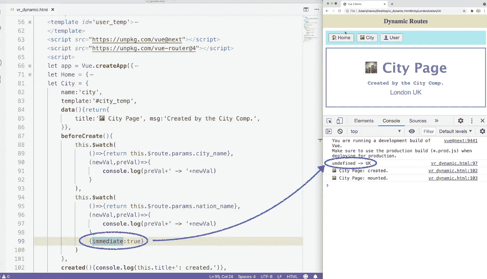
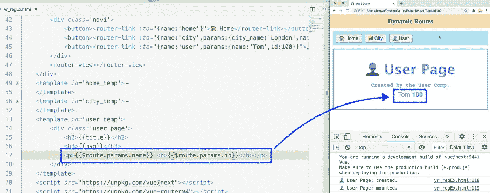
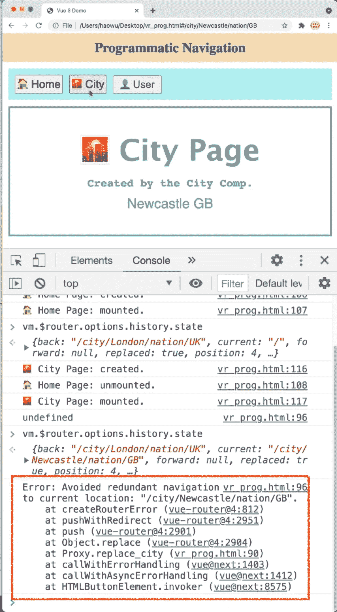
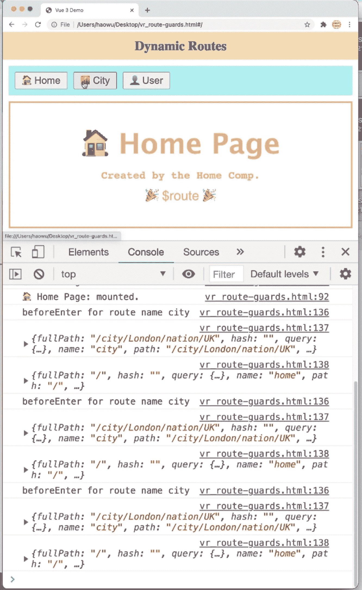
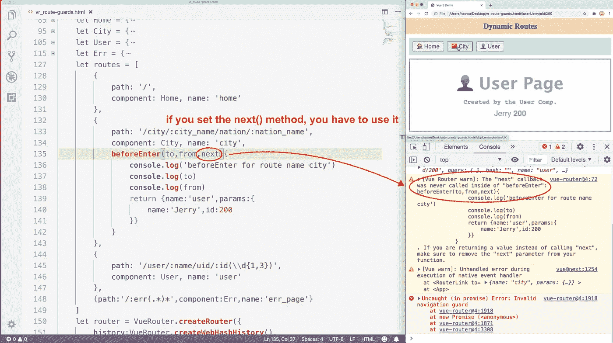
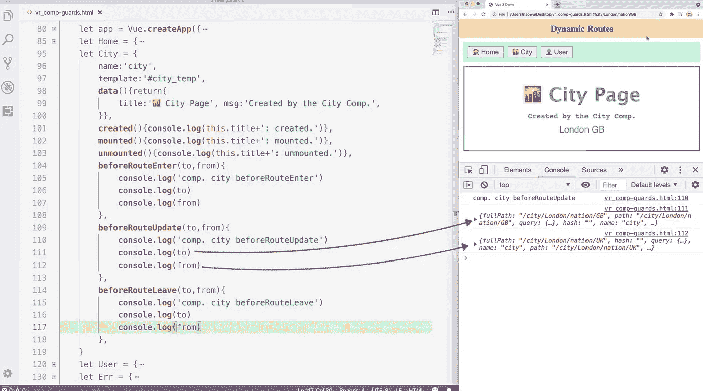
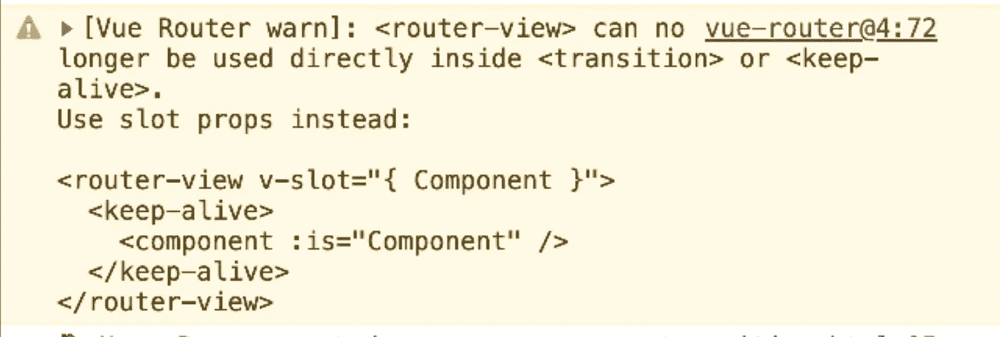
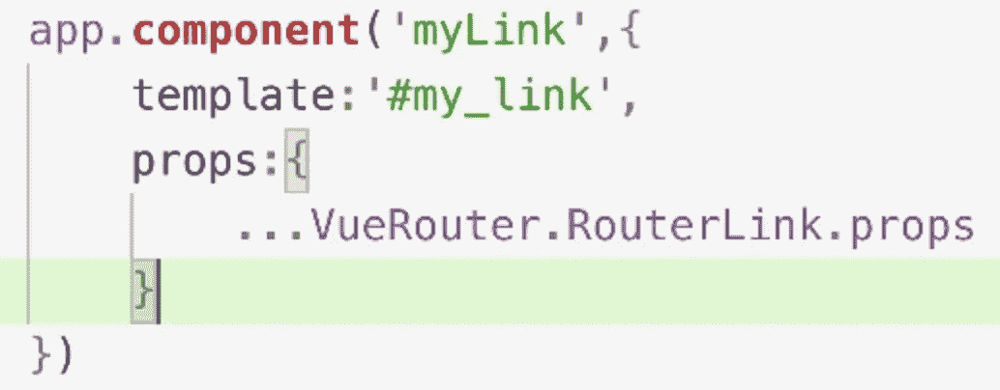
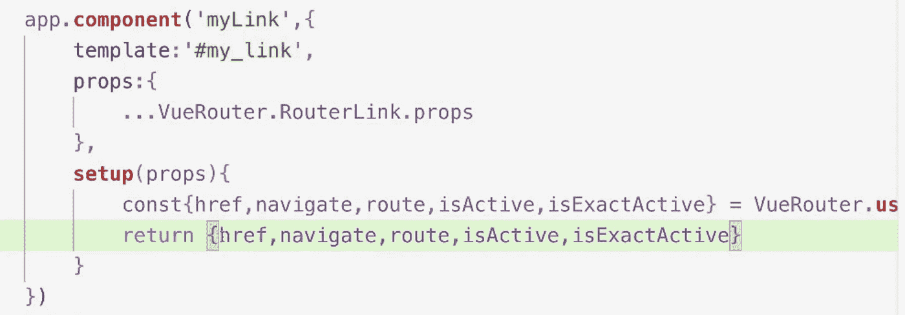
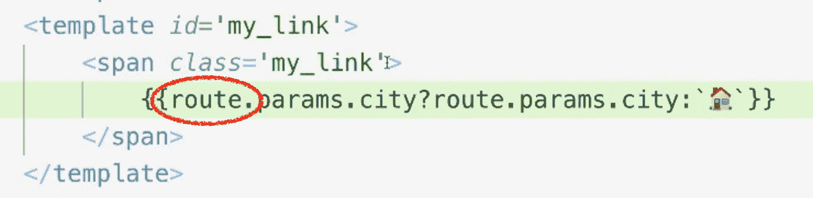

# 完整的 Vue 路由器 4 指南:基础知识、编程路由、导航保护、过渡效果和合成 API

> 原文：<https://levelup.gitconnected.com/complete-vue-router-4-guide-basics-programmatic-routing-navigation-guards-transition-effects-31b21a2f444d>

查看完整的视频课程:

[https://www.udemy.com/course/complete-vuejs-3-course/?referral code = 75f 591 e 320 BC 4 ea 22188](https://www.udemy.com/course/complete-vuejs-3-course/?referralCode=75F591E320BC4EA22188)

# 基础知识介绍

Vue 程序是一个单页应用程序。Vue 页面由一个或几个 Vue 组件组成。为了给用户呈现不同的页面，我们只需要把不同的 Vue 组件堆叠在一起。

管理组件最简单的方法是使用动态组件。`is` 属性决定安装哪个组件。我们用 v-bind 指令给`is` 属性加前缀，并给它分配一个动态值。通过改变分配给`is` 属性的值，我们可以切换组件。

正在显示的内容发生了变化，但实际上，我们从未离开过当前页面。地址框中的 URL 从未改变。我们所做的只是通过组件标签切换显示的组件。这就是为什么浏览器的前进和后退按钮仍然被禁用。

但是从用户的角度来看，他们访问了三个不同的页面。这三个按钮就像普通的导航按钮一样。每当他们点击一个按钮，就会出现一个新的页面。

但是与真实的网页不同,“关于”和“用户”页面不能共享或保存，因为它们没有自己的 URL。它们只是同一页面的不同状态。显然，这在许多情况下并不理想，甚至是不可接受的。

Vue 路由器是一个官方的 Vue 插件，致力于帮助我们管理组件。它使我们能够为每个组件组合分配一个 URL，这样单页面应用程序就可以像普通的多页面网站一样运行。每个虚拟页面都可以有自己的 URL。

我们用的是 Vue 3，匹配的 Vue 路由器版本是 4。这里的手动地址是[这里是](http://next.router.vuejs.org)。

安装和卸载组件并不是 Vue 路由器唯一要做的事情。它为我们提供许多其他服务。

总之，Vue Router 使构建单页应用程序变得更加容易。

接下来，我们来安装 Vue 路由器。我们仍然会在一个 HTML 文件上运行整个 Vue 程序。稍后我们将向您展示如何将 Vue 路由器与单文件组件集成在一起。

我们复制这个地址并粘贴到一个脚本标签中。

现在，我们已经完成了 Vue 路由器的安装。如果您检查窗口对象，您会发现全局 api: VueRouter。

VueRouter 为我们提供了许多内置组件:

RouterLink 是一个内置组件。我们用它来生成导航按钮。作为一个组件，它仍然主要依靠道具从外部组件获取信息。

RouterLink 总共有六个道具。*到*道具是最重要的一个。也是唯一的强制道具。至于其他道具，我们会在后面的课中处理。

*RouterView* 是另一个内置组件。这是 Vue 路由器用来显示组件的窗口。它有两个道具:名字和路线。默认名称值为 default。

我们使用 *createRouter* 方法来创建一个新的 Vue 路由器实例。

这个演示程序有四个组件:root、home、about 和 user。这三个子组件共享同一个模板。

Vue 路由器管理的组件不需要提前创建。我们只需要定义选项对象。我们移除 app.component()方法，并将每个 options 对象分配给一个变量。

变量名至少应该反映组件名。

然后我们创建一个变量，并将其命名为 routes。不要选择其他名字。我们给它分配一个数组。这个数组是我们定义路由规则的地方。每个元素都是一个对象，代表一个路由规则。

然后我们创建另一个变量，并将其命名为 router。也不要选择其他名字。我们使用 createRouter 方法设置它的值。createRouter 方法将一个对象作为其参数值。

在对象内部，我们设置了两个属性。第一个是历史。它记录了我们传递给地址栏的每个 URL，从而启用了浏览器的前进和后退按钮。

为了创建历史记录，我们有两个选项:createWebHashHistory 和 createWebHistory。第二种方法更适合 SEO，因为它没有在 URL 中放置强制标签。但是缺点是它需要一个服务器环境。在这里，我们将使用 createWebHashHistory。我们不需要向这个方法传递任何东西。

第二个属性名是 *routes* 。它的值是 routes 数组。我们特意将数组命名为 routes，这样我们就可以使用快捷语法。我们只需要把单词 routes 放在这里。它将自动扩展为路由冒号路由。

现在，路由器已经创建好了。我们使用 app 点使用方法将其添加到 vue 程序中。

接下来，我们回到 routes 数组来定义路由规则。每个路由都是使用对象定义的。我们有三个虚拟页面，所以我们至少需要三个路由规则。

*path* 属性控制将在地址栏中显示的 URL 地址。斜杠表示根路径。我们用它来显示主页。

*组件*属性决定在访问由 path 属性指定的 URL 时将使用哪个组件。为了便于维护，路径名和选项对象名应该相同或至少相似。

现在，整个 Vue 路由器完成了。我们已经定义了路由规则，创建了一个新路由器，并将这个新路由器添加到应用程序实例中。让我们刷新页面并检查 Vue 实例。

我们可以找到一个名为美元符号路由器的新属性。它的值是一个普通的 JS 对象。它包含使我们能够以编程方式操作 Vue 路由器的方法。

接下来，我们转到根组件的模板。我们用 routerView 组件替换了动态组件。

然后我们用 routerLink 标签替换这三个按钮标签。

我们使用 To 属性来指定目标 URL。我们在这里设置的 URL 必须与我们在 routes 数组中定义的 URL 相匹配。

现在，所有三个路由器链接都设置好了。

每当我们点击一个路由器链接，我们将添加一个新的历史记录。我们可以使用后退和前进按钮在记录之间来回切换。

默认情况下，routerLink 标记将被呈现为 A 标记。这就是我们每次点击 routerLink 时，地址栏中的 URL 更新的方式。To 属性的值将以 hashtag 为前缀，并用作 A 标记的 href 值。

# 历史模式

哈希历史模式很容易使用。我们可以直接在浏览器中测试我们的 Vue 程序。但是这种模式也有一个很大的问题:URL 中的 hashtag。我们不能移除它。这不仅让 URL 看起来很糟糕，对 SEO 也很不利。

*createWebHistory* 方法启用 HTML5 模式。在这种模式下，标签不会出现在 URL 中。但是，这种模式需要服务器环境。我们不能直接在浏览器中打开文件。

createWebHistory 方法将 baseURL 作为其参数。默认值是 slash，这意味着 createWebHistory 方法假定 Vue 程序是从服务器的根目录托管的。

在我们的实际项目中，我们可能会将 Vue 程序放在一个子目录中。我们可以将子目录的路径发送给 createWebHistory 方法。这样，Vue 路由器将知道从哪里提供服务。

HTML5 模式的问题是你只能刷新主页。如果刷新其他页面，将会出现 404 错误。

这是因为我们的 Vue 程序还是单页程序。只有一个 HTML 文件。

像*斜杠关于*和*斜杠用户*这样的 URL 部分并不指向任何实际的文件。它们只是 VueRouter 的命令，告诉它应该安装哪个组件。

这个问题很容易解决。只需给你的服务器添加一个全面的后备。如果一个 URL 不匹配任何现有的文件，服务器应该加载你的 Vue 应用程序所在的索引文件。VueRouter 将再次从该 URL 运行命令。这就是我们刷新非主页的方式。

# 命名路线

在本节中，我们将讨论命名路由。我为今天的课程创建了一个新程序，并将在接下来的课程中继续使用这个程序。总之，我创建了五个路由规则。每个路由规则管理一个组件。

主组件有自己的模板。其余四个组件共享同一个模板。我还为五个路由规则创建了五个 routerLinks。*到*属性的值与 routes 数组中的路径值相同。

这些路由器链接可以工作，但是有一个缺点。To 属性的值必须与对应的路径值相同。如果我们需要更改路由路径，我们还需要更新 routerLink 端的属性。这是不可取的。

更好的解决方案是使用命名路由。在每个路由规则中，我们添加一个新的属性:name。现在，每个路由规则都有一个名称，可以通过它的名称来引用。

在 routerLink 中，我们用 v-bind 为*到*属性添加前缀，并为其分配一个对象。在对象内部，我们设置 name 属性。它的值应该与相应的路由名称相同。

RouterLinks 和路由规则通过 name 属性连接。当我们更改路由路径时，我们不需要担心路由链接。

# 名称视图

我们已经尝试了命名路由，现在让我们尝试命名路由视图。

RouterView 是 VueRouter 的内置组件。它有两个道具:名字和路线。名称 prop 帮助我们区分 RouterViews，使我们能够同时使用多个 RouterViews。默认名称值为 default。

routes 数组中的 component 属性连接到默认的 RouterView。为了使用命名视图，我们将组件切换到组件中，并为其分配一个对象。在对象内部，我们使用 RouterView 名称作为属性名称。您可以设置多个 RouterViews。这里，我们将 home 指定为 default。这将给出与将*家*分配给*组件*相同的结果。

接下来，我们制作 routerView 组件的另外四个副本，并以其他四个子组件的名称命名它们。现在，模板部分完成了。它可以同时显示多个组件。接下来，我们准备路由规则。

我们希望显示主路线上的所有子组件。组件属性可以帮助我们做到这一点。对于 home 组件，我们仍然使用默认的 RouterView。我们将客厅组件分配给客厅 RouterView。如果 RouterView 名称与组件名称完全相同，我们将能够在这里使用快捷语法。因此，让我们修改 RouterView 名称，使它们与相应的组件名称相同。

根组件有五个 RouterView，归属路由将为每个 router view 分配一个组件。

如果 routerView 没有被分配组件，它将不会被呈现，因此不会在页面上留下任何痕迹。

# 嵌套视图

假设我们有一个 Vue 程序。在其根组件中，我们有一个 RouterView。我们希望根路由显示 home 组件。

在 route *slash kitchen* 中，我们想要显示 home 组件中的厨房组件。怎么会这样？

厨房组件显示在 home 组件中，由 URL 中的一个部分控制，我们需要在 home 组件中安装一个 RouterView。

home 组件本身通过安装在根组件中的 RouterView 显示。所以我们实际上是将一个 RouterView 嵌套在另一个 router view 中。这称为嵌套 RouterView。

这是我们在上节课中使用的程序。我已经从根组件中删除了所有命名的 RouterViews。

在 home 组件的模板中，我添加了一个 DIV 并为它设置了一个边框。在这个 DIV 中，我添加了一个 RouterView。我还没有给嵌套的 RouterView 分配任何组件，所以不会呈现它。其他路线也不会受到影响。

接下来，我们回到 routes 数组。

我们删除了除第一条以外的所有路由规则。

在第一个路由规则中，我们添加了一个新属性:children。它的值仍然是一个路由数组。它为当前路由定义子路由。

这里的语法和以前一样。我们可以在这里粘贴以前的路线。这些路由将被视为 slash 的子路由。多亏了命名路由，我们不需要对 RouterLinks 做任何修改。

让我们测试这个程序。

当我们单击 home 按钮时，我们将返回到根路由 slash。不包括子路由，因此 Home 组件中的 RouterView 不会被分配任何组件。当嵌套的 RouterView 没有显示任何组件时，我们不希望看到外部的 DIV。有办法藏起来吗？

我们转到控制台表，检查一个非常重要的变量:$route。我们通过根组件实例检查它。每个挂载的组件实例都会自动拥有它，而不仅仅是根组件实例。

这里注意，它的名字是 route，不是 router。此变量包含当前路线的重要信息。在我们的实际项目中，我们会经常使用这个变量。

打开它，我们会发现一个名为*的属性与*匹配。它的值是一个数组。我们在回家的路上，只有一条匹配的路径。所以匹配的数组只有一个元素。

然后我们转到客厅路线，再次检查匹配的数组。这一次，我们有两个要素。子路线也被视为匹配。通过检查匹配数组的长度，我们可以知道 home 组件的 RouterView 是否被分配了一个组件。

在外部 DIV 中，我们添加了一个 V-IF 指令。我们检查匹配数组的长度。如果是 1，则表示没有子路由。那么就不再需要呈现外部 DIV 了。

后四条路由都有子路由。将呈现外部 DIV。当我们回到主页时，外部的 DIV 消失了，因为没有子路由。V-IF 指令已经删除了它。

# 动态路线

动态路由使我们能够通过 URL 将信息传递到组件中。URL 的动态部分将被视为一条信息。通过当前路径安装的所有组件都可以访问它。

区分静态部分和动态部分是不可能的，因为你永远不知道动态值是多少。因此，建议您在每个动态部分前添加一个专用的静态部分。

例如，在实际的城市名称前，我们加上斜线 city。

一个静态部分也可以与多个动态部分一起工作。但是仍然建议在每个动态部分前面加上一个静态部分。一条路线可以有多个动态路段。

打开$route，您会发现一个名为 params 的属性。这是我们访问 URL 的动态部分的地方。

要使用动态路由，我们必须首先声明它们。在城市路线中，我们将动态路段添加到路径值中。这个动态部分实际上是一个参数名。每个动态部分都被视为 URL 的一个参数。

我们使用冒号来声明参数。这里，我们将参数命名为 cityName。冒号告诉 vue router city name 是一个变量，而不是一个实际的 URL 部分。CityName 将用作 params 对象中的属性名。

在 city 链接中，我们添加了一个 params 属性。它的值是一个对象。属性名应该与我们在城市路线中定义的参数名相同。

可以通过＄store . params . ci ity _ name 在组件模板中访问 city_name 参数。

params 对象现在有一个名为 *cityName* 的属性。它的价值是伦敦。params 对象中的属性是反应性的。如果我们更改 URL 中的城市名称，城市组件将自动更新城市名称。

接下来，我们添加第二个参数。我们把它命名为 nationName。最好给每个动态部分加上静态部分的前缀。

在我们的实际项目中，我们经常使用 param 属性查询后端程序。一旦它们的值发生变化，我们需要进行新的查询。因此，我们能够监控参数值的变化并对其做出反应是非常重要的。

观察器是监控参数变化的最佳方式。我们不使用两个更新挂钩的原因是它们只监视显示在模板中的属性。

在 city 组件中，我们添加了一个 beforeCreate 挂钩。在您的实际项目中，设置观察器的最佳位置是创建的钩子。这里，我们选择 beforeCreate 钩子向您展示，在组件完全创建之前，params 值已经准备好了。

我们使用*安装观察器。$手表*。

第一个参数是受监控属性的名称。这里我们需要设置一个回调函数，返回*这个点美元符号点 params 点城市名*在里面。

第二个参数是接收新的和以前的城市名的回调。这也是我们查询后端程序的地方。

现在，cityName 属性的监视程序已经完成。

我们复制了一个观察器，并将城市名切换为国家名。

现在，城市和国家名称都被监视，不管它们是否在模板中使用。

让我们测试这个程序。

我们先改国名。

我们可以看到监视器被触发了。它向我们展示了新的和以前的国家名称。

当我们离开城市页面时，城市和国家名称都将变得不确定。这些变化也受到了关注。

当我们进入城市页面时，城市和国家名称应该从未定义更改为当前值。但这些变化并没有被关注。

如果您需要在我们第一次进入页面时对初始参数值的变化做出反应，那么您需要向观察器传递一个 config 对象。

我们以第二个观察者为例。我们将一个配置对象作为第三个参数传递给它。我们将 immediate 设置为 true。

现在，当我们刷新或进入城市页面时，国家观察者将被触发。这是一个非常有用的功能。如果我们使用国家名称查询后端程序，刷新页面使我们能够重复前面的查询。

# 正则表达式

在用户页面中，我们希望显示用户名和 ID。这两条信息是通过 URL 传递的。在用户路由器中，我们设置了两个参数:名称和 ID。最好给动态部分加上静态部分的前缀。在这里，我们用用户名作为名称的前缀，用 UID 作为 id 的前缀。

然后，我们转到用户链接并设置 params 对象。我们设置了一个名字和一个 ID。

现在，单击 user 按钮会将用户名和 ID 发送到 URL。

接下来，我们转到用户组件的模板。我们通过 route 变量显示用户名和 ID。

用户可以对 URL 进行任何更改，并将其发送到我们的服务器。例如，他们可以设置各种 ID 值。

显然，这是不可接受的。在挂载用户组件之前，用户路由必须验证用户名和 ID 值。

URL 基本上是由斜线分开的字符串。通过在每个动态部分前面加上一个静态部分，我们可以很容易地分离出 URL 中嵌入的所有参数值。

为了验证参数值，我们使用正则表达式。我们不会使用本地正则表达式语法。Vue 路由器开发了自己的自定义语法。

首先，让我们快速回顾一下基本的正则表达式语法。我们从选择器开始。

插入符号匹配字符串的开头。*脱字符号 A* (^a)表示字符串必须以字母 a 开头，Apple 是匹配的。香蕉不匹配。

美元符号匹配字符串的结尾。 *A* *美元符号* (a$)表示字符串必须以字母 A 结尾。所以香蕉是匹配的，而苹果不是。

点匹配单个字符，换行符或行结束符除外。

管道的意思是或者。它需要一个匹配字符串来指定至少一个替代项。

括号和破折号允许我们设置一系列可接受的数字或字母。

括号表示子模式。比如我们把 ab 放在括号里。AB 被认为是一个不可分割的实体。ABC 是匹配的。ACB 不是因为 A 和 B 必须在一起。

反斜杠用于转义特殊字符。

反斜杠小写 D 表示一个数字。

反斜杠小写 W 表示单词字符。

反斜杠小写 S 表示空白字符。

如果将 D、W 和 S 大写，会得到相反的结果:非数字、非单词和非空格。

一个选择器只匹配一个字符。他们需要使用量词。

总共，我们有六个量词。

星号表示零个或多个匹配项。

加号表示至少有一个匹配项。

问号表示零个或一个匹配。

花括号用于设置特定的数字或范围。

一个数字意味着正好有 N 个匹配。

添加逗号意味着至少有 N 个匹配项。

两个数意味着 N 到 M 个匹配。

接下来，让我们看看为验证 param 值而开发的自定义语法 Vue 路由器。

在参数名后面，我们放了一组括号。我们在这个括号中设置的正则表达式只验证一个参数值。

我们首先为单个角色设定要求。我们可以要求它是任何字符，只有数字或单词字符。你可以设置更复杂的规则。

然后我们添加一个量词来控制参数值的长度。

点星号表示匹配任意数量的任意字符。

在括号后面，可以放第二个量词。在这里，我们只能从星号、加号和问号中选择。不能使用花括号来指定范围。

第二个限定符控制可以为被验证的参数提供多少个值。

看看这个例子，知道它是干什么的吗？

括号内的*点星号*表示参数值可以由任意数量的任意字符组成。换句话说，任何东西都会匹配。

第二个星号表示可以有任意数量的参数值。

此路由规则将匹配任何 URL。我们用它作为一个安全网来捕捉所有无法识别的和非法的路线。换句话说，这就是 404 路线。

接下来，让我们回到本课开始时使用的 Vue 路由器程序。

在 ID 参数后面，我们放了一组括号。我们要求所有的 ID 值都是数字。所以在括号里面，我们把反斜杠小写成 d，我们需要一个额外的反斜杠来转义反斜杠。

在字母 D 后面，我们放了一组花括号来控制合法 ID 值的位数。

我们把一和三。现在，合法的 ID 值必须包含至少一个数字，不超过三个数字。换句话说，合法 ID 的取值范围在 0 到 999 之间。

在括号后面，我们不放任何量词。这意味着必须且只能有一个 ID 值。

所有非法路由将在控制台上留下一个空白页面和一个警告。

对于我们现实生活中的项目，我们通常会加载一个 404 页面来查找非法路线。

我们返回到 routes 数组，添加一个新的路由规则。

我们将参数名设置在开始斜杠的后面。我们称之为 ERR。在它后面，我们放了一组括号。在括号内，我们设置点*星号*。它匹配任何数量的任何字符。在括号后面，我们加上了另一个星号。它匹配任意数量的参数值。

所有未定义和非法的路由将由最后一个路由规则处理。

接下来，我们创建一个错误组件。

我们复制了一份用户模板，并将其重命名为*错误模板*。

我已经预先为错误组件定义了一个类。

在 H2 标签中，我们希望使用 title 属性显示第 404 页。

在下面的 H3 标签中，我们想用消息属性显示*路径不能被识别*。

为了获得用户提交的路径，我们仍然使用 route 变量。它的 fullPath 或 Path 属性给了我们需要的信息。

在下面的 P 标记中，我们添加了一个 RouterLink，并使用它将我们带回到主页。

接下来，我们为错误组件定义一个选项对象。

在数据选项中，我们将标题设置为*第 404 页*。

消息值需要包含当前路径。我们用计算机来设置它。

我们可以通过这个访问路由变量。

现在，误差部分完成了。我们来测试一下。

任何非法或未定义的路线将加载它。路线将显示在组件模板中。

让我们检查控制台表上的路由变量。

我们打开 params 对象。

我们可以看到属性名是 *ERR* ，这是我们在错误路径中设置的。

它的值是一个数组。每个元素都是当前 URL 的一部分。

如果我们删除第二个星号，那么整个 URL 将被视为一个整体，因为 URL 中的斜杠将被点选择器匹配。

仍将加载错误组件。但是参数值将变成一个字符串。这就是为什么建议您始终保留第二个星号。帮助 Vue 路由器更准确地分析非法路由。

RouterLinks 非常适合创建用户界面。但有时，我们可能需要以编程方式操作路由。

打开路由器属性，你会发现一系列可以帮助我们操作 Vue 路由器的方法。

*$router.push()* 方法将我们移动到一个新的路由，并添加一个新的历史条目。它在编程上相当于 routerLink。

*$router.replace()* 方法也将我们带到一条新的路线，但不会创建新的历史条目。它取代了现在的，就像它的名字所暗示的那样。

*$router.go()* 方法帮助我们浏览历史记录。与浏览器的前进和后退按钮不同，我们可以控制跳过的历史记录的数量。

我们将一个整数传递给 *$router.go()* 方法。该整数表示跳过的记录数。正整数意味着向前，负整数意味着向后。

如果我们只需要返回上一页，我们使用 *$router* 。*背()*法。它等于将负 1 传递给 *go* 方法。

接下来，我们来试试这些方法。首先，我们通过单击导航按钮来创建一些历史记录。

让我们检查一下历史状态，它告诉我们在历史堆栈中的位置。可以通过$router.options.history.state 检索历史状态。

我们目前在最新的一页。它的位置是 6。如果我们在第一页，它的值将是 0。

使用*$路由器*。 *go()* 方法，我们可以在历史堆栈中移动好几步。为了回到第一页，我们给它传递-6。

导航成功， *$router.go()* 方法返回*未定义的*。

我们可以看到我们已被发送到主页，后退按钮被禁用。它证明了我们处于零的位置。

如果我们继续倒退， *$router.go()* 方法将会无声地失败，仍然返回 undefined。

*返回*的方法给我们同样的结果。

如果我们运行 *$router.go()* 方法而不向它传递任何东西，我们将重新加载整个页面。所以 *$router.go()* 的作用和刷新按钮一样。如果需要重新加载整个页面，只需运行一个空的 *$router.go()* 方法。

*go* 方法是同步的。它返回给我们未定义的。

然而，推送方法是异步的。它回报给我们一个承诺。让我们看看它的解析值和拒绝值是多少。

我们删除了本地路由器链接。我们将使用 *$router.push()* 方法手动导航。

在 home 按钮标签中，我们添加了 v on 指令并监控 click 事件。我们触发了一个名为 backHome 的方法。

然后我们转到根组件来定义 backHome 方法。

我们调用 *$router.go()方法*并将/传递给它。

*$router.push()* 方法是异步的，如果您有在导航之后发生的操作，请记住在 back_Home 方法前面加上 async，并“等待” *$router.push()* 方法。

让我们检查 push 方法的解析值。

我们离开主页并返回。

在 home 组件被安装后，我们得到了*未定义的*。这证明*推*方法的解析值为*未定义*。

如果我们再次点击主页按钮，我们将得到一个错误信息。

通过检查返回值是否为*未定义的*，我们可以判断通过 push 方法导航是否成功。

接下来，我们删除城市链接。我们使用 replace 方法替换它。

在 backHome 方法下面，我们创建了 replaceCity 方法。我们使用*替换*的方法进行导航。*替换*的方法也是异步的。

我们向 replace 方法传递一个对象。在它里面，我们使用命名路由。我们使用 params 对象来提供城市和国家名称。

让我们测试这个程序。目前，我们处于第 4 位。

我们点击城市按钮。

我们已经被送到城市页面。替换方法的旋转值也未定义。

让我们检查一下历史状态。我们可以看到我们仍然在位置 4。

如果我们再次单击 city 按钮，我们将得到与 push 方法相同的错误消息。

# 多方面的

URL 可以使用查询属性发送数据。在 URL 的末尾，我们添加了一个问号，并使用等号设置了一个键值对。如果您有多个键值对，请使用&符号将它们连接起来。

现在，URL 包含一个消息属性。

所有查询属性都将被发送到存储在查询对象中的 route 变量。

在组件模板中，我们可以使用双花括号显示消息属性，就像我们对 param 属性所做的那样。

当没有查询属性时，我们希望隐藏 H3 标签。知道怎么做吗？

我们使用*对象点键*的方法。它返回一个给定对象属性名的数组。我们检查返回数组的长度。如果它是零，我们删除 H3 标签。

查询属性是反应性的，可以被观察器监视。

接下来，我们来谈谈重定向。

我们添加一个新的 routerLink 并设置一个新的 path: /redirect。

斜线重定向未定义。所以它触发了 404 页面。

在 routes 数组中，我们使用/redirect 添加了一个新的路由规则。

我们称之为重定向。我们没有设置组件属性，而是设置了*重定向*，并为其分配了一个对象。这个对象与我们分配给 routerLink 中的*到*属性的对象相同。我们重定向到归属路由，并向其发送查询消息。

现在，单击重定向按钮将我们带到主页。

我们可以使用函数语法设置重定向路由规则。

我们将*重定向*选项定义为回调。这个回调接收重定向路由的路由对象。我们仍然将参数命名为*到*。

*重定向*路径是导航的真正目标。在我们到达重定向路径之后，发生到归属路由的重定向。

我们可以看到*到*的值是*重定向*路线的路线对象。它使我们能够访问重定向路由自己的查询属性。

*redirect* 方法需要返回一个对象来指定我们想要去的最终路线。这个对象与我们在 routerLink 标签中分配给*到*属性的对象相同。我们使用*名称*属性来指定目标路线。

在查询对象中，我们使用*设置消息值为. query.message* 。这就是我们如何将重定向路由的查询属性中继到归属路由。

让我们测试这个程序。

我们可以看到家乡路由已经收到了我们在重定向链接中设置的消息属性。

接下来，我们来看看路由别名。

别名不是第二个名字。这是另一条路。

一条路线可以有多个别名。把它们列在一个数组里。

别名路径的工作方式与普通路径完全相同。它们还支持动态部分。您需要确保参数名称与原始路径中使用的名称相同。

还可以设置正则表达式来验证参数值。

您可以为子路由设置别名。别名可以是相对的，也可以是绝对的。

例如，对于厨房路径，我们将其别名设置为 myKitchen，这是一个相对路径。

您也可以使用绝对路径作为别名。

# 使用参数作为道具

参数值可以作为属性值传递给组件。这样，我们可以跳过长前缀。

我们转到 city 组件的 options 对象，并将 cityName 和 nationName 声明为 props。城市组件由 vue 路由器创建和安装。我们如何为它设置合适值呢？

在城市路线中，我们增加了一个新的选项:道具。我们将其值设置为 true。

现在，我们传递给 URL 的国家和城市名称将被视为道具值，并自动分配给相应的道具。因此，保持正确名称与参数名称相同非常重要。

让我们测试这个程序。这两个道具已经从 URL 接收了它们的值。

我们还可以使用 object 语法设置 props 选项。对象语法允许我们设置默认的属性值。但是有一个问题:props 值不再与来自 URL 的 param 值相关联。

改变 URL 中的参数值不会影响这两个属性。因此，除非您想要设置固定值的 props，否则不要使用 props 选项的对象语法。

route 对象存储了大量信息。有时，我们可能希望使用来自 route 对象的信息来设置属性值。

在这种情况下，我们需要使用函数语法设置 props 选项。我们将其设置为回调。回调接收当前的路由对象。

# 导航防护装置💂‍♀️

从这一节开始，我们将学习如何设置导航卫士来过滤网址。

导航卫士只是在导航过程中的某个时刻触发的回调。它们都接收两个参数:*到*和到*。*到*是目标路线的路线对象。*中的*是当前路线对象。*

导航防护有三种类型:全局、按路线和组件内。

全局防护在路由器级别工作，由每次导航触发。我们在路由器变量中定义它们。总共有三种类型的全局防护。

每条路由的保护是在路由级别定义的。每个路由规则都有自己的防护。每条路线只有一种守卫。

组件内防护是在组件级别定义的。我们在组件选项对象中定义了它们。还有三种类型的组件内防护装置。

接下来，我们就来详细看看这些导航卫士。

全局防护是在路由器变量上定义的。它们会在每次导航时被触发。我们有三种类型的全局保护:beforeEach、beforeResolve 和 afterEach。每个保护都可以多次定义，并将按顺序执行。

三个守卫的回调都从接收*到*和*。*

每个保护装置的*前有一个可选的下一种方法。*

Vue 路由器 4 正在尝试淡化*下一个*的方法。默认情况下，任何导航卫士都被视为成功。

要使导航保护失败，只需显式返回一个 falsy 值。要通过一个守卫，你可以返回 true 或者干脆什么都不做。

每次我们开始一个新的导航或者更新当前路线时，比如改变参数或者查询属性值，都会触发 *beforeEach* 保护。

*BeforeResolve* 稍后触发。它在导航被确认之前被触发。与 beforeEach 保护不同，beforeResolve 会一直等到所有组件内保护都被执行并且所有异步组件都被解析。换句话说，当 beforeResolve 保护被执行时，当前路由使用的所有组件都准备好被挂载了。

每次导航后保护触发*。它有一个可选的第三个参数，反映导航失败。后护板不能再影响航行了。我们主要用它来收集导航失败的信息。*

每个 routes 元素内部都定义了 PerRouter 保护。只有一种类型:beforeEnter。它会在我们进入定义它的路线之前触发。更改参数或查询值不会触发外围保护。

如果您需要几个外围防护，请在输入前分配一个数组。

组件内防护是在选项对象内部定义的。有三种组件内防护装置。它们基本上是组件自己的钩子函数。

第一个是 *beforeRouteEnter* 。如果您需要几个 beforeRouteEnter 保护，请使用数组。

它在呈现其组件的路由被确认之前被调用。

beforeRouterEnter 保护类似于 beforeCreate 挂钩，它在创建组件实例之前被调用，因此不能通过它访问组件实例。

另外两种类型是*之前路由更新*和*之前路由更新*。

*BeforeRouteUpdate* 在呈现其组件的路由改变时被调用。更改参数或查询值将触发它。它指向组件实例。

*beforeRouterLeave* 在呈现其组件的路线即将被导航离开时被调用。在导航还没有开始之前，它仍然指向组件实例。

接下来，我们来试试导航挂钩。我们将从每条路线的守卫开始。

我们找到城市路径，在进入之前安装一个*守卫。我们输出守卫名并输出它的 THIS。进入*前的*守卫被安装在城市路线上。访问其他路线不会触发它。*

beforeEnter 在创建城市组件之前执行。它指向窗口对象。

离开城市页面也不会触发 beforeEnter 保护。

接下来，让我们检查 beforeEnter 防护的两个参数。

*到*指向拥有 beforeEnter 防护的路线。*从*指向我们刚刚离开的路线。

我们的浏览器已经在城市页面了。让我们保持这种方式，刷新城市页面。

*到*指向当前路线。

从开始的*中的路径值是斜线，但它不是从点到回家的路径。名称值未定义，不是 home。这只是一个占位符值，它不代表真正的主路径。*

接下来，我们去主页，然后回来。

我们从首页转到城市页，*到*点城市路线，*从*点首页路线。home route 的 name 属性是 home，不是 undefined，所以这里从开始的*才真正指向 home route。*

接下来，我们转到用户页面，然后回来。*到*仍然指向城市路线，*从*指向用户路线。

更改参数或查询属性值不会触发进入之前的*保护，因为我们从未重新进入城市路线。*

在 Vue Router 4 中，默认情况下，所有导航防护都成功。我们不必显式返回 true。但如果你愿意，你还是可以做到的。结果和什么都不做一样。

将 true 转换为 false，beforeEnter 防护将失效并阻止导航。

我们现在在城市页面，让我们重新加载页面。我们可以看到应该安装城市组件的区域现在是空白的。控制台表上没有错误报告。

接下来，我们转到主页，然后返回到城市页面。

beforeEnter 防护已被触发并停止导航。我们仍然在主页上。

无论我们点击城市按钮多少次，我们都不会离开当前页面。

我们可以用 beforeEnter 守卫把我们引向另一条路线。

我们不是返回 false，而是返回一个我们希望被重定向到的路径。在这里，我们返回斜杠。

现在，点击城市按钮将我们带到主页。

我们也可以返回一个对象来设置更多的信息。这样，我们可以使用命名路由。

我们设置 params 选项，并设置名称和 ID 值。

现在，单击 city 按钮将我们带到用户页面，并向它传递一个名称和一个 ID 值。

前*进入*保护装置也支持*下一*方法。一旦我们将 *next* 方法传递给 beforeEnter 防护，我们必须显式调用它。否则，beforeEnter 保护将会失败。

我们可以看到，在单击城市按钮后，我们得到了一个警告和一个错误消息。

要解决这个问题，我们需要调用一个空的*下一个*方法。

我们可以将返回的路由对象传递给下一个方法。我们将被定向到由传递给下一个方法的*对象指定的路线。*

我的建议是尽可能避免使用下一个方法。如果你需要阻止一个导航，只需返回 false。要通过一个航海警卫，什么都不用做就行了。让默认设置为您工作。

接下来，让我们尝试为一条路线安装多个 beforeEnter 防护装置。我们以回家的路线为例。

在 home route 中，我们设置了 beforeEnter 选项，并为其分配了一个数组。

每个元素都是一个回调。这些回调将按照创建顺序执行。执行完最后一次回调后，将加载受保护的路由。

如果一个守卫返回假，它将停止导航。它后面定义的守卫不会被执行。守卫的路线将变得无法访问。

我们试过每条路线的守卫。只有一种类型:beforeEnter。它安装在路由级别，并在我们输入路由之前触发。

接下来，让我们试试组件内防护。我们仍将使用城市组件作为示例。

有三种类型的组件内保护:beforeRouteEnter、beforeRouteUpdate 和 beforeRouteLeave。我们全部安装。

让我们试试这个程序。我们刷新页面并点击城市按钮。

我们可以看到 *beforeEnter* 守护在 *beforeRouteEnter* 守护之前执行。这是有意义的，因为组件是由路由管理的。

我们还可以看到，在创建城市组件实例之前，执行了*before route enter*保护。因此，它不能访问城市组件实例。另外两个组件内的守卫可以通过这个访问城市组件实例。

接下来，我们更改 URL 中的国家名称。

我们可以看到 beforeRouteUpdate 保护已被执行。

更改城市名称也会触发 beforeRouteUpdate 保护。

我们单击用户按钮离开城市页面。

beforeRouteLeave 保护被触发。在卸载城市组件之前触发。这就是为什么它仍然可以通过这个访问城市组件。

接下来，我们检查三个组件内防护装置的参数中的*到*和*。*

我们刷新程序，然后单击“城市”按钮。

*到*指向城市路线，*从*指向用户路线。

接下来，我们尝试 beforeRouteUpdate 保护。我们改变国家名称来触发它。

这次*到*和到*都指向城市路线。*到*指向带有新国家名称的更新路线。*从*指向原来的路线。*

接下来，我们单击 home 按钮离开城市路线。

我们是出市路线，所以*到*指向回家路线，*从*指向市路线。

在我们的实际项目中，我们可以使用 beforeRouteLeave 设置一个弹出窗口，询问用户是否确定要离开当前页面。

我们定义一个常数，命名为 answer。

我们使用*窗口点确认*方法设置它的值。

当我们离开城市路线时，确认方法将被触发并生成一个带有*取消*和*确定*按钮的弹出窗口。

如果用户点击 *ok* ，确认方法返回 true。如果他们点击*取消*，确认方法返回假。

我们检查答案值。如果不是，我们返回 false 来取消导航。

beforeRouteEnter guard 支持 *next* 方法。下一个方法中的*起着非常重要的作用。*

看看 *next* 方法回调的执行时间。它在创建的钩子之后执行。这意味着传递给下一个方法的回调可以访问城市组件实例。

我们唯一可以访问的组件实例是根组件。我们通过变量 vm 访问它。

VM 在传递给下一个方法的回调中可用。

根组件实例可以通过引用访问其子组件。如果我们给 city 组件一个 ref，那么我们将能够访问 beforeRoutEnter 守卫内部的 city 组件实例。

但问题是子组件是通过 RouterView 安装的。我们如何为它们设置 ref 值？现在只要记住这个问题。我们将在后面的课程中向您展示解决方案。如果您有空闲时间，请复习一下组件插槽。

接下来，我们来试试全球卫士。

全局防护在路由器变量中注册。当我们输入或更新路线时，会触发全局防护。所有三个全球守卫一起触发。

接下来，我们转到城市路线。

城市路线有每条路线和组件内的警卫。让我们检查一下这些卫兵的处决顺序。

进入城市路线后，已经触发了五个守卫。

每个保护之前的全局*首先触发，然后是进入*之前的*，这是每条路线的保护。*

第三个防护是 *beforeRouteEnter* ，它是城市组件自己的组件内防护。

另外两个全球守卫最后被处决。

综上所述，当我们输入一条路线时，守卫之前的三个*都会被执行。执行顺序是全局的、按路线的和组件内的。另外两个全球守卫最后被处决。*

接下来，我们更改 URL 中的国家名称。

这次，我们有四个被触发的守卫。

三个全球守卫都被触发了。 *beforeRouteUpdate* 防护正好在每个防护之前的全局*之后触发。*

接下来，我们单击用户按钮离开城市页面。我们转到用户页面。

城市组件的 *beforeRouteLeave* 守卫首先触发。

在它后面，我们有三个 before guards，按照全局、每个路由和组件内的顺序执行。

在三个 before 守卫之后，我们有另外两个全局守卫:beforeResolve 和 afterEach。

接下来，我们回到主页。这是我们得到的结果:

第一个触发的防护是用户组件的 beforeRouteLeave 防护。其次是三个全球警卫，这意味着主页。

全球【after 每个守卫在导航被确认后触发。重定向已经太晚了。

*beforeResolve* 防护在导航确认之前触发。导航还没有确认，所以它仍然可以重定向。

在 *beforeResolve* 保护被触发时，所有组件内保护和异步组件都已经被解析。换句话说，当一个 *beforeResolve* 保护被执行时，目标路径所需的所有组件都准备好被安装。这使得 *beforeResolve* guard 非常适合在用户无法进入页面的情况下获取数据或执行您希望避免的操作。

如果在 beforeEach 保护中重定向，则必须添加 If 语句以确保目标路由不是当前路由。否则，你会得到一个无限循环。原因是在每个人在每条路线上工作之前，包括目标路线。

# 过渡和保持活力

routerView 组件为我们安装和移除组件。每次我们更改路由时，当前组件将被卸载。当我们移回来时，将再次创建卸载的组件。

使用 keepAlive 组件，我们可以将未安装的组件保存在内存中，并在以后重用它们。

但是 keepAlive 能和 routerView 一起工作吗？让我们找出答案。我们直接把 routerView 包装在 keepAlive 里面。

主页已成功加载，但我们在控制台上收到一条警告。它说 routerView 不能直接在 transition 或 keepAlive 中使用。

如果我们切换到其他页面，将不会保存任何组件。所以 keepAlive 不起作用。

警告也向我们展示了新的语法。我们需要做相反的事情:在 routerView 中包装 keepAlive 或 transition。

我们在 routerView 组件中声明了一个命名槽，并使用动态组件来显示组件。这也使我们能够为 routerView 安装的组件设置 *ref* 值。

我们从警告中复制正确的代码并粘贴到我们的程序中。

V-slot 传递两个属性。第一个是组件。它表示当前路线安装的组件。我们将其赋给组件标签的 *is* 属性。

第二个是路由。它是当前的路由对象。我们可以通过它访问查询和参数属性。

让我们测试这个程序。

当我们切换页面时，我们可以看到没有组件被卸载。因此，每个组件只会被创建一次。

接下来，让我们尝试过渡。我们将 *keepAlive* 切换到转换状态。我们在中将过渡模式设置为 *out。*

我们将使用 animate.css 生成的过渡效果。我们要做的第一件事是安装 animate.css。我们将链接标签复制到我们的程序中。

接下来，我们选择一个过渡入和出的效果。

我们使用 enterActiveClass 将转换设置为有效。对于过渡效果，我们使用 leaveActiveClass。

现在，已经添加了过渡效果。

如果我们想重用组件，只需用 keepAlive 包装动态组件。

使用当前设置，每条路线都有相同的过渡效果。有时，我们可能希望为选定的路线设置特殊的过渡效果。知道怎么做吗？

解决方案仍在美元符号路由变量中。

它有一个值为对象的元属性。我们可以用它来传递每条路线的定制信息。

在设置路由规则时，我们可以为每条路由设置一个自定义元对象。此处设置的属性将全部发送到路由变量的元对象。

例如，在 home 路由中，我们在其元对象中设置了一个消息属性。此消息属性将被发送到归属路由的元对象。只有当我们在回家的路上时，它才是可见的。

我们给每个路由规则一个元对象，并使用路由名设置消息值。

然后我们在每个守卫前设置一个全局*。*

我们通过*到*点元来访问元对象。每次我们输入一个路由，beforeEnter guard 都会输出该路由的元对象。这省去了我们手动检查 meta 值的麻烦。

接下来，我们向上滚动并找到 routerView 组件。

它的 v-slot 接收两个道具:组件和路由

Route 是当前路由对象。它使我们能够访问为每条路由设置的元属性。它在 routerView 标记中可用，这意味着 transition 标记可以访问它。

我们将转换类名移动到归属路由的元对象中。

我们创建两个属性:enterClass 和 leaveClass。

然后我们返回到转换标签，并在*输入*和*离开活动类*前加上 v 绑定指令。

我们首先检查路由元是否包含 *enterClass* 属性。如果是，我们将值设置为 *route.meta.enterClass* 。如果没有，我们从 animate.css 中选择一个不同的过渡效果。

现在，回家的路线将会有它自己的转变——实际上。其他路由共享相同的过渡-实际上。

对于 leaveActiveClass，我们以同样的方式设置它的值。

滑动转换效应仅在我们进入主页时出现，因为只有 home route 的 meta 具有自定义的 enter 和 leave 类。

# 组合 API

从本节开始，我们将向您展示如何在 Vue 设置功能中预定义 Vue 路由器。设置功能在创建组件实例之前执行。所以我们不能通过它访问$router 或$route 对象。

解决方法是创建我们自己的路由器和路由对象，如下所示:

Route 为我们提供当前路线的信息。路由器帮助我们获得路由方法。

在设置功能中，我们只能访问两个路由守卫:onBeforeRouteUpdate 和 onBeforeRouteLeave。这两个保护直接来自 VueRouter API。

当我们更新 param 值时，onBeforeRouteUpdate 保护会触发。

onBeforeRouteLeave 警卫

# 自定义路由器链接

默认情况下，routerLink 标记将被呈现为 A 标记。*到*值控制被渲染标签的 href 值。有时，我们可能想要完全控制导航按钮的样式。我们不希望 routerLink 组件自动呈现在 A 标记中。

我们还尝试了 routerLink 组件的一个属性。这是*习俗*。将它添加到 routerLink 组件中允许我们完全定制导航按钮。

安装了自定义属性的 RouterLink 组件不会再呈现在标签中，因此我们可以完全控制导航按钮的样式。我们选择主页链接，并在其中添加*自定义*。

我们可以看到主页链接现在只是一个 B 标签。包装标签不见了。

因为 A 标签没了，home 键再也不能带我们去首页了。

为了解决这个问题，我们需要使用命名槽。我们将 vSlot 属性添加到 routeLink 标记中。

总共，我们可以发送五个属性。它们是 navigate、href、route、isActive 和 isExactActive。这些属性允许我们在起始和结束 routerLink 标记之间重新创建一个功能导航按钮。该区域属于根组件，而不是 routerLink 组件。

在 B 标签中，我们添加了 v on 指令，并监视 click 事件。我们给它分配导航属性。

现在，B 标签可以作为一个导航按钮。点击它会将我们带回主页。

如果出于某种原因，您需要自己创建一个 A 标签，只需使用 HREF 属性创建 A 标签的 HREF 属性。

route 属性相当于$route。它存储当前路线的基本信息。我们可以通过它访问路径、参数和查询属性。

我们自己的 A 标签不会自动接收这两个活动类。我们需要手动设置它们。isActive 和 isExactActive 属性都是布尔值。当当前链接处于活动状态时，它们将变为真。

我们使用对象语法设置 class 属性。我们使用预定义的类作为属性名。这两个活动道具决定了该类是否会被添加。

# UseLink:创建我们自己的 RouterLink Comp。

在本节中，我们将创建自己的 *routerLink* 组件。

VueRouter API 有三种使用方法。我们已经尝试了其中的两种。第三个是 *useLink* 。它使我们能够在设置功能中创建路由器链接。

本地 routerLink 组件通过六个属性获取外部信息。因为我们正在创建自己的 routerLink 组件，所以不再需要自定义属性。这两个 activeClass 属性由活动链接自动设置。我们不需要手动设置它们。

我们将自己的链接组件命名为 *myLink* 。myLink 是我们自己安装的普通组件，不是 VueRouter。所以要小心字母的大小写。坚持使用小写字母。

我们仍然使用与 routerLink 组件中相同的语法来设置*到*属性。然后我们设置 ariaCurrentValue 属性。将大写字母换成小写字母，并在前面加一个破折号。

接下来，我们为 *myLink* 创建一个新模板。我已经预定义了一个 myLink 类来设计 my-link 组件的样式。

我们创建一个 span 标记，并为它分配 myLink 类。我们将稍后设置它的内容。

接下来，我们声明 myLink 组件。我的链接不由 VueRouter 管理。我们需要使用 app.component 方法自己创建它。

我们使用 spread 操作符来声明它的属性。我们直接从 RouterLink 组件扩展 props 对象。

接下来，我们添加设置功能。该设置自动接收传递给组件的道具。我们控制台记录它并检查程序。

我们有四个 myLink 组件。所以我们总共有四个输出。

每个 myLink 组件都有四个道具。不包括这两个活动类。自定义和替换值都为假。

设置 myLink 的模板与创建自定义 routerLink 组件非常相似。我们使用公开的 routerLink APIs 进行导航。

在自定义路由器链接中，我们使用 v slot 来公开 API。这里，我们使用设置功能。

在 setUp 函数中，我们调用 userLink 方法并将 props 对象传递给它。

useLink 方法返回我们五个属性。它们是 HREF、导航、路线、isActive 和 isExactActive。它们与我们在自定义路由器链接中分配给 v slot 的属性相同。

我们返回这五个属性，以便将它们添加到 myLink 组件实例中，从而在 myLink 组件中可见。

在 myLink 模板中，我们首先检查我们是在主页还是在城市页面。我们可以通过由 setUp 函数返回的 route 属性来访问当前的路由信息。如果我们在一个城市页面，我们显示城市名称。否则，我们会显示一个主页图标。

在 SPAN 标记中，我们添加了 v on 指令来监视 click 事件，并为其分配 navigate 方法。navigate 方法也由 setUP 函数返回。现在，span 标签可以导航了。

接下来，让我们突出显示活动按钮。

我们回到 SPAN 标签。我们添加 class 属性并使用 object 语法设置它的值。

任何激活的按钮都将接收两个激活的类。

HREF 值存储当前路径。我们可以用它来创建我们自己的标签。在这里，我将 HREF 属性赋给了 SPAN 标记的 title 属性。

让我们运行程序，检查 HREF 值。

我们可以看到 HREF 值是当前路径。你可以用它来创建你自己的标签。

# 导航失败

在这一节中，我们将向您展示如何处理导航故障。

像*推送*和*替换*这样的导航方法是异步的。让我们检查它们的解析值。

在导航成功完成后，我们可以看到 push 和 replace 返回 undefined。

如果导航失败，我们将得到一个错误消息。以下是一个示例:

VueRouter 为我们提供了一种检测故障类型的方法。有三种类型的失败:中止、取消和重复。

使用 isNavigationFailure 方法，我们可以检查故障类型。但是语法相当独特。

我们将以*推*法为例。

我们将返回值传递给 isNavigationFailure 方法。正如它的名字所暗示的那样，这个方法只告诉我们导航是否失败。它不返回失败类型。

如果导航成功，则返回 false。否则，它返回 true。

为了检查失败类型，我们向它传递第二个参数。第二个参数值来自 navigationFailureType 属性。我们需要在附录中附上建议的故障类型。

如果失败与我们建议的失败类型匹配，则返回 true。如果不是，则返回 false。

