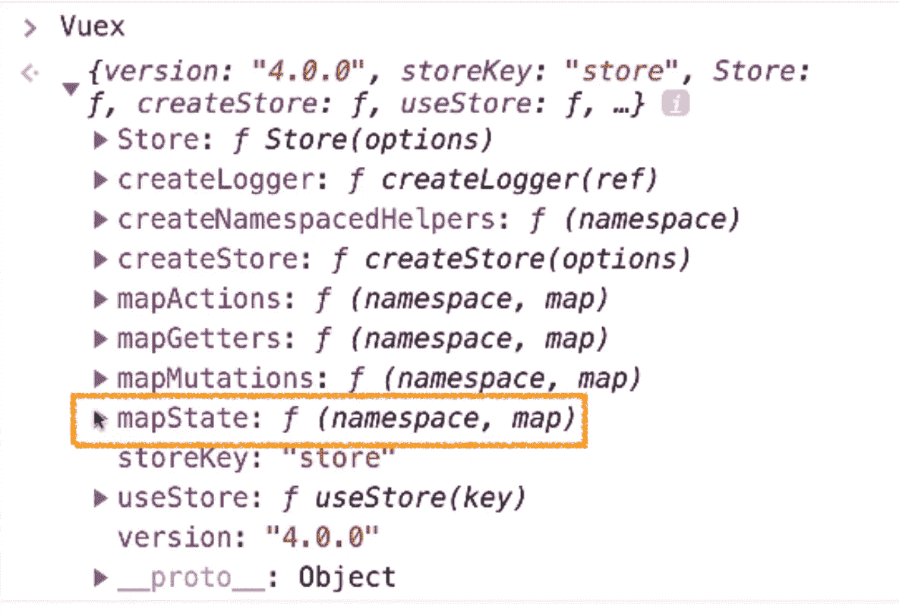
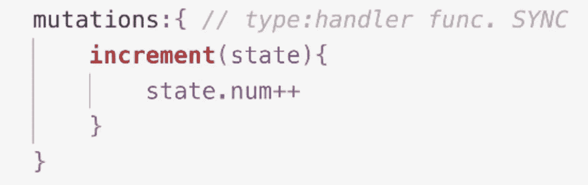
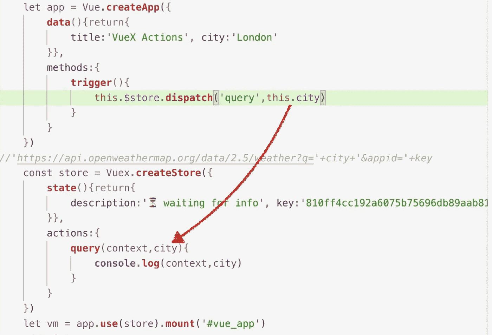
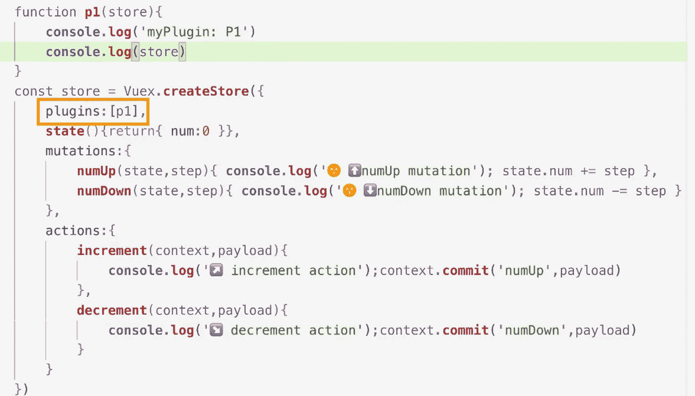
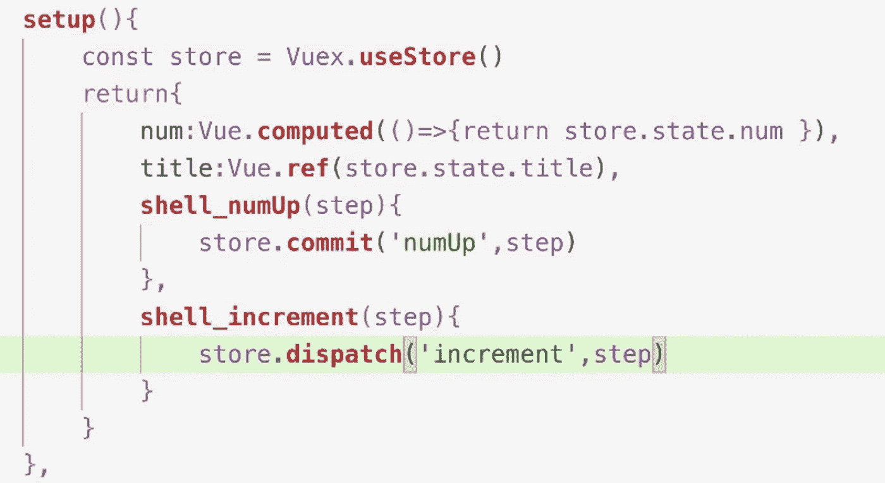

# 完整的 VueX 4 指南:状态、Getters、突变、动作、模块、插件和组合 API

> 原文：<https://levelup.gitconnected.com/complete-vuex-4-guide-states-getters-mutations-actions-modules-plugins-and-composition-api-eff469c43b4f>

查看完整的视频课程:

[https://www.udemy.com/course/complete-vuejs-3-course/?referral code = 75f 591 e 320 BC 4 ea 22188](https://www.udemy.com/course/complete-vuejs-3-course/?referralCode=75F591E320BC4EA22188)

VueX 4

Vue 应用由一系列嵌套组件组成。我们在最外面有一个根组件。它有零个或几个嵌套的子组件。每个子组件都可以有自己的子组件。

一个三级 Vue 演示应用

为了向内发送数据，也就是从父组件向其子组件发送数据，我们使用了 props。子组件可能会从用户那里收集信息，因此需要将信息向上发送给其父组件。向上发送数据需要自定义事件。

随着我们的项目变得越来越复杂，我们可能需要在一个组件和嵌套在其中的另一个组件之间交换数据。兄弟组件可能也需要相互交换数据。

在这些情况下，Props 和自定义事件相当不方便，因为它们只在父组件和其子组件之间传递信息。这就是开发 VueX 的原因。

VueX 是 Vue 官方插件。它提供了对所有组件的平等访问，不管它们嵌套有多深。

VueX 是使用**单例**模式设计的。它是一个**共享的**数据存储位置。所有组件读取和写入**相同的**数据集。

这里的关键点是**只有一个数据集**。所有组件都使用相同的数据集。任何数据修改将立即对所有组件可见，任何组件都不会收到过时的数据。

假设我们的程序有三个层次的组件:根、子和孙。在我们安装了 VueX 之后，每个组件的实例对象都将获得一个新的属性:美元符号存储。这就是组件访问 VueX 的方式。这也是 VueX 如何保证对所有组件的平等访问，不管它们嵌套得有多深。

存储在 VueX 中的数据称为状态。我们可以基于状态属性创建定制的 getters。

要改变状态属性值，我们需要突变方法。只有突变方法可以改变状态值，并且所有的突变方法必须是同步的。为了从后端 API 检索数据，我们使用了动作方法。动作方法可以处理异步操作。

突变和动作都是 VueX 方法。VueX 具体将其方法分为两组。来自变异组的方法改变状态，来自动作组的方法处理与后端 API 的连接。这样的设计保证了所有的状态修改都是**同步**的，因此可以以可预测的顺序执行。

为了触发变异方法，我们使用了 *$store.commit()* 方法。至于动作方法，我们使用 *$store.dispatch()* 方法。

VueX 是使用单例模式设计的。所有东西都只有一份拷贝，所有东西都存储在同一个地方。随着我们项目规模的增长，VueX 商店可能会变得非常臃肿。

为了帮助实现这一点，VueX 允许我们将 VueX 商店划分为多个模块。每个模块都是一个子库，有自己的状态、获取器、变异和动作。一个模块甚至可以有自己的子模块。

状态、getter、变异、动作、模块是 VueX 的五大核心概念。

接下来，让我们创建第一个 VueX 程序。我们需要的 VueX 版本是 4。要安装 VueX，我们复制 CDN 地址。

在我们的 Vue 程序中，我们添加了一个新的脚本标签，并使用复制的 CDN 地址设置它的*源*属性。

我们现在可以通过 *Vuex* 访问 VueX api。

我们正在使用的程序是一个非常简单的计数器应用程序。在根模板中，我们显示了 number 属性。当我们点击按钮时，我们触发了*增量*方法，该方法将数值增加 1。我们还有一个子组件。目前，子组件仅显示标题。

让我们将 VueX 添加到程序中。

首先，我们创建一个常数。我们把它命名为商店。商店是最常用的名称。不要选择其他名字。

我们使用 VueX api 中的 createStore 方法设置存储值。我们向 createStore 方法传递一个对象。这个对象是我们定义状态、getters、突变和动作的地方。我们将这个对象命名为 VueX 选项对象。

然后，我们用 *use* 方法附加 app 实例，并向其传递存储常量。

现在，VueX 安装完成。

让我们检查根组件实例。我们可以看到它收到了一个新的属性:美元符号商店。

在子组件中也可以找到相同的属性。

如果我们比较这两个商店属性，我们将得到 true，因为只有一个 VueX 商店。它由所有组件共享。

存储在美元符号存储属性中的对象实际上是由 createStore 方法返回的同一对象。

接下来，我们从数据选项中删除数字属性。也不再需要*增量*方法。

在 createStore 对象中，我们添加了 state 选项。它的语法与我们在组件选项对象中设置的数据选项相同。我们使用一个函数来设置它的值，并在其中返回一个对象。我们在返回的对象中定义状态属性。

也可以直接将对象指定给状态选项。这就是我们对以前的 VueX 版本所做的。结果是一样的。

我们选择更复杂的函数语法是为了保证如果我们在创建其他 VueX 模块时重用 options 对象，state 对象不会被共享。该函数将创建状态对象的新实例。我们将在模块课程中向您展示详细信息。

如果不打算重用 options 对象，则可以使用 object 语法。我个人会一直使用函数语法。

接下来，我们添加突变选项。它的值是一个对象。我们定义了一个名为*增量*的变异方法。

变异方法自动接收状态对象作为它的第一个参数值。这是它们访问状态属性的方式。我们给*状态点号*加一。

让我们检查一下*虚拟机。$store* 对象。我们找到*状态*属性并打开它。

数字属性存储在这里。我们还可以看到 state 属性的值是一个代理对象。这就是状态属性能够反应的原因。该机制与组件实例中的数据属性相同。

在组件模板中，我们可以通过 *$store.state* 访问状态属性。

为了触发一个突变方法，我们使用了 *commit()* 方法。*提交*方法也来自于 *$store* 对象。它的第一个参数是我们想要触发的变异方法的名称。

现在，柜台 app 完成了。它由 VueX 提供动力。数据存储在 VueX 中，并通过 VueX 突变方法进行修改。

接下来，我们复制 H1 和按钮标签，并将它们粘贴到子组件的模板中。

子组件与父组件访问相同的号码状态属性。如果我们改变一个组件中的数字状态，另一个组件将自动接收改变后的状态。

这两个按钮来自两个不同的组件，但是它们触发相同的方法并修改相同的状态属性。两个 H1 标签显示相同的数字状态属性。因此，它们总是同步的。

# **VueX 详细状态**

现在，让我们仔细看看 VueX 州属性。我已经预定义了三个状态属性。分别是品牌，型号，年份。

在组件模板中，我们通过在名称前加上前缀 *$store.state* 来显示状态属性。

这么长的前缀真的不方便。

我们可以将状态属性作为计算属性映射到组件实例中。打开 VueX API，你会发现四个名字以 *map* 开头的方法。mapState 方法是我们所需要的。

我们使用 mapState 方法设置 computed 选项。我们将一个数组传递给 mapState 方法。我们使用状态属性名来设置数组元素。不要忘记用引号将数组元素括起来。这里有一个窍门:基本上 VueX 的所有内容都需要用引号括起来。

现在，品牌、型号和年份都被映射到组件实例的根级别。在组件模板中，我们可以在不使用任何前缀的情况下访问它们。

我们在控制台表上运行 mapState 方法。让我们看看它返回什么。

我们发现一个物体。此返回对象中的属性以传递给 mapState 方法的数组元素命名。属性值是 mappedState 函数。这个函数供内部使用，它帮助我们从 VueX 状态中检索值。

如果我们使用 mapState 方法设置 computed 选项的值，我们将无法设置自己的计算属性。

解决方案是使用原始语法设置计算对象。在对象内部，我们用 spread 操作符作为 mapState 方法的前缀。将从返回的对象中检索属性，并将其插入到计算对象中。在 mapState 方法下面，我们可以设置自己的计算属性。

mapState 方法还支持对象语法，这需要更多的工作，但作为回报，它给了我们更多的控制权。

我们需要为想要映射到组件实例的每个状态属性设置一个属性名。州属性名应该用引号括起来。属性名不必与州名相同。我们可以设置别名。

设置别名并不是我们使用对象语法的主要原因。我们使用 object 语法来设置定制的 getters。

Getter 函数将接收状态对象，因此可以访问所有状态属性。这在 getter 函数中仍然指向组件实例，从而使我们能够访问组件数据属性。

假设我们想要创建一个 *age* 属性来反映车龄。

我们首先创建一个新的 date 对象来获取当前年份。然后我们从中减去*州点年份*。state 参数让我们可以访问状态属性。

# VuX 吸气剂详情

*计算的*选项是数据选项的扩展。计算属性只是基于数据属性的 getters 和 setters。

VueX 中的状态选项与 Vue 组件中的*数据*选项的作用相同。它存储用于存储数据的属性。getter 选项是与*计算的*选项等价的 VueX。我们用它来定义基于状态属性的 getters。

列表状态属性存储五辆汽车的信息。我们想列出所有手动挡汽车。

在 getters 选项中，我们创建了一个新属性:manualCar。它的值是一个 getter 函数。

VueX 中的 Getter 函数自动接收两个参数:state 和 getter。State 是第一个参数，getter 是第二个参数。

第一个参数帮助我们访问状态属性。第二个帮助我们访问其他 getter 属性，以防您需要为另一个 getter 创建一个 getter。

我们通过*状态点列表*访问列表数组。我们在附录中加入了过滤方法来隔离所有的手动汽车。

使用 mapGetters 方法，我们可以将 getter 属性映射到 computed 选项中。

我们可以选择数组语法或对象语法。对象语法允许我们将一个 getter 映射到一个不同的名称。但这是它能做的全部，我们不能像在 mapState 方法中那样定义另一个 getter 函数。

总之，如果您希望保留原始的 getter 名称，请向 mapGetters 方法传递一个数组。如果要将 getters 映射到新名称，请使用 object 语法。更改名称是您可以对对象语法做的唯一事情。

现在，manualCar 数组已经被插入到同名的根组件实例对象的根级别中。在组件模板中，我们将 list 切换到 manualCar。现在只会上市手动挡的车。

接下来，让我们尝试第二个参数:getters。它让我们可以访问 getters 对象，这意味着我们可以基于另一个 getter 创建一个 getter。

比如我们想知道手动挡汽车的总数。我们使用第二个参数访问 manualCar getter。然后我们在它后面加上长度属性。

**VueX 突变详情**

在这节课中，我们将学习突变方法。在我们开始之前，请记住只有突变方法可以修改状态值，并且所有的突变方法必须是同步的。不要将任何突变方法连接到任何后端 API。变异方法的唯一工作是为状态属性设置新值。

一种变异方法的名字叫做*型*。这个函数体被称为*处理器*。处理函数必须是同步的。

所有的变异方法都会自动接收状态对象。这是它们访问状态属性的方式。他们不依赖于此。

为了触发一个突变方法，我们使用了*提交*方法。我们将方法名传递给*提交*方法。commit 方法接受第二个参数。它将作为第二个参数值传递给提交的变异方法。如果您需要向提交的变异方法传递几个值，请将它们放在一个对象或数组中。

在组件方法内部触发了*提交*方法。我们可以将组件数据属性传递给它。

还有另一种设置*提交*方法的方式。我们传递一个对象给它。我们使用*类型*属性来指定我们想要触发的突变方法。记住要用引号将突变方法的名称括起来。然后我们可以设置任意多的属性。

传递给*提交*方法的整个对象将作为第二个参数传递给提交的变异方法。通常，我们将第二个参数命名为*有效载荷*。我们需要从有效载荷对象中检索我们需要的属性。

接下来，我们定义一个新的变异方法。我们称之为*减量*。它从 number state 属性值中减去 1。

这一次，我们希望将*减量*突变方法映射到组件实例中。 *mapMutations()* 方法与 *mapGetter()* 方法相同。您可以使用数组语法将变异方法映射到它自己的名称。使用 object 语法，您可以选择不同的名称。

现在，减量突变方法已经被映射到同名的根组件实例。我们将它作为普通的组件方法来调用。不需要*提交*方法。

在我们的实际项目中，最好不要映射任何突变或动作方法。只需使用*提交*和*分派*方法来触发它们。

# v 型和 VueX

我们这里有一个输入标签。使用 *v model* 指令，我们在输入表单和消息数据属性之间建立了一条双向路径。

我们想要将*消息*属性移动到 VueX 状态，但是我们要求输入标签保持和以前一样。换句话说，我们需要启用 v 模块指令来处理 VueX 的状态属性。知道怎么做吗？

在组件选项对象中，我们添加了计算选项。我们使用对象语法声明了一个*消息*属性。我们为它设置了 getter 和 setter。

在 getter 函数中，我们返回*这个点美元符号存储点状态点消息*。

在 setter 函数中，我们将用户提交的值分配给消息状态属性。只有突变方法可以操作状态属性的值。所以我们需要定义一个变异方法来帮助我们进行赋值。

我们将新的变异方法命名为*更新*。我们将其第二个参数值赋给消息状态属性。然后在 setter 函数中，我们“提交”了 *update* 突变方法，并将新的消息值作为第二个参数传递给它。

现在，我们已经在消息状态属性和输入表单之间建立了一个双向数据路径。关键是设置一个可写的计算属性作为中间人。

# **VueX 行动详情**

我们这里有一个半成品的天气应用程序。我们将使用 VueX 来检索所选城市的天气描述。

我们将城市名存储在根组件中，并使用 VueX 来检索和存储天气信息。当我们点击这个按钮时，我们希望载入当前城市的天气信息。

从后端 API 检索数据是一个异步操作，因此应该使用 action 方法来完成。

我已经安装了 axios。我们转到 VueX 并添加操作选项。我们添加了一个名为 query 的新动作方法。

查询方法接收两个参数。第一个是语境。第二个是我们设定的。我们把它命名为城市。我们用它将城市名传递给查询方法。

在触发器方法中，我们“分派”查询操作方法。我们将*这个点城市*传递给 *dispatch* 方法作为它的第二个参数值。现在，当我们单击按钮时，城市名称将被传递给*查询*操作方法。

第一个参数*上下文*让我们访问整个 VueX 商店。我们可以访问状态和 getter 属性。我们还可以提交突变，甚至调度其他动作方法。

接下来，让我们定义*查询*动作方法。我们首先给它加上前缀*异步*。

然后我们准备 API 地址。API 地址包含两条外部信息:城市名和验证密钥。

城市名来自函数参数。我们可以直接访问它。

验证密钥以 VueX 状态存储。我们通过*上下文*访问它。我们用*上下文点状态*作为关键字的前缀。

现在，API 地址已经设置好了。

我们添加了 TRY CATCH 语句。

在 TRY 部分，我们'*等待*， *axios get* 方法，并将 API 地址传递给它。我们将返回的对象存储在结果变量中。然后，我们在控制台日志中记录城市名和检索到的天气描述。

在 CATCH 部分，我们在控制台记录错误消息。

我们的目标是将检索到的天气描述分配给*描述*状态属性。这就需要一个突变的方法。

我们增加了突变选项。我们定义了一个名为 *update* 的变异方法。*更新*方法将其第二个参数值赋给*描述*状态属性。

我们回到查询方法的 TRY 部分。

我们“提交”了*更新*变异方法，并将检索到的天气描述传递给它。

现在，程序完成了。

# 练习:创建一个天气应用程序。

在这一部分，我们仍将致力于天气应用程序。但是我们会让事情变得更复杂，这样我们就可以尝试我们所知道的关于 VueX 的一切。

*城市*和*描述*都是 VueX 状态属性，但是我们不希望在组件模板中使用长前缀。这要求我们将它们映射到组件实例中。

我们添加了*计算的*选项，并在其中‘传播’了 mapState 方法。我们将城市和描述映射到组件实例中。

当我们单击 city 按钮时，我们触发了 *change* 方法，并将新的城市名传递给它。我们需要将新的城市名称传递给 city state 属性。这需要我们“提交”一个突变方法。

我们转到 VueX 并添加突变选项。

我们定义了一个名为 changeCity 的变异方法。我们用*国家点城市*设置它的第二个参数。在 *change* 方法中，我们提交 changeCity 突变方法，并将新的城市名传递给它。

现在，我们可以通过单击城市按钮来更改城市名称。

接下来，我们回到 VueX。我们添加了 actions 选项，并定义了一个名为 *query* 的异步操作方法。

在上一课中，我们为查询方法设置了两个参数。第二个参数是城市名。这里，我们采取不同的方法。我们只保留第一个论点。我们没有将城市名传递给查询方法。

API 地址中使用了城市名称。我们可以使用 getter 来生成 API 地址。在 getters 选项中，我们创建了一个名为 API 的 getter。我们在其中返回 API 地址。城市和键值都来自 VueX 州。我们在它们前面加上州名。

现在，每次我们更改城市名称时，API getter 都会返回一个新的 API 地址。

在*查询*动作方法中，我们添加了 TRY CATCH 语句。在 TRY 部分，我们等待 *axios get* 方法。我们将*上下文点 getters 点 API* 传递给 get 方法。当我们更改城市名称时，API 地址会自动更新。然后我们将返回的对象存储在一个名为 *result* 的变量中。我们在控制台日志中记录了城市名称和天气描述。

我们需要一个突变方法来更新描述状态属性。我们将其命名为更新天气。在查询操作方法中，检索到天气描述后，我们“提交”updateWeather 突变方法，并将检索到的天气描述传递给它。

在我们更改了城市名称之后，我们需要将描述状态重置为*加载信息*。

现在，我们在 VueX 方面的工作已经完成。

在 *change* 方法中，在我们提交了 *changeCity* 变异之后，我们分派了*查询*动作。变异方法都是同步的。在这里，我们可以放心，在发送查询操作之前，城市名称将被更改。如果您愿意，可以在 *changeCity* 突变方法中调度*查询*动作。

然后我们添加创建的钩子，并在其中分派*查询*动作。这是为了加载初始数据。

现在，程序完成了。每当我们选择一个新的城市，该城市的天气描述将被检索。

# **VueX 模块**

VueX 只保留一组数据。但是随着我们的项目越来越完善，一个数据集可能是不够的。这就是引入 VueX 模块的原因。

除了根存储，我们可以为它创建几个子存储。每个子店都是独立的，不会干扰其他店。

传递给 createStore 方法的对象是我们定义根模块的地方。我们添加了模块选项，并为其分配了一个对象。这个对象是我们声明子 VueX 模块的地方。

我们创建两个模块:模块 A 和模块 b。

在模块 A 中，我们添加了 state 选项并声明了一个 title 属性。在模块 B 中，我们做同样的事情。这两个标题状态是独立的。

接下来，我们在模块选项中注册这两个模块。我们在模块选项中设置的属性名将被用作模块名。

让我们检查存储变量。

我们打开状态对象。我们可以看到状态对象已经接收了两个子对象。它们以模块名命名。两个子模块的状态属性存储在这两个对象中。

createStore 方法的 options 对象中定义的状态属性是根状态属性。根状态属性存储在状态对象的根级别。这就是为什么我们在同一个名字下有两个状态属性，但是它们不会互相冲突。

现在我们在所有权名下有三个州的财产。让我们将它们映射到组件实例对象中。

我们添加了计算选项。我们使用对象语法设置 mapState 方法，这样我们就可以为三个标题状态属性设置别名。

对于根状态属性，我们可以通过名称直接访问它们。对于子模块的状态属性，我们需要函数语法。我们返回状态点模块名点属性名。

现在，三个标题属性已经被映射到根组件实例中。我们通过他们的化名来访问他们。

接下来，让我们尝试 getters。在模块 A 中，我们添加了 getters 选项并创建了一个 capTitle getter。我们返回大写的标题值。

getter 函数有三个参数。第一个是当前模块的状态对象。第二个是当前模块的 getter 对象。第三个指向根状态对象。为了从当前模块中访问状态属性，我们使用第一个参数。

然后我们复制 getters 选项并粘贴到 moduleB 中。现在，我们有两个队长。它们会引起命名冲突吗？

我们收到一条错误消息。上面写着重复的 getter 键。

如果我们禁用一个 capTitle getter，错误消息就会消失。

来自所有模块的 Getters 将直接合并到 getters 对象的根级别。与状态对象不同，不会有任何子对象。

# 命名空间

在这一课中，我们将讨论命名空间。它帮助我们区分不同模块的 getters、mutations 和 actions，这样相同的名字就不会引起命名冲突。

状态属性不需要名称空间，因为它们有自己的方式来避免命名冲突。

根状态属性将存储在状态对象的根级别中。来自子模块的那些将被存储在以模块名命名的子对象中。此功能仅适用于状态属性。

来自所有模块的 Getters 将被合并到同一个对象中。因此，相同的 getter 名称会导致命名冲突。

有时，可能很难保持 getter 名称的唯一性，在这种情况下，我们可以使用 namespace 在 getter 名称前面加上它们的模型名称。

我们将*命名空间*选项添加到模块 A 中，并将其值设置为 true。不要漏掉最后一个字母 d。

模块 B 还没有打开名称空间，所以它的 getter 没有前缀。

建议打开除根模块之外的所有模块的名称空间。打开根模块的名称空间是没有意义的，因为根模块没有名称，因此，根 getters 不会收到任何前缀。

接下来，我们将这三个 capTitle getters 映射到组件实例中。

我们希望保持 getter 名称不变，所以我们使用数组语法。子模块中的 Getters 需要以它们的模块名为前缀，并用斜杠分隔。根 getters 不需要前缀。

所有三个 capTitle 吸气剂已被添加到它。感谢前缀，不会有任何命名冲突。

为了访问根 getters，我们直接使用它们的名字。

至于来自子模块的 getters，它们的名字包含一个特殊的字符斜杠，我们需要把它们的名字放在方括号中并用引号括起来。

有时，一个组件可能只需要一个模块的 getters。在这种情况下，我们可以在 mapGetters 方法中指定目标模块的名称空间。

我们将模块名作为第一个参数值传递给 mapGetters 方法。现在，这个 mapGetters 方法只适用于模块 a。我们不再需要在 getter 名称前加上模块名。

所有映射方法都支持名称空间。例如，我们添加了 mapState 方法，并将其第一个参数值设置为 a。

传递给 aTitle 方法的状态对象只包含模块 A 的状态对象的属性。

同样的规则也适用于突变和动作。

有时，我们可能需要在模块内部定义全局操作方法。在这种情况下，我们需要使用对象语法来定义操作方法。我们仍将使用测试方法作为示例。我们把它的功能体转换成一个对象。

在对象中，我们添加根属性并将其值设置为 true。

然后我们添加 handler 属性来定义函数体。handler 方法与普通的 action 方法相同。它有两个参数:上下文和有效负载。有效负载的值取决于如何调度测试操作方法。

测试操作方法是全局的，但它仍在模块 A 中定义。其上下文对象中的状态属性仍指向模块 A 的状态对象，而不是根状态对象。

若要访问根状态或其他模块中的状态，请使用 rootState 属性。吸气剂也是如此。有一个 getters 属性和一个 rootGetters 属性。

接下来，我们制作测试动作的副本，并将其粘贴到根模块中。

现在，我们有两个测试操作方法，但它们都是全局的。让我们看看 VueX 是如何处理这种情况的。

让我们刷新页面并检查商店对象。

在下划线操作中，只有一个测试属性，但它的值是一个数组。两种测试操作方法都存储在这里。

因此，当我们分派测试动作时，我们将同时触发这两个动作。

# **动态 VueX 模块**

在本节中，我们将讨论动态模块。

我们使用 registerModule 方法注册动态模块。registerModule 方法有两个参数。第一个是模块名，第二个是用于定义模块的选项对象。options 对象只是一个普通的对象。我们可以反复使用。

使用 *hasModule* 方法，我们可以检查一个模块名是否已经注册。

使用 *unregisterModule* 方法，我们可以删除一个模块。

接下来，我们复制 registerModule 方法。我们将新模块命名为 A2。A1 和 A2 是使用相同的选项对象创建的。

还记得我们提到过最好使用函数语法来设置状态选项吗？现在，你会明白为什么。

同一个 options 对象用于创建两个模块。自然，我们希望这两个模块是独立的。

让我们使用对象语法重置它的状态选项。我们移除该函数，并将 an 对象直接分配给 state 选项。

让我们从模块 A1 重新加载页面并重置标题状态。

然后让我们检查状态对象。

现在我们可以看到问题了。模块 A2 的标题也已更改。

模块 A 1 和 A2 共享同一个状态对象。更改模块 A1 的状态属性也会影响模块 A2。

显然，这不是我们想要的。这就是为什么您应该使用函数语法来设置 state 选项。函数语法确保使用相同的选项对象创建的模块将有它们自己的状态对象。更改一个模块的状态属性不会影响其他模块。

对于永远不会重用的选项对象，可以使用对象语法。但就个人而言，我会一直坚持函数语法。

registerModule 方法将一个 config 对象作为其第三个参数。我们可以在其中设置 *preserverState* 属性。

将 preserveState 属性设置为 true 可防止将模块的状态属性添加到 VueX 存储中。

VueX 假设当前存储已经包含该模块的状态，并且您不想覆盖它。换句话说，对于不需要状态属性的模块，可以将*preserve estate*设置为 true 来放弃它们。

这也意味着这个模块的突变和 getters 将不再工作。

如果我们从模块 A1“提交”changeTitle 突变方法，我们将得到一个错误消息，因为标题状态属性尚未添加到 VueX 存储中。

# **VueX 插件**

在这一节，我们将学习 VueX 插件。

VueX 插件只是钩子函数，当我们第一次加载程序时会被触发。

在根模块中，我们添加了插件选项，并为它分配了一个数组。这个数组是我们注册插件函数的地方。我们把它命名为 P1。

接下来，我们定义一个名为 P1 的函数。插件函数将接收存储对象。

当我们第一次加载程序时，插件功能会自动触发。分派动作或提交突变不会再次触发插件功能。

为了监控突变或动作方法，我们需要两个 subscribe 方法。subscribe 方法监视变异方法。对于操作方法，请使用 subscribeAction 方法。

这两种订阅方法是独立的，它们不依赖于插件。它们只是插件中最常用的。

在 P1 插件中，我们添加了 subscribe 方法来监控突变。我们向 subscribe 方法传递一个回调。这个回调有两个参数:突变和状态。

回调的第一个参数是一个具有两个属性的对象。

使用*类型*属性，我们可以判断哪个突变方法被触发。*有效负载*属性存储传递给突变方法的参数值。

第二个参数是 VueX 存储的状态对象。它反映了最新的状态，意味着其中的属性已经被“变异”了。

您可以添加任意多的*订阅*方法。它们将被推入一个队列，并按照添加时的顺序执行。

我们可以选择一个 subscribe 方法，并将其移动到队列的开头，这样它将首先被执行。

在所选 subscribe 方法的回调后面，我们添加了一个 config 对象。我们将*前置*设置为真。现在，第二个订阅方法将被添加到队列的第一个位置。因此，它将首先被执行。

在开发阶段，我们可能需要拍摄状态快照，以比较突变前和突变后的状态。这可以通过比较两个状态对象来完成。第一个状态对象来自插件函数，第二个来自订阅方法。

我已经安装了 *low dash* 这是一个 JS 函数库。它有一个叫做 cloneDeep 的方法。它创建对象的深层副本。深度复制意味着复制所有嵌套的对象。

在 subscribe 方法之外，我们对 state 对象进行深度克隆，并将副本存储在名为 *pre* 的变量中。状态对象来自传递给插件函数的存储对象。这是变异前的状态。

在 subscribe 方法的回调中，我们对 state 对象进行了第二次深度克隆。我们将复制的对象存储在名为 post 的变量中。

这一次，状态对象来自回调的第二个参数。这是变异后的状态。

现在 *pre* 存储旧状态， *post* 存储新状态。

我们输出它们进行比较。

最后，我们将 post 分配给 pre。注意，赋值必须放在最后，在我们输出 *pre* 和 *post* 之后。

让我们试试这个程序。

现在我们可以比较突变前和突变后的状态。深度克隆技术仅用于开发目的。不要在生产环境中使用它。

subscribe 方法返回一个 unsubscribe 方法。调用它，subscribe 方法将被取消。

为了监视操作方法，我们使用 subscribeAction 方法。其语法与 subscribe 方法相同。传递给它的回调接收两个参数:action 和 state。

action 参数仍然是一个具有两个属性的对象:type 和 payload。

类型告诉我们被调度的动作方法的名称。Payload 告诉我们传递给调度的 action 方法的参数值。

动作方法不修改状态属性。因此，状态参数存储突变前的状态。

还可以使用 object 语法设置 subscribeAction 方法。我们不是向它传递回调，而是向它传递一个对象。对象允许我们设置两个方法:before 和 after。

正如它们的名字所暗示的那样，这两个方法将在一个动作方法被调度之前和之后被触发。

在调度 action 方法之前，触发方法之前的*。自然地，它具有突变前的状态。*

在调度 action 方法后，触发方法后的*。变异方法是同步的，从动作方法内部提交。因此，*法之后的*也是在变异法背后触发的。因此，它具有后突变状态。*

如果订阅的动作方法查询后端 API，那么在查询开始之前会触发 *before* 方法。查询结束后会触发 *after* 方法。我们可以使用这两种方法来打开和关闭加载通知。

# VueX 组合 API

在本节中，我们将向您介绍如何在设置功能中使用 VueX。

挑战在于如何在设置功能中访问 VueX 商店。组件实例尚未创建。所以*这个。$store* 在这里行不通。

我们声明一个名为 store 的变量。我们使用 *createStore* 方法设置它的值。现在，我们可以在设置功能中访问 VueX 商店。useStore 方法将搜索已安装的 VueX 存储并返回它。

假设我们想将 num 和 title 状态添加到组件实例中。

在 setUp 函数中，我们返回一个对象。在返回的对象中，我们添加了一个数字属性，并使用*计算的*方法设置其值。我们设置了一个 getter 函数，并在其中返回*存储点状态点号*。

注意这里，数字状态属性本身不会被添加到组件实例中。返回对象中的 number 属性实际上是数字状态的 getter。

当我们改变 *number* 状态时，返回的 number 属性也会随之改变。这就是为什么我们选择计算方法而不是参考 T21 方法。

至于 *title* 属性，我们可以使用 *ref* 方法设置它的值，因为我们不想改变 *title* 状态。如果不需要反应性，您甚至可以跳过*参考*方法。

仔细想想，返回对象中的*号*和*标题*属性，不过是 VueX 状态属性的外壳。

为了将突变和动作方法添加到组件实例中，我们使用相同的策略:为它们创建外壳。

我们为 *numberUp* 突变方法定义了一个 shell 方法。我们把它命名为 *shellNumUp* 。

为了向组件实例添加一个动作方法，我们仍然创建一个 shell 方法。shell 方法调度目标操作。

总之，setUp 函数可以很容易地将 VueX 状态和方法添加到组件实例中。我们只需要把它们放在返回的对象中。不再需要任何映射方法。

对于状态和 getters，我们在 computed 方法中返回它们。

对于突变和动作，我们为它们创建一个 shell 方法。外壳方法的唯一工作是提交或分派目标方法。

## [未完待续……]