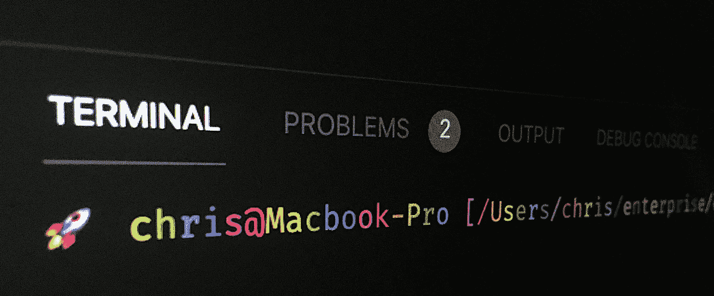

# 外壳提示的复杂颜色模式

> 原文：<https://levelup.gitconnected.com/complex-color-patterns-for-shell-prompts-f35a99598d5c>

## 【bash 和 zsh 外壳的字母级交替颜色。

我供图！:)

# 彩壳提示？！用表情符号？！

我们大多数开发人员都知道我们可以用各种颜色来给我们的 shell 提示着色，在 shell 语法中，它是某种看起来很丑的格式字符串，比如`**\e[31m**`——顺便说一下，那个是红色的——我肯定你马上就认出来了。😂

在创建了我的全栈课程“Bash 命令和脚本——从初学者到专家”之后，我最近深入研究了整个 shell 提示符格式化的故事:

 [## Bash 命令和脚本——从初学者到专家

### 大家好！我已经做了 7 年多的专业全栈软件工程师，并且我已经编程很多年了…

www.udemy.com](https://www.udemy.com/course/bash-commands-and-scripting/?referralCode=A4FC7847723F041BE375) 

除此之外，如果我告诉你，你可以用一种高级的方式来设计你的提示，让它看起来像这样:

或者这个:

或者，我当前的设置，像这样:

据我所知，我是第一个做这件事的人！(或者至少出版了它)😎我现在知道为什么了——因为 bash 和 zsh 语法使得创建这样的颜色模式非常令人头疼！😅

我相信我已经通过[为代码片段](https://github.com/princefishthrower/awesome-shell-prompt-colors)创建了一个存储库，并粘贴了下面的代码片段，让您免去了这个头疼的问题。

# 代码

[库在这里](https://github.com/princefishthrower/awesome-shell-prompt-colors)。在这里，您可以找到关于实际颜色实现的所有细节，以及让这些冷色调显示在您的 shell 中所需的步骤！对于没有耐心的人来说，下面是 bash 和 zsh shells 的工作脚本，但是我不能保证下面的代码片段是最新的版本。

# 代码

# 尝试

# zsh

你也可以在我博客的片段页面的 devops 部分找到这些片段[。](https://chrisfrew.in/snippets)

继续将这些分别粘贴到你的`**.bash_profile**`或`**.zprofile**`中，这取决于你使用的终端。或者，[在存储库上发出一个 pull 请求，提交另一个 shell 的代码！](https://github.com/princefishthrower/awesome-shell-prompt-colors)

# 谢谢！

目前就这些。我可能会在某个时候写一篇额外的文章，对这两个函数进行演练——事实证明，bash 和 zsh 之间有一些令人讨厌和有趣的区别——最不可原谅的是 zsh 中的循环从 1 开始🙄。

干杯！🍺

克莉丝