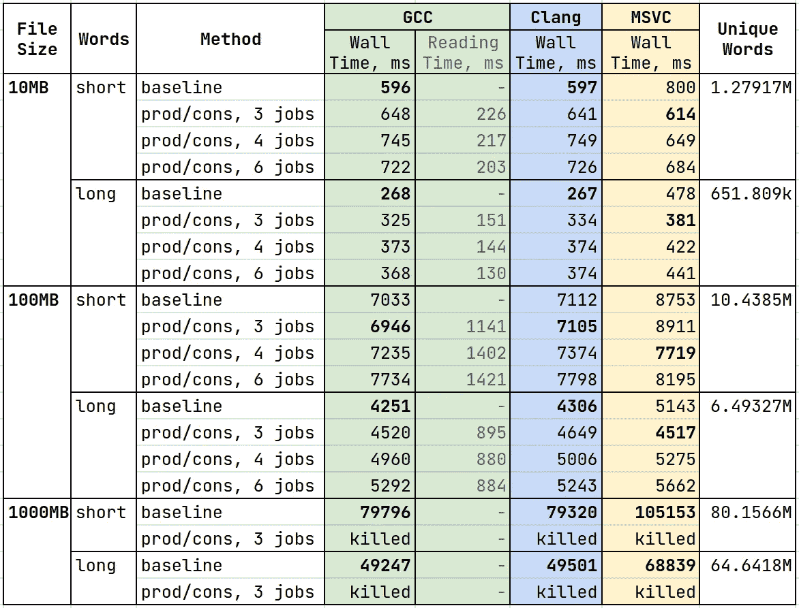
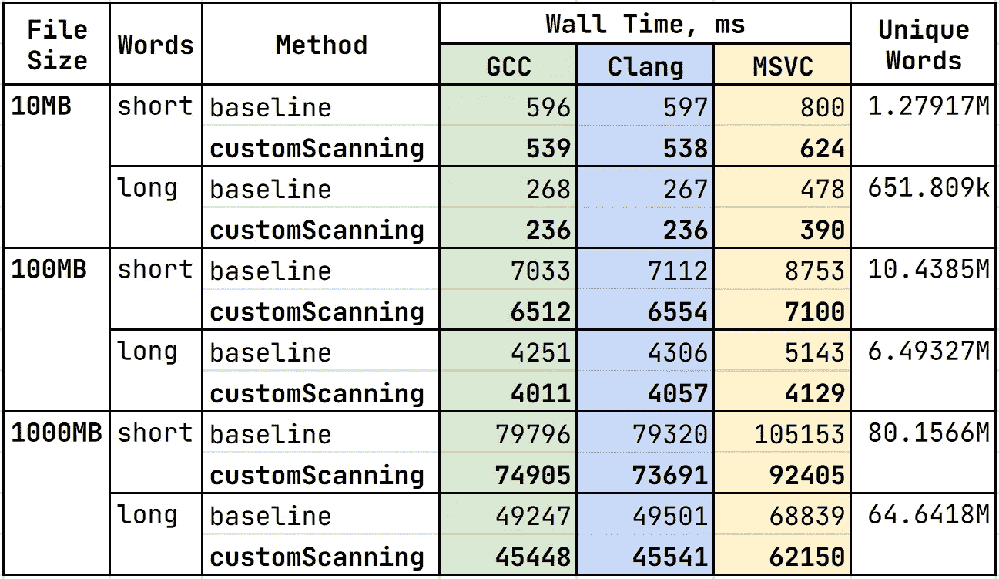
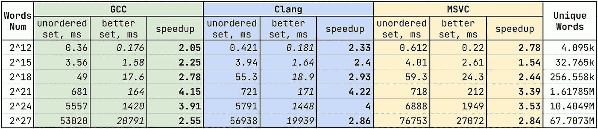
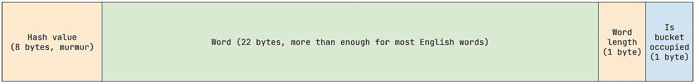
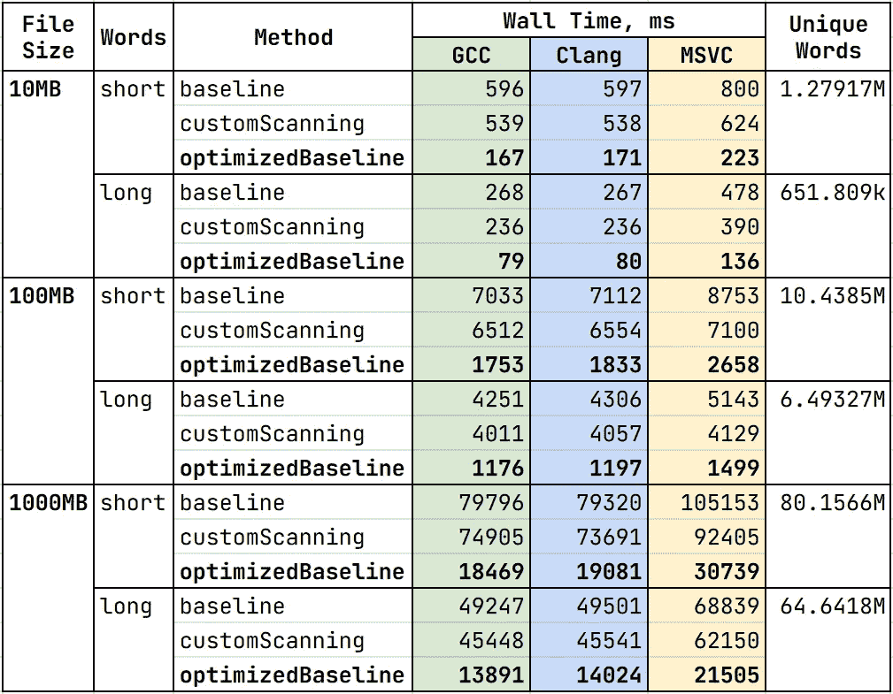
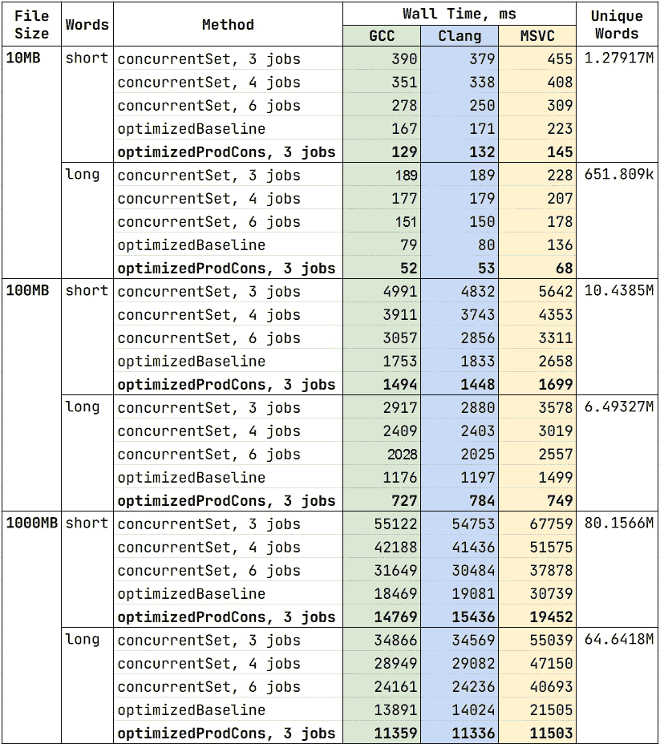

# 非常简单的并发任务的复杂解决方案

> 原文：<https://levelup.gitconnected.com/complex-solution-to-a-dead-simple-concurrency-task-5a66ae21e3b>

## 在处理性能关键的应用程序时，抽象确实会泄漏。在这种情况下，开发人员不能再将计算机视为黑盒。相反，人们应该对幕后发生的事情有一个坚实的理解。这个故事说明了如何正确使用并发性，计算机架构和算法知识可以极大地加快你的程序，如果使用得当。

照片由 [Ryan Yoo](https://unsplash.com/@ryan_yoo?utm_source=medium&utm_medium=referral) 在 [Unsplash](https://unsplash.com?utm_source=medium&utm_medium=referral) 上拍摄

C++并发是一件棘手的事情。虽然它给了你惊人的能力来提升你的应用，**它并没有限制你编写比它的顺序版本**慢得多的多线程代码。为了识别潜在的瓶颈，我们必须知道在多线程设置中应该/不应该做什么，最重要的是，**为什么会这样。所以让我们开始吧！**

# 问题陈述

最近接到一个看起来很无辜的测试任务。请仔细阅读，因为我们将在最终解决方案中利用该陈述的每一部分。

> 写一个程序，计算给定文件中不同单词的数量。在 ASCII 编码中，输入文本保证只包含‘a’…‘z’字母和空格字符。

起初看似轻而易举的事情变成了激动人心的冒险，只增加了两个额外的条件:

1.  程序应该能够**处理大量输入**(即`32GB`)。
2.  解决方案必须**利用所有**可用的 **CPU 资源。**

# 基线

为了有一些`baseline`可以比较，让我们编写最简单的顺序解决方案:

这就是接吻的终极形式:通过文字阅读，把它们放在一起。这段代码既不是并发的，也不是最优的，但它是一个很好的起点。在我们真正了解自己的需求之前，我们不应该把事情弄得过于复杂。

# 并发尝试

让我们添加一些并发性。我们应该首先把阅读单词和处理单词分开。这样做应该会减少应用程序的关键路径和总体运行时间。我选择用下面的线程实现单生产者/多消费者模式:

*   `Reader` —按单词块读取文件。每个块被表示为一个字符串向量，并被放在生产者的队列中。
*   `Producer` —从每个组块中形成一组独特的单词，并将其放在共享消费者队列中。
*   `Consumer` —当消费者队列中有两个以上的元素时，合并前两组唯一的单词，并将结果放回原处。

`[Implementation](https://github.com/yuuurchyk/UniqueWordsCounter/blob/main/src/method/producerConsumer.cpp)`有点繁琐，但还是没有火箭科学。一些一般性评论:

1.  我使用**死亡药丸**作为线程间通信机制。这些特殊的队列元素表明，没有人会再将任何东西推回到容器中。药丸最多可以出现**一次，严格来说是在队列的最后**。这意味着，如果前面的元素是死亡药丸，就没有更多的项目要处理。
2.  **临界截面应尽可能短**。我们可能会一边拿着`mutex`一边检查前面的元素是不是死亡药丸，但这没有太大意义。因为我们期望元素在大多数情况下都是普通的，所以我们应该快速窃取前端项目，释放`mutex`并在不同步的情况下处理结果元素。当它碰巧是死亡药丸时，我们再次获得锁并把它移回来。
3.  **为互斥体使用 RAII 包装器。当不需要细粒度控制时，`std::scoped_lock`是一个很好的选择。与锁定/解锁语义相比，它意味着很少甚至没有开销。此外，您不再关心异常安全，因为`mutex`在堆栈展开期间会自动释放。**
4.  **使用移动语义**。
5.  确保你深入了解容器是如何工作的。

# 结果

这是计时结果。在两组合成生成的文件上测试了`baseline`和`producer/consumer`方法:**短**和**长**单词，每组中的单词具有不同的平均长度。该表还提供了`reader`线程在`producer/consumer`算法中花费的时间(参见*读取时间*栏):

生产者/消费者方法与顺序基线的比较。请不要比较编译器之间的绝对计时结果，因为 MSVC 数据是在不同的机器上收集的。

等等，什么？`producer/consumer`方案不是应该比`baseline`快很多吗？性能不应该随着线程数量的增加而提高吗？数字不会说谎。引入并发性使程序变得更糟，尤其是对于大文件！在我们继续之前，这里有一些观察结果:

1.  这些方法远远不受硬盘读取速度的限制
2.  墙时间似乎取决于唯一单词的数量，而不是文件的大小
3.  当使用`producer/consumer`方法时，RAM 的`16GB`对于`1000MB`文件来说是不够的
4.  我们没有从多线程中获益

## 关于基准测试的小说明

更改基准的顺序有时可能会显著影响计时结果。在我的例子中，这是由于分支预测。因为短单词和长单词具有不同的统计属性，所以当改变单词的分布时，决定下一个字符是否是空格的分支无法预测。为了解决这个问题，请确保运行足够多的迭代，或者如果前者不可行的话，将基准分成两个可执行文件。

# 分析

## 内存管理

那么并发方法有什么问题呢？没有长临界区，每个线程都应该有很多工作要做。也没有副本，因为移动语义被广泛使用。有经验的程序员可能已经知道答案，但是让我们后退一步，分析每个线程正在做什么:

*   `Reader:`读取字符串，将它们放入`vector`中。`Vector`将其元素存储在**堆**中。
*   `Producer:`将 vector 中的字符串放入`unordered set`中。与`vector`类似，哈希表也分配在**堆**上。
*   `Consumer:`合并两个`unordered sets`。因为我们再次处理哈希表，所以我们有很多**堆内存分配。**

但是线程仍然是并行运行的，对吗？技术上可以，但是这里有一个问题:**堆是不可并行化的！**除非我们事先使用依赖于系统的 API 或保留原始内存池，否则我们不能同时进行两次分配。由于在容器的保护下，除了隐式堆内存分配之外，没有线程做任何其他事情，所以第二个解决方案根本不是并行的。因为与基线示例相比，我们对集合做了更多的工作，而且线程间的通信也不是免费的，所以所有这些因素都会影响最终的性能。这也解释了为什么线程越多情况越糟(观察 4)。

## 无序集性能

我们知道`std::unordered_set`在幕后使用了散列表。但是那里到底发生了什么？嗯，**表**的每一个桶**都是一个单链表！**当插入新元素时，我们首先使用对象的哈希值找到正确的存储桶。然后，我们遍历所选存储桶中的项目链表，检查该元素是否已经存在。如果没有，我们分配一个节点，将元素放在那里，并将节点追加到列表中。当每个存储桶的平均项目数大于 1 时，集合会增长。听起来不错？以下是一些需要考虑的方面:

*   **内存分配。**我们不仅为桶分配内存，还为每次插入的列表节点分配内存。虽然前一种分配不会经常发生，但如果有足够多的独特单词，后一种分配会更频繁地被触发。由于上面讨论的原因，这实际上扼杀了并行性。
*   **未使用的桶。**我们可能会不小心“侵入”哈希表，只使用它的一小部分存储桶。例如，偶数的无序集合将只占用其存储桶的一半。如果我们真的很不走运，甚至有可能所有的物品都被放在一个桶里。关键要点是散列函数应该具有良好的统计特性，并产生均匀分布的值。
*   **内存访问模式，缓存局部性。**与连续容器相比，链表的遍历令人难以置信地可怕。由于 CPU 不处理单个字节，而是 64 字节长的缓存行，因此访问后续元素的速度非常快，因为它们已经在缓存中。此外，硬件将检测顺序存储器访问模式，并推测性地预取随后的高速缓存行，以减少等待时间。不幸的是，链表不能受益于所有这些。因为节点随机分布在堆中，所以您将在每个元素上获得**缓存未命中，并求助于处理 RAM，这是**的一百倍！！！比 L1 缓存慢。为了验证这确实是一个问题，我用 *cachegrind 分析了基线实现。*遍历存储桶的内容会导致大量 L1 数据缺失。****

现在我们明白了为什么文件读取还不是一个瓶颈，以及为什么结果时间取决于文件中的字数(观察 1 & 2)。

## 其他潜在问题

*   我们能读得更快吗？众所周知，速度很慢，所以我们可以尝试做得更好。此外，自从`iostreams`按字读取以来，我们实际上还没有将文件读取从字处理中分离出来。
*   **更好的队列？**如果两个线程想从不同的方面访问元素，我们为什么要阻塞它们？我们应该尝试使用无锁队列。尽管原子比互斥更昂贵，但它们可能提供更好的每线程性能。但当然，这应该是侧写。
*   **我们甚至需要** `**std::string**` **？**

# 优化基线

让我们往回走一点。我们已经确定了目标:*缓存位置*、*更少的堆分配*、*自定义扫描*、*无锁队列*。因为这些都不是微不足道的，所以让我们逐步改进顺序解决方案，然后引入并发性。

## 自定义扫描

由于文件操作很长，我们应该读取大的原始数据缓冲区，并手工将它们分解成单词。唯一的极限情况是当字在两个缓冲器的边界上时。现在让我们坚持使用标准的散列集实现，看看手工读取是否会有所不同。

与顺序基线相比，自定义扫描方法。

我们仅从**人工阅读**中获得`6–12%` 改进。鉴于`iostreams`在幕后做了类似的事情，我们不应该期待更多。我们还可以尝试使用内存映射 io 来避免将字符从内核复制到用户空间，但是这超出了本文的范围。

`[implementation](https://github.com/yuuurchyk/UniqueWordsCounter/blob/main/include/UniqueWordsCounter/utils/scanningImpl.h)`并没有那么难:将文件读入缓冲区，处理角落情况(第一个和最后一个单词+单词跨越整个缓冲区的罕见可能性)。唯一有趣的部分是我们处理常规单词的热循环:

自定义扫描:处理常规单词的热循环。

以下是自定义扫描可能更快的原因:

1.  循环中的一些条件。没有`end` 条件(我把尾随符号追加到缓冲区的末尾)。`std::strpbrk`用于查找空格字符(使用内部函数)。单词之间很少有超过一个空格的，所以对应的循环标记为`unlikely` *。*
2.  字符串构造被转发到`std::unordered_set` *。*在基线实现中，我们有一两个构造(从流中读取+将构造函数移动到集合中)。在这里，我们总是在集合中只有一个字符串结构。

## 更好的设置

我们怀疑`std::unordered_set` 是一个瓶颈，因为糟糕的缓存局部性和大量的堆分配。为了减轻它们，我们可以尝试使用**开放地址散列和线性探测**(你可以找到我的实现`[here](https://github.com/yuuurchyk/UniqueWordsCounter/blob/main/include/UniqueWordsCounter/utils/wordsSet.h)`)。它利用数据局部性，仅在重新散列时分配内存。总的想法非常简单:

*   每个存储桶只能包含一个元素。这意味着我们只使用一组桶。没有节点、指针或额外分配。
*   当添加新元素时，我们首先选择将它放入的桶。如果已经有人住了，我们就去下一个。我们继续，直到我们找到一个空桶，并把新元素放在那里。因为我们检查相邻的存储桶，所以应该很快，因为它们已经在缓存中。

当从缓冲区插入单词时，让我们将其与`std::unordered_set`进行比较:

当从缓冲区插入字时，开放寻址集总是比 std::unordered_set 至少快两倍。

好多了。我们看到在各种条件下，所有编译器的`open addressing set`速度至少是**的两倍。以下是帮助我取得这些成绩的诀窍:**

最好设置桶结构。

*   **铲斗结构。**因为大多数英语单词都不太长，所以我设计了一个 bucket 来优化这个特定的场景。22 个字符对于几乎每个单词来说都绰绰有余(长单词单独处理)。此外，桶完全适合一半的缓存行，大小为`32 bytes`。因此，我们构建了一个自定义版本的字符串，它占用了`32 bytes` **和哈希**(与`std::string` *，*相反，后者经常占用相同数量的内存，而没有哈希)。
*   **哈希函数敏感度。**维基百科说，使用线性探测的开放式寻址哈希最适合使用**杂音哈希。**我可以从测试中证实这一点。更改哈希函数似乎会降低性能。
*   不要等到饱了才吃。当`open addressing set`快满时，插入/查找操作变成线性搜索，应尽可能避免。容器应该保持稀疏。因此，当超过`90%`个桶被占用时，解决方案是`rehash`。
*   **除非真正需要，否则不要复制到桶里。因为我们从缓冲器中放置单词，所以我们可以首先通过计算来自缓冲器的散列来确定单词是否已经存在。然后，当且仅当这个单词不存在时，我们将它复制到桶中。相反，`std::unordered_set`在每次插入时构造`std::string`。**

## 优化基线

让我们将前面的两种方法合二为一:

与其他顺序解决方案相比，优化的基线(自定义扫描+开放式寻址集)。数字说明了一切。

# 添加并发

由于第一次尝试并发性非常糟糕，我将把这些方法与一个更实用的方法进行比较:使用多个`consumers`和一个`tbb::concurrent_unordered_set` *。*它是`Intel TBB`库的一部分，该库提供了为并发使用而优化的容器。我还没有研究这个实现，但是它似乎使用了桶式锁定，这允许同时插入。

`[**concurrentSetProducerConsumer**](https://github.com/yuuurchyk/UniqueWordsCounter/blob/main/src/method/concurrentSetProducerConsumer.cpp)` 方法的思想非常简单:只有一个`producer`线程，它将数据作为大的原始缓冲区读取。多个`consumer`线程使用上述自定义扫描程序处理缓冲区。单词被插入到`tbb::concurrent_unordered_set` *的共享实例中。*

## 将并发引入优化基线

由于`open addressing set`的非并发性，很难利用多线程。但是仍然有一些我们可以削减的角落。下列任务可以同时执行:

1.  从文件读入缓冲区
2.  扫描缓冲器中的单词
3.  重新散列结果集

因此，`[**optimizedProducerConsumer**](https://github.com/yuuurchyk/UniqueWordsCounter/blob/main/src/method/optimizedProducerConsumer.cpp)` 方法使用三个线程:

1.  将文件读入大的原始缓冲区
2.  `Producer:`使用自定义扫描程序读取缓冲区。将唯一字放入具有固定容量`1024`桶的小`open addressing set`中。一旦器械包装满，就会被安排消费并更换新的器械包。
3.  `Consumer:`将`producer`检索到的所有集合合并成一个集合(通过这样做，我们不会在重散列发生时阻塞`producer`线程)

与顺序“优化基线”方法相比，并发方法概述。

观察结果:

1.  `**concurrentSetProducerConsumer**` 随着线程数量的增加而扩展，但缺乏缓存局部性
2.  使用`open addressing set`的操作仍然是一个瓶颈，应该进一步优化

# 进一步的步骤

我们已经救了另一个`20%`，但是我们不能利用超过三个线程。如果我们能把`concurrent unordered set`的性质和`open addressing set`的缓存位置结合起来就好了。事实证明这是可能的。当决定`open addressing set`的桶索引时，我们使用最低有效散列位。我们可以产生多个`open addressing set`的实例，并根据散列的*最高有效位*在单词和它进入的集合之间建立一一对应关系。因此，我们可以有一个分布式的`open addressing set`并启动多个相互不依赖的`consumer`线程。我已经尝试过一点了。杂音哈希似乎具有良好的统计特性(即，单词基于最高有效位均匀地分布在集合中)。然而，这种方法需要使用每个线程的内存池来处理并发分配，这超出了我的能力范围。希望以后分享成果。

# 结束语

从高绩效的角度来看，即使是最简单的任务也可以变成激动人心的认知冒险。我不后悔接受这个挑战，因为它帮助我学习新东西，更新我的算法/计算机架构知识，并致力于对性能至关重要的特定案例。

方法、基准和测试的代码可在`[Github](https://github.com/yuuurchyk/UniqueWordsCounter)`上获得。请随意调查或留下改进建议。

以下是一直以来激励我的演讲:

*   Chandler Carruth: [“算法的效率，数据结构的性能”](https://www.youtube.com/watch?v=fHNmRkzxHWs&list=PL4qLUxc03WjxRzzmGeAALvqqB3sAcjLCc&index=11)，CppCon 2014
*   Scott Meyers:[“Cpu 缓存和您为什么关注它”](https://www.youtube.com/watch?v=WDIkqP4JbkE&list=PL4qLUxc03WjxRzzmGeAALvqqB3sAcjLCc&index=12)，代码::dive 2014
*   安德烈·亚历山德雷斯库:《写快速代码》，代码::dive 2015 ( [Part 1](https://www.youtube.com/watch?v=vrfYLlR8X8k&list=PL4qLUxc03WjxRzzmGeAALvqqB3sAcjLCc&index=8) ， [Part 2](https://www.youtube.com/watch?v=9tvbz8CSI8M) )
*   帖木儿·多姆勒:[“想要快速的 C++？了解你的硬件！”](https://www.youtube.com/watch?v=BP6NxVxDQIs&list=PL4qLUxc03WjxRzzmGeAALvqqB3sAcjLCc&index=7&t=2987s)，CppCon 2016
*   钱德勒·卡鲁斯:[《无处可去》](https://www.youtube.com/watch?v=2EWejmkKlxs&list=PL4qLUxc03WjxRzzmGeAALvqqB3sAcjLCc&index=14&t=3288s)，CppCon 2017