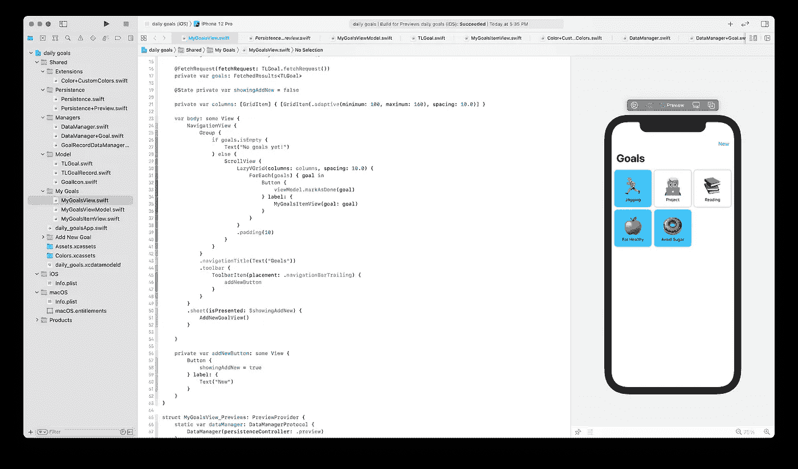

# 复杂 SwiftUI App 教程。第三部分。行动

> 原文：<https://levelup.gitconnected.com/complex-swiftui-app-tutorial-part-3-actions-7a3c09dd4f89>

## iOS 应用程序开发

## 在本教程中，我们将向网格项目添加一个 ContextMenu，并在 SwiftUI 应用程序中实现目标操作。我们将使用联合收割机，核心数据和 MVVM 模式。

作者提供的截图

> 在本教程中，我们使用最新版本的 Xcode (12.4)和 macOS Big Sur (11.2.2)进行编写。

在本教程中，我们将使用在 [Complex SwiftUI app 教程中开发的 App。第二部分。主视图](https://alexzarr.medium.com/complex-swiftui-app-tutorial-part-2-main-view-31464249b367)教程，所以推荐通读一下。否则，如果您不想这样做，您可以简单地在这里下载 starter 项目。

## 我们今天要做什么

今天，我们将把我们的目标标记为今天完成，并开始存储我们一段时间以来的表现记录。此外，我们将添加编辑和删除目标。我们将使用`ContextMenu`进行操作，创建另一个 **SwiftUI** 视图来编辑目标，并向我们的`DataManager`添加一个新方法来将`TLGoalRecords`存储在**核心数据**中。

## 入门指南

首先，确保你已经准备好了入门应用。如果您已经完成了本教程前面的所有部分，那么您就万事俱备了。否则，下载[启动项目](https://github.com/alexzarr/DailyGoals/tree/tutorial-part-02/main-view)。

此时，我们可以创建新的目标，并在主屏幕上看到我们所有的目标。我们有一个显示目标的`LazyVGrid`，现在，我们将添加一个点击目标的动作。

## 我已经完成了今天行动的目标

要添加动作，我们需要先有一个负责逻辑的层。实际上，我们需要我们案例中的东西:主视图的视图模型和实现了新方法的`DataManager`。先说`DataManager`。

## 数据管理器

我们将为与`TLGoalRecords`相关的动作创建一个新的协议`GoalRecordDataManager`。为了避免将来`DataManager`有一个巨大的文件，我们将为这个协议创建一个单独的文件。但首先，让我们重构其中的当前代码。

> 在一个完美的世界中，我们应该创建一个单独的分支，在那里实现计划的重构，合并它，然后继续当前的任务。但是现在，我们就在这里做。它不疼。

创建`DataManager+Goal.swift`文件。然后将实现这个协议的`GoalDataManagerProtocol`定义和`DataManager`扩展移到这个文件中。此外，我们将向该协议添加一个新方法`readGoal`。该文件将如下所示:

如您所见，我们向协议添加了一个新方法，并在扩展中实现了它。在这个方法中，我们用给定的`id`或`nil`返回一个目标，如果没有这样的目标。

> 注意`id`参数是可选的。这是因为`TLGoal`有一个可选参数`id`。事实上，它永远不会是`nil`，所以为了方便起见，我们将其设置为可选参数。

现在，我们的`DataManager.swift`看起来不错:

确保您为`persistenceController`移除了`private` 。暴露它并不是最明智的事情，但是因为我们把我们的`DataManager`藏在协议后面，它不会有太大的改变。

最后，创建`DataManager+GoalRecord.swift`文件。它将有一个包含三种方法(及其实现)协议:

*   我们用三种方法创建了一个新的协议，
*   创建了一个扩展来实现完全相同的方法，但是为`date`添加了一个默认值，
*   最后，实现了这个协议。

`DataManager`的最后一步是将新协议添加到`typealias`中，我们已经为`DataManagerProtocol`准备了该协议:

现在，当我们点击一个目标时，我们准备使用`DataManager`来创建一个新的记录。首先，我们将为`MyGoalsView`创建一个 viewModel，因此它将负责与模型的交互。

## MyGoalsViewModel

创建一个新的 Swift 文件`MyGoalsViewModel`。这个视图模型现在有两个方法:`markAsDone`和`unmarkAsDone`:

*   我们创建了一个符合`ObservableObject`的新类，
*   注入了`DataManager`，所以我们可以测试这个视图模型，
*   添加了一个新方法，基本上调用了新创建的`DataManager`的`createGoalRecord`方法，
*   又加了一个叫`deleteGoalRecord`的。

现在，我们几乎准备好实现我们视图中的操作了。但在此之前，让我们先给我们的`TLGoal`添加几个计算变量。转到`TLGoal.swift`，添加以下内容:

*   添加`lastRecord`，它只是从`records`集合中取出最后一个`TLGoalRecord`，
*   添加`isCompletedToday`,它简单地获取`lastRecord`,并检查其`date`是否是今天。

现在，打开`MyGoalsItemView.swift`。今天的目标完成后，我们将更改背景:

1.  我们检查`goalIsCompletedToday`是否将背景色设置为绿色，否则，我们使用默认的背景色，
2.  我们为预览创建另一个`TLGoal`变量，
3.  我们将我们的预览移动到一个`Group`中，并将我们的`previewLayout`修改器应用到整个`Group`中，所以我们不需要为每个预览项目应用它，
4.  最后，我们在`Group`中添加另一个`MyGoalsItemView`。

现在，画布向我们展示了两个项目:

作者提供的截图

看起来不错。但是让我们先创建一个自定义颜色。按下`Command` + `N`创建一个新文件。在`iOS`选项卡中，选择`Resources`部分的`Asset Catalog`。点击`Next`，称之为`Colors`，点击`Create`。

现在，我们有一个专门针对颜色的资产目录。打开它，点击底部栏中的加号按钮，选择`Color Set`。称之为`completed`，为`Any Appearance`设置 8 位 RGB 值为 59，199，255，为`Dark Appearance`设置 75，135，215。或者你可以选择任何你喜欢的颜色。

还有，趁我们在这里，我们再加一个颜色，叫`background`。它的`Any Appearance`会是白色的`Dark Appearance`会是黑色的。我们需要它，因为我们使用的`Color(.systemBackground)`使用了 macOS 中没有的`UIColor.systemBackground`。

最后，创建一个新的 Swift 文件`Color+CustomColors.swift`:

现在，我们在一个扩展中拥有了来自资源的所有颜色。再次打开`MyGoalsItemView.swift`并改变背景颜色:

太好了。现在，如果你打开`MyGoalsView.swift`，你会看到它显示我们今天的目标是否完成:

作者提供的截图

太好了。最后，是时候添加我们在视图模型中实现的动作了。

## 标记为完成

为了实现将今天的目标标记为已完成，我们将注入我们的视图模型，然后将`MyGoalsItemView`放入`Button`中，并在其动作中使用我们的新方法:

1.  我们在视图中添加了`MyGoalsViewModel`，
2.  我们在`Grid`上添加了一个`Button`来调用 tap 上的`markAsDone`，
3.  我们在`PreviewProvider`中创建了`dataManager`，
4.  我们用具有这个`dataManager`的 viewModel 初始化视图。

现在，如果你构建并运行了这个应用程序(或者甚至你运行了实时预览)，你就可以将你的目标标记为已完成。如果您重新构建应用程序并再次运行，该状态将持续存在，因此您可以确保您的记录被正确存储，并且您可以开始收集关于您如何随着时间的推移处理目标的记录。

# 撤消操作

但是如果你不小心碰到了一个目标呢？在这种情况下，您需要撤销此操作。为此，我们将实现一个`ContentMenu`，这样你可以长按任何目标并撤销你的动作。就这么办吧。将以下内容添加到您的视图中:

1.  我们给我们的`Button`添加了一个新的修改器`.contextMenu`，
2.  我们实现了一个方法来构建`ContextMenu`的项目。我们添加了一个包装器`@ViewBuilder`，显示我们正在构建一个`View`。我们检查了目标是否完成，并在这种情况下展示了我们的`undo`方法。最后，我们添加了接下来要实现的两个操作。

现在，如果你点击并按住你的任何一个目标，你会看到一个常规的`ContextMenu`，根据目标的状态有几个动作。目前只有`Not completed`能用。我们将在下一个教程中讨论它。

## 下一步是什么

恭喜你。我们已经创建了一个点击目标的操作，并向我们的目标添加了一个`ContextMenu`，因此我们可以撤销将它们标记为已完成(此外，该菜单还会有其他操作，如“删除”和“编辑”)。我们正在逐步开发我们的应用程序，帮助人们获得新习惯，戒掉坏习惯。我们使用 **SwiftUI** 和**组合**以及 **MVVM** 模式。我们尽可能地隐藏在**协议**之后，以使我们的应用程序可测试。我们确保我们的应用在**预览**模式下工作，不会影响设备/模拟器上的数据。毕竟，我们使我们的代码干净且可测试，所以如果在某个时候，我们需要扩展应用程序，我们将能够毫不费力地完成。

该应用程序的完整代码可在[这里](https://github.com/alexzarr/daily-goals-yt-tutorial/tree/part-3-mark-as-done-action)获得。

敬请期待！下一个教程将很快推出。

*本教程是复杂 SwiftUI 应用教程的第二部分。要检查其他零件，请使用以下链接:*

1.  [*复杂 SwiftUI App 教程。第一部分。设计模型*](https://medium.com/geekculture/complex-swiftui-app-tutorial-part-1-designing-model-17db0977712b) *。*
2.  [*复杂 SwiftUI App 教程。第二部分。主视图*](https://alexzarr.medium.com/complex-swiftui-app-tutorial-part-2-main-view-31464249b367) *。*
3.  *复杂 SwiftUI App 教程。第三部分。行动。(本教程)*