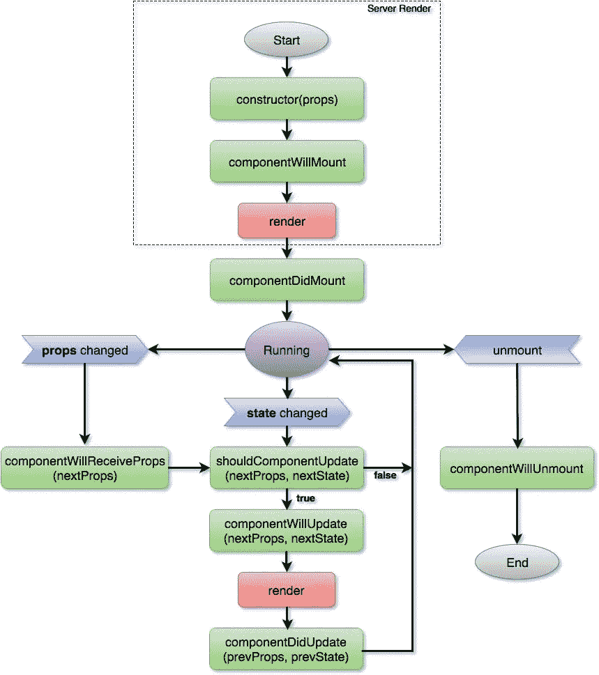

# componentidmakesense—反应组件生命周期解释

> 原文：<https://levelup.gitconnected.com/componentdidmakesense-react-lifecycle-explanation-393dcb19e459>

## 了解 React 生命周期方法以及何时/如何使用它们

React 令人难以置信，因为它允许您使用声明性 API 来构建 UI。您告诉 React 您希望界面是什么样子，它会处理其余的事情。

 [## 学习 React -最佳 React 教程(2018) | gitconnected

### React 的前 48 门课程。教程由开发者提交并投票，让你找到最好的反应…

gitconnected.com](https://gitconnected.com/learn/react) 

当用户与应用程序交互时，状态会发生变化，从而导致 DOM 更新。React 提供了一组方法，可以在更新过程中的任何时候无缝地拦截更改，并控制 UI。组件生命周期通常是真正掌握 React 的最后一部分，本文将确保您牢牢掌握。

组件的生命周期可以定义为从组件第一次被插入 DOM 开始的时间，组件在 DOM 中的整个时间，以及组件从 DOM 中被移除的时间。代码中的每个 React 组件都有唯一的生命周期。

## 生命周期概述

生命周期方法是允许你读取状态变化和控制 UI 更新的钩子。生命周期可以分为 3 类:

1.  **挂载:**组件正在被添加到 DOM 中。
2.  **更新:**组件接收改变属性或状态，并在组件被重新渲染时被调用。
3.  **卸载:**正在从 DOM 中删除组件。

生命周期方法提供了接管这些步骤的切入点。任何以`componentWill`开头的方法都意味着您在事件发生之前访问它，任何以`componentDid`开头的方法都意味着您在事件发生之后捕获它。

## 增加

*   `constructor()`
*   `componentWillMount()`
*   `render()`
*   `componentDidMount()`

## 更新

*   `componentWillReceiveProps()`
*   `shouldComponentUpdate()`
*   `componentWillUpdate()`
*   `render()`
*   `componentDidUpdate()`

## 卸载

*   `componentWillUnmount()`

# 构造器

在创建组件时和挂载(添加到 DOM 中)之前调用这个方法。它的主要用途是为组件的方法初始化状态和`.bind(this)`。如果你没有做到这两点，那么就不需要构造函数了。

# 组件将安装

这个方法在组件被添加到 DOM / `render()`之前执行。通常建议您使用`constructor`，但是这个方法仍然包含在 API 中，主要是为了向后兼容。

你应该避免在这个方法中调用任何引起副作用的函数，因为`setState`不会触发一个变化，也没有 DOM 可以与之交互。

*注意，这也是在服务器上调用的唯一生命周期方法。*

 [## 组合 API —轻松发展您的编码事业| gitconnected

### 消除在每个单独位置手动更新您的详细信息的痛苦。只需在您的中更改一次数据…

gitconnected.com](https://gitconnected.com/portfolio-api) 

# 组件安装

您的组件现在已经呈现并存在于 DOM 中。这是您应该启动 AJAX 请求、添加事件监听器和执行任何需要 DOM 的设置的时候。在此方法期间或之后的任何时间调用`setState`将导致重新渲染。

# componentWillReceiveProps

当你的组件从它的父组件收到新的道具时，`componentWillReceiveProps(nextProps)`被触发。这是一个伟大的时间来检查是否有变化，在即将到来的道具相比，你目前的道具，并触发一个新的价值为基础的状态变化。一个常见的用例是根据变化重置状态。

# shouldComponentUpdate

这种方法纯粹是为了提高性能。渲染和[协调](https://reactjs.org/docs/reconciliation.html)在 React 中开销很大。`shouldComponentUpdate(nextProps, nextState)`为开发人员提供了从该方法返回布尔值`true/false`的能力，该方法控制 React 是否应该执行协调操作和 DOM 更新。

默认行为是让 React 呈现每个更新，这在大多数情况下都有效。如果`shouldComponentUpdate()`返回`false`，那么`componentWillUpdate()`、`render()`和`componentDidUpdate()`将不会被调用。

# 组件将更新

当接收到新的道具或状态时，React 会在渲染之前立即调用此方法。`componentWillUpdate(nextProps, nextState)`用处不大，大概应该避免(类似于`componentWillMount`)。此时你不应该做任何会改变状态的事情——如果你需要在渲染前做任何事情，请使用`componentWillReceiveProps`。

*注意，在初始渲染时不会调用这个方法。*

# componentDidUpdate

React 为您构建了一个全新的 UI 后，`componentDidUpdate(prevProps, prevState)`会立即被调用。这是与 DOM 交互或根据新接口的外观实例化新网络请求的好时机。

# 组件将卸载

您的组件曾经有过辉煌的一生，现在是它离开 UI 的时候了。这是清理与添加和维护组件相关的一切的时刻，而组件是在 UI 上存在的。

# 奖励:componentDidCatch

`componentDidCatch(error, info)`是 React 16 中新增的一个生命周期。React 臭名昭著，因为如果 React 应用程序中出现 JavaScript 错误，整个应用程序就会崩溃。它破坏了 React 的内部状态，破坏了应用程序并产生了神秘的错误消息。`componentDidCatch`通过为实现该方法的组件的子组件捕获组件树中发生的任何 JavaScript 错误来解决这个问题。它能够捕获错误并显示回退 UI。

*如果您觉得这篇文章有帮助，请点击*👏*。* [*关注我*](https://medium.com/@treyhuffine) *了解更多关于 React、Node.js、JavaScript 和开源软件的文章！你也可以在*[*Twitter*](https://twitter.com/treyhuffine)*或者*[*git connected*](https://gitconnected.com/treyhuffine)*上找到我。*