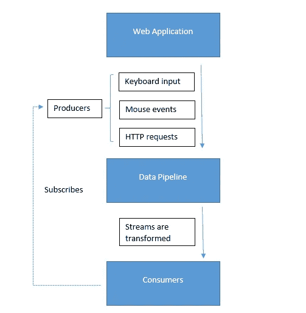
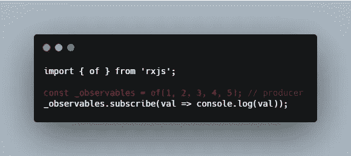
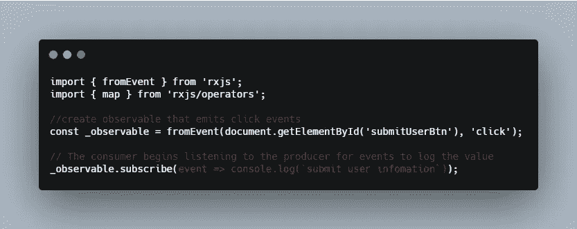
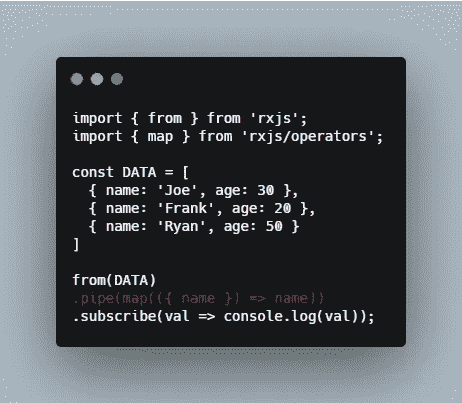

# 反应式编程的组成部分

> 原文：<https://levelup.gitconnected.com/components-in-reactive-programming-365c7bd9d271>

## Rxjs

## 介绍反应式编程的 3 个组成部分——生产者、消费者和数据管道。

在 [Unsplash](https://unsplash.com/s/photos/coffee?utm_source=unsplash&utm_medium=referral&utm_content=creditCopyText) 上由 [Toa Heftiba](https://unsplash.com/@heftiba?utm_source=unsplash&utm_medium=referral&utm_content=creditCopyText) 拍摄的照片

这篇文章是关于反应式编程中组件的基础知识。

1.  生产者
2.  顾客
3.  数据管道

【https://betterfullstack.com 查看 [*更多类似内容*](https://betterfullstack.com)

下图展示了反应式编程在大背景下是如何工作的。

反应式规划中从上游观测者到下游观测者的一般模型

# 生产者

***生产者*** 是你数据的来源。

一个 ***流*** 必须总是有一个数据生产者，这将是你将在 RxJS 中执行的任何逻辑的起点。

> 流只不过是一段时间内的一系列事件

[***观察者模式***](https://en.wikipedia.org/wiki/Observer_pattern) 将生产者定义为主体。我们称它们为 ***可观察物*** ，就像是能够被观察到的东西。

rxjs 中的生产者样本

***Observables*** 负责推送通知，所以我们把这种行为称为 fire-and-forget。这意味着我们永远不会期望生产者参与事件的处理，而只是参与事件的排放。

# 顾客

***消费者*** 是接受来自 ***生产者*** 的事件并以某种方式进行处理的组件。当消费者开始监听生产者的事件时，您现在就有了一个流。正是在这一点上，流开始推动事件；我们将消费者称为 ***观察者*** 。

***流*** 只从 ***生产者*** 流向 ***消费者*** 。

rxjs 中的消费者样本

从上面的例子来看，每当用户点击提交按钮时，都会产生一个事件传递给消费者。

自然界中，一条小溪会从上游流向下游；同样的事情也发生在反应式编程中。这些流总是从上游观察者流向下游观察者。

来自用户的点击动作将是上游可观察的，因为它只会产生事件，而不会消费它们。基于点击动作执行逻辑的代码是下游观察者。

# 数据管道

反应式编程的最大好处是，当数据从生产者传递到消费者时，您可以对其进行编辑。

来自我最近的一篇文章是[函数式编程与集合](/approach-reactive-programming-in-modern-web-application-b20f59b7699d#NestedOperatorExpressions)相结合，作为管理事件序列的理想方式来满足需求。

函数式编程？是的，这就是为什么我们可以在像 RxJS 这样的库中找到许多函数式编程语法实现。

为了创建数据管道，我们使用 RxJS 库提供的 [pipable 操作符](https://github.com/ReactiveX/rxjs/blob/master/doc/pipeable-operators.md)和操作符，通过使用函数式编程将数据从生产者转换到消费者。

rxjs 中的数据管道示例

生产者将通过数据管道和`**pipe**` **操作符**发出一个包含姓名和年龄信息的用户数组，使用`map`转换来自生产者的数据，并只将用户名返回给消费者。

# 摘要

本文提供了反应式编程中组件的基础知识。我们有 3 个部分，即生产者、数据管道和消费者。

我希望这篇文章对你有用！可以跟着我上[媒](https://medium.com/@transonhoang?source=post_page---------------------------)。我也在推特上。欢迎在下面的评论中留下任何问题。我很乐意帮忙！

 [## 故事-更好的全栈

### 关于 JavaScript、Python 和 Wordpress 的有用文章，有助于开发人员减少开发时间并提高…

betterfullstack.com](https://betterfullstack.com/stories/)