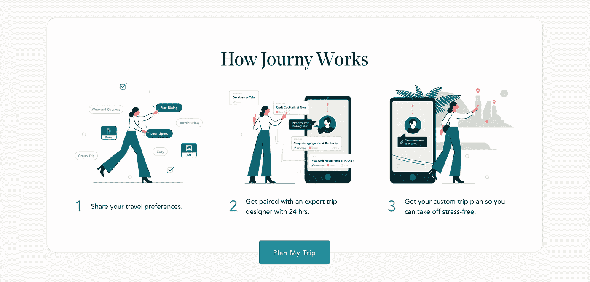
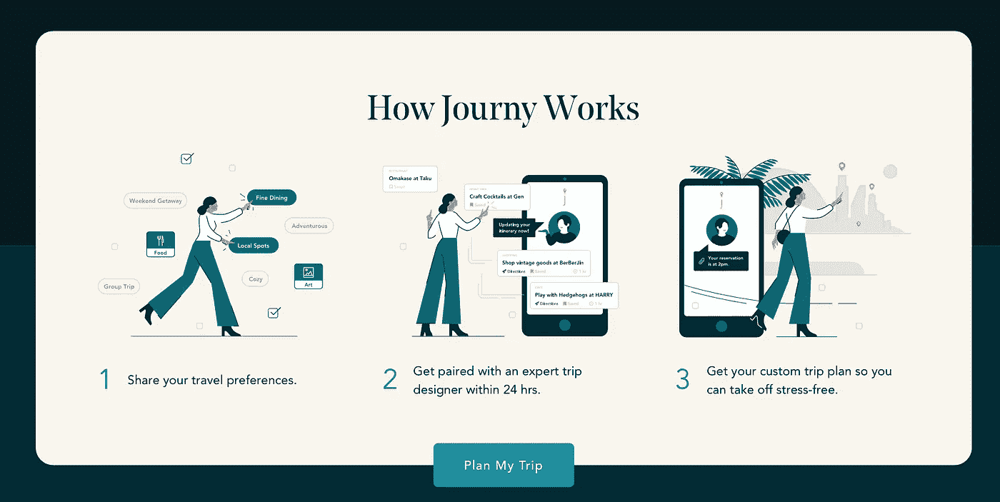
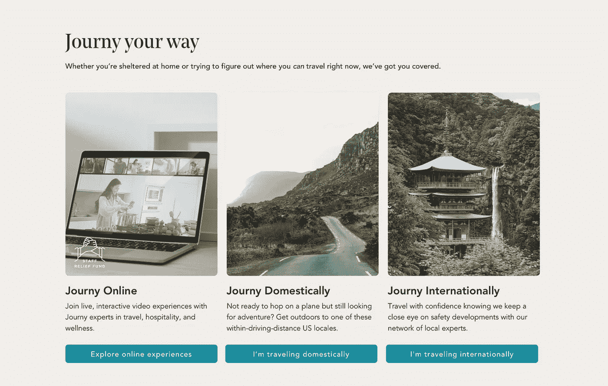
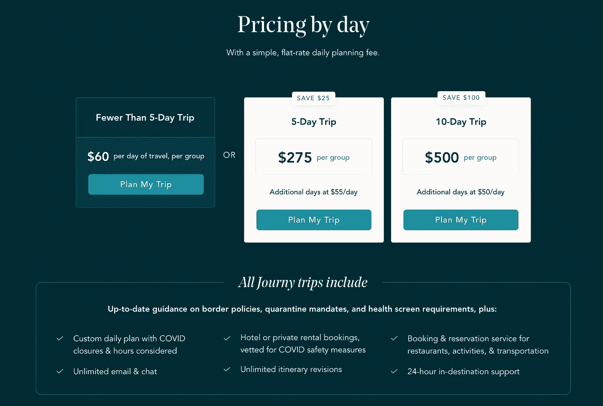

# 扩展静态内容开发

> 原文：<https://levelup.gitconnected.com/composing-components-building-static-content-websites-21c003dc1097>

这是最“基本”的网站类型:主页、博客、营销页面。现在似乎每隔一周就有一个新的静态站点生成器，或者像 Gatsby 或 Gridsome 这样的 JAMStack 框架。

虽然许多人会认为我们应该简单地在一个普通的 HTML、CSS、JS 栈上构建它，但是有一些令人信服的理由让我们在 JAMStack 框架中进行编写。然而，这些好处是基于这样一种想法，即使用这些 JAMStacks 进行开发和迭代实际上更容易、更快。

一个大问题是，我们最终会写出难以维护的组件。简单和容易地组合组件的想法似乎从来没有兑现它的承诺。创建一个新页面似乎总是感觉像是从头开始写，或者拼凑一些不太符合我们期望的组件。

## 问题

让我们后退一步，理解为什么即使有了新的工具和框架，编写一个“基本的”静态网站也不那么容易。

当前构建 UI 最流行的范例是使用声明性状态驱动的组件。这些框架中的许多都被设计成灵活和非个性化的。组件的核心有三个主要部分:

*   标记和样式
*   道具和数据
*   方法/互动

正如您所看到的，组件并没有解决如何分离我们的关注点以使它们可组合的更困难的问题。

因此，我们经常对组件进行任意分解。难以适应新情况的东西。

以下是您经常遇到的问题类型的一个重要示例:



你看到设计，觉得很棒！是时候创建新组件了。

我们将用`background-color: $beige`创建一个`div`。在里面我们将添加圆形的`div`和`margin: 0 auto` …等等。

太好了，现在我们有了一个“T7”组件。是时候把它放到我们的主页上了。

```
// Homepage Template/JSX
<DefaultLayout>
  <HeroSection />
  <PricingSection />
  {/* NEW COMPONENT */}
  <HowItWorksSection />
</DefaultLayout>
```

完美！看起来不错！

现在，两个月后，你的设计师带来了一个新的页面，你看到这个…



现在怎么办？

我可以给组件添加道具来设置背景色，但是这一部分的第二个版本有两种色调的背景！

我是否创建了一个新的`<HowItWorksDarkSection />`组件，但这将意味着大量的重复代码…

> 当定义一个组件时，您设置承诺:标记承诺、数据承诺/依赖(通过 props 和内部状态)和组件依赖。当您创建一个组件时，您或多或少必须按原样使用它。

因此，你必须考虑你想要什么样的承诺。

# 在以内容为中心的网站上分离关注点。

这里有 4 种类型的组件，它们的职责，以及它们如何帮助你编写可维护的内容网站。

## 1.章节包装

**职责:**

*   颜色；色彩；色调
*   盒子样式:背景颜色、边框、边框半径、多种颜色等。
*   内部最大宽度、填充/间距/边距。

这样你就可以写下你的章节内容，而不用担心页面之间的差异。这解决了上述问题。

```
// Homepage Template/JSX
<DefaultLayout>

  {/* Page 1 with single background */}
  <BasicSectionWrapper text-color="text" bg-color="off-white">
    <HowItWorksSection />
  </BasicSectionWrapper>{/* Page 2 wtih Two Tone background */}
  <TwoToneSectionWrapper top-color="navy" bottom-color="turquoise">
    <HowItWorksSection />
  </TwoToneSectionWrapper></DefaultLayout>
```

## 2.通用布局内容部分

**职责**

*   管理将用于显示内容的常见布局。
*   响应变化

让我们来看另一个组成部分。



始终考虑是否有必要将此作为“特殊”或“特定页面”部分。

```
// Option 1: Page Specific Section
<TwoToneSectionWrapper top-color=”navy” bottom-color=”turquoise”>
  <JournyYourWay />
</TwoToneSectionWrapper>
```

当您创建特定于页面的组件时，它现在可以有限地重用。你必须为每个文本区域添加一个道具:`title`、`subtitle`、`columns`。

特别是对于列，内容以这种格式固定。想要在列中添加或删除另一行内容吗？按钮风格不同？你需要加道具让它可调。等到这个“真正”可重用的时候，你将会拥有太多的道具。主要问题是，如果内容完全改变，它甚至无法工作。

请考虑第二种选择

```
 // Journy Your Way
<SectionWrapper bg-color=”off-white”>
  <VStack>
  <AHeading level=”2">Journy Your Way</AHeading>
  <AHeading level=”4">Whether …</AHeading>
  <Columns>
    { cards.map(card => {( <ImageCard props={card} />)}
  </Columns>
  </VStack>
</SectionWrapper>
```

这在内容视图组件上会稍微详细一些。然而，即使有 5-6 个部分，模板也应该适合一个页面，并且仍然易于浏览。

## 3.页面特定内容部分

**职责**

*   有道具，但有默认的设计。
*   覆盖更改

页面特定内容部分是用于显示非常定制的布局和数据的部分。为了方便起见，我们选择将它放入一个组件中。它更易于管理，易于从一个页面复制到另一个页面，并且更易于在视图页面中解析。

设计页面特定内容的关键在于，它们没有被设计成，也不应该被设计成灵活的。使组件灵活会使组件太难使用，或者太冗长，以至于在另一个组件中从头开始构建会更方便。

我们确实希望能够在其他页面上重用这些组件，只是数据略有不同。因此，我们应该使用的唯一道具是内容道具和颜色道具。

让我们试着弄清楚什么应该是页面特定的内容部分。



在这里，我们可能会尝试将整个部分作为一个组件。相反，我们应该考虑哪些组件可能会改变，以及如何改变。

```
<SectionWrapper bg-color=”dark-turquoise”>
  <VStack>
    <AHeading level=”2">Pricing by day</AHeading>
    <AHeading level=”4">With a simple, flat-rate planning fee.</AHeading>
    {/* Page Specific Section */}
    <PricingCards />
    {/* Page Specific Section */}
    <InclusionsList color=”white” accent-color=”turquoise” />
  </VStack>
</SectionWrapper>
```

让我们继续考虑这些组件在未来可能会发生什么变化。最常见的只是复制更改。所以我们应该为这些组件设置道具，使其易于更改。

```
// Pricing Props
const pricingCardsProps = {
  // Might be more cards on the left. So all cards will be arrays.
  leftCards: {
    type: Array,
    default: [
      {
        color: "dark", // Allow Card color theme to change.
        title: "Fewer than 5-Day Trip",
        price: "60",
        priceUnit: "per day of travel, per group",
        ctaText: "Plan My Trip",
        ctaUrl: "/url",
      },
    ],
  },
  // All Text might change
  separator: {
    type: String,
    default: "OR"
  },
  rightCards: {
    type: Array,
    default: [
      {
        color: "light",
        title: "5-Day Trip",
        tag: "save $25",
        price: "275",
        priceUnit: "per group",
        ctaText: "Plan My Trip",
        ctaUrl: "/url",
      },
      *{
        color: "light",
        title: "10-Day Trip",
        tag: "save $100",
        price: "500",
        priceUnit: "per group",
        ctaText: "Plan My Trip",
        ctaUrl: "/url",
      },*
    ],
  },
};// Pricing Props
const inclusionsListProps = {
  title: {
    type: String,
    default: "All Journy Trips include",
  },
  subTitle: {
    type: String,
    default: "...",
  },
  list: {
    type: Array,
    default: [
      "point 1", 
      "point 2", 
      "point 3",
      // Etc.
    ],
  },
};
```

现在，将来如果设计者想要使用这些页面特定的组件，我们可以很容易地改变有意义的文本。

## 4.内容视图组件:

**职责**

*   导入部分
*   定义布局
*   使用节包装器包装组件
*   提供作为道具发送的数据覆盖

内容视图是我们要看的最后一种组件。这个页面应该足够简单，一个“非技术”的人可以进入进行复制编辑(如果合适)。理想情况下，您可以通过 CMS 获得数据。

```
import HowItWorksSection from '@/components/HowItWorksSection'
import PricingCards from '@/components/HowItWorksSection'// Homepage Template/JSX
<DefaultLayout>
  {/* Regular Section */}
  <BackgroundImageSection image="./background-image.jpg">
    <Columns>
      <div>
        <AHeading level="2">Travel Tips</AHeading>
        <AHeading level="4">......</AHeading>
      </div><div>
        
      </div>
    </Columns>
  </BackgroundImageSection>{/* Pricing Section */}
  <SectionWrapper bg-color="dark-turquoise">
    <VStack>
      <AHeading level="2">Pricing by day</AHeading>
      <AHeading level="4">With a simple, flat-rate planning fee.</AHeading>
      {/* Page Specific Section */}
      <PricingCards />
      {/* Page Specific Section */}
      <InclusionsList color="white" accent-color="turquoise" />
    </VStack>
  </SectionWrapper>;{/* How it works section */}
  <TwoToneSectionWrapper top-color="navy" bottom-color="turquoise">
    <HowItWorksSection />
  </TwoToneSectionWrapper></DefaultLayout>
```

## 摘要

无论何时构建组件，都要确保花一些时间考虑哪些可能会改变，哪些不会。找出基本的可组合元素，并为内容节省使用道具。

1.  使用节包装来控制节颜色、内部内容的最大宽度、填充。
2.  用可组合组件定义公共布局。
3.  具有特殊设计的元素应该被包装，通过道具只暴露内容。道具应该有默认值，与默认/首次设计相关。
4.  在您的实际视图中，使用节包装器和布局组件定义整体布局和内容。模板应该只使用预定义的可组合组件。

感谢阅读！