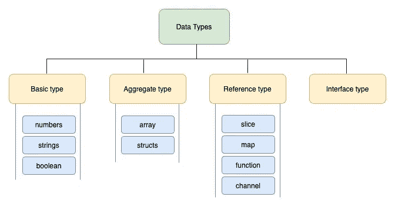
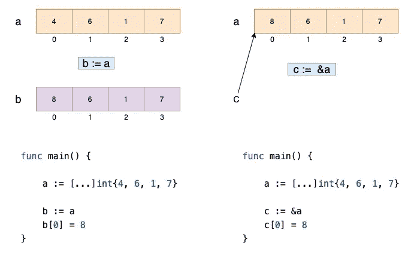
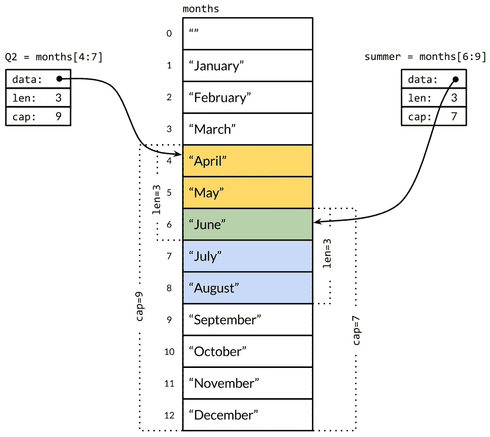
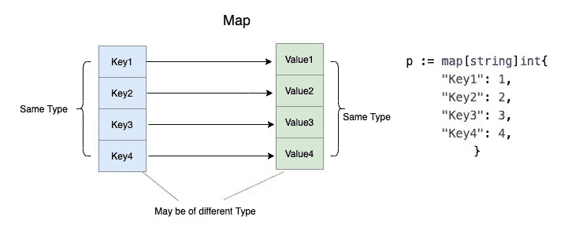
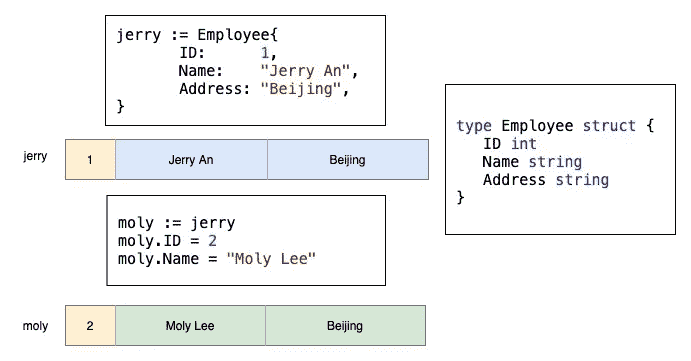

# Golang 中的复合数据类型

> 原文：<https://levelup.gitconnected.com/composite-data-types-in-golang-a829288b5553>

## Go 支持复合类型，如数组、切片、映射和结构。我们将逐一讨论这四种复合类型



Golang 数据类型

在 Go 中，数据类型分为以下四类:

1.  基本类型:数字、字符串和布尔值都属于这一类。
2.  **聚集类型:**数组和结构属于这一类别。它们的值是内存中其他值的串联。
3.  **引用类型:**指针、切片、地图、函数、通道都属于此类。
4.  **接口类型**

在这篇文章中，我们将讨论四种复合类型:*数组、切片、映射、结构。*

# 目录

*   [数组](#866f)
*   [切片](#d610)
*   [地图](#640d)
*   [结构](#e9ca)

# **阵列**

*   数组存储与**同类型** ( *同质*)的项目集合
*   数组中的元素存储在**连续内存位置**
*   数组具有固定的大小
*   申报样式

```
// Given fixed size
a := [3]int{1,2,3}//  Array literal with length inferred
a := [...]int{1,2,3}var a [3]int
a[0] = 1
a[1] = 2
a[2] = 3
```

在数组文本中，`...`符号指定的长度等于文本中元素的数量。

*   数组副本引用**不同的**底层数据。

当数组用作函数参数时，内部的函数接收数组的副本，而不是原始数组。这种行为不同于其他通过引用隐式传递数组的语言。



go 的数组副本

# 薄片



切片示例

*   切片不存储任何数据，它只是描述底层阵列的一部分，并由该阵列提供支持
*   内置函数`len`返回切片中元素的数量
*   内置函数`cap`返回底层数组的长度
*   申报样式

```
// slice existing array 
a := [...]int{1,2,3,4,5,6}
b := a[:3]// literal style
c := []int{1,2,3,4,5,6}// Via make function
d := make([]int, 10, 100)   // slice with length==10 capacity==100
e := make([]int, 10)   // slice with length==10 capacity==10
```

*   片拷贝引用**相同的**底层数据，与数组不同

# 地图

在 Go 中，映射是对哈希表的引用。它是按键值对分组的元素的集合



*   申报样式

```
// literal style
p := map[string]int{
    "Key1": 1,
    "Key2": 2,
  }// Via make function
q := make(map[string]int)
q["key3"] = 4
```

*   要知道该元素是否存在，请使用如下测试:

`value, ok := p["Key2"]`

*   多个赋值引用**相同的**底层数据

# 结构体

> Golang 中的结构是最常用的结构之一，也是创建用户定义类型的一种方式。

一个`struct`是描述一个单一概念的**不同数据类型** ( *异构* ) 的集合。

*   结构中的字段或属性存储在**连续内存位置**
*   就像数组一样，它有固定的大小
*   结构副本引用**不同的**底层数据



很好，我相信您现在对四种复合类型已经很有信心了:数组、切片、映射和结构。