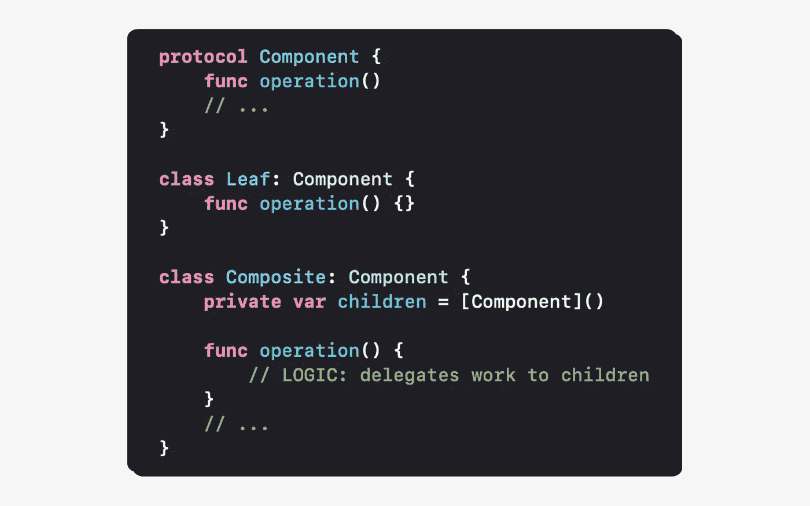
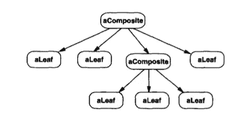
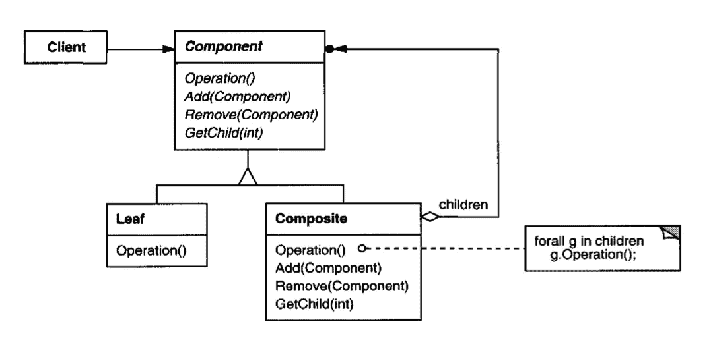
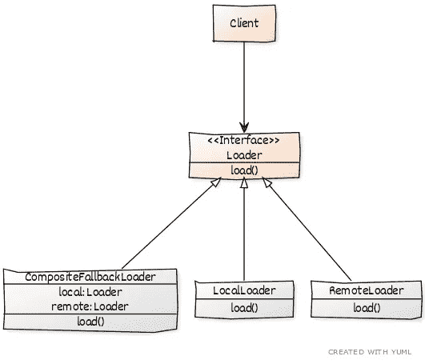

# Swift 中的“复合”模式

> 原文：<https://levelup.gitconnected.com/composite-pattern-in-swift-8c7b932fc157>



# 定义

“复合”模式是一种结构设计模式，对于将类和对象组成一个更大的系统很有用。

**“复合”模式定义了一个统一处理对象结构的接口。结构是包含单个对象和对象组合的树的形式。**

# 我们什么时候应该使用这种模式？

## 通过统一的界面组合多个对象

当我们有一个统一处理的对象集合时，应该使用这种模式。客户端不知道它处理的对象的类型，这意味着所有的对象都应该符合相同的接口。它使客户端代码变得简单，因为对象的类型对客户端变得透明。

## 将一组物体视为一个整体

当我们有一个具有层次关系的对象集合时，应该使用这种模式。对象的集合形成了具有层次结构的树状结构。该结构包含树叶(单个对象)和复合物(对象的组合)。



来自设计模式的图像——可重用面向对象软件的元素

在这种结构中，复合对象从其子对象执行操作。这意味着叶子对象定义行为，复合对象将工作委托给它们的子对象。最后，客户机认为它与一个对象通信，尽管在接口后面我们可以有多个对象。

## 将对象知识与客户端分离

当客户端知道它使用的对象类型时，应该使用这种模式。通过共享一个接口，对象不需要被单独处理，这就消除了应用程序的复杂性。客户端不需要检查它是否在正确的对象上调用了正确的方法:它在整个对象结构上调用相同的方法。“复合”模式为客户机收集和管理对象，客户机可以与结构中的任何对象一起工作，没有任何耦合。

# 我们应该如何使用这种模式？

客户端通过接口(**组件**)与一组对象进行通信，该接口表示由叶子和组合执行的操作。



来自设计模式的图像——可重用面向对象软件的元素

## 具体例子

假设我们有一个移动应用程序，可以根据互联网连接远程或本地加载数据。这是反映上述结构的 UML 图。



我们可以使用任何叶对象(LocalLoader 或 RemoteLoader)为我们的应用程序加载数据。如果我们用一个糟糕的互联网连接发出一个远程请求，我们希望通过加载本地数据来预测任何失败的请求。我们创建一个复合对象(CompositeFallbackLoader ),以便在远程数据加载失败时提供一个后备。

# 履行

```
**protocol** LoadData {
    **func** load(completion: **@escaping** (Result<Data, Error>) -> Void)
}
```

在我们的示例中，我们没有定义 Add 和 Remove 方法，因为我们希望通过在构造函数中注入单独的对象来保持复合对象不变。我们也不使用 getChild 方法，因为我们没有使用它。遵循*接口分离原则，我们不实现我们的对象不需要的方法。*

如果您的用例需要这些方法，我们可以抛出异常作为我们方法的默认实现，以便强制我们实现它们。叶子和复合物扮演不同的角色，所以如果我们不编写对对象没有意义的默认实现，那就更有意义了。然而，如果共享接口包含对两种类型对象的操作，我们就失去了安全性，因为对象可能会对某些方法做一些无意义的事情(例如，Add 方法在叶子中没有意义)。将职责划分到接口中是一个设计决策。这将使设计安全，因为我们不会调用无意义的方法。然而，我们会失去透明性，因为客户端需要知道它与之通信的对象的类型。根据您的需求，在透明度和安全性之间找到合适的平衡点。

## 叶对象

```
**class** LoadRemoteData: LoadData {
    **func** load(completion: **@escaping** (Result<Data, Error>) -> Void) {
        completion(.failure(NSError(domain: "any error", code: 0)))
    }
}**class** LoadLocalData: LoadData {
    **func** load(completion: **@escaping** (Result<Data, Error>) -> Void) {
        completion(.success("'my local data'".data(using: .utf8)!))
    }
}
```

每个对象都符合 LoadData 接口。在这个例子中，我们假装一个远程请求失败和一个成功的本地数据检索来展示复合对象的使用。

## 复合物体

```
**class** CompositeFallbackLoader: LoadData {
    **let** remote: LoadData
    **let** local: LoadData **init**(remote: LoadData, local: LoadData) {
        **self**.remote = remote
        **self**.local = local
    } **func** load(completion: **@escaping** (Result<Data, Error>) -> Void) {
        remote.load(completion: { [**weak** **self**] result **in
            switch** result {
            **case** .success:
                print("fetch \(result) remotely")
            **case** .failure:
                **self**?.retrieveLocalData()
            }
        })
    } **private func** retrieveLocalData() {
        local.load(completion: { localResult **in
            switch** localResult {
            **case** **let** .success(data):
                let myData = String(data: data, encoding: .utf8)!
                print("fetch \(myData) locally")
            **case** **let** .failure(error):
                print(error)
            }
        })
    }
}
```

复合对象符合 LoadData 接口。它实现了一种回退机制，因此当远程请求失败时，可以在本地检索数据。

# 在操场上运行代码

这里有一个[在线 Swift 游乐场](http://online.swiftplayground.run/)，所以不必创建 Xcode 游乐场来测试“复合”模式的实现。然后，复制下面的代码，该代码与我们的移动应用程序的“复合”模式的完整实现相对应，显示了失败的远程请求以及对本地数据的回退。

```
**import** Foundation**protocol** LoadData {
    **func** load(completion: **@escaping** (Result<Data, Error>) -> Void)
}**class** LoadRemoteData: LoadData {
    **func** load(completion: **@escaping** (Result<Data, Error>) -> Void) {
        completion(.failure(NSError(domain: "any error", code: 0)))
    }
}**class** LoadLocalData: LoadData {
    **func** load(completion: **@escaping** (Result<Data, Error>) -> Void) {
        completion(.success("'my local data'".data(using: .utf8)!))
    }
}**class** CompositeFallbackLoader: LoadData {
    **let** remote: LoadData
    **let** local: LoadData **init**(remote: LoadData, local: LoadData) {
        **self**.remote = remote
        **self**.local = local
    } **func** load(completion: **@escaping** (Result<Data, Error>) -> Void) {
        remote.load(completion: { [**weak** **self**] result **in
            switch** result {
            **case** .success:
                print("fetch \(result) remotely")
            **case** .failure:
                **self**?.retrieveLocalData()
            }
        })
    } **private func** retrieveLocalData() {
        local.load(completion: { localResult **in
            switch** localResult {
            **case** **let** .success(data):
                let myData = String(data: data, encoding: .utf8)!
                print("fetch \(myData) locally")
            **case** **let** .failure(error):
                print(error)
            }
        })
    }
}// Client
**let** composite = CompositeFallbackLoader(
    remote: LoadRemoteData(), 
    local: LoadLocalData()
)composite.load(completion: { result **in
    switch** result {
    **case** **let** .success(data):
        print(data)
    **case** **let** .failure(error):
        print(error)
    }
})
```

最后，粘贴并运行代码。