# Flutter & Dart 中的组合[函数式编程—第三部分]

> 原文：<https://levelup.gitconnected.com/composition-in-flutter-dart-functional-programming-part-3-ffba917aee3d>

## [功能编程](https://medium.com/@yogi-6/list/functional-programming-in-dart-flutter-2f3ac9d7fa39)/组合

## 使用 Flutter & Dart 中的组合创建模块化应用程序。

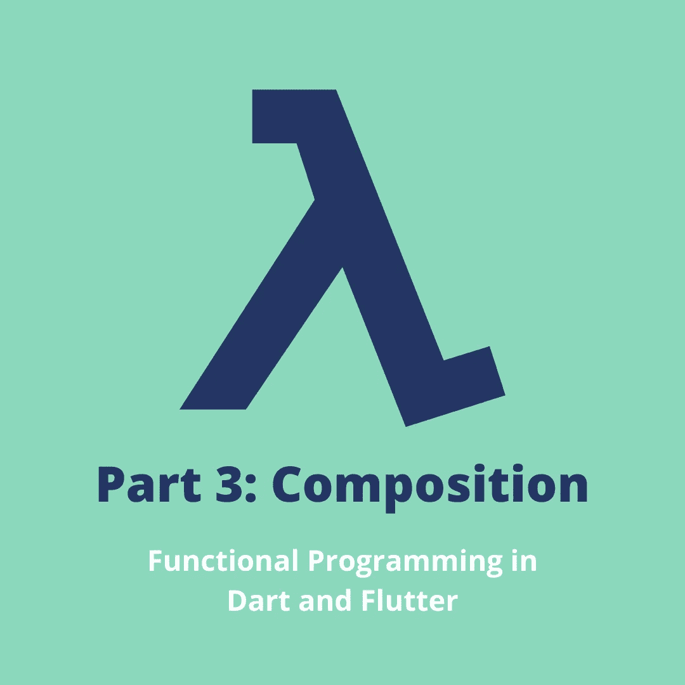

以前，我们讨论过 FP 中的闭包和 Currying。今天，我们将看看组合以及它如何帮助创建模块化应用程序。

**目录**

*   [**什么是作文？**](#c355)
*   [**旋舞如何使用构图？**](#2aee)
*   [**缀 vs 管**](#196d)
*   [**例题**](#ab9f)
*   [**最终想法**](#979c)

# 什么是作文？

我们来看看作文的英文定义。根据 dictionary.com: *构图是将部分或元素组合起来形成整体的行为。好的，这很容易消化。简单来说，就是像乐高。我们用乐高积木组合成一个结构。*

在 FP 中，我们定义了小的通用函数，这些函数可以组合起来构成复杂的函数。一个函数的输出成为另一个函数的输入，以此类推。输入从一个函数传递到另一个函数，最后返回结果。因此，我们可以将组合视为数据流动的管道。

构图的数学符号是`f.g`，在编程中翻译成`f(g(x))`。它从内向外流动。

1.  首先，`x`得到评估。
2.  `x`作为输入被传递给`g`，并且`g(x)`被评估。
3.  最后，对`g(x)`求值，并将结果传递给`f`，最后，对`f(g(x))`求值。

在 Dart 中，compose 函数翻译成

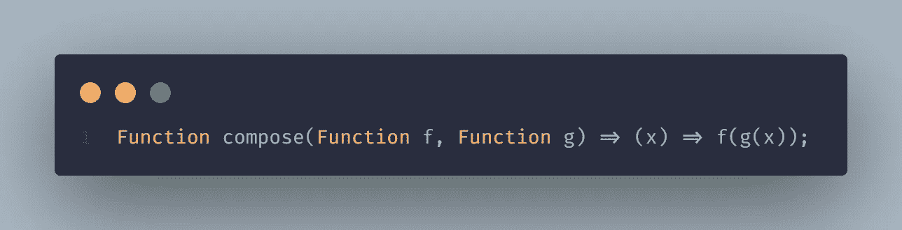

Compose 是一个高阶函数。它接受两个函数，并返回一个接受输入的函数。构图的执行顺序是从右到左，所以先执行功能`g`，然后执行功能`f`。

**示例**

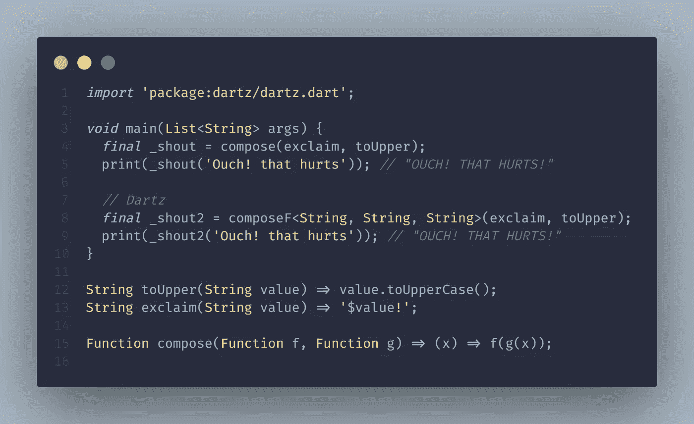

我们创建一个函数`shout`，由两个更小的效用函数`toUpper`和`exclaim`组成。在第 4 行，我们组合这两个函数来创建一个`shout`函数。8 号线使用`dartz` 包提供的`composeF`功能。

# Flutter 如何使用构图？

Flutter 框架是展示组合力量的最好例子之一。对于 UI，我们组合了小部件。比如要不要给点垫高？将该小部件与一个`Padding`小部件组合在一起。需要一些装饰吗？将小部件与`DecoratedBox`小部件组合在一起，等等。

Flutter 大量使用构图。我们用来设计 ui 的部件树遵循组合。小部件就像乐高积木。它们是小的通用部件，我们组合它们来制作复杂的部件/UI。例如，`Container`由几个小部件组成，如`Padding`、`DecoratedBox`、`Align`、`LimitedBox`等。

# 合成与管道

与 compose 类似，我们也有一个管道实用程序。唯一的区别是 compose 执行从右到左的顺序，而管道执行从左到右的顺序。

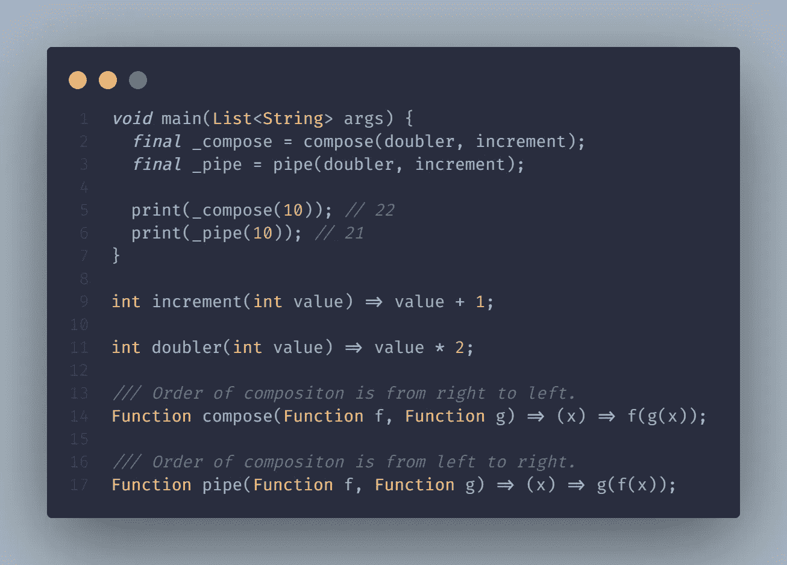

在第 14 行，我们有 compose，因为它有从右到左的顺序，函数 g 首先被执行，结果被传递给函数 f。

在第 17 行，我们有管道。这里，首先执行函数 f，然后将结果传递给函数 g，因此是从左到右。

在 compose 场景中，输入 10 首先通过`increment`函数增加到 11，然后加倍，结果返回 22。

在管道场景中，首先使用`doubler`函数将输入 10 加倍，然后变成 20，然后增加到 21 并返回。

# 例子

让我们结合所学的概念，构建几个将字符串从一种情况转换为另一种情况的函数。

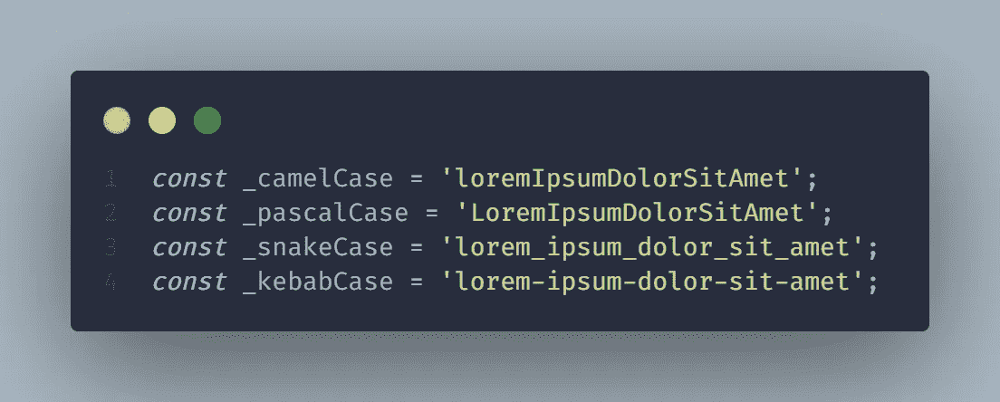

我们需要可以将上述情况相互转换的函数。
与乐高一样，我们首先需要乐高积木，在这种情况下，它将是一些实用功能。

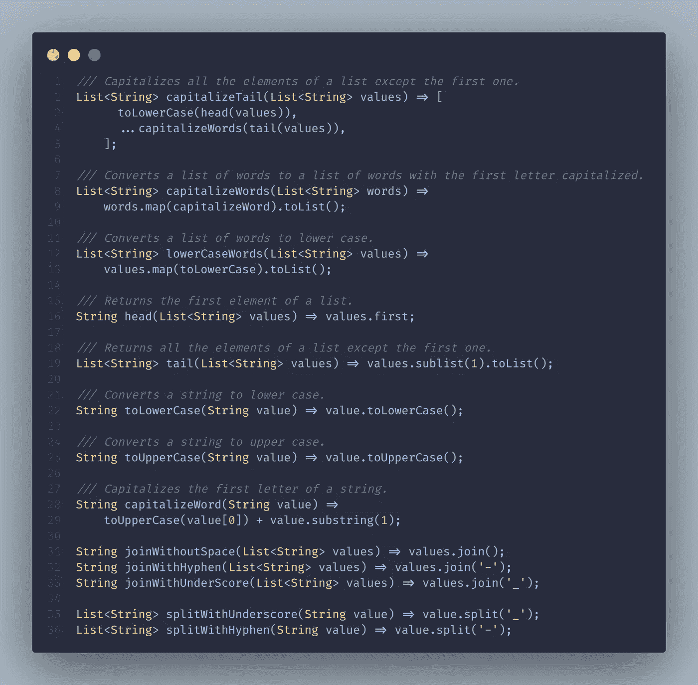

我们之前定义的 compose 函数只支持将两个函数作为参数。现在我们将定义一个可以接受 n 个参数的函数。

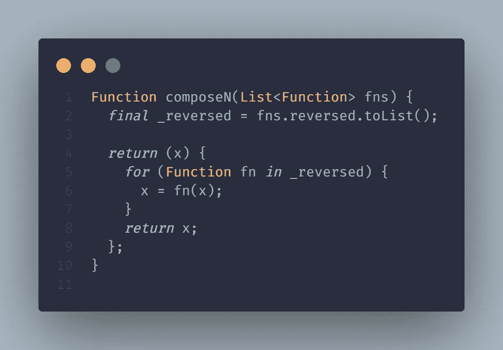

现在我们有了构建模块，让我们将它们组合起来创建更有意义的函数。这些是使用的一些函数。前往 [Github repo](https://github.com/Yogi-6/functional_programming_dart) 了解更多信息。

## 蛇案到帕斯卡案

我们将从将蛇的案例转换为骆驼、帕斯卡和烤肉串案例开始。

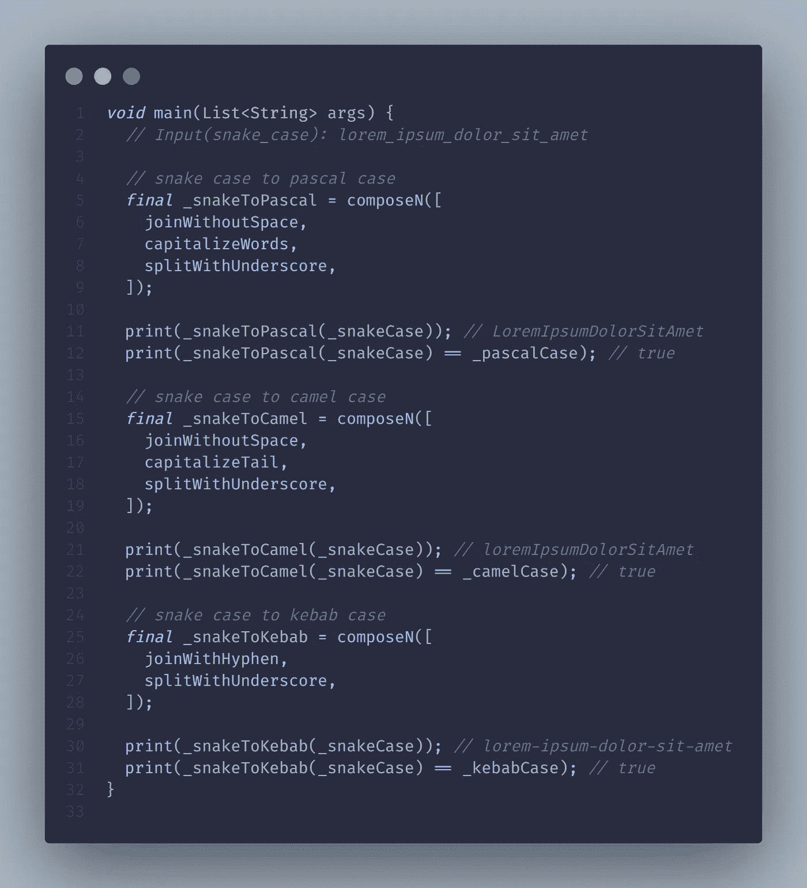

在第 3 行，我们定义了一个`_snakeToPascal`函数。它接受一个参数并返回结果。我们来看看它的实现。`_snakeToPascal`由三个更小的功能组成:`splitWithUnderscore`、`capitalizeWords`和`joinWithoutSpace`。让我们将*" lorem _ ipsum _ dolor _ sit _ amet "*作为函数的输入。我们知道，作曲是从右到左的，所以，

1.  输入首先被传递给`splitWithUnderscore`函数，该函数将输入分成 *["lorem "、" ipsum "、" dolor "、" sit "、" amet"]* 。
2.  将数组`splitWithUnderscore`的返回值传递给第二个函数，即`capitalizeWords`，它将每个元素的第一个字母转换成大写并返回列表。 *["Lorem "、" Ipsum "、" Dolor "、" Sit "、" Amet"]*
3.  然后将来自`capitalizeWords`的结果传递给`joinWithoutSpace` 函数，该函数将元素连接在一起并返回结果。*LoremIpsumDolorSitAmet*

还记得我们开始时说的吗？我们通过组合为我们的数据定义了一个管道。就是这个；我们的数据流经这些管道并返回结果。一旦我们花了一些时间构建了通用函数，现在将它们组合起来生成有意义的函数就是小菜一碟。

## 蛇案到骆驼案

在第 15 行，`_snakeToCamel`非常简单。第一个和最后一个功能相同，`splitWithUnderscore`和`joinWithoutSpace`。我们将中间函数从`capitalizeWords`改为`capitalizeTail`，我们的函数就准备好了。
使用`capitalizeTail`的原因是在 camelCase 的情况下我们不需要第一个单词大写。`capitalizeTail`和`capitalizeWords`一样，但是忽略了第一个词，这个词和我们的用例匹配。

**蛇案到肉串案**

蛇案到烤肉串案就更简单了。这里我们需要组合两个函数(`splitWithUnderscore` & `joinWithHyphen`)，我们的工作就完成了。

## 骆驼案到其他案件

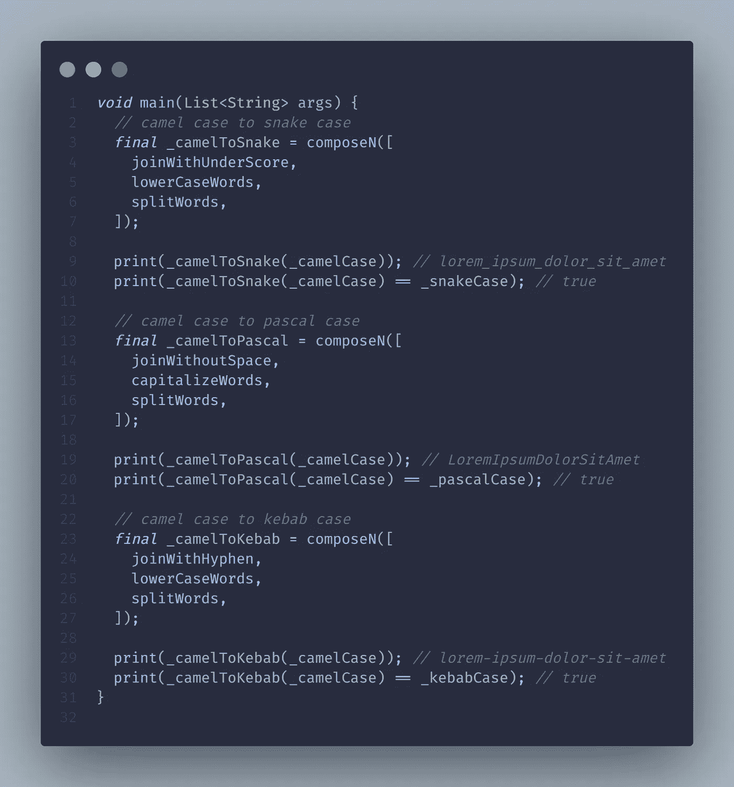

## 烤肉串案到其他案件

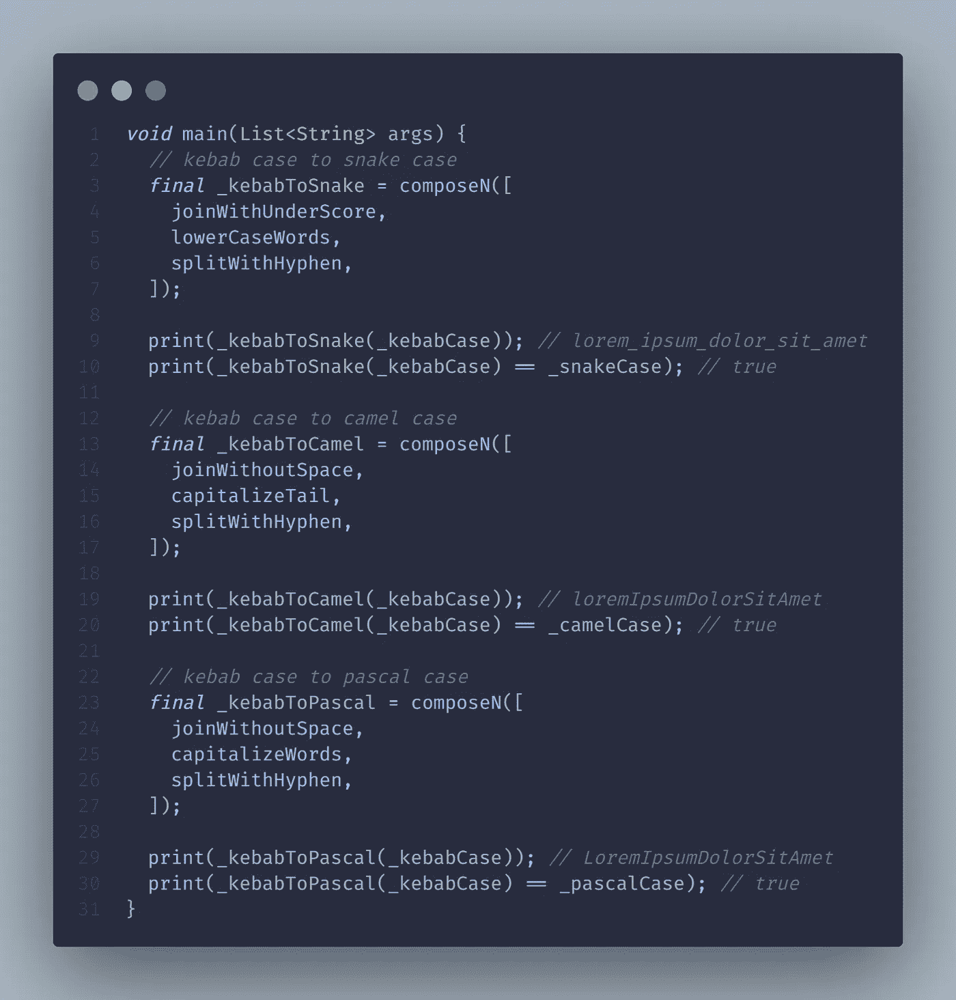

## 帕斯卡案例到其他案例

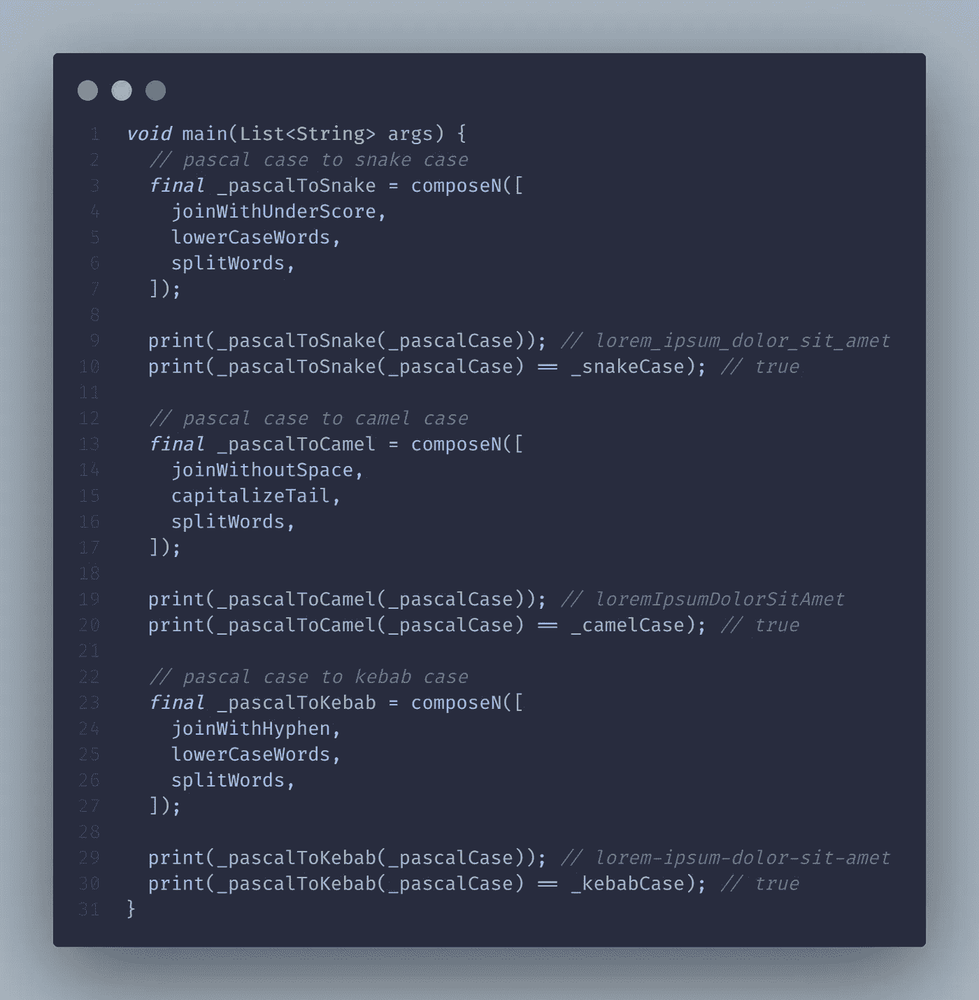

# 最后的想法

我喜欢把作曲看作是一种分而治之的技巧。组合的主要优点是我们最终得到高度可重用和可定制的小片段。下一篇文章将更进一步，介绍 Dart 中复杂数据结构的相等性和不变性。

**牛逼！**拍拍自己的背，因为你坚持到了最后。我希望我为你投入的时间增加了一些价值。在 [**GitHub**](https://github.com/Yogi-6/functional_programming_dart) 知识库上找到更多例子，并在 [**Twitter**](https://twitter.com/_yogi_6) 或 [**LinkedIn**](https://www.linkedin.com/in/yogi6/) 上寻求建议/问题或任何你希望我涵盖的主题。你可以鼓掌支持👏，感谢您的阅读:)更多信息请关注😄

下次见，伙计们！

# 本系列的其他文章

*   [基础](https://yogi-6.medium.com/functional-programming-in-dart-foundation-part-0-7e932517b824)
*   [纯功能&副作用](https://yogi-6.medium.com/pure-functions-side-effects-in-dart-functional-programming-part-1-fb931d6c0351)
*   [Arity、Closure、Currying、Partial Application & more。](/arity-closure-currying-partial-application-more-in-dart-functional-programming-part-2-4534a8b7f374)
*   作文
*   [永恒性&平等性](/immutability-equality-in-flutter-dart-functional-programming-part-4-339a4e9312bb)
*   [高阶函数&递归](https://medium.com/flutter-community/higher-order-functions-recursion-in-dart-functional-programming-part-5-4237bc114005)

# 分级编码

感谢您成为我们社区的一员！升级正在改变技术招聘。 [**在最好的公司**找到你最完美的工作](https://jobs.levelup.dev/talent) **，而不仅仅是你的*下一份工作*。**

 [## 提升——改变招聘流程

### 🔥让软件工程师找到他们热爱的完美角色🧠招聘人才是最痛苦的部分…

作业. levelup.dev](https://jobs.levelup.dev/talent)