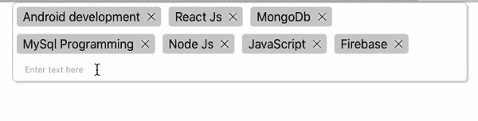

# 复合组件模式——以不同方式开发 React 应用程序的一种方式。

> 原文：<https://levelup.gitconnected.com/compound-component-pattern-a-way-of-developing-react-apps-differently-8efdd3ce4a8a>


照片由 [**Kaboompics 拍摄。com**](https://www.pexels.com/@kaboompics?utm_content=attributionCopyText&utm_medium=referral&utm_source=pexels)from[**Pexels**](https://www.pexels.com/photo/geometric-decoration-5836/?utm_content=attributionCopyText&utm_medium=referral&utm_source=pexels)

最近，我开发并发布了我的第一个名为 react-capsules 的 npm 包。这是一段代码，可以在任何 react 应用程序中使用，并创建一个 UI 组件，如下图所示。只要开火并找到它为你服务。



react-capsules 提供的可重用 UI 组件。

现在，如果你看看它的降价，你会发现组件是使用点运算符调用的。你没有把很多道具传递给一个单独的组件，如果你使用这个包一段时间，你会感觉对代码有更好的控制。您开发的代码并不混乱，也不容易理解，并且在使用这个库时没有单点故障。类似的设计你可以在一个非常流行的 react 库中找到 [react-bootstrap](https://www.npmjs.com/package/react-bootstrap) 。综上所述，react 中的这种设计模式被称为复合组件模式。接下来我们将从内部寻找答案。

**有什么需要:**

React 从它走出脸书的第一天起就是一个很棒的工具。但是很快开发者开始发现它的一些局限性。其中一个问题是在组件之间传递更深层次的属性。较长道具链中的问题有:

1.  很容易忘记代码中发生了什么。第一次理解这样的代码并不容易。
2.  由于 react 属性是单向的和不可变的，开发人员必须维护一个回调链来改变组件树的上层节点中的属性，这很容易变得乏味。

人们可以有效地争辩说，我们有 Redux 来处理这样的问题，我们集中我们的商店和所有操纵商店。但我主张着眼于眼前的问题。像 react-capsules 这样的 UI 库需要 Redux 吗？它大到可以这样处理吗？此外，即使我们重新设计这个包来使用 Redux，它会像我们现在这样方便和控制代码吗？

解决这种问题的好方法不是传递道具，而是将组件暴露给根。这就是复合组件模式(又名 CCP)所要完成的。这样你在应用程序中只有一个状态，没有道具链。这是开发设计模式的哲学基础。

**快速演示:**

使用 CCP 创建一个 react 应用程序或它的一部分并不困难。我们只是将子组件暴露给根，而不是传递道具。为了更好地理解，我将参考开发 react-capsules 的主要项目。

```
import React from 'react';
import Item from './Item';
import TextInput from './TextInput';const ReactBulletDnd = ({ children, style, data, set }) => {
  return (<div style={{ ...style }}>
    <div style={{
      display: 'flex',
      flexDirection: 'row',
      flexWrap: 'wrap'
    }}>
      {children}
    </div>
  </div>)
}ReactBulletDnd.Item = Item;
ReactBulletDnd.TextInput = TextInput;export default ReactBulletDnd;
```

这是作为库的入口点的组件。在导入中，Item 是列表中的每个选项卡，TextInput 是底部的输入。在导出之前的底部，您可以看到我们是如何将刚刚导入的组件分配给根组件的。我们把所有的孩子都赋给了返回函数。这就是典型的 CCP 设计在 react 应用中的实现方式。

**React.cloneElement**

在实现 CCP 时，这是一个非常方便的工具。在 react-capsules 的上下文中，您可以看到拖放功能是由库负责的。在调用范围内没有捕获或发出事件，或者该功能是在调用范围之外的地方实现的。这是在 React.cloneElement 的帮助下完成的。

```
React.Children.map(children, (child) => {                                   
   return React.cloneElement(child, { /*Props here*/ }); 
 }
}
```

React.cloneElement 帮助您将任何道具传递给子对象，否则会直接传递给子对象。这是一个很好的工具，可以将实现某个特性所需的任何属性传递给组件，但不需要被调用视线看到。在我们的例子中，与拖放相关的事件(如 onMouseOver、onMouseEnter 等)就是使用这个实用程序传递的。请参考完整的代码，以便有更好的想法。

正如您在要点中看到的，如果子元素不是 textInput，我们将在 cloneElement 方法中传递一些属性，如 onClick、onDragStart 等。你可以在要点的第 39 到 46 行看到。这就是库如何屏蔽调用视线中的拖放实现。

**结论:**

至此，本文解释了 CCP 解决的问题及其典型实现。此外，我们讨论了使用 React.cloneElement 屏蔽功能。您认为这种类型的设计可以取代 React 应用程序中的 Redux 吗？评论你的想法。另外，在下面找到库的代码。

[](https://github.com/Gaurav2048/React-Capsules) [## Gaurav2048/React 胶囊

### 一个即插即用 api，用于具有免打扰功能的项目列表。- Gaurav2048/React 胶囊

github.com](https://github.com/Gaurav2048/React-Capsules) 

npm-js 的反应胶囊。帮我把它变成一个选择的工具。

[](https://www.npmjs.com/package/react-capsules) [## 反应胶囊

### 一个即插即用 api，用于具有免打扰功能的项目列表。npm 安装-保存 react-capsules 主要组件…

www.npmjs.com](https://www.npmjs.com/package/react-capsules)