# 使用 React Native Web 和 React Native Elements 创建简单应用的全面指南

> 原文：<https://levelup.gitconnected.com/comprehensive-guide-to-create-simple-app-using-react-native-web-and-react-native-elements-306cf43fb8d7>

案例研究:gitphone，GitHub 智能手机知识库检查器。

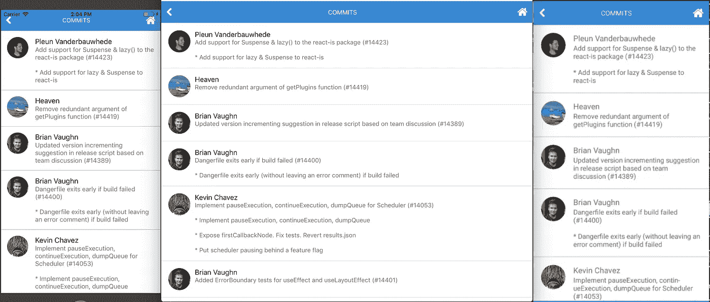

iOS、web 和 android 上的 gitphone

你有没有想过，有没有可能用单一代码库创建一个(Android | iOS |网站)app？答案:*是的，是！*

多亏了 [react-native-web](https://github.com/necolas/react-native-web) (RNW)，这才成为可能。

下面的教程是我在[react-native-elements](https://github.com/react-native-training/react-native-elements)(RNE)回购的[拉动请求](https://github.com/react-native-training/react-native-elements/pull/1664)的一部分。RNE 是一个跨平台的反应原生用户界面工具包。它具有跨 android、iOS 和 web 的一致设计！

# 总有机碳

*   使用 [CRNWA](https://github.com/VISI-ONE/create-react-native-web-app) 初始化项目
*   确保一切正常:安卓、iOS 和网络
*   将 RNE 最新版本( **1.0.0-beta7** )添加到项目中
*   添加 2 个屏幕

屏幕 1 RNE 组件:

1.  投入
2.  带有图标的按钮

*屏幕 2 RNE 组件:*

1.  *页眉*
2.  *列表项*
3.  *电影《阿凡达》*
4.  *文本*

*gitphone *应该有*:*

*   *路由，反应-路由器。[https://reacttraining.com/react-router](https://reacttraining.com/react-router/)。它在本地和网络上都很好用。*
*   *调用 GitHub API。参见 https://developer.github.com/v3/。*

# *0️⃣初始步骤*

*安装`create-react-native-web-app`*

```
*$ npm i -g create-react-native-web-app*
```

# *1️⃣ **第一步***

*创建一个`gitphone`项目。*

```
*λ create-react-native-web-app gitphone⏳ Creating React Native Web App by the name of gitphone ...✅ Created project folder.✅ Added project files.⏳ Installing project dependencies...yarn install v1.10.1
[1/4] Resolving packages...
[2/4] Fetching packages...
info fsevents@1.2.4: The platform "win32" is incompatible with this module.
info "fsevents@1.2.4" is an optional dependency and failed compatibility check. Excluding it from installation.
[3/4] Linking dependencies...
[4/4] Building fresh packages...
success Saved lockfile.
Done in 797.66s.✅ Installed project dependencies.✅ Done! 😁👍 Your project is ready for development.* change directory to your new project
$ cd gitphone$ Then run the these commands to get started:* To run development Web server
$ yarn web* To run Android on connected device (after installing Android Debug Bridge "adb" - [https://developer.android.com/studio/releases/platform-tools](https://developer.android.com/studio/releases/platform-tools))
$ yarn android* To run ios simulator (after installing Xcode - only on Apple devices)
$ yarn ios* To run tests for Native and Web
$ yarn test* To run build for Web
$ yarn build*
```

*转到`gitphone`目录，通过运行`yarn web`测试 web 应用程序。*

```
*Starting the development server...
Compiled successfully!You can now view create-react-native-web-app in the browser.Local:            [http://localhost:3001/](http://localhost:3001/)
On Your Network:  [http://172.26.235.145:3001/](http://172.26.235.145:3001/)Note that the development build is not optimized.
To create a production build, use yarn build.*
```

*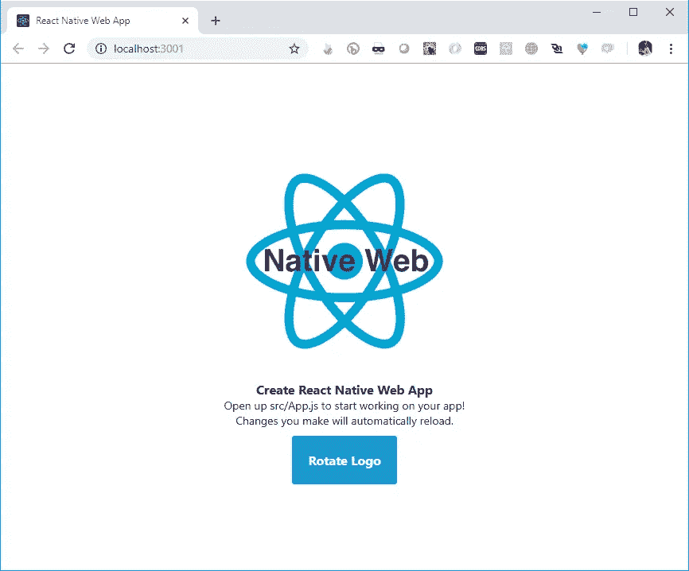*

*gitphone web 应用程序在浏览器上打开🎉*

*接下来，通过运行`yarn android`来测试`gitphone`安卓应用。*

```
*Installing APK 'app-debug.apk' on 'Redmi 4X - 7.1.2' for app:debug
Installed on 1 device.BUILD SUCCESSFULTotal time: 21.783 secsStarting: Intent { cmp=com.creaternwapp/.MainActivity }
✨  Done in 25.64s.*
```

*如果构建成功，您将看到应用程序安装在您的 Android(模拟器)设备上。*

*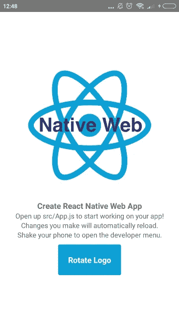*

*gitphone Android 版本🤖*

*但是如果运行`yarn android`时出现错误，请参见下面的[故障排除](#0b47)部分。*

*我们第一步的最后一部分，确保它可以在 iOS 上运行没有任何问题。运行`yarn ios`和*瞧！**

*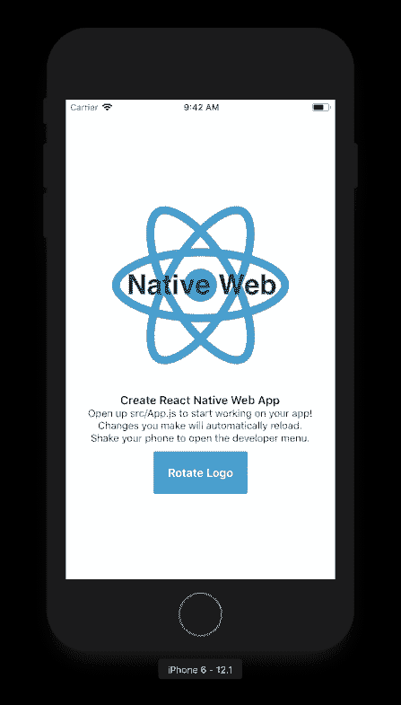*

*gitphone iOS 版本🍏*

# *2️⃣第二步*

*安装 React 本地元素(RNE)。*

```
*$ yarn add react-native-elements@beta*
```

*正在安装 React 本机矢量图标(RNVI)。*

```
*$ yarn add react-native-vector-icons*
```

*链接:*

```
*$ react-native link react-native-vector-icons*
```

*RNE 和 RNVI 都是用 ES6 编写的。如果您在此时运行`yarn web`，您将得到一个错误。*

```
*./node_modules/react-native-elements/src/config/withTheme.js
Module parse failed: Unexpected token (12:28)
You may need an appropriate loader to handle this file type.*
```

*我们需要告诉网络公司把它们转走。*

1.  *打开`config/webpack.config.dev.js`*
2.  *在第 141 行`Process JS with babel`，将 RNE 和 RNVI 添加到`include`*
3.  *对`config/webpack.config.prod.js`也做同样的事情👌*

*如果你迷路了，请看这个提交 [8c0e603](https://github.com/haruelrovix/gitphone/commit/8c0e6036d9231cc934285502528a2061b848ce2d) 。*

# *3️⃣试一试*

*现在，让我们理解 RNE 是如何工作的。*

1.  *打开`src/App.js`*
2.  *从 RNE 进口`Button`*

```
*import { Button } from 'react-native-elements';*
```

*3.在`render`上，将`TouchableHighlight`改为使用 RNE 的`Button`*

*4.运行`yarn ios`、`yarn android`和`yarn web`以查看其运行情况！👏*

***注意:**如果运行`yarn android`时出现错误`Could not find com.android.tools.build.appt2`，请在 Gradle 存储库上添加`google`。*

*详见这个提交: [a2ebba1](https://github.com/haruelrovix/gitphone/commit/a2ebba14aef533925b593933fa885e2f990b2ace) 。*

# *4️⃣添加主页组件*

*我们的第一个组件将是`Home`。在这个组件上，有两个输入字段和一个提交按钮。*

1.  *在`src`内，创建新文件夹:`Components`*
2.  *添加名为`Home.js`的新文件*

*3.在`App.js`上，导入`Home`组件*

*4.运行`yarn ios`、`yarn android`和`yarn web`以查看其运行情况！🎇*

## *主页组件的样式*

*你应该注意到我们的`Home`在 UI 方面并不好看。让我们为它添加样式。*

1.  *在`Components`中，创建`Shared.style.js`文件*

*2.导入样式并更新`Home`组件，如下所示*

*3.现在看起来更好*，提交添加 Home 组件: [2e510c4](https://github.com/haruelrovix/gitphone/commit/2e510c462c68d7c68433f2706cf8fbb847d6541e) 。*

**等一下…**好像网页版的 RNVI 有问题。您可以查看这篇 [Web(带 webpack)](https://github.com/oblador/react-native-vector-icons#web-with-webpack) 文章，或者按照以下步骤操作。*

1.  *打开`config/webpack.config.dev.js`*
2.  *在第 162 行添加`url-loader`*

*3.对`config/webpack.config.prod.js`也做同样的事情👌*

*4.打开`src/index.js`文件*

*5.添加`iconFont`并在文件头追加`style`*

*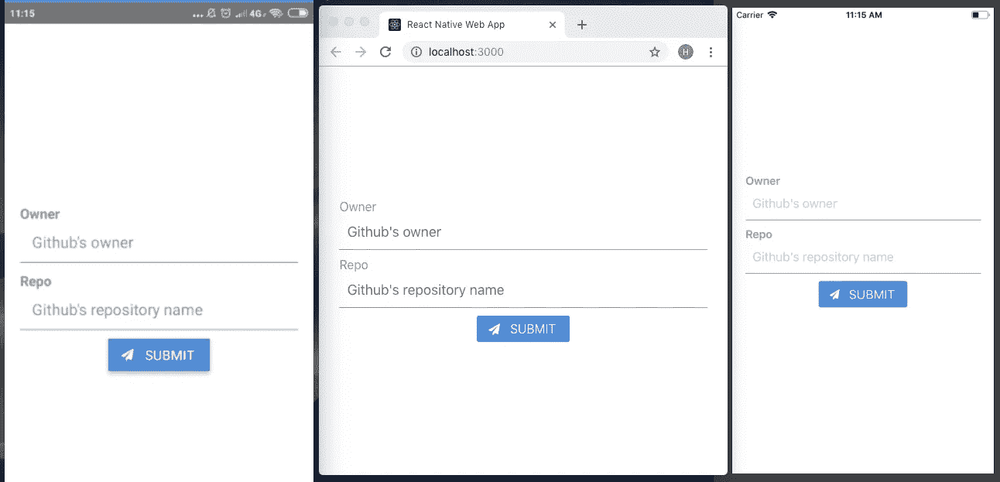*

*我们的 RNE x RNW 进展到此为止~*

# *5️⃣路由*

*接下来，让我们添加第二个组件:`CommitList`。*

1.  *在`Components`中创建名为`Commit`的新文件夹*
2.  *添加新文件:`CommitList.js`*

*在我们的应用程序中，用户通过点击`Submit`按钮进入第二个屏幕。我们如何实现它？*

**《react——路由器来救援》*——[https://reacttraining.com/react-router/](https://reacttraining.com/react-router/)*

*增加`react-router-dom`和`react-router-native`*

```
*$ yarn add react-router-dom react-router-native*
```

*我们需要针对 web 的`BrowserRouter`和针对本地的`NativeRouter`。我们需要根据平台将其分开。*

1.  *在`src`上，创建`Utils`文件夹*
2.  *在`Utils`上增加两个文件:`Routing.native.js`和`Routing.web.js`*

*这些文件的内容仅在第二行有所不同。*

*现在，把它粘在一起。*

*3.打开`App.js`，导入`CommitList`组件*

*4.从`Utils/Routing`导入`Route`、`Router`和`Switch`*

*5.实现内部路由`render`方法*

*6.现在对于`Submit`按钮上的动作，打开`Home.js`*

*7.从`Utils/Routing`导入`withRouter`*

```
*import { withRouter } from '../Utils/Routing';*
```

*8.`WithRouter`是特设的。用它包裹`Home`组件*

```
*export default withRouter(Home);*
```

*9.为按钮添加`onPress`属性*

```
*onPress={this.onPressButton}*
```

*10.实现`onPressButton`事件处理程序*

```
*onPressButton = () => this.props.history.push('/commit');*
```

*11.所有人一起*

*提交: [f193aa3](https://github.com/haruelrovix/gitphone/commit/f193aa3c268e7be263ae529de0f719ffd443e26d)*

*在`web`和`android`上测试，你应该可以使用`Submit`和按下`Back`按钮在屏幕之间来回切换。*

**“iOS 上怎么回？”*😂*

## *执行`withHeader`*

*我们将创建一个`withHeader`特设。为什么是 HOC？如果我们以后添加更多的屏幕，我们可以更容易地重用它。*

1.  *在`src`上，创建`HOCs`文件夹*
2.  *添加`withHeader.js`文件*
3.  *从 RNE 进口`Header`和从`RNVI/FontAwesome`进口`Icon`*

```
*import { Header } from 'react-native-elements';
import Icon from 'react-native-vector-icons/FontAwesome';*
```

*4.`withHeader`接受一个道具:`title`*

```
*const withHeader = ({ title = '' }) => (WrappedComponent) => {*
```

*5.返回/回家的事件处理程序*

```
*goBack = () => this.props.history.goBack();goHome = () => this.props.history.replace('/');*
```

*6.在`CommitList`组件中导入并使用`withHeader`*

*提交: [0cf995b](https://github.com/haruelrovix/gitphone/commit/0cf995bde91f5958e252188f1343de923069e7f3)*

# *6️⃣从 GitHub API 获取数据*

*我们来取一个真实的数据。我们将通过 [GitHub](https://developer.github.com/v3/repos/commits/#list-commits-on-a-repository) 从存储库中获取提交列表，并将其呈现在我们的第二个屏幕上`CommitList`。*

```
*GET /repos/:owner/:repo/commits*
```

*理想情况下，`:owner`和`:repo`是我们第一个屏幕的表单值。由于本文的目标是 RNE x RNW，我们将在稍后讨论该表单(和状态管理)。*

*为了获取 GitHub API，我们将使用`[fetch-hoc](https://github.com/esphen/fetch-hoc)`包，还需要来自`redux`的`[compose](https://redux.js.org/api/compose)`，来处理同一个组件上的多个 hoc。*

```
*$ yarn add fetch-hoc redux*
```

1.  *打开`CommitList.js`*
2.  *从`redux`导入`{ compose }`，从`fetch-hoc`导入`fetch`*
3.  *如下使用它*

*提交: [334197c](https://github.com/haruelrovix/gitphone/commit/334197c7c05bd1bdb1b648ca56cfe69c8b496eed)*

*现在运行`yarn web`，打开`DevTools`的`network`标签，点击`Submit`按钮，你会看到一堆提交数据。默认情况下，GitHub API 返回 30 次提交。*

## *呈现提交数据*

*将显示在屏幕上的提交数据:*

```
*author.avatar_urlcommit:
  author.name
  message*
```

*让我们修改一下`CommitList.js`*

1.  *添加新导入*

```
*import { ActivityIndicator, Dimensions, FlatList, Platform, View } from 'react-native';
import { Avatar, ListItem } from 'react-native-elements';*
```

*2.在主渲染，修改如下*

```
*<View style={styles.container}>
  {this.renderContent()}
</View>*
```

*3.创建`renderContent`方法*

```
*renderContent = () => (
  this.props.loading ?
    <ActivityIndicator color='#87ceeb' /> :
    <FlatList
      keyExtractor={this.keyExtractor}
      data={this.props.data}
      renderItem={this.renderItem}
    />
)*
```

*4.创建`renderItem`方法*

```
*renderItem = ({ item }) => (
  <ListItem
    title={item.commit.author.name}
    subtitle={item.commit.message}
    leftElement={this.renderLeftElement(item)
  />
)*
```

*5.创建`renderLeftElement`方法*

```
*renderLeftElement = (item) => (
  <View>
    <Avatar
      source={{ uri: item.author.avatar_url }}
      size='medium'
      rounded
    />
  </View>
)*
```

*6.这是我们的新款`CommitList`，包括让它更漂亮的造型*

*提交: [27a7867](https://github.com/haruelrovix/gitphone/commit/27a78672958f0caaa34b3e93c934685b9dcebd50)*

*他们来了！*

**

*太棒了，是吧？*

# *7️⃣处理表单提交*

*到目前为止，我们的应用程序看起来很棒。但是我们不会将值从第一个屏幕传递到第二个屏幕。让我们现在做那件事。*

1.  *为了处理表单，我们将使用`formik`[https://github.com/jaredpalmer/formik](https://github.com/jaredpalmer/formik)*

```
*$ yarn add formik*
```

*2.打开`Home.js`并导入*

```
*import { Formik } from 'formik';*
```

*3.用`formik`包裹主`View`*

```
*<Formik initialValues={{ owner: '', repo: '' }}
  onSubmit={this.onPressButton}>
  {({ handleChange, handleSubmit, values }) => (
    <View style={styles.container}>*
```

*4.将`onChangeText`处理程序添加到`Input`*

```
*<Input ... onChangeText={handleChange('owner')} value={values.owner}
<Input ... onChangeText={handleChange('repo')} value={values.repo}*
```

*5.将`Button` `onPress`道具改为`handleSubmit`*

```
*<Button ... onPress={handleSubmit}*
```

*6.不要忘记关闭主`View`*

```
 *</View>
  )}
</Formik>*
```

*表单提交:完成👌下一个问题:我们如何将这些值传递给第二个屏幕？当我们重定向到第二个屏幕时发送它们！*

1.  *在`onPressButton`方法中，只发送一个对象而不是`pathname`。*

```
*this.props.history.push({
  pathname: '/commit',
  state: { owner, repo }
});*
```

*2.打开`CommitList`，导入`withRouter`*

```
*import { withRouter } from '../../Utils/Routing';*
```

*3.在`compose`内增加`withRouter`*

*4.获取传递到`withRouter`的值，并将其用于`fetch`*

```
*withHeader({ title: 'Commits' }),
withRouter,
fetch(({ location: { state = {} } }) => (
 `https://api.github.com/repos/${state.owner}/${state.repo}/commits`
))*
```

*HOC 的命令很重要。因此，确保它与上面的代码片段相同。万一你输了，这里是提交: [1d83c5e](https://github.com/haruelrovix/gitphone/commit/1d83c5e1487d2d99c00cc1b18f563ed4497d87b9) 。*

*测试应用程序。现在，我们应该能够获取任何 GitHub 存储库，*带有一些警告。*👀*

# *8️⃣润色了应用程序*

*如果我们获取不存在的存储库会发生什么？*本地红屏，网页黑屏！*😹*

*如果存在错误，返回错误。让我们利用这一点。*

1.  *在`CommitList`上，修改`renderContent`*

```
*this.props.loading ?
  <ActivityIndicator color='#87ceeb' /> :
  this.renderFlatList()*
```

*2.从 RNE 进口`Text`*

```
*import { ..., Text } from 'react-native-elements';*
```

*3.添加`renderFlatList`方法*

```
*this.props.error ?
  <Text h4>Error: {this.props.data.message || '😕'}</Text> :
  <FlatList ... />*
```

*测试一下。代替*红色或空白的*屏幕，现在`Error: Not Found`显示出来。*

*还有什么？尝试获取`facebook/react-native`。我们又有一个错误🙀*

```
*Cannot read property 'avatar_url' of null*
```

*不是所有的`author`都有一个`avatar_url`。为了头像`source`我们应该这么做。*

```
*source={{uri: (item.author && item.author.avatar_url) || undefined}}*
```

*所以，如果没有 url，我们的应用程序什么也不呈现？看起来不太好。*解决方法:渲染作者初始姓名。**

*在 RegEx 和 Avatar `title`道具的帮助下，`renderLeftElement`现在应该是这个样子:*

```
*renderLeftElement = (item) => {
  const initials = item.commit.author.name.match(/\b\w/g) || [];return (
    <View style={leftElementStyle}>
      <Avatar
        title={((initials.shift() || '') + (initials.pop() || ''))}
        ...*
```

*提交`Polishing the app`部分: [943974b](https://github.com/haruelrovix/gitphone/commit/943974b285635884dc3ec1d7981146307dfd98d3) 。*

*当我写这篇文章时，fetch `facebook/react-native`返回如下:*

*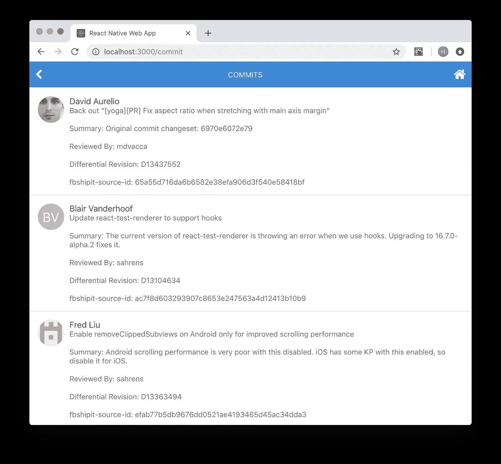*

*为什么不爱 regex？感谢[萨诺尔](https://stackoverflow.com/a/33076482)。*

# *结论*

*我们已经创建了一个简单的应用程序使用 RNE + RNW👏*

*   *在 iOS、web 和 android 上运行良好？✅*
*   *使用 react-native-elements 中的组件？✅*
*   *在屏幕之间移动？✅*
*   *API 调用？✅*

*对`gitphone`的一些改进:*

*如果从`Commits`屏幕返回，`Home`屏幕上的输入表单为空。如果您想保留以前的值，可以通过在应用程序中引入 redux 来轻松解决这个问题。此处引用: [48108dd](https://github.com/haruelrovix/rnw-github/pull/1/commits/48108ddc3e80669b9d57b2f998a5073d5e5eabb0) 。*

*一旦到达列表的最底部，我们可以获取更多的提交数据吗？无限卷轴？*

*对于 web，我们可以使用`react-visibility-sensor`。来看看: [6c1f689](https://github.com/haruelrovix/rnw-github/pull/1/commits/6c1f6894d78840648a11bbdf2d0e841fb6dad12d) 。*

*对于 native 来说，比较容易。我们可以使用`FlatList` `onEndReached`道具。为了给你一个思路，请看这个: [9d2e1f2](https://github.com/haruelrovix/rnw-github/pull/2/commits/9d2e1f2a3e8605f8184f1f8950eb0175045bb67a) 。*

# *解决纷争💺*

***#1** 运行 T3 时**构建失败】***

```
*:app:compileDebugAidl FAILEDFAILURE: Build failed with an exception.* What went wrong:
Execution failed for task ':app:compileDebugAidl'.
> java.lang.IllegalStateException: aidl is missing* Try:
Run with --stacktrace option to get the stack trace. Run with --info or --debug option to get more log output.BUILD FAILED*
```

*以下是解决第一个问题的方法:*

1.  *打开 Android Studio。*

*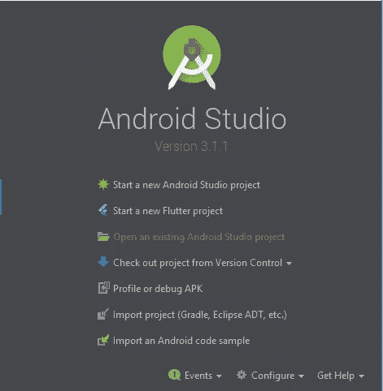*

*2.打开`gitphone`下的`android`项目。*

*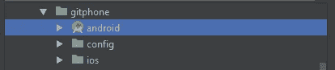*

*3.出现提示时，单击更新。*

*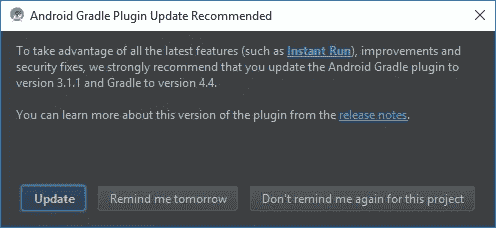*

*等待 Android Studio 同步项目。*

*4.同步成功，但有两个错误。*

*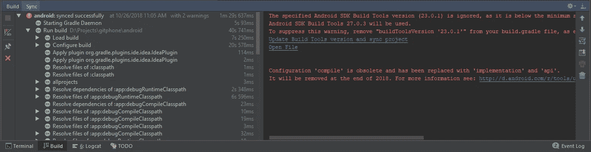*

*5.在这个阶段，只需点击同步窗口上的`Update Build Tools version and sync project`。*

*6.现在，剩下的警告是`Configuration 'compile'...`*

*7.要解决这个问题，打开`app/build.gradle`文件，将`dependencies`部分(第 139 行)改为使用`implementation`而不是`compile`。*

```
*dependencies {
    implementation fileTree(dir: "libs", include: ["*.jar"])
    implementation "com.android.support:appcompat-v7:23.0.1"
    implementation "com.facebook.react:react-native:+"
}*
```

*8.再次同步并关闭 Android Studio。*

*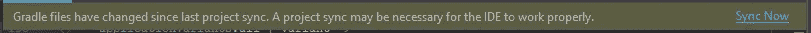*

*android 故障排除已完成。现在，你应该可以成功运行`yarn android`了。*

***#2 构建运行** `**yarn ios**`时失败*

```
*** BUILD FAILED **The following build commands failed:

 CompileC /gitphone/ios/build/Build/Intermediates.noindex/React.build/Debug-iphonesimulator/double-conversion.build/Objects-normal/x86_64/strtod.o /gitphone/node_modules/react-native/third-party/double-conversion-1.1.5/src/strtod.cc normal x86_64 c++ com.apple.compilers.llvm.clang.1_0.compiler*
```

*以下是解决第二个问题的方法:*

*在项目中，从你最喜欢的终端运行下面的脚本*

```
**$ curl -L https://git.io/fix-rn-xcode10 | bash**
```

*如果您再次运行`yarn ios`，并且您得到了这个错误*

```
*The following build commands failed:
 Libtool /gitphone/ios/build/Build/Products/Debug-iphonesimulator/libRCTWebSocket.a normal x86_64
(1 failure)*
```

*请运行此脚本:*

```
**$ cp ios/build/Build/Products/Debug-iphonesimulator/libfishhook.a node_modules/react-native/Libraries/WebSocket**
```

*iOS 故障排除已完成。现在，你应该可以成功运行`yarn ios`了。*

## *作者*

*[](https://github.com/haruelrovix) [## 开源代码库

### RX 生物 http://j.mp/kbnqMr。haruelrovix 有 35 个可用的存储库。在 GitHub 上关注他们的代码。

github.com](https://github.com/haruelrovix) [](https://github.com/andangrd) [## 开源代码库

### andangrd 有 17 个可用的存储库。在 GitHub 上关注他们的代码。

github.com](https://github.com/andangrd) 

感谢:

*   [iRoachie](https://github.com/iRoachie) ， [Monte9](https://github.com/Monte9) ，[Xavier-ville legier](https://github.com/xavier-villelegier)(RNE 核心团队)
*   内科拉斯 (RNW)
*   [orYoffe](https://github.com/VISI-ONE/create-react-native-web-app/commits?author=orYoffe) (RNW CLI)
*   fn + F12🤣

*当然是* J2 游乐场👍还有[开集体](https://opencollective.com/)💰

[](https://levelup.gitconnected.com)[](https://gitconnected.com/learn/react-native) [## 学习 React Native -最佳 React Native 教程(2019) | gitconnected

### 十大 React Native 教程-免费学习 React Native。课程由开发者提交并投票…

gitconnected.com](https://gitconnected.com/learn/react-native) [](https://gitconnected.com/learn/react) [## 学习 React -最佳 React 教程(2019) | gitconnected

### 排名前 49 的 React 教程-免费学习 React。课程由开发人员提交并投票，使您能够…

gitconnected.com](https://gitconnected.com/learn/react)*