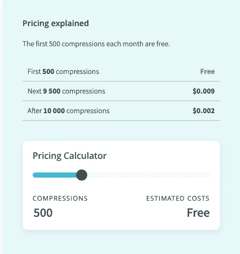

# 用 16 行 python 代码和 TinyPNG API 压缩图像

> 原文：<https://levelup.gitconnected.com/compress-images-with-16-lines-of-python-code-and-tinypng-api-6ff33861cfc5>

# TinyPNG 是什么？

[https://tinypng.com/](https://tinypng.com/)

> TinyPNG 使用智能有损压缩技术来减小 WEBP、JPEG 和 PNG 文件的大小。通过有选择地减少图像中的颜色数量，存储数据所需的字节更少。这种效果几乎看不见，但它对文件大小有很大的影响！

TinyPNG 有一个 web 应用程序，允许我们压缩图像(最多 20 张图像&每张最大 5MB)。这很有用，但我们有时需要压缩 20 多张图像。

最棒的是 TinyPNG 有多种语言的 API 和包。

TinyPNG 开发者 API【https://tinypng.com/developers】T3

在这篇文章中，我将向你展示如何在 python 中使用 API。

第一步。获取 API 密钥
步骤 2。安装 pip 组件
步骤 3。写一个脚本(少 20 行)
Step4。运行脚本

# 第一步。获取 API 密钥

转到[https://tinypng.com/developers](https://tinypng.com/developers)并键入您的姓名和电子邮件地址。你会很容易得到 API 密匙。

API 对多达 500 个请求是免费的。



# 第二步。安装 pip 包

```
 pip install tinify 
```

# 第三步。写剧本

添加 try-except 很好😜

https://tinypng.com/developers/reference/python

剧本超级简单。为源图像创建一个 **src** ，为优化图像创建一个 **dist** 。
通过“glob”获取文件名，并使用 **tinify.from_file** 方法将图像文件传递给 TinyPng API。
您可以将图像文件作为缓冲区或图像 URL 传递，而不是图像文件路径。

```
 with open(“unoptimized.jpg”, ‘rb’) as source:
 source_data = source.read()
 result_data = tinify.from_buffer(source_data).to_buffer()  source = tinify.from_url(“[https://tinypng.com/images/panda-happy.png](https://tinypng.com/images/panda-happy.png)")
source.to_file(“optimized.png”)**app.py**

import tinify
from glob import glob
import os.path
tinify.key = “your_api_key”
source_dir_name = ‘src’
destination_dir_name = ‘dist’
# get all files names in directory
files = glob(source_dir_name + ‘/*’)
# compress all files
for file in files:
 print(‘compressing ‘ + file)
 source = tinify.from_file(file)
 file_name, ext = os.path.splitext(file)
 file_name = file_name.replace(source_dir_name + ‘/’, ‘’)
 source.to_file(destination_dir_name + “/” + file_name + “.png”)
print(‘compressed all images’) 
```

# 第四步。运行脚本

在运行脚本之前，我们需要两件小事。
首先，创建两个目录(src 和 dist)。如果你不喜欢这些目录名，你可以随意更改。

```
 $ mkdir src dist 
```

然后，将您想要压缩的图像文件移动到“src”目录。

快到了！

最后，运行脚本！

```
 $ python app.py
compressing src/MoreToggles.css.png
compressing src/CSSscrolshadows.jpg
compressing src/CSStoTailwindCSS.png
compressing src/broider.png
compressing src/Tailblocks.jpg
compressing src/calcolor.jpg
compressing src/screenshot-rocks.png
compressing src/SmoothShadow.png
compressing src/Neumorphism.io.png
compressed all images
```

repo
https://koji/tinypng _ image _ compress

通常，您可以将图像文件大小缩小 20–50%。

如果您喜欢轻松地使用更多功能，我推荐您查看这篇文章。

[https://medium . com/acronis-design/how-to-optimize-images-by-using-MAC OS-terminal-tiny png-CLI-DD 0 bb 8 e 67708](https://medium.com/acronis-design/how-to-optimize-images-by-using-macos-terminal-tinypng-cli-dd0bb8e67708)