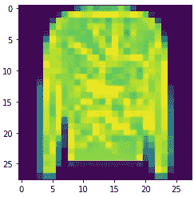

# 使用张量流的计算机视觉

> 原文：<https://levelup.gitconnected.com/computer-vision-using-tensorflow-946718d3c123>


图片由 [fancycrave1](https://pixabay.com/users/fancycrave1-1115284/?utm_source=link-attribution&utm_medium=referral&utm_campaign=image&utm_content=820390) 来自 [Pixaby](https://pixabay.com/photos/office-home-glasses-workspace-820390/)

## 赋予计算机看穿机器学习的能力

作者:乌马尔·汗

许多人很幸运被赋予了看见的能力。从你出生的那一刻起，你周围的物体和人的图像就开始记录在你的记忆中，随着时间的推移，人类能够检测复杂的情绪和人类行为，在区域中导航，捡起物体等等。有视力的人几乎每天的每一个动作都依赖于这种感觉。巧合的是，你现在正在用你的视力阅读这篇文章。

## 如果我们能给计算机这种能力会怎么样？

在 21 世纪，像《终结者》、《钢铁侠》、《复仇者联盟》和其他科幻电影这样的电影很容易证明机器(“机器人”)如何能够呈现人类的许多特征。然而这只是在电影里！在现实世界中，人类在技术进步方面还没有达到那种复杂程度，他们可以创造一个机器人或机器，能够执行人类可以执行的所有职责。然而，用不了多久，我们的世界就会被全功能机器人所居住。

**深度学习**是与机器学习相关的领域。它使用人工神经网络(ANN)来训练单一任务模型(只做一件事的机器人)，以提出问题的解决方案。计算机能够看到和检测一个物体的特征，然后将其归类为某个物品或面孔的想法被称为**计算机视觉。**深度学习如何改变计算机视觉的一个例子是面部识别。人脸以图像、像素和视频的形式进入我们的神经网络，经过一系列的层，它可以训练我们的模型输出某个人脸。安全系统使用这个输出与他们的数据库进行比较，如果需要的话，可以检查这个人的所有信息。所以毫无疑问，计算机视觉在实践中是一个非常有用的工具。


图片来自 [Pixaby](https://pixabay.com/illustrations/flat-recognition-facial-face-woman-3252983/) 的 [teguhjati pras](https://pixabay.com/users/teguhjatipras-8450603/?utm_source=link-attribution&utm_medium=referral&utm_campaign=image&utm_content=3252983)

## 什么是神经网络？


图片来自 [Pixaby](https://pixabay.com/illustrations/neural-network-3637503/) 的 [Ahmed Gad](https://pixabay.com/users/ahmedgad-9403351/?utm_source=link-attribution&utm_medium=referral&utm_campaign=image&utm_content=3637503)

到目前为止，我们一直在提到神经网络，但究竟什么是人工神经网络？安的想法是基于我们大脑中的神经系统。我们的大脑使用一系列相互连接的神经元在我们的大脑中创建一个神经网络来做各种事情的方式是人工神经网络的动机。在深度学习中，最简单的 NN 包括单个神经元。NN 可以分成 3 层；我们有**输入层、隐藏层、**和**输出层。**隐藏层是指输入层和输出层之间的所有层，该函数将权重应用于输入，并通过激活函数将其作为输出。简而言之，**隐层**对进入**网络** ( [DeepAI](https://deepai.org/machine-learning-glossary-and-terms/hidden-layer-machine-learning) )的输入进行非线性变换。输出可以由一个或多个神经元组成。通过一系列算法模仿大脑如何运作，数据之间的潜在关系被发现，从而对我们的输出做出精确的估计。

## 建立神经网络:

创建神经网络时有几个通用步骤，它应该是任何问题的基础。这些步骤对于理解神经网络的工作方式和手头需要调整神经网络的不同问题是非常重要的。

## 1.识别问题:

我们希望从这篇文章或代码中获得的是能够将任何图片输入到我们的模型中，并通过神经网络对其进行分类。

## 2.导入必要的库

```
import tensorflow as tf
import numpy as np
from tensorflow import keras
```

*   [**Tensorflow**](https://www.tensorflow.org/) 是一个免费的开源平台，用于创建机器学习中的算法。Tensorflow 确实有助于建立神经网络来有效地解决复杂的任务。
*   Numpy 是一个包含线性代数概念的库，比如数组和矩阵，这些概念在以后会有意义
*   **Keras** 是 Tensorflow 提供的一个很棒的 API，是领先的高级神经网络 API 之一。它是用 Python 编写的，支持多个后端神经网络计算引擎。

## 3.获取数据

数据在 MNIST 数据集中提供，可通过 Tensorflow 中的 Keras API 访问。时尚-MNIST 是 Zalando 文章图像的数据集，由 60，000 个样本的训练集和 10，000 个样本的测试集组成。每个示例都是 28x28 灰度图像，与 10 个类别的标签相关联。Zalando 打算将时尚 MNIST 作为原始 MNIST 数据集的直接替代物，用于机器学习算法的基准测试。它共享训练和测试分割的相同图像大小和结构。

我们数据中的每张图片高 28 像素，宽 28 像素，总共 784 像素。每个像素都有一个与之关联的像素值，表示该像素的亮度或暗度，数字越大表示越暗。该像素值是 0 到 255 之间的整数。训练和测试数据集有 785 列。第一列由类别标签组成(见下文)，代表服装。其余的列包含相关图像的像素值。在使用这些 28x28 阵列时，导入我们的 Numpy 库将对我们有极大的帮助。

我们产品的标签

*   0: T 恤/上衣
*   1:裤子
*   2:套头衫
*   3:着装
*   4:外套
*   5:凉鞋
*   6:衬衫
*   7:运动鞋
*   8:袋子
*   9:短靴

时尚 MNIST 数据可在 tf.keras 数据集 API 中直接获得。你这样加载它:

```
mnist = tf.keras.datasets.fashion_mnist
```

接下来我们要做的是将我们的数据分为训练和测试数据，这样我们就可以用给定的标签训练我们的模型，然后给出我们的模型测试数据，模型可以通过从训练数据到测试数据的学习来应用这些数据。

```
(train_images, train_labels), (test_images, test_labels) = mnist.load_data()
```

处理图像和数据时，一件有趣的事情是将其可视化。因此，我们将导入 Matplot 库，它可以帮助我们将数据绘制成具有视觉吸引力的图像。例如，索引为 0 的第一个对象是一个 boot。

```
np.set_printoptions(linewidth=200)
import matplotlib.pyplot as plt
plt.imshow(train_images[0])
print(train_labels[0])
print(train_images[0])
```


我们可以看到有 28 x 28 个像素，根据项目的不同，每个像素都有自己的值，范围从 0 到 255。

## 4.创建我们的模型

```
model = tf.keras.**Sequential**([
    tf.keras.layers.**Flatten**(),
    tf.keras.layers.**Dense**(128, **activation**=tf.nn.relu),
    tf.keras.layers.**Dense**(10, **activation**=tf.nn.softmax)
])
```

我们用几个关键词来定义我们的模型:

*   **顺序**定义神经网络中的一系列层。顺序方法的开括号和闭括号之间的所有线都是我们神经网络的层
*   **Flatten** 将我们的 2D 像素阵列转换为每个像素的 1D 列表，这不是一个可行的解决方案，但它比创建一个卷积神经网络简单得多。这一层将是我们的输入
*   **密集**是我们在给神经网络添加层时使用的关键词。在我们的例子中，我们总共有 3 层。第二层总共有 128 个神经元，而第三层有 10 个。我们的最后一层有 10 个神经元的原因是我们将把我们的对象分为 10 类。既然这是一个分类问题，我们最后一层应该永远是类别的数量。
*   **激活**功能是告诉神经元做什么所需要的。有许多选项，但我们将使用 **Relu** 和 **softmax** 。
*   Relu 实际上意味着“如果 X > 0 返回 X，否则返回 0”——所以它所做的只是将 0 或更大的值传递给网络中的下一层。
*   **Softmax** 取一组值，并有效地挑选最大的一个，因此，例如，如果最后一层的输出看起来像[0.1，0.1，0.05，0.1，9.5，0.1，0.05，0.05]，它可以省去您通过它寻找最大值的麻烦，并将其变成[0，0，0，0，0，1，0，0，0，0] —目标是节省大量编码！

## 5.编译我们的模型

接下来要做的事情实际上是建立我们的模型。我们通过编译我们的模型来做到这一点，我们需要填写两个非常重要的参数，**优化器**和**损失。**

*   **损失**函数测量我们犯了多少错误或者实际值和模型给我们的值之间的差异量
*   然后使用来自**损失**函数的误差值，**优化器**函数在下一次尝试时创建一个更好的“猜测”。
*   **度量**参数将基本上告诉我们对每个猜测的估计的准确性。

```
model.compile(optimizer= tf.keras.optimizers.Adam(), 
             loss = 'sparse_categorical_crossentropy',
              metrics=['accuracy'])
```

## 6.符合我们的模型

```
model.fit(train_images, train_labels, epochs=5)
```

现在我们已经创建了我们的模型，但是我们如何给它数据来训练呢？我们通过在训练图像和训练标签上拟合我们的模型来做到这一点。我们拟合模型，让它找出训练数据与其实际标签之间的关系，因此在未来，如果您有看起来像训练数据的数据，那么它可以预测该数据会是什么样子。我们想要运行模型的尝试次数被称为**时期**，并且有一个太多(过度拟合)的东西，因此有一个理想的特定数量。


从上图中，我们可以看到，随着我们进行更多的测试(“ **Epochs** ”)，我们的模型的损失会减少，而我们的模型的准确性会略微增加。

## 7.测试它

```
model.evaluate(test_images, test_labels)
```

当我们训练我们的模型时，我们希望它处理那些不能给出最终答案的数据，这些数据叫做我们的**测试数据。它返回一个列表，其中包含我们的模型和精度的损失。在我们的例子中，我们的模型有 82%的准确率，而损失为 0.56(见下文)**


现在我们已经创建了我们的模型，根据训练数据训练了我们的模型，评估了我们的模型并看到了总体准确性，现在我们可以向它提供图像并测试以查看我们的模型是否预测了我们商品的正确分类。

```
classifications = model.predict(test_images)
print(classifications[object_index])
```

为此，我们在我们的**测试数据**上使用 **model.predict** ，这将为我们提供某一图像属于某一类别的所有概率的列表。例如，如果我们设置 **object_index = 0** (向上滚动可以看到 0 处的对象是一只鞋)**，**我们将得到:


请注意，所有这些都是科学数字中的概率，我们看到最接近 **1** 的概率在索引 **9** 上。我们可以通过以下方式找到该对象的标签:

```
print(test_labels[0])
```

这打印出了 **9 (** 这是一个**踝靴)**所以我们的模型准确地预测了这个物体是什么。现在我们再做两个例子。

## Object_index =第 27 项

因此，如果我们首先使用 Matplot lib 检查索引 27 处的项目是什么，我们可以看到它是一件衬衫。



索引 27 产生一件衬衫

让我们使用上面的代码来测试它:

```
classifications = model.predict(test_images)
print(classifications[27])
```


看起来最大概率在索引 0 处。让我们看看这是不是真的:

```
print(test_labels[27])
```

打印出 0。因此，将其与我们的分类指数进行比较，我们看到指数 0 是一件衬衫，因此它再次准确预测。

## Object_index =第 15 项

```
np.set_printoptions(linewidth=200)
plt.imshow(training_images[15]) # Plug in object index at 15
print(training_labels[15])
print(training_images[15])
```

这就产生了踝靴:


索引为 15 的对象:踝靴

让我们测试一下我们的神经网络。

```
classifications = model.predict(test_images)
print(classifications[15])
```


```
print(test_labels[27])
```

打印出 **1** 。注意，这是完全错误的，因为根据上面的分类，这个物体不是一条裤子。因此，根据我们模型的准确性，这个预测存在 18%的错误预测。

# 结论:

总之，为了结束这个项目，我们得到了由 Keras 图书馆提供的 MNIST 数据集的图像。我们通过将 2D 数组分解成一维数组来创建神经网络，并将其输入到输入层。在建立了我们的模型并对其进行训练之后，我们根据我们的测试数据对其进行了评估，发现该模型只有 82%的准确率。这表明有很大的改进空间。我们可以增加**时期**或者我们可以有不同的**优化器**功能以及**损失**功能。我们还可以增加我们**隐藏层的神经元数量。**所有这些都是提高模型准确性的好方法，但我们必须认识到这只是基于训练数据。我们提高训练数据的精确度越多，可能会导致**过度拟合**(指定模型来拟合每个数据点)。因此，我们可以查看大量细节，以进一步增强我们对神经网络的建模和理解。

现在，据我们所知，神经网络是一个简单的想法，它可以很快变得非常困难。然而，深度学习中的神经网络是解决极其复杂任务的非常有效的方式。自动驾驶汽车和自然语言处理等任务需要更深入地了解神经网络的底层结构和类型。随着技术的进步，毫无疑问，人工神经网络肯定会在创造将接管世界的机器人方面发挥至关重要的作用；)

进入下一个问题:)

**完整代码可以在我的** [**Github**](https://github.com/umarkhan2000/DataScienceProjects/blob/master/MNIST%20Fashion%20Data/Computer%20Vision%20MNIST.ipynb) **上找到，关注我的** [**LinkedIn**](https://www.linkedin.com/in/umar-khan-203b028a/)

[](https://skilled.dev) [## 编写面试问题

### 一个完整的平台，在这里我会教你找到下一份工作所需的一切，以及…

技术开发](https://skilled.dev)