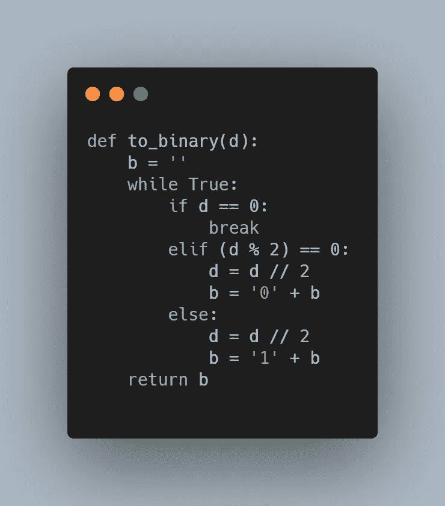
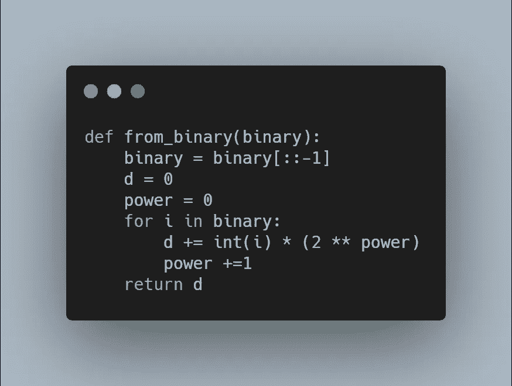
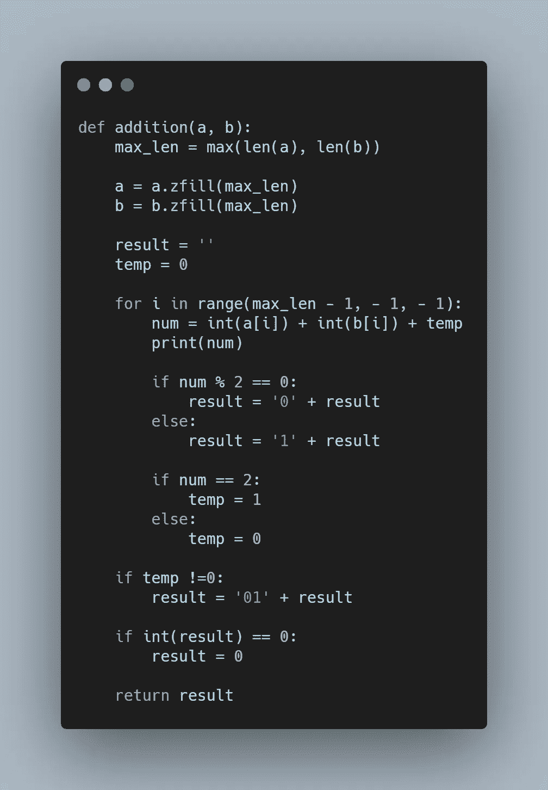
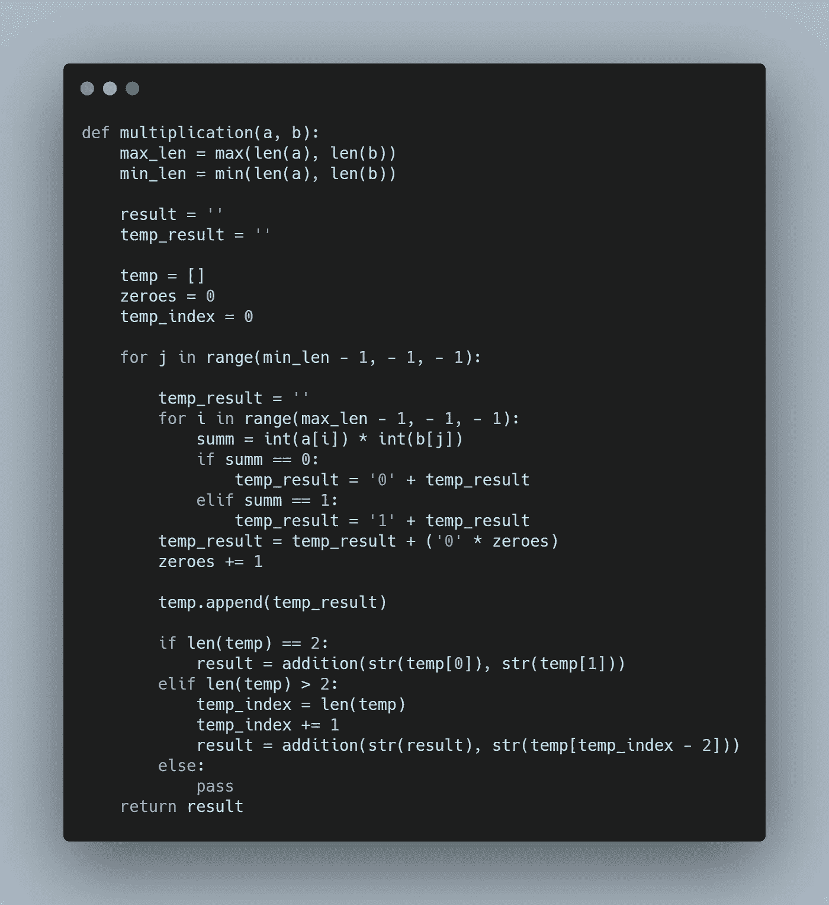
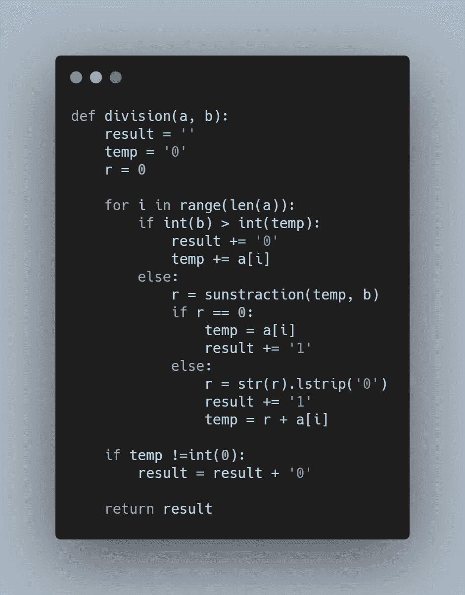

# 用 Python 计算二进制数

> 原文：<https://levelup.gitconnected.com/computing-binary-numbers-with-python-a6e00be69bea>

正如我们所知，在我们使用的硬件和我们在屏幕上看到的东西之间有很多抽象层次。我们还听说计算机使用二进制，这意味着数据的单位是 0 和 1(或真和假)。当我们告诉计算机去计算一些东西时，它不能只接受数字，然后进行计算。首先必须将数字转换成二进制，然后才能进行计算。我决定深入研究计算机如何进行二进制计算。为了简化表示，我用 python 构建了所有函数。

图片由 [Penny Morlock](https://pixy.org/97788/) 提供

## **算术**

我们有 4 种算术运算:加、减、乘、除。范妮认为计算机只能通过加法来完成所有这些运算。让我们看看它是怎么做的！

减法:a-b = a + (-b)

乘法:a * b = a + a，b 乘以

除法:a / b = a + a，直到到达 b，并记录它需要多少次迭代。

这是一个简单加法的概述，我们可以执行所有可能的计算。

## **往返双星**

现在让我们看看如何将十进制数转换成二进制数，以及如何将二进制数转换成十进制数。

收件人:

为了将十进制转换为二进制，我们需要检查给定的数字是否是偶数，然后将其除以 2。如果是偶数，则在二进制数序列的开头加 0。如果它不能被 2 整除，那么在二进制序列的开头加 1。跟踪部门产品，并对其重复这些操作。继续迭代，直到达到 0。如果数字不能被 2 整除，就四舍五入到最低的小数。

假设我们有 10 号:

1.  10/2 = 5，10 是偶数= 0
2.  5//2 = 2，5 甚至不是= 1
3.  2/2 = 1，2 是偶数= 0
4.  1/2 = 0，在我们的例子中 0 = 1

结果= 0101

Python 表示法:

出发地:

要将二进制转换成十进制，我们需要一个可迭代形式的二进制数，比如字符串或数组。反转二进制数。此外，我们需要将 decimal 的初始值设置为 0，并将 power 的值设置为 0。然后迭代二进制数，并且在每次迭代中，将 2 提高到最近的幂值，并且乘以最近的二进制数字值。最后将结果加到十进制数的最近值上。此外，将功率值增加 1。继续下去，直到对每个二进制数字执行运算。

二进制数:0101

十进制= 0

功率= 0

1.  0 + 1 * (2 ** 0) = 1
2.  1 + 0 * (2 ** 1) = 0
3.  1 + 1 * (2 ** 2) = 5
4.  5 + 0 * (2 ** 3) = 5

Python 表示法:

## **二进制加法**

二进制数的加法和十进制数的加法非常相似。但是我们不是执行 10，而是执行 1，其余的都是一样的。

有 4 种基本操作:

1.  0 + 0 = 0
2.  1 + 0 = 1
3.  0 + 1 = 1
4.  1 + 1 = 0

当你有 1 + 1 +进位的时候有点棘手。这里的规则是，如果总的加法结果是偶数(包括进位)，那么你将留下 0，如果是奇数，那么留下 1。

Python 表示法:

## **二进制减法**

二进制减法和十进制减法非常相似。唯一的区别是当减法的结果等于-1 时。这种情况只有在从 0 中减去时才会发生，因为我们处理的是 0 和 1。当我们从 0 减去 1 时，结果将是-1。当这种情况发生时，借款列中的 0 变为 2(将 0 — 1 变为 2 — 1，这就是我们留下 1 的原因)并将-1 结转到下一列。

Python 表示法:

## **乘法运算**

正如我们之前提到的，乘法是很多加法。二进制乘法也不例外。

我们需要做的是重复加法运算，重复的次数是最小数的长度。作为输出，你将得到乘法的多个乘积。然后你可以把所有这些乘积加在一起，得到最终的总和。

但是你不必等到所有的乘法运算都完成。我们能做的是将前两次相乘，得到两个乘积。然后把它们加在一起。因此，你会有一个临时数字，然后在每隔一次的迭代中，把最初乘法的每个结果都加到这个临时数字上。

Python 表示法:

**师**

类似乘法+加法的过程。二进制除法就是一堆减法。一定要将两个二进制数相除，取一个除法器，检查它是否大于或等于除数的第一位。如果不是，那么我们留 0，检查前两位是否大于或等于除数。重复此操作，直到找到匹配项，如果没有匹配项，则保留 0。

当找到匹配时，保留 1，从除数中减去除法器。

重复检查操作，直到你有一个新的匹配，并做分站每次匹配被发现。

Python 表示法:

## **全码**

我将所有的函数都放在一个文件中，这样就很容易使用它们:

胃肠治疗系统

**结论**

当然，我可以用 python 表达的是在更接近硬件的层面上正在发生的事情的近似值。但是我们可以很好的感觉到下面发生了什么。

理解计算机如何在我们看不到的层面上工作是建立计算机科学基础知识的必要步骤。

不断学习，不断成长！