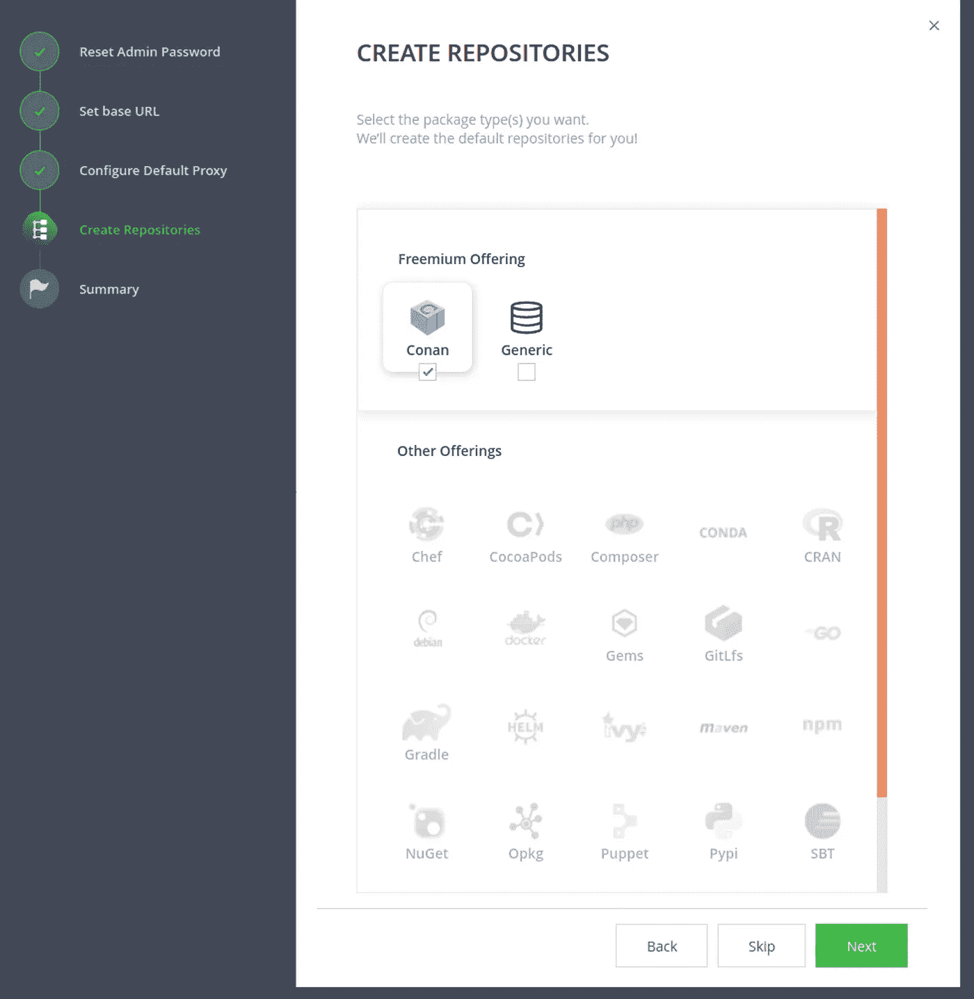
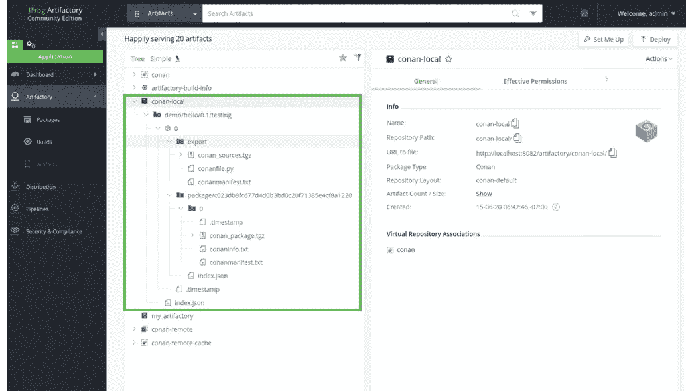

# 柯南包管理器教程

> 原文：<https://levelup.gitconnected.com/conan-package-manager-tutorial-bfb308ddd7a>

## 柯南包管理器概念和工作流程简介


[https://commons . wikimedia . org/wiki/File:Conan _ package _ manager _ logo . png](https://commons.wikimedia.org/wiki/File:Conan_package_manager_logo.png)

当你开发一个库或一个可执行程序时，有时你会为你的软件使用外部库，而不是自己写，以避免重复发明轮子。

尽管无论您使用哪种工具来管理构建过程都会发生这种情况，但是由于 CMake 已经成为 C/C++包的事实上的工具，所以我将重点讨论关于 CMake 的主题。

使用 CMake 时解决外部库依赖性的经典方法是将外部库的源代码复制到子目录中，然后使用 CMakeLists.txt 中的 *add_subdirectory()* 将外部库代码添加到 CMake 树中，并与您的软件一起构建。

通过手动下载代码(通常是。zip，tar.gz)或者使用 *git 子模块*和从 git 库获取或者使用 CMake 的 *ExternalProject* 模块扩展。

此外，除了将复制的外部包添加到您的 CMake 树之外，您还可以在您的 CMake 树之外单独构建和安装外部包，然后在您构建软件时使用 CMakeLists.txt 中的 *find_package()* 来导入它们(您可以查看[我以前的帖子](/simple-modern-cmake-tutorial-b0c1c362cd2c)以了解有关如何导出/导入 CMake 包的更多详细信息)。

可以想象，随着您使用的外部库数量的增加，用上面提到的那些经典方法处理依赖性很快就会变得难以管理。

在本帖中，我将简单介绍一下名为“柯南”的 C/C++包管理器。Conan 包管理器不仅使处理外部依赖变得容易，而且改进了包的部署过程。

Conan⁴是一个 C /C++语言的依赖和包管理器。这是一个开源软件，可以免费使用。它可以运行在大多数主流平台上(Windows、Linux 和 OSX)。

柯南由客户端和服务器组成。推荐的服务器是 JFrog Artifactory 社区版(CE)。JFrog Artifactory 社区版(CE)免费使用。因此，在本教程中，我将使用它来给出客户端和服务器方面的概述。即使没有安装它或实际执行教程，你也应该能够通过通读这篇文章来理解基本思想和工作流程。

# 安装柯南服务器和客户端

首先，你可以从[这里](https://conan.io/downloads.html)下载 JFrog Artifactory 社区版。此时，我使用 Linux 作为环境，我简单地下载了 tar.gz 文件，但是有几个选项，比如获得 docker 容器。

```
tar xvf jfrog-artifactory-cpp-ce-7.5.7-linux.tar.gz
cd artifactory-cpp-ce-7.5.7/app/bin
sudo bash installService.sh
sudo systemctl start artifactory.service
```

最后一个命令将启动服务器(服务名为 artifactory.service)。现在你可以通过一个网址为[的网络浏览器访问服务器。首次登录时会要求输入用户名和密码(用户名为“admin”，密码为“password”)。](http://localhost:8081)

然后，选择创建柯南知识库。



现在，您已经有了一个服务器，作为在您的机器上本地运行的 Conan 库。

接下来，为了安装柯南客户端，执行 *pip* ⁵命令。

```
pip install conan
```

最后，您的机器上安装了柯南服务器和客户端。接下来，让我们创建一个简单的“hello world”柯南包。

# 创建柯南包

幸运的是，柯南有一个功能，可以提供一个与“hello world”包装一模一样的食谱。通过执行下面的命令，

```
mkdir conan_tutorial && cd conan_tutorial
conan new hello/0.1 -t -s
```

它将创建如下所示的文件(hello/0.1 分别是一个*包名* / *版本*)，

```
conan_tutorial
├── conanfile.py
├── src
│   ├── CMakeLists.txt
│   ├── hello.cpp
│   └── hello.h
└── test_package
    ├── CMakeLists.txt
    ├── conanfile.py
    └── example.cpp
```

在 src/目录下，定义了一个简单的 CMake 库包(hello.h/cpp 实现 *hello()* 函数，打印“Hello World”)

*conanfile.py* 是自动生成的 Conan 主配方文件。

```
####### *conanfile.py #######*from conans import ConanFile, CMakeclass HelloConan(ConanFile):
    **name = "hello"
    version = "0.1"**
    license = "<Put the package license here>"
    author = "<Put your name here> <And your email here>"
    url = "<Package recipe repository url here, for issues about the package>"
    description = "<Description of Hello here>"
    topics = ("<Put some tag here>", "<here>", "<and here>")
    settings = "os", "compiler", "build_type", "arch"
    options = {"shared": [True, False]}
    default_options = {"shared": False}
    **generators = "cmake"**
    **exports_sources = "src/*"**def build(self):
        cmake = CMake(self)
        cmake.configure(source_folder="src")
        cmake.build()# Explicit way:
        # self.run('cmake %s/hello %s'
        #          % (self.source_folder, cmake.command_line))
        # self.run("cmake --build . %s" % cmake.build_config)def package(self):
        self.copy("*.h", dst="include", src="src")
        self.copy("*.lib", dst="lib", keep_path=False)
        self.copy("*.dll", dst="bin", keep_path=False)
        self.copy("*.dylib*", dst="lib", keep_path=False)
        self.copy("*.so", dst="lib", keep_path=False)
        self.copy("*.a", dst="lib", keep_path=False)def package_info(self):
        self.cpp_info.libs = ["hello"]
```

我们在生成配方时给出的名称和版本(hello/0.1)用于名称和版本属性。

另外，通过设置 *generators = "cmake"* ，Conan 生成一个*conanbuiltinfo . cmake*文件，当我们用 CMake 构建包时可以包含这个文件。生成的 conanbuildinfo.cmake 包含包所需的依赖项的信息。在这个例子中，为了简单起见，hello world 包没有任何必需的依赖项，所以没有太多的意义，但是如果一个包有任何必需的依赖项，我们需要在 *conanfile.py* 文件*中指定[构建需求](https://docs.conan.io/en/latest/devtools/build_requires.html)。*

为了让柯南包对消费者可见，我们需要将 *conanfile.py* 导出到本地柯南缓存(按照惯例，该文件将位于用户主文件夹~/。柯南/)。

*exports_sources = src/** 指示柯南在导出 *conanfile.py.* 时，将本地 *src/* 文件夹中的所有文件复制到本地柯南缓存中。这种方法的优点是，它使配方自包含，并且在从源构建时不需要从外部位置获取源。

*build()* 用于从导出的源代码进行构建，本例中表示使用 CMake。

*package()* 用于将构建工件复制到柯南本地缓存下的指定包文件夹中。

*package_info()* 指定一些构建信息，以传达给包的消费者。当我们稍后用柯南构建另一个消费这个包的包时，这里指定的信息将被收集。然后，Conan 生成*conanbuiltinfo . cmake*，其中包含消费者包所需的该包的所有信息。

在这种情况下，*self . CPP _ info . libs =[" hello "]*表示消费者包应该链接的库。

为了简单起见，我没有介绍所有的属性和方法，只介绍了与掌握工作流基础知识相关的内容。柯南是一个非常强大的工具，它有许多功能。如果你有兴趣，你可以查看[这里的](https://docs.conan.io/en/latest/reference/conanfile/methods.html)来了解更多关于方法的细节。这里的[是关于属性的详细信息](https://docs.conan.io/en/latest/reference/conanfile/attributes.html)。

# 导出并上传柯南包

现在我们创建了一个简单的 hello world 柯南包。下一个。让我们导出包，以便消费者可以看到它。为了导出，我们需要执行

```
conan export . demo/testing
```

这将导出 *conanfile.py* 并将 *exported_sources* 复制到我们上面提到的 Conan 本地缓存中。除了*版本*和*名称*属性之外，演示/测试是您可以指定的包的附加标识。导出包后，消费者就可以看到它了。为了确认，我们可以跑

```
conan search*Existing package recipes:**hello/0.1@demo/testing*
```

现在可以看到 *hello/0.1@demo/testing* 这个包上市了。

然后，作为下一步，我们建立并安装到柯南本地缓存包。

```
conan install hello/0.1@demo/testing --build=hello
```

这将构建包并将工件复制到 Conan 本地缓存下的指定包目录中。你可以回去看看上面提到的*包(self)* 功能。

运行命令后， *hello/0.1@demo/testing* 包应该安装在本地(在柯南本地缓存中)。

到现在为止，我们还没有用过当初准备的柯南服务器。所以，我们把包上传到柯南服务器吧。

首先，我们需要通过运行下面的命令将服务器添加到远程列表中，

```
conan remote add conan-local http://localhost:8081/artifactory/api/conan/conan-local
```

conan-local 是您可以指定的远程名称。然后您可以通过执行，

```
conan upload hello/0.1@demo/testing — all -r=conan-local
```

为了确认，如果您检查存储库，您可以看到 *hello/0.1@demo/testing* 包被上传并托管在存储库上。



就是这样。我们成功地创建了一个柯南包，并将其上传到一个远程存储库(在本教程中，它托管在本地机器上，但如果是远程存储库，也可以应用相同的工作流程)。

# 消费一个柯南包

到目前为止，我们创建了一个柯南包，并上传到远程资源库。接下来，我们看看如何使用另一个包中的包。

你可能已经注意到了，之前我们执行“*柯南 new hello/0.1 -t -s* 命令的时候， *test_package* 目录是自动创建的。这是一个简单的示例包，它使用了 *hello/0.1* 包。柯南自动创建的，这样我们就可以测试柯南包是否可以正确安装和链接。

*test_package* 的 CMakeLists.txt 如下所示，

```
cmake_minimum_required(VERSION 2.8.12)
project(PackageTest CXX)include(${CMAKE_BINARY_DIR}/conanbuildinfo.cmake)
conan_basic_setup()add_executable(example example.cpp)
target_link_libraries(example ${CONAN_LIBS})# CTest is a testing tool that can be used to test your project.
# enable_testing()
# add_test(NAME example
#          WORKING_DIRECTORY ${CMAKE_BINARY_DIR}/bin
#          COMMAND example)
```

关键部分是*“包含($ { CMAKE _ BINARY _ DIR }/conanbuildinfo . CMAKE)”。*

当 *test_package* 被安装后，所有依赖关系的 *package_info()* 方法(在本例中，只有*" hello/0.1 @ demo/testing "*包)将被调用和聚集。然后，Conan 生成 conanbuildinfo.cmake，其中包含不同变量形式的所有依赖关系信息(同样，在这种情况下，仅包含来自*“hello/0.1 @ demo/testing”*包的信息)。

为了安装和执行*测试包*，我们运行

```
conan test test_package hello/0.1@demo/testing
```

如前所述，这是一个简单的测试包，专门为使用*“hello/0.1 @ demo/testing”而生成。*所以和普通包消耗*“hello/0.1 @ demo/testing”*的情况略有不同。我们需要以某种方式告诉这个包需要或者依赖于*“hello/0.1 @ demo/testing”。*在这种情况下，我们只需要在消费包的*con config file . py*文件中指定[构建需求](https://docs.conan.io/en/latest/devtools/build_requires.html)。

# 摘要

在这篇文章中，我简单介绍了柯南包管理器，并且用一个简单的教程解释了柯南包管理器的基本工作流程。

[1]:[https://cmake.org/](https://cmake.org/)

[2]:[https://git-scm.com/book/en/v2/Git-Tools-Submodules](https://git-scm.com/book/en/v2/Git-Tools-Submodules)

[3]:[https://cmake . org/cmake/help/latest/module/external project . html](https://cmake.org/cmake/help/latest/module/ExternalProject.html)

【4】:[https://conan.io/](https://conan.io/)

[5]:[https://pypi.org/project/pip/](https://pypi.org/project/pip/)