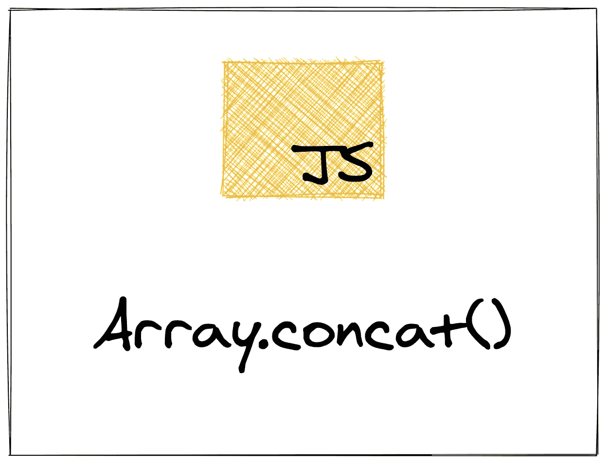

# concat:通过构建 JavaScript 的数组方法来学习它们

> 原文：<https://levelup.gitconnected.com/concat-learn-javascripts-array-methods-by-building-them-cd2cbb44b4e2>

在本系列的第三篇文章中，我们将探索`concat`方法，以及如何将复杂的逻辑抽象成一个函数，这样我们就不必考虑它了。



# 介绍

数组是 JavaScript 最强大的特性之一。它们的灵活性和力量是微妙的，所以聚光灯倾向于照射在功能或物体上。这导致即使是一些涉及数组的最简单的任务也要经过层层编码。

我们已经研究了两种流行的 JavaScript 数组方法，并了解了它们如何使我们的代码更易于阅读。在本文中，我们将继续探索`concat`方法，它提供了一种将多个数组连接成一个数组的简单方法。

# 它是如何工作的

`concat`方法(缩写为 *concatenate* )接受任意数量的数组，并将它们组合成一个新数组。我们可以不使用`concat`方法来实现。例如，如果我们有以下两个数组:

```
const num1 = [1, 2, 3];
const num2 = [4, 5, 6];
```

我们可以将它们与两个`for`循环结合起来(每个数组一个):

```
const nums = []for (let i = 0; i < num1.length; i++) {
  nums.push(num1[i])
}for (let i = 0; i < num2.length; i++) {
  nums.push(num2[i])
}console.log(nums) // [1, 2, 3, 4, 5, 6]
```

这个解决方案工作得很好，但是它有几个缺点。

也就是说，它不是非常动态的。如果我们需要添加第三个数组，我们该怎么做？我们要增加第三个循环吗？好吧，让我们把它变得更有活力:

```
const numArrays = [num1, num2]const nums = []for (let i = 0; i < numArrays.length; i++) {
  let currentArray = numArrays[i]
  for (let j = 0; j < currentArray.length; j++) {
    nums.push(currentArray[j])
  }
}console.log(nums) // [1, 2, 3, 4, 5, 6]
```

在上面的代码块中，我们获取两个数组`num1`和`num2`，并将它们添加到一个数组`numArrays`。这将让我们一起处理所有的数组。然后我们遍历数组列表。然后，我们可以遍历每个数组，并将条目推入我们的`num`数组。

它更加动态，意味着我们可以更容易地适应数据的变化。关于嵌套循环还有一点需要说明，但是我们现在可以把它放在一边。主要问题是这段代码很长，难以阅读，难以理解我们在做什么。如果你看到这段没有任何注释的代码，你会花一些时间去理解开发者想要做什么。

我们想做这样的事情:

```
const num1 = [1, 2, 3];
const num2 = [4, 5, 6];const nums = num1.concat(num2)console.log(nums) // [1, 2, 3, 4, 5, 6]
```

眨眼就错过了！这段代码在一行易于阅读的代码中实现了相同的结果。

哈利路亚！

# 实现我们自己的

我们已经确定了它的作用，所以让我们来谈谈`concat`是如何做到的。要实现我们自己的，我们需要一个函数:

*   接受任意数量的数组
*   循环通过它们
*   将每个数组的项添加到最终数组中
*   然后，返回最后一个数组

这是我们将要构建的`concat`最终版本的规范，但是为了得到它们，我们将练习一个叫做 *reduction* 的技巧。我们不会试图解决所有这些问题，而是将问题的复杂性降低一点。我们的第一个解决方案将采用两个数组并将它们连接起来，然后我们将修改该解决方案以处理任意数量的数组。

首先，我们需要一个带两个数组的函数:

```
function concat(arr1, arr2) {
	// More to come here ...
}
```

让我们把这两个数组合并成一个数组，这样我们就可以一起处理它们了。然后我们可以遍历组合数组:

```
function concat(arr1, arr2) {
  let arrs = [arr1, arr2]

  for (let i = 0; i < arrs.length; i++) {
    // More to come here ...
  }
}
```

下一步是遍历传入的两个数组，并将每一项推入一个`final`数组，然后我们可以返回该数组:

```
function concat(arr1, arr2) {
  let arrs = [arr1, arr2]
  let final = []

  for (let i = 0; i < arrs.length; i++) {
    let currentArray = arrs[i]
    for (let j = 0; j < currentArray.length; j++) {
      final.push(currentArray[j])
    }
  }

  return final
}
```

这与我们之前的实现是一样的，但是我们去掉了难以理解的逻辑，使其可重用。现在，当我们想要连接两个数组时，我们不必考虑*如何*去做，我们只需要:

```
const letters1 = ['a', 'b', 'c'];
const letters2 = ['d', 'e', 'f'];const letters = concat(letters1, letters2);console.log(nums) // ['a', 'b', 'c', 'd', 'e', 'f']
```

我们已经解决了这个问题的简化版本。我们已经定义了一个函数，它接受两个数组并将它们连接成一个新的数组。现在我们需要解决原来的作用域，使这个函数可以处理任意数量的传入数组。为此，我们需要一种动态的方式来处理函数传入的参数。

# 使用函数的`arguments`

我们需要一种方法来处理任意数量的传入数组。有几种方法可以做到这一点，但最简单的是使用内置的`arguments`对象:

```
function printArguments() {
  // Print out the `arguments` object
  console.log(arguments)
}printArguments('hello', 'world')
```

在上面的代码片段中，我们定义了一个使用`console.log`打印`arguments`对象的函数。然后我们调用这个函数，传递两个参数:`'hello'`和`'world'`。

如果您运行这段代码，您将在控制台中看到如下内容:

```
{
  '0': 'hello',
  '1': 'world',
  length: 2,
  callee: ƒ printArguments(),
  __proto__: { ... }
}
```

`arguments`对象是类似数组的。你可以通过索引访问`arguments`中的条目(即`arguments[0]`会给你`'hello'`)，它有一个长度，但它不是一个真正的数组。

但是，如果我们可以通过索引访问条目，那么我们就可以遍历它。所以我们可以修改我们的`concat`实现来使用`arguments`:

```
function concat() {
  let final = []

  for (let i = 0; i < arguments.length; i++) {
    let currentArray = arguments[i]
    for (let j = 0; j < currentArray.length; j++) {
      final.push(currentArray[j])
    }
  }

  return final
}
```

我们已经用`arguments`替换了`numsArray`，但是除此之外，这段代码与之前的代码是一样的。现在我们的`concat`方法可以接受任意数量的传入数组:

```
let num1 = [1, 2, 3]
let num2 = [4, 5, 6]
let num3 = [7, 8, 9]
let num4 = [0]let nums = concat(num1, num2, num3, num4)console.log(nums) // [1, 2, 3, 4, 5, 6, 7, 8, 9, 0]
```

我们已经完成了我们的`concat`版本，但是我们当然可以让它更干净一点，我们现在就去做。

# 清理我们的实现

我们对`concat`的实现工作得很好，但不是很干净。在以前的文章中，我谈到了循环一般是如何难以阅读的。嗯，嵌套循环特别难！

我们可以开始清理这个问题，用`forEach`替换我们的`for`循环。我们只需将`arguments`转换成一个完整的数组:

```
function concat() {
  let final = []
  let args = Array.from(arguments); args.forEach(arg => {
    arg.forEach(num => final.push(num))
  }) return final
}
```

我们删除了几行代码，并使我们的实现更容易阅读。我们可以更进一步，但是使用 rest 和 spread 操作符。

首先，我们将实现 rest 操作符，这是替换`arguments`的一种方式:

```
function concat(...args) {
  let final = [] args.forEach(arg => {
    final = [ ...final, ...arg ]
  }) return final
}
```

剪掉了几行。这也是处理未知数量输入问题的更现代的方法。

接下来，我们将使用 spread 运算符删除一个循环:

```
function concat(...args) {
  let final = [] args.forEach(arg => {
    final = [ ...final, ...arg ]
  }) return final
}
```

spread 运算符“解包”一个对象，就像数组一样。我把它比作把背包倒扣在行李箱上，然后拉开拉链:背包里的所有东西都会掉到行李箱里。

在这里，我们解压数组(`arg`)中传递的每一个数据，让所有数据都进入`final`数组。

为什么我们对`final`做同样的事情？随着循环的每一次迭代，我们都在创建一个新的数组来代替之前的版本。所以在我们的`forEach`循环的第一次迭代之后，`final`数组将保存传递到`concat`的第一个数组中的所有项目。我们希望当前版本`final`中的这些项目出现在下一个版本中(在`forEach`的下一次迭代之后)，所以我们也解压它。

# 结论

您仍然可以看到，任何数组方法都可以用循环来实现，但是我们对`concat`的实现比我们之前对`[forEach](https://zkf.io/js-array-methods-foreach/)`和`[map](https://zkf.io/js-array-methods-map/)`的实现要复杂一些。我们可以看到，这些数组方法不仅仅是让我们的代码更具声明性，它们还隐藏了复杂性。随着我们探索一些更复杂的数组方法，比如`reduce`，这种情况会更加真实。

我将详细介绍并解释和实现每个内置数组方法，这将帮助您理解它们是如何工作的，以及何时以及如何使用它们。我已经完成了`[forEach](https://zkf.io/js-array-methods-foreach/)`和`[map](https://zkf.io/js-array-methods-map/)`，所以如果你还没有完成的话，请检查一下。要跟进，注册我的[时事通讯](https://hawthorne.substack.com)并在[推特](https://twitter.com/ZFleischmann)上关注我。