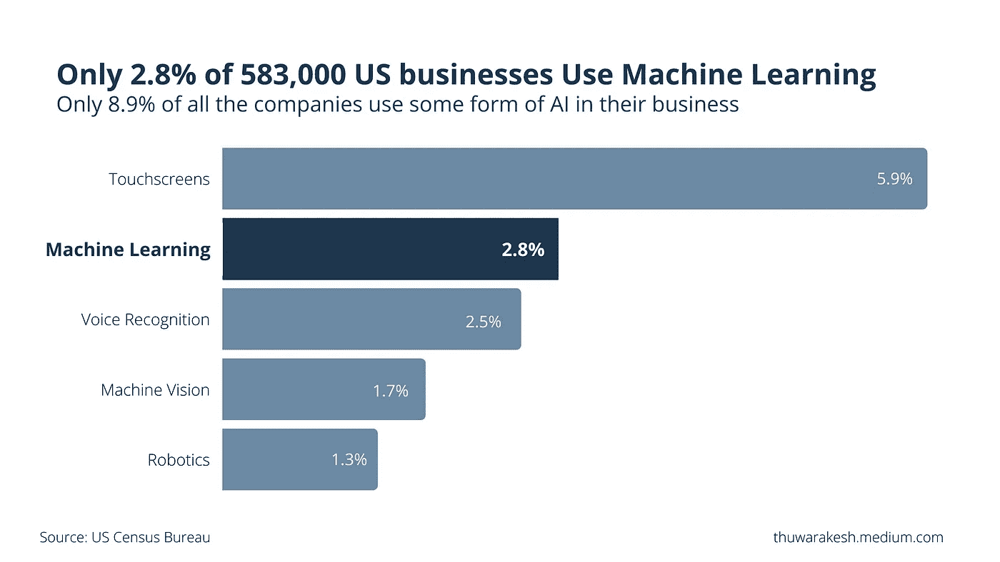

# 为什么机器学习模型会无声无息地死去

> 原文：<https://levelup.gitconnected.com/concept-drift-in-machine-learning-1fc7a4396b10>

## 你如何拯救它

照片由[丽莎夏](https://www.pexels.com/@liza-summer?utm_content=attributionCopyText&utm_medium=referral&utm_source=pexels)从[派克斯](https://www.pexels.com/photo/unrecognizable-upset-lady-embracing-knees-sitting-on-chair-6382642/?utm_content=attributionCopyText&utm_medium=referral&utm_source=pexels)拍摄

> 人生的意义因人而异，因日而异，因时而异——维克多·e·弗兰克，《人类对意义的探索》。

弗兰克尔不仅对生命的意义是正确的，他的说法对生产中的机器学习模型也是正确的。

当您在生产中部署 ML 模型时，它们表现良好。然而，他们的表现一路下滑。它的预测质量会下降，很快变得不那么有价值。

这是软件部署和机器学习部署之间的主要区别。软件程序每次都以同样的方式执行任务。即使创造了几十年，它们仍然有用，除非新技术超越了它们，或者最初创造它们的目的已经过时。

大多数公司在不知道这种差异的情况下，试图在业务运营中使用机器学习，但都失败了。他们在从这项技术提供的价值中获益之前就退出了。

使用机器学习和人工智能来推动业务运营的公司越来越少。—图片由[作者](https://linkedin.com/in/thuwarakesh)提供。

根据美国人口普查局 2018 年对 583，000 家美国公司的[调查](https://conference.nber.org/conf_papers/f138039.pdf)，只有 2.8%的公司使用机器学习来利用优势进行运营。大约 8.9%的被调查者使用某种形式的人工智能，如语音识别。

# 为什么 ML 模型在生产中性能会下降？

你花了几周甚至几个月的时间来训练一个机器学习模型，最后，它进入了生产阶段。现在，你应该看到你努力工作的好处了。

但是，您会注意到模型性能随着时间的推移而慢慢降低。什么会导致这种情况？

如果没有持续监控和充分评估预测的质量下降，概念漂移可能会在机器学习模型的预期退役日期之前杀死它。

## 什么是概念漂移？

当训练集样本的分布发生变化时，就会发生概念漂移。

> 在最基本的层面上，随着时间的推移，概念漂移导致曾经被认为是一个概念的例子的数据点被完全视为另一个概念。

例如，当欺诈的概念不断变化时，欺诈检测模型存在概念漂移的风险。

这可能导致模型性能下降，特别是在概念漂移持续发生而未被您的监控系统检测到的长时间内。

## 是什么原因导致了观念漂移？

概念漂移发生的主要原因是应用程序中的底层数据分布在不断变化。

当分布发生变化时，旧的机器学习模型不再能够做出准确的预测，必须完全重新定义或重新训练以适应这些变化。

虽然这听起来像是你永远不希望在应用程序中发生的事情，但尽可能频繁地更新是许多机器学习模型的目标。

这是因为从生产环境中收集的新数据包含有价值的信息，这些信息有助于提高模型所做预测的准确性。

由于外部原因或预测本身，输入数据的分布可能会发生变化。例如，消费者的购买行为受到宏观经济趋势的影响。然而，他们在你平台上的行为也可能是你推荐系统的直接后果。

# 如何解决生产中模型的概念漂移？

虽然概念漂移看起来很吓人，但还是有办法解决的。这是所有机器学习开发者迟早都会面临的普遍问题。

这个概念会随着时间的推移而漂移，并且数据会从用于训练模型的数据发生变化。如果你没有监控这种漂移的方法，你的准确性会慢慢下降，直到最终没有人再相信你的预测。

## 随着时间的推移监视模型的输入和输出。

通过监视输入和输出数据分布，我们可以确定性能泄漏是数据问题还是模型问题。

如果是数据问题，那么你可以调查是什么变化导致了这种转变。这可能是数据收集方法或趋势的真正转变。

如果是一个模型问题，你应该看看你的模型的什么特性可能导致这种分布的变化。这可能是由诸如模型中的偏差甚至环境变化等因素造成的，这些因素会导致训练集与实际数据不匹配。

## 随着时间的推移跟踪模型预测质量

随着时间的推移监控不同的性能指标是至关重要的，因为我们可以通过仔细观察它们来找出任何偏差。一些关键的模型性能指标包括精确度、召回率、F-measure 和 ROC。

[**精度**](https://developers.google.com/machine-learning/crash-course/classification/precision-and-recall) 是当真阳性除以所有做出的预测时，预测的准确程度。如果你观察一段时间内的精度，这表明我们的模型从实际数据分布偏离到它现在预测的程度。

[**回忆**](https://developers.google.com/machine-learning/crash-course/classification/precision-and-recall) 告诉我们是否捕捉到了足够多的正面例子。

如果召回率随着时间的推移而下降，这表明我们的模型已经从真阳性漂移到假阴性，这不适合商业决策。

[**F-measure**](https://link.springer.com/article/10.1007/s10994-021-05964-1) 使用精度和召回值的调和平均值将精度和召回值组合成一个数字。如果 F-measure 随着精度而变化，那么这也表明存在模型漂移。

[**ROC**](https://towardsdatascience.com/understanding-auc-roc-curve-68b2303cc9c5) 让我们能够对照所有其他预测来查看一个真阳性，这有助于识别任何分类器偏差问题或导致假阳性的特征变化。可以看作是精度和召回率的扩展，但是它有更多的信息。

## 使用新数据定期重新训练您的模型，以保持准确性和可信度。

虽然跟踪绩效矩阵可以尽早发现概念漂移，但定期的再培训会主动尝试消除这种情况。

不断地重新训练你的模型可能会花费大量的时间和资源，但从长远来看，这是一项值得的投资。

再培训的频率很大程度上取决于领域。在电子商务中，每周重新训练模型可能是有意义的。但是对于欺诈用户行为不断变化的欺诈检测系统，您可能需要每天重新训练您的模型。

## 使用一组模型。

这些都是防止或解决生产中机器学习漂移的优秀策略。然而，解决这个问题的另一种方法是使用集合模型。

集合模型同时使用多种算法，并将它们的预测组合成一个比任何单个算法都更准确的最终预测。

这是提高精度和防止随着时间推移出现任何漂移的好方法。

# 最后的想法

概念漂移导致机器学习模型在生产中的表现不同于它们在训练中的表现。这是一个大问题，如果没有正确预测漂移，可能会导致糟糕的用户体验，甚至导致模型失败。

概念漂移在生产中最常见的方式是当您的数据随时间变化时(例如，添加新功能，删除一些现有功能)。监控您的数据并尽快发现偏差是非常重要的。

你也应该使用像定期再培训或集合这样的技术来防止漂移。

你必须在用户开始报告你的产品的糟糕体验之前解决机器学习漂移。如果发生这种情况，它将很快导致信任的丧失，并为以后的修复工作带来非常高的成本。积极主动！