# 基于 5 种机器学习算法的混凝土强度建模

> 原文：<https://levelup.gitconnected.com/concrete-strength-modeling-with-5-machine-learning-algorithms-447ea3d558d1>

## 寻找混凝土强度的最佳算法

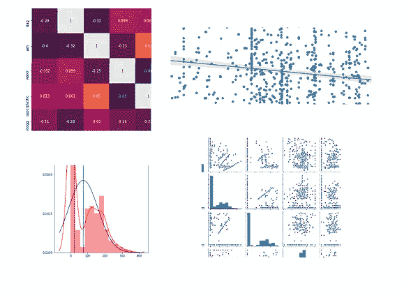

作者的照片

在本文中，我们将实现回归算法，以找到混凝土强度的最佳性能模型。让我给你简单介绍一下数据集。混凝土的强度取决于如下所示的各种因素:

独立变量:水泥、矿渣、灰分、水、超塑性、粗骨料、细骨料和龄期。

因变量或目标变量:强度

你可以从[这里](https://www.kaggle.com/pritech/predicting-the-strength-of-concrete)得到数据。

让我们练习寻找模型的性能。

```
# Importing Libraries# Data Handling Librariesimport pandas as pd
import numpy as np
from collections import OrderedDict# Import Data Visualization Libraryimport matplotlib.pyplot as plt
import seaborn as sns
import scipy.stats as sci# Statistic Librariesimport warnings
warnings.filterwarnings("ignore")# Import Machine Learning Libraries
from sklearn.linear_model import LinearRegression , Lasso ,Ridge
from sklearn.tree import DecisionTreeRegressor
from sklearn.ensemble import AdaBoostRegressor 
from sklearn.ensemble import RandomForestRegressor 
from sklearn.ensemble import GradientBoostingRegressor
from xgboost import XGBRegressor
from sklearn.svm import SVR
from sklearn.neighbors import KNeighborsRegressor# Importing Validating matrix
from sklearn.model_selection import cross_val_score,GridSearchCV
from sklearn.model_selection import train_test_split
from sklearn.metrics import r2_score,mean_squared_error
```

用 pandas 库读取数据集的 excel 文件。

```
df = pd.read_excel("Capstone Project.xlsx")# creating another set of copy
df2 = df.copy()
```

用 head 方法查看数据。

```
# displays the first five rows of data
df.head()
```

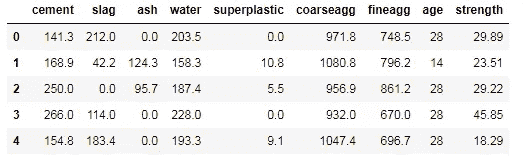

作者的照片

> ***了解统计数据的描述。***

```
# gives the descriptive stats
df.describe()
```

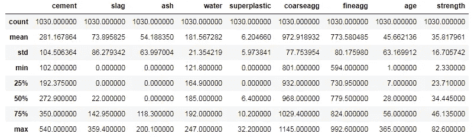

作者的照片

统计描述是非常昂贵的信息较少，我们可以做一个自定义的描述报告如下所示。

```
# Preparing Custom EDA Reportdef custom_summary(data):
    result = []
    for col in data.columns:
        stats = OrderedDict({"column_name":col,
                    "Count":round(data[col].count(),2),
                    "Minimum":round(data[col].min(),2),
                    "Quartile 1":round(data[col].quantile(0.25),2),
                    "Mean":round(data[col].mean(),2),
                    "Median":round(data[col].median(),2),
                    "Mode":round(data[col].mode(),2),
                    "Quartile 3":round(data[col].quantile(0.75),2),
                    "Maximum":round(data[col].max(),2),
                    "Variance":round(data[col].var(),2),
                    "Std. Dev.":round(data[col].std(),2),
                    "Kurtosis":round(data[col].kurt(),2),
                    "Skewness":round(data[col].skew(),2),
                    "IQR":data[col].quantile(0.75)-data[col].quantile(0.25)})
        result.append(stats)
        if data[col].skew()<-1:
            sk_label = "Highly Negatively Skewed"
        elif -1<=data[col].skew()<-0.5:
            sk_label = "Moderately Negatively Skewed"
        elif -0.5<= data[col].skew()<0:
            sk_label = "Fairly Symmetric (Negative)"
        elif 0<=data[col].skew()<0.5:
            sk_label= "Fairly Symmetric (Positive)"  
        elif 0.5<=data[col].skew()<1:   
            sk_label= "Moderately Positively Skewed"  
        elif data[col].skew()>1:
            sk_label="Highly Positively Skewed"
        else:
            sk_label='error'
        stats['skewness comment']=sk_label#Outlier comment
        upperlim = stats['Quartile 3']+(1.5*stats['IQR'])    
        lowerlim = stats['Quartile 1']-(1.5*stats['IQR'])
        if len([x for x in data[col] if x < lowerlim or x > upperlim]) > 0:
            outliercomments = 'Has Outlier'
        else:
            outliercomments = 'Has no outliers'
        stats['Outlier Comment'] = outliercommentsresult_df = pd.DataFrame(result)
    return result_dfcustom_summary(df)
```

上述自定义统计报告的结果非常惊人。

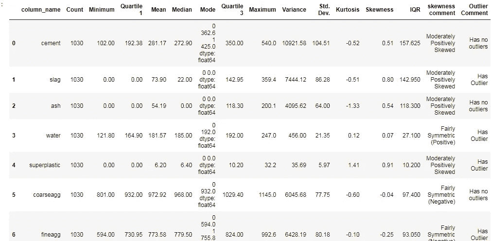

数据的自定义描述。作者的照片

现在，我们将使用四分位数和标准方法制作两个函数来检测异常值。

```
# Replacing the outlierdef replaceoutlier(data,col,method = 'Quartile',strategy = 'Median'):
    col_data = data[col]

    # Using Quartile to set values

    if method == 'Quartile':
        q2 = data[col].median()
        q1 = data[col].quantile(0.25)
        q3 = data[col].quantile(0.75)
        iqr = q3 - q1
        low_limit = q1 - 1.5*iqr
        up_limit = q3 + 1.5*iqr

    # Using STD to set values

    elif method == 'Standard Deviation':
        col_mean = data[col].mean()
        col_std = data[col].std()
        cutoff = col_std*2
        low_limit = col_mean - cutoff
        up_limit = col_mean + cutoff

    else:
        print("Error: Pass a correct method")# Printing Outliers

    outliers = data.loc[(col_data < low_limit) | (col_data > up_limit) , col ] outlier_density = round((len(outliers)/len(data)),2) if len(outliers) == 0:
        print(f'Feature\'{col}\'does not have any outlier')
    else:
        print(f'Total no. of outliers are: {len(outliers)}\n')
        print(f'Outlier percxentage: {outlier_density}\n')
        print(f'Outliers for \'{col}\'are : {np.sort(np.array(outliers))}\n') display(data[(col_data < low_limit) | (col_data > up_limit)])

    # Replacing Outliers

    if strategy == 'Median':
        data.loc[(col_data < low_limit) | (col_data > up_limit) , col ] = q2 elif strategy == 'Mean':
        data.loc[(col_data < low_limit) | (col_data > up_limit) , col ] = col_mean else:
        print("Error: Pass a correct Strategy")

    return data
```

第二个函数用于绘制密度和箱线图。

```
def odt_plots(data,col):
    f,(ax1,ax2,ax3) = plt.subplots(1,3,figsize = (20,20))
    kwargs = {'fontsize':20,'color': 'black'}

    # Descriptive Stats: Box Plot

    sns.boxplot(data[col],ax = ax1,orient = 'v', color = 'red')
    ax1.set_title(col +' ' + 'Box Plot',**kwargs)
    ax1.set_xlabel('Box Plot',**kwargs)
    ax1.set_ylabel("Values",**kwargs)

    #Plotting histogram with outlier

    sns.distplot(data[col],ax = ax2,color='red',fit = sci.norm )
    ax2.axvline(data[col].mean(), color = 'green')
    ax2.axvline(data[col].median(),color = 'black' , linestyle = 'dashed') ax2.set_title(col +' ' + 'Distribution with Outliers',**kwargs)
    ax2.set_xlabel('Density',**kwargs)
    ax2.set_ylabel("Values",**kwargs)

    #Plotting histogram without outlier

    y= replaceoutlier(df,col)

    sns.distplot(y[col],ax = ax3,color='red',fit = sci.norm )
    ax3.axvline(y[col].mean(), color = 'green')
    ax3.axvline(y[col].median(),color = 'black' , linestyle = 'dashed') ax3.set_title(col +' ' + 'Distribution without Outliers',**kwargs) ax3.set_xlabel('Density',**kwargs)
    ax3.set_ylabel("Values",**kwargs)

    plt.show()
```

现在，是时候调用这个函数了。

```
for col in df.columns:
    odt_plots(df,col)
```

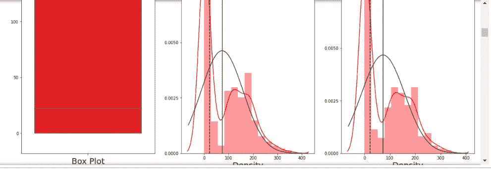

方框图和密度图。作者的照片

现在，我们将在 seaborn 库的帮助下绘制每个特征的散点图和直方图。

```
print(sns.pairplot(df))
```

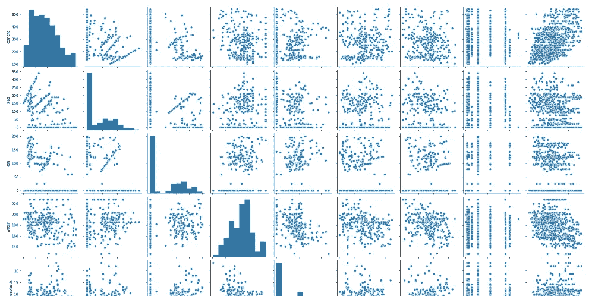

作者的照片

现在，我们将使用回归进行多元分析。

```
for col in list(df.columns):
    if col!= 'strength':
        ## not all in 1 x axis        
        fig,ax1 = plt.subplots(figsize=(20,15),sharex=False) 

        sns.regplot(x=df[col],y=df['strength'],ax=ax1).set_title(
                          f'Relationship between{col} and strength')
```


作者的照片

是时候查看相关特性的热图了。

```
corr=df.corr()
fig,ax = plt.subplots(figsize = (15,12))
sns.heatmap(corr,annot=True)
```

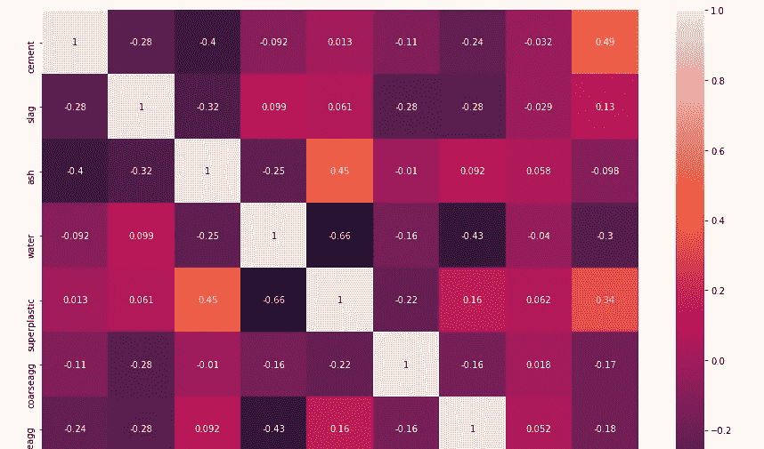

作者的照片

现在，我们将使用自定义函数来查找相关数。

```
def corr_with_target(data,tcol):
    ind_var = data.drop([tcol],axis=1).columns
    corr_result = [] for col in ind_var:
        corr_result.append(data[tcol].corr(data[col]))
    view_col = pd.DataFrame([ind_var,corr_result],index =
                    ['Variable','Correlation']).T.sort_values
                    ('Correlation',ascending=False) return view_colcorr_with_target(df,'strength')
```

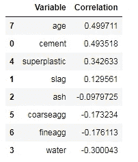

作者的照片

> ***现在，我们来做多重共线性检查。***

```
def VIF_colinearity(ind_var):
    from statsmodels.stats.outliers_influence import
                                variance_inflation_factor
    vif = pd.DataFrame()
    vif["vif_factor"] = [variance_inflation_factor(ind_var.values,
                               i) for i in range(ind_var.shape[1])]
    vif["Feature"] = ind_var.columns

    return vif.sort_values("vif_factor",ascending= False)VIF_colinearity(df.drop('strength',axis=1))
```

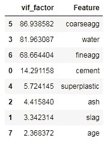

作者的照片

> ***现在，我们将应用 PCA 来减少多重共线性特征。***

```
def apply_PCA(x):

    col = []
    ncom = len(x.columns)

    from sklearn.preprocessing import StandardScaler
    x = StandardScaler().fit_transform(x)

    from sklearn.decomposition import PCA

    for i in range(1,ncom):
        pca = PCA(n_components= i)
        p_components = pca.fit_transform(x)
        exp_var_ratio = np.cumsum(pca.explained_variance_ratio_)
        if exp_var_ratio[i-1]> 0.9:
            n_components = i
            break

    print("Explained Variance Ratio after PCA is: ",exp_var_ratio)

    #creating dataframe

    for j in range(1, n_components + 1):
        col.append("pc" +str(j))
    pcom = pd.DataFrame(data = p_components,columns=col)

    return pcomtransform_df = apply_PCA(df.drop("strength",axis=1))
```

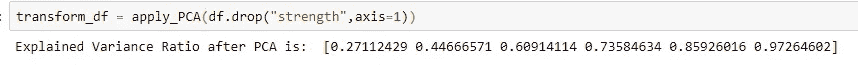

作者的照片

在应用 PCA 之后制作新的数据帧。

```
transform_df = transform_df.join(df[['strength']],how = 'left')
transform_df
```

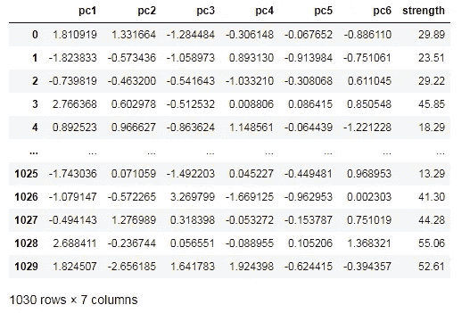

作者的照片

[](https://betterprogramming.pub/perform-xgboost-knn-modeling-with-dimension-reduction-technique-9f4ca52feeaf) [## 使用降维技术执行 XGBoost、KNN 建模

### 基于 MNIST 数据集的机器学习算法建模

better 编程. pub](https://betterprogramming.pub/perform-xgboost-knn-modeling-with-dimension-reduction-technique-9f4ca52feeaf) 

> ***现在，创建一个函数来拆分数据和构建模型。***

```
# Function for train test split
def train_and_testsplit(data,tcol,test_size = 0.3):
    x = data.drop(tcol,axis=1)
    y = data[tcol]

    return train_test_split(x,y,test_size=test_size,random_state=50)
```

用于建立模型的函数。

```
# Function for model buildingdef build_model(model_name,model,data,tcol):
    x_train,x_test,y_train,y_test = train_and_testsplit(data,tcol)
    model.fit(x_train,y_train)
    y_pred = model.predict(x_test)
    rmse = np.sqrt(mean_squared_error(y_test,y_pred))
    r2score = r2_score(y_test,y_pred)
    temp = [model_name , rmse ,  r2score]

    return temp
```

现在，为多个模型制作一个函数。

```
# building multiple modelsdef multiple_models(data,tcol):
    col_names = ["Model_Name","RMSE", "R_Square"]
    result = pd.DataFrame(columns= col_names) result.loc[len(result)] = build_model("Linear_Regression",lr,transform_df,"strength") result.loc[len(result)] = build_model("Lasso_Regression",Lasso(),transform_df,"strength") result.loc[len(result)] = build_model("Ridge_Regression",Ridge(),transform_df,"strength") result.loc[len(result)] = build_model("Decision_Tree_Regressor",DecisionTreeRegressor(),transform_df,"strength") result.loc[len(result)] = build_model("Ada_Boost_Regressor",AdaBoostRegressor(),transform_df,"strength") result.loc[len(result)] = build_model("Random_Forest_Regressor",RandomForestRegressor(),transform_df,"strength") result.loc[len(result)] = build_model("Gradient_Boosting_Regressor",GradientBoostingRegressor(),transform_df,"strength") result.loc[len(result)] = build_model("XG_Boost_Regressor",XGBRegressor(),transform_df,"strength") result.loc[len(result)] = build_model("Support_Vactor_Regressor",SVR(),transform_df,"strength") result.loc[len(result)] = build_model("K_Nearest_Neighbor_Regressor",KNeighborsRegressor(),transform_df,"strength")

    return resultmultiple_models(transform_df,"strength")
```

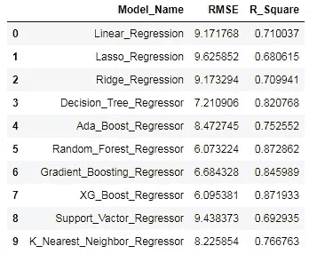

作者的照片

我希望你喜欢这篇文章。通过我的 [LinkedIn](https://www.linkedin.com/in/data-scientist-95040a1ab/) 和 [twitter](https://twitter.com/amitprius) 联系我。

# 推荐文章

[1。NLP —零到英雄与 Python](https://medium.com/towards-artificial-intelligence/nlp-zero-to-hero-with-python-2df6fcebff6e?sk=2231d868766e96b13d1e9d7db6064df1)
2。 [Python 数据结构数据类型和对象](https://medium.com/towards-artificial-intelligence/python-data-structures-data-types-and-objects-244d0a86c3cf?sk=42f4b462499f3fc3a160b21e2c94dba6)3 .[Python 中的异常处理概念](https://pub.towardsai.net/exception-handling-concepts-in-python-4d5116decac3?source=friends_link&sk=a0ed49d9fdeaa67925eac34ecb55ea30)
4。[为什么 LSTM 在深度学习方面比 RNN 更有用？](https://pub.towardsai.net/deep-learning-88e218b74a14?source=friends_link&sk=540bf9088d31859d50dbddab7524ba35)
5。[神经网络:递归神经网络的兴起](https://pub.towardsai.net/neural-networks-the-rise-of-recurrent-neural-networks-df740252da88?source=friends_link&sk=6844935e3de14e478ce00f0b22e419eb)
6。[用 Python](https://medium.com/towards-artificial-intelligence/fully-explained-linear-regression-with-python-fe2b313f32f3?source=friends_link&sk=53c91a2a51347ec2d93f8222c0e06402)
7 全面讲解了线性回归。[用 Python](https://medium.com/towards-artificial-intelligence/fully-explained-logistic-regression-with-python-f4a16413ddcd?source=friends_link&sk=528181f15a44e48ea38fdd9579241a78)
充分解释了 Logistic 回归 8。[concat()、merge()和 join()与 Python](https://pub.towardsai.net/differences-between-concat-merge-and-join-with-python-1a6541abc08d?source=friends_link&sk=3b37b694fb90db16275059ea752fc16a)
的区别 9。[与 Python 的数据角力—第一部分](https://pub.towardsai.net/data-wrangling-with-python-part-1-969e3cc81d69?source=friends_link&sk=9c3649cf20f31a5c9ead51c50c89ba0b)
10。[机器学习中的混淆矩阵](https://medium.com/analytics-vidhya/confusion-matrix-in-machine-learning-91b6e2b3f9af?source=friends_link&sk=11c6531da0bab7b504d518d02746d4cc)