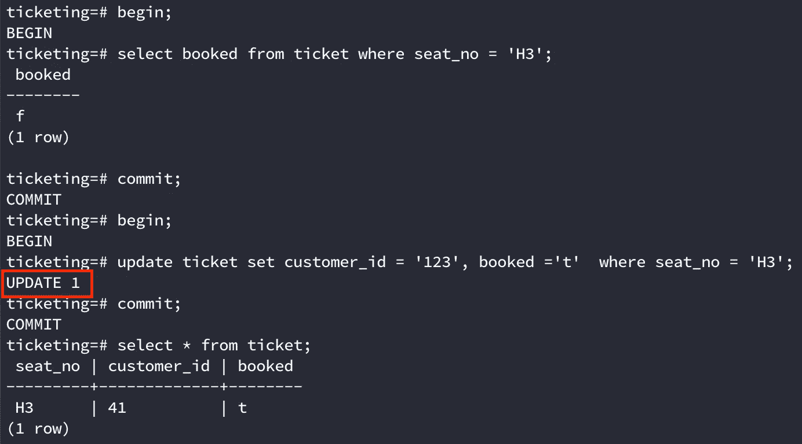

# 并发性、错误和数据库

> 原文：<https://levelup.gitconnected.com/concurrency-bugs-and-databases-e798596e083b>


鸣谢:谷歌

D 数据库有许多隔离级别，每一个都提供某种保证。例如，*快照隔离*保护我们免受幻影读取。然而，隔离级别并不能保护我们免受任何攻击。让我们讨论几个现实世界中并发可能导致错误的场景及其可能的解决方案。

> READ_COMMIT 是 postgres 中默认的隔离级别。你可以在这里阅读隔离级别

> 案例 1:假设你正在*预定我的节目*试图预定你下一部电影的门票。你和 X 先生为一场演出选择了相同的座位，然后去结账。理想情况下，你们中只有一个人可以订票。然而，有没有可能你们两个都能订到一模一样的座位？


座位安排视图

# ***所涉及的步骤***

1.  检查一下座位是否有空
2.  如果是，将它们分配给当前用户并通知用户


预订系统

> 这个模型只是为了演示手头的问题

```
## Psuedo code for booking if (seatsAvailable(List<Seats> selectedSeats)) {
    bookTickets(selectedSeats);
    sendEmailNotification(customer_id);
}// These are two individual transactions from db point of viewseatsAvailable() {
  Select booked from booking where seats = 'H3';
  return !booked;
}bookTickets() {
  update booking set customer_id = '123' and booked = 't' where
  seats = 'H3';
}
```

# 问题

如果两个并发事务试图更新预订，那么它们都会成功。这将是一个问题，因为我们最终会通知多个用户预订成功。



并发事务 1 成功更新预订


并发事务 2 成功更新预订

# ***解***

1.  将 *SELECT* 替换为*select for update—*SELECT 和 SELECT FOR UPDATE 的区别在于，SELECT FOR UPDATE 锁定作为查询响应返回的行。这意味着在持有锁的事务提交/中止之前，任何其他事务都不能对这些行进行任何更改。

```
// This is a single transaction from db point of viewbegin;
seatsAvailable() -> Select * from booking where seats = 'H3' FOR UPDATE;bookTickets() -> update booking set customer_id = '123' and booked = 't' where seats = 'H3';
commit;
```


并发事务 1 更新预订


并发事务 2 将无法更新预订

第二个事务将在应用层失败，因为当我们检查将返回 false 的条件`if booked = false`时。

> 在两个不同的事务中使用 SELECT FOR UPDATE 和 UPDATE 将产生与使用 SELECT and UPDATE 相同的结果

2.使它成为原子的--这将涉及到用一个更新语句代替 get 和 update。

```
update booking set user_id = '123' and booked = 't' where seats = 'H3' and booked = 'f';
```

> 他的方法可能不适用于每一个用例。


并发事务 1 未能更新预订


并发事务 2 成功更新预订

如果您想知道为什么这样做，这是因为当多个事务试图更新同一行时，它们会对该行进行独占锁定，只有在其中一个事务提交/中止后，下一个事务才有机会运行。

> 情况 2:考虑这样一种情况，您正试图购买价值超过您当前电子钱包余额的商品。是否有可能成功完成交易，从而使您的余额为负？

# ***所涉及的步骤***

1.  检查是否有足够的余额
2.  如果是，从用户余额中扣除金额

```
## Psuedo code for balance updatesif(currentBalance() - cartAmount > 0) {
   deductBalance(); 
}// These are two individual transactions from db point of viewcurrentBalance() -> Select balance from account where custotmer_id = '1234';deductBalance() -> update account set balance = balance-cartAmount where customer_id = '1234';
```

# 问题

如果有同时发生的交易，那么余额有可能变成负数。如你所见，你可以在 350 英镑的余额上花费 460 英镑，因为个人花费 150 英镑和 310 英镑比当时的当前余额少。


在 350 英镑的余额上花费 150 英镑


在 350 英镑的余额上花费 310 英镑

# 解决办法

1.  添加*列约束* —处理这个问题的一种方法是在 balance 列上添加一个约束，防止它变成负数。

```
alter table account add constraint greater_than_0 check (balance >= 0);abc=# \d account
                      Table "public.account"
   Column    |       Type        | Collation | Nullable | Default
-------------+-------------------+-----------+----------+---------
 customer_id | character varying |           |          |
 balance     | numeric           |           |          |
Check constraints:
    "greater_than_0" CHECK (balance >= 0::numeric) 
```

> 这个模型只是为了演示手头的问题


使用这种方法，您也可以用一条 update 语句替换 select 和 update 语句。

```
update account set balance = balance-cartAmount where customer_id = '1234';
```

现在，如果余额为负，您可以处理应用层抛出的异常。这可能不是最好的方法，因为它会将域逻辑泄露给数据库，而且您可能会遇到这样的情况，即拥有一个负余额是可以的，就像以后支付功能一样。

2.*分布式锁定* —在执行任何操作之前锁定客户 id。一旦我们获得了锁，我们就可以执行 DB 操作，并在操作完成时释放锁。这样，一次只能对该客户的钱包执行一个 DB 操作。这可能有点矫枉过正，但我们已经大大降低了问题的复杂性。现实生活中的应用程序在存钱方面有很多复杂性。

使用 Redis 获取锁

3.将 *SELECT* 替换为*SELECT FOR UPDATE*—类似于案例 1，我们可以将 SELECT 替换为 SELECT FOR UPDATE，它锁定作为查询响应返回的行。

> *SELECT FOR UPDATE* **不会**阻止 SELECT 语句，只会阻止 SELECT FOR UPDATE，UPDATE 语句。

> 案例 3:假设你的团队正在进行为期一周的生产支持。要求是至少有一个人应该始终支持。有没有可能，如果你和队友试图取消分配自我(假设另一个仍然可用)，那么就没有人支持了？

# 涉及的步骤

1.  检查支架上是否至少有 2 名成员
2.  如果是，删除当前用户

```
## Psuedo codeif(totalMembersOnSupport() > 1) {
  removeFromSupport(user_id);
}totalMembersOnSupport() -> Select count(user_id) from support where on_support = 't';removeFromSupport() -> update support set on_support = 'f' where user_id = '234';
```

这种情况与前面讨论的情况之间的一个区别是，在前面的情况中，并发事务试图更新同一行。但是在这种情况下，他们正在更新两个不同的行。
这被称为*写偏斜*

# **解决方案**

这个问题的解决方案仍然是一样的，用更新的*选择替换*选择**

> 您实际上可以通过切换到可序列化隔离级别来解决这些问题，但这也有其自身的问题。

差不多就是这样！感谢您的阅读，我希望您喜欢这篇文章。如果你真的为它鼓掌了:)

也可以在 [Medium](https://medium.com/@mohak1712) 和 [Github](https://github.com/mohak1712) 上关注我。🙂