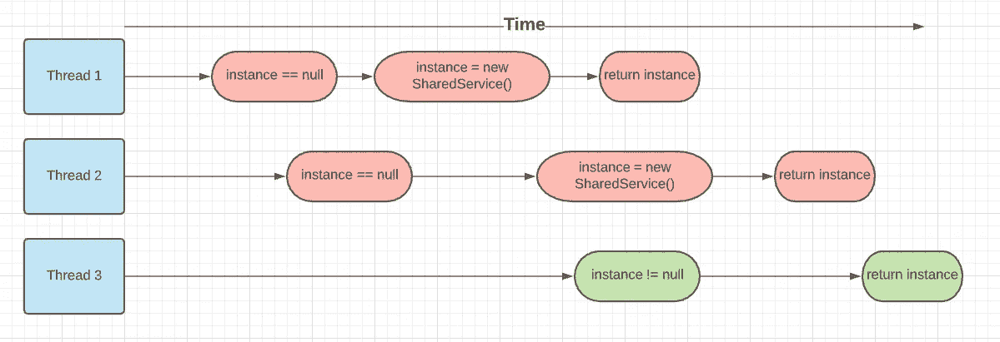
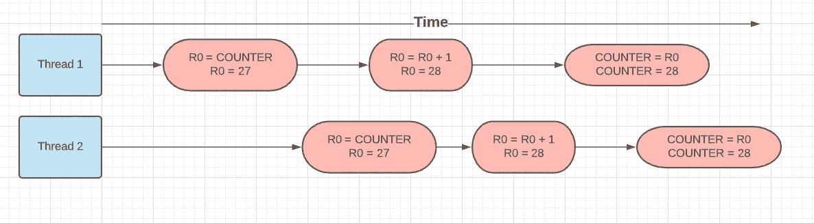

# 虚拟对象的并发控制

> 原文：<https://levelup.gitconnected.com/concurrency-control-for-dummies-49c15305827b>

> 一件可能出错的事情和一件不可能出错的事情之间的主要区别在于，当一件不可能出错的事情出错时，它通常是不可能得到和修复的。
> 
> [**——道格拉斯·亚当斯**](https://www.brainyquote.com/authors/douglas-adams-quotes)

还记得和你经理的那次谈话吗？当他要求你提高服务质量时，你回答说“嘿！我们可以在其中添加并行性”？

所以，你开始朝它努力，你将性能提高了 5 倍，测试用例通过了，你发布了你的变更。您觉得自己已经掌握了提高系统性能的艺术。几天后，你所谓的改进服务产生了一个错误的输出，你只是忽略了它，说这是一个暂时的问题，不会再发生了。但它确实会一次又一次周期性地发生，现在你只是在代码中上下徘徊寻找 bug，抓耳挠腮。你想知道这一切是从哪里开始的。

> **“我们可以加上排比。”**

不管这一行看起来多么无关痛痒，都不要掉入陷阱。作为开发人员，我们的首要责任是让代码按预期工作。我们不能不惜任何代价来换取工作的正确性，即使是以业绩为代价。那么，我们是否应该永远不使用并行。如果操作正确，系统中的并行性可以创造奇迹，将资源利用率提高到极致，并明显带来更好的性能。但请记住，只有做得正确。在这篇文章中，我的目标是提供一些启发，可以帮助您理解与并发性相关的常见问题以及它为什么如此重要。

这篇文章主要是关于 Java 中的并发控制。但是，如果您想从总体上了解并发性，这是一本很好的读物。如果你想知道为什么 JavaScript 是单线程语言，为什么你只能在 Android 的主线程中更新 UI 组件，我们将会深入探讨。

# 常见陷阱

并发控制是一个宽泛的概念，不可能在一篇文章中涵盖。我将尝试列出一些最常见的模式，如果不小心的话，它们会导致系统中的主要并发错误。这将帮助你培养一种意识，在任何代码库中找出问题。

*   **比较和设置**

你会发现在你的代码中有很多例子，你只是简单地比较一些变量，如果某些条件成立，就改变相同的或其他的变量值。就像如果购物车没有满，然后添加一个项目，如果用户名是唯一的，然后分配用户名，如果座位没有预订，然后分配给请求用户。让我们看一个创建单例类的简单例子，这是在整个系统中创建共享服务的一个非常常见的设计模式。

```
public class SharedService {

    private SharedService instance; public SharedService createInstance() { if (instance == null) {
            instance = new SharedService();
        }
        return instance;
    }
}
```

比较:如果实例为空，则不创建 SharedService 实例

Set: Instance 为新创建的 SharedService

如果你的系统是单线程的，上面的代码会很好的工作，但事实可能不是这样，所以会发生很多错误。



**不幸的时间线**

线程 1 和线程 2 的操作交错进行，由于“不走运的时间安排”,它们都为 SharedService 创建了不同的实例，这违反了我们的单例模式。Singleton 示例可能看起来很无聊，但是用一个用户的购物车列表(一个用户有两个购物车列表)替换 SharedService，一个用户名分配给两个用户。上面的操作时间线只是交错线程操作的简化版本，如果我们考虑寄存器级别或机器代码级别的操作，它将更加复杂和危险。

*   **读-修改-写**

另一种常见的模式是读取-修改-写入循环，您从传感器读取数据，转换它以生成危险级别值，并存储它(因此一些安全系统可以读取它并采取行动)或简单的计数器。

```
public class SimpleCounter { private int counter = 0; public void incrementCounter() {
        counter++;
    }
}
```

如果你争论的话，count++不可能在这里产生“不幸的时机”问题，对吗？

++操作不是原子操作，它的机器级代码如下所示:

```
LD R0, COUNTER             // R0 = COUNTER  -> Read
ADD R0, R0, 1              // R0 = R0 + 1   -> Modify
ST COUNTER, R0             // COUNTER = R0  -> Write
```



不幸的时机

假设 COUNTER 的初始值为 27(当时)，两个线程 1 和 2 进行增量运算。从程序员的意图来看，两次运算后的最终结果应该是 29，但由于一些“不走运的时机”，最终结果是 28。

当对象被多线程并行读/写时，有许多这样的模式是系统中并发错误的根本原因。这种访问/修改模式中真正问题可以列举如下:

1.  对象的状态发布
2.  状态不变量
3.  非原子操作

## 国家出版物

对象的状态由其变量或其变量的状态来定义。举个例子，

```
public ShoppingCart{ Long totalItems;
   Long totalCartPrice;
   List<Item> cartItemList;}
```

在这里，我们可以说 ShoppingCart 状态是由 totalItems、totalCartPrice 的值以及 cartitem list(cartitem list 的状态)中的每一项定义的。

状态发布只是允许其他对象访问/修改对象的状态。像在 SimpleCounter 示例中一样，允许多个线程改变 SimpleCounter(即计数器)的状态。

## **状态不变量**

随着程序的进行，对象的状态会发生变化，更多的商品会被添加到购物车列表中。但是它们是物体禁止的状态。例如，计数器不可能是负的。下面是状态不变量的几个例子:

1.  totalItems 必须等于 cartItemList 中的项目数
2.  每个用户的用户名必须是唯一的
3.  计数器值不能为负
4.  交易后，发送方和接收方账户余额之和应相同

作为开发人员，我们必须确保如果对象的状态发生转变，它必须保持这些不变量。大多数并发错误都源于违反这种状态不变量，两个线程同时试图在 cartItemList 中添加项目，并且由于不幸的计时 totalItems 不等于 cartItemList 中的实际项目数。

## 非原子操作

我们的 incrementCounter 函数之所以不起作用，是因为 count++操作不是原子的。对于一个原子操作，只有转换前或转换后的状态对外界存在，中间没有挂起状态。这意味着在 SimpleCounter 中，线程 2 不应该在线程 1 执行操作时读取值 27。

# 如何控制并发

## 封装，封装，封装

知道对象状态被完美地封装，限制对象状态可以被改变的范围(理想的是从类的公共函数开始)。但是对象封装并不是将变量声明为私有的，而是提供公共的 Getter-Setter。这不是封装的含义，例如:

```
public List<Item> getShoppingCartList(){

     return this.cartItemList;}
```

初看起来，getShoppingCartList 函数似乎完美地封装了 cartItemList 变量，但客户端在获得对 List 的引用后，可能会尝试更改它或添加更多的项，或者 List 中的 Item 对象本身是可变的。

不完美，更好的选择是返回列表的克隆

```
public List<ImmutableItem> getShoppingCartList(){

      List<ImmutableItem> cartListClone = new ArrayList();
      for( Item i : this.cartItemList ){
            cartListClone.add( createImmutableItem( i ) );
      }
      return cartListClone;
}
```

## 不可变对象

不可变对象是那些状态不能改变的对象。示例:

```
public class Point{ private int x, y;
     public point( int x, int y ){
         this.x = x;
         this.y = y;
     }
     public getX(){ return this.x; }
     public getY(){ return this.y; }
}
```

点是不可变的，因为在创建点对象之后，我们不能改变它的状态，如果对象的状态没有改变，那么它怎么会导致并发错误。

## 线程限制

当多个线程试图修改一个对象的状态时，许多并发错误就会出现。但是如果我们只允许一个线程改变对象的状态呢？这并不意味着创建一个单线程系统，而是只允许单线程改变对象的状态，而其他操作仍然可以并行工作。您会在许多地方发现线程限制的概念，

1.  演员模型
2.  用于与 UI 组件交互的 Android 主线程
3.  Java Swing
4.  JavaScript 单线程执行

## 锁

像 Java 这样的语言为构建健壮的并发程序提供了对象锁定机制。这些锁可以充当看门人的角色，只允许一个线程进入一个代码块，并帮助创建原子操作。为了使 incrementCounter 操作原子化，我们可以使用锁定，例如:

```
public class SimpleCounter { private int counter = 0; synchronized public void incrementCounter() {
        counter++;
    }
}
```

仅仅通过添加一个关键字 synchronized，我们就使我们的函数原子化了。

关于并发性，肯定还有很多内容需要介绍，但我想这是一个很好的起点。

谢了。