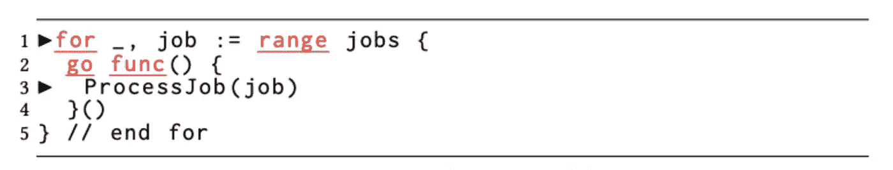
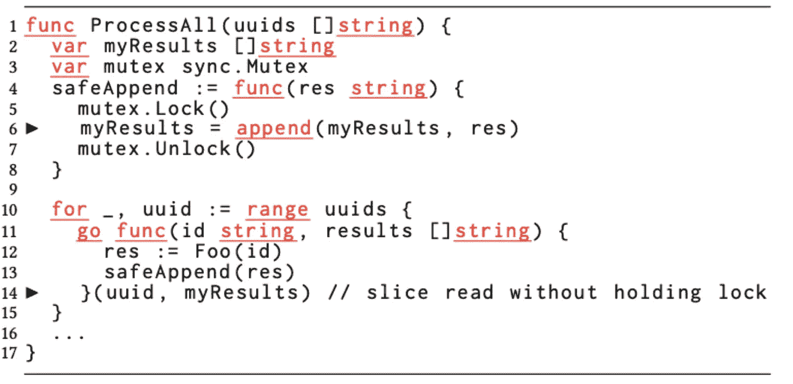
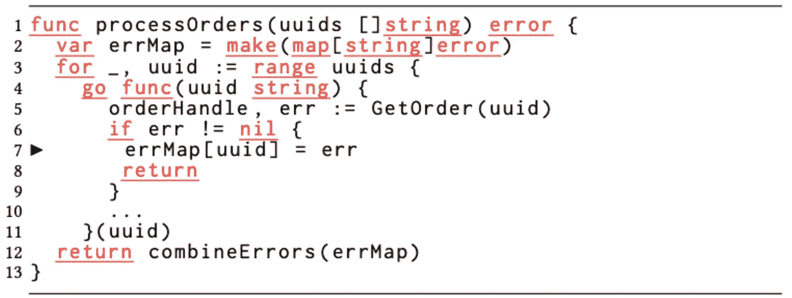
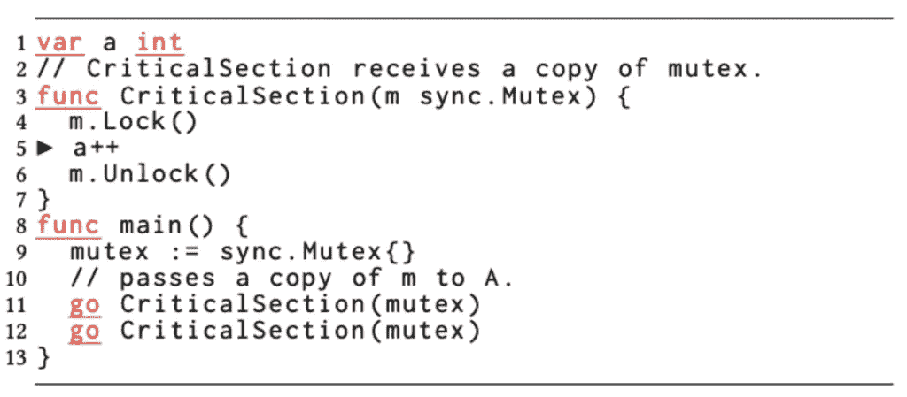
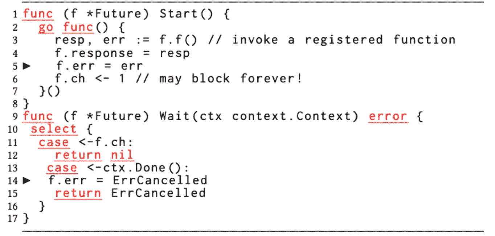
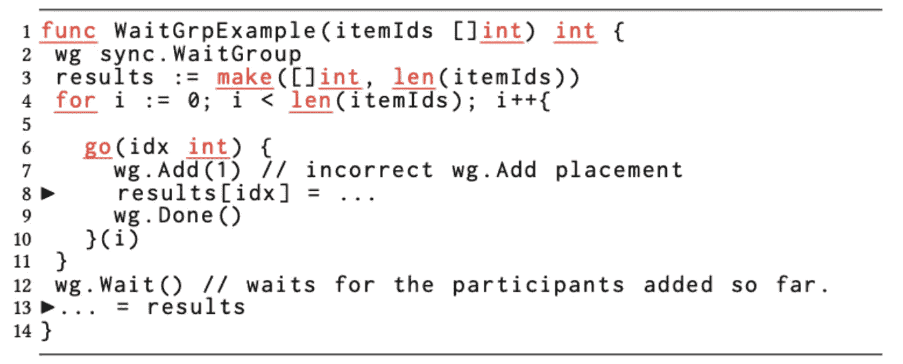

# 围棋中的并发并不神奇

> 原文：<https://levelup.gitconnected.com/concurrency-in-go-is-not-magic-37bb16af4b1a>


照片由 [Unsplash](https://unsplash.com?utm_source=medium&utm_medium=referral) 上的 [Aziz Acharki](https://unsplash.com/@acharki95?utm_source=medium&utm_medium=referral) 拍摄

我最近读了优步的帖子[Go](https://eng.uber.com/data-race-patterns-in-go/)中的数据竞争模式，关于他们代码库中数据竞争的运行时分析。追踪这些通常很微妙的错误是一项了不起的工作，我相信优步庞大的代码库正受益于他们的辛勤工作。然而，这篇文章的语气暗示这些问题是 Go 的错，应该由语言本身来阻止。

我从 2011 年开始在 Go 中进行专业编程，在那段时间里，我从未见过 Go 团队声称并发本身很容易。这可能很容易混淆，因为有很多关于在 Go 中实现一种或另一种并发模式比其他语言更容易的演示。“并发模式”和并发性的区别在于前者已经被证实是正确的并且没有错误。验证新的并发模式总是很困难。Go 所做的唯一声明是，如果你知道如何正确地实现并发模式，它通常会很简洁并且容易实现。来自其他语言的并发结构，如 Futures、Promises 或 async/await，都需要正确使用以避免竞争。没有一个是魔法，他们都有自己的脚枪。它仍然需要技能和专业知识来理解和避免竞争和死锁。

关于这篇文章，困扰我的一件事是这些例子是过于复杂的 Go 代码。很难说文章中的例子是否是真正的代码(至少有一个在我看来有语法错误)，但它们确实给我留下了简化的真正代码的印象。在任何情况下，代码的风格和组织都会在我们的一次代码审查中受到很大的打击。我并不是说这样的事情不会偶尔发生，但是我检查了我们的库并发用法，我没有发现任何一个并发代码的例子像这些例子一样复杂。如果我不得不打赌，这些例子在优步也是异常值，但是给定 5000 万行代码，异常值将比我们的更极端。我想深入研究每个例子，因为我得出了与作者完全不同的结论。

# 1.Go 的设计选择是在 goroutines 中通过引用透明地捕获自由变量，这是导致数据竞争的一个原因

我同意作者的观点，Go 中的闭包是一把大脚枪，因为它们是如何捕获范围的。我经常看到来自 javascript，有时是 Java 的人过度使用/滥用闭包。我几乎从不在 Go 中使用闭包，除非我需要有意地捕获作用域。我在我们的代码库中看到过类似于第一个例子的代码:



极其不必要的“end for”注释意味着这段代码已经被简化了。但是假设只是示例中的代码，解决这个问题很简单；移除多余且完全不必要的封口:

```
for _, job := range jobs {
    go Process(job)
}
```

如果我们假设这个例子是简化的，闭包要大得多，那么它应该被提取到一个命名函数中。命名函数更加清晰和易于维护，也使得代码更容易阅读。现在的风格似乎是在函数中定义了许多花哨的闭包。不要胡思乱想。

第一种模式中的例 2 和例 3 似乎也完全过度使用/滥用了闭包，同样的规则也适用于使用命名函数。

# 2.切片是令人困惑的类型，会产生微妙且难以诊断的数据竞争



模式 2 非常复杂，我无法想象开发人员在这里想做什么。导致竞争的读取/复制是为了创建一个从未使用过的变量。同样，也许这个例子删除了用法，但是如果不知道变量是如何使用的，就不可能知道如何解决这个问题。我可以理解作者的观点，他们认为拷贝是安全的，因为他们假设切片是指针而不是结构。但是如果这个令人费解的例子是他们能找到的最好的例子，我不能想象这种情况会经常发生。由于这是迄今为止最大的模式，我想知道他们是否都遵循了值/引用混淆或者更简单的东西，比如完全忘记同步。

# 3.对 Go 内置的线程不安全映射的并发访问会导致频繁的数据竞争



模式 3 似乎暗示，与其他语言相比，拥有一个非线程安全的 map 实现是一个错误。用简洁的括号语法代替冗长的 get/set 语法会让开发人员对线程安全感到困惑。我根本不买这个。早期，Java 从内部同步的 Vector 到 ArrayList 做了巨大的转换，这样单线程代码就不需要获取锁。创建一个结构来包装 map 和 sync 是非常容易的。RWMutex 允许并发映射。或者只使用较新的同步。地图是否符合您的使用情形。我不认为这是因为 Go 的内置地图或方便的语法而变得更难。

# 4.Go 开发人员经常在按值传递(或方法超过值)方面出错，这可能导致不小的数据竞争



模式 4 是一个棘手的问题，我经常看到没有经验的 Go 程序员犯这个错误。与其他总是显式复制结构的语言相比，在 Go 中通过将副本传递给函数来进行复制几乎太容易了。但是同步。Mutex 的方法是在指针类型上，这总是一个应该使用指针的提示。在[同步中也有一个明确的警告。互斥文件](https://pkg.go.dev/sync#Mutex):

> 互斥体在第一次使用后不得复制。

文档中只有三个句子是关于这个结构的，这是其中之一。这似乎是实现者应该小心的事情。同样，的解决方案也是一样的，将互斥体和受保护的内存包装在一个结构中。

# 5.消息传递(通道)和共享内存的混合使用使得代码变得复杂，容易出现数据竞争



模式 5 展示了将 Java 并发模式融入 go 的过程。我在尝试用 Go 编写他们最喜欢的并发模式的新 Go 使用者身上看到了这种情况。这几乎总是不必要的，我会花额外的时间指导，以显示一个更好的方法，以更干净的方式在围棋中完成同样的效果。但是忽略这一点，只看代码，我不确定作者是如何将非同步变量访问归咎于通道的。如果要我猜的话，作者后来意识到他需要处理 ctx。完成，并将其添加到等待中，而不在 err 上添加同步。因为 err 是私有的，所以看起来 err 需要访问器，这个例子中没有显示，也是不同步的。作者想以某种方式指责这里的渠道使用，但我不明白一个导致另一个。chan 信号可能永远阻塞的评论是一个完全独立的错误，很容易用缓冲通道修复，但这又指向一个可能没有经验的 Go 程序员。

# 6.Go 在其组同步构造 sync 中提供了更多的余地。WaitGroup，但是 Add/Done 方法的不正确放置会导致数据竞争



我 100%同意作者关于模式 6 的观点。我看过 sync。WaitGroup 误用的方式几乎与示例完全相同。 [godocs](https://pkg.go.dev/sync#WaitGroup.Add) 对此提出了警告，这个例子清楚地显示了在生成 goroutine 之前使用 Add，但是仍然很容易出错。使用 Add 来设置循环外的总大小是我使用 WaitGroup 的首选方式，但我确实认为在某些情况下使用增量是有用的，在循环之前可能不知道最终的并发性。延迟执行的顺序也可能导致微妙的错误(不仅仅是竞争)。这两者都是代码审查中需要注意的事情。

# 7.为 Go 的表驱动测试套件习语并行运行测试经常会导致数据竞争，无论是在产品中还是在测试代码中

我不知道该怎么说模式 7。看起来让你的测试并行运行，而没有真正确保你的测试是并行运行的是一个坏主意。我就把这叫做“糟糕”或者“不要那样做”的情况。

# 结论

虽然我不同意这篇文章的结论，但从这些例子中仍然可以学到很多东西。认识到产生 bug 的概率更高的常见模式是一个非常有价值的过程，作者们确实做了一项了不起的工作。但我是一个木工，有句谚语说“一个可怜的工匠责怪他的工具。”这并不是说对于完成一项任务来说，某些工具并不比其他工具更好，而是取决于实现者是否明智地选择。在整篇文章中，作者指出了应该受到指责的某些结构或语言选择。至少从例子中，我认为开发人员经常使用错误的工具。这是不可能知道的，但也可能有一些缺乏经验的开发人员试图在其技能集的边缘构建代码。

我认为，如果说 Go 在这里应该受到指责，那是因为 Go 鼓励更多地使用并发性。第一次编写并发代码的开发人员需要指导，即使是有经验的开发人员也需要良好的代码审查，因为并发错误很容易犯。这不是特定要去的地方；我分解并发代码以避免数据竞争的心理模型和方法与我在 Java 或 c 中所做的是一样的。虽然 Go 使并发代码的编写非常简洁易读，但基本原理仍然适用。当我向新开发人员讲授 Go 时，我最后谈到了并发性，并说“你不会经常需要它”，这有时会降低一些开发人员的期望，因为他们经常很兴奋地开始在 Go 中编写并发代码。

我确实认为 Go 社区应该少强调 Go 的并发方面，因为像在任何其他语言中一样，它是一个高级主题，应该只由有经验的开发人员解决(或者在他们的指导下)。大多数代码只需要传递并发的知识，并遵循一些基本原则，如在并发上下文中零共享或只读共享。也有可能并发性比其他语言更容易和更可靠，但我们最终会有更多的错误，因为与其他语言相比，更多的程序员尝试使用并发性，而其他语言的准入门槛更高。我不认为 Go 会增加并发代码的编写难度，所以只有专家才会尝试使用它。

我很想知道在我的日常围棋工作中，我多久会看到这些模式。如果我们把他们发现的所有错误加起来，我们得到 878 个分类比赛，开始时他们说程序员修复了大约 1100 个比赛；这是个很大的数字。但是我不确定如何看待这个问题，因为考虑到 5000 万行代码，这个数字似乎并不大。我们的代码库目前有大约 190，000 行，如果我推断，我应该会发现其中的 4 个错误。幸运的是，在我们的秤中，我可以手动检查它们。我在我们的代码库中只找到了 19 个“go”关键字的用法，没有一个符合这里的模式。可能有我看不到的种族，但不遵循这些模式。

总的来说，如果不进行一些规范化，还不清楚这些错误是常见还是罕见。文章称“与 Java 微服务相比，Go 微服务暴露了大约 8 倍的并发性”，但没有说明它如何测量并发性暴露。也没有对每个机会的错误进行分析来说 Go 比其他语言更差/更好。

为围棋辩护的是，它非常强调简单。本文中的模式和示例绝非如此。大多数闭包应该是一行程序，与其他构造(如命名函数或结构)相比，应该尽量少用，因为它们是带有正确执行同步的方法的容器。很难说这些例子是真是假，但是如果代码本身不那么花哨，大多数错误是可以避免的，或者至少是更明显的。Go 强烈鼓励简单性(我在我的团队中也是如此)，这就是为什么我怀疑这些错误是新手开发人员犯的。认识到 Go 中没有让并发变得简单的魔法，并努力编写尽可能简单的代码是避免类似错误的方法。

关于我:我是 Tonal 的软件架构总监，在那里我们有一个 100% Go 后端。我从 1999 年开始成为一名专业软件开发人员，从 2011 年开始使用 Go。

# 分级编码

感谢您成为我们社区的一员！更多内容见[级编码出版物](https://levelup.gitconnected.com/)。
跟随:[推特](https://twitter.com/gitconnected)，[领英](https://www.linkedin.com/company/gitconnected)，[通迅](https://newsletter.levelup.dev/)
**升一级正在改造理工大招聘➡️** [**加入我们的人才集体**](https://jobs.levelup.dev/talent/welcome?referral=true)