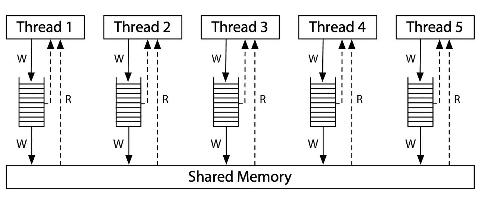

# Go 中的并发性:共享内存

> 原文：<https://levelup.gitconnected.com/concurrency-in-go-shared-memory-a2ef201b396b>

为了更好地理解 Go 的内存模型在并发程序上的表现，我一直在研究一些例子。我将尝试解释我在多核 CPU 上操作排序方面所学到的知识。

我要展示的例子是 Russ Cox 在他的[硬件模型文章](https://research.swtch.com/hwmm)中写的*消息传递*例子的扩展。读完之后，我想尝试一下这种行为，亲自看看。这就是结果。

# 艾丽丝和鲍勃在办公室

爱丽丝和鲍勃共用一间办公室。他们的轮班有时会重叠，但他们通常在不同的时间开始和结束。他们进去，做他们的工作，然后离开。然而他们有一个规则:最后一个离开的人必须关灯。问题是爱丽丝可能来得很早，甚至在鲍勃到达之前就离开了，所以当鲍勃离开时，他不知道爱丽丝是已经离开了还是还没有到达。他们想出了一个让彼此知道他们的工作已经完成的系统:当他们离开办公室时，他们在办公室的另一边放上一面旗子。这样，他们中的任何一个在离开之前，如果看到对面的旗子升起，就可以关灯并放下旗子。

**让我们用代码建模:**

> *为了叙述方便，我们暂且忽略* `*sync.WaitGroup*` *。这个练习的重点是强调 Go 同步模型的缺陷，这样我们可以更好地理解并发安全代码是如何(以及为什么)构建的。*

代码很简单。假设一个`Office`亮着灯开始它的一天，在所有工人跑完`Work`之后，`Office.lights`应该是关着的。

逻辑上，只能有三种情况:

1.  **爱丽丝关灯:**鲍勃的 goroutine 第一个完成

2.鲍勃关灯:爱丽丝的 goroutine 第一个完成

3.他们都关掉了灯:他们同时升起了他们的旗帜

假设 goroutines 被公平地调度，那么从外部的角度来看，有一组交错的操作可以被看作是连续的。每一个事件都发生在一个*总的全局秩序*中。这使得第三种情况成为可能。在一个顺序一致的环境中，不可能有第四种情况**没有人**关灯。

为了让 Bob 关灯，我们假设 Bob 是到达`if`语句的最后一个 goroutine。我们肯定地知道`f.flag[Bob]`是真的，因为它刚刚被设置在这个 goroutine 中。为了让鲍勃**而不是**关灯，`f.flag[Alice]`必须为假，这意味着爱丽丝一定没有完成她的工作，所以鲍勃不是办公室里的最后一个人:这是一个矛盾。

让我们通过一个测试来看看这一点:

当单独运行时，测试很可能会通过。但是我们的代码中有一个错误。显而易见，我们应该使用并发结构，如通道、互斥、原子操作或等待组来正确指示他们的工作日已经结束，灯应该关闭。然而，一开始我并不清楚为什么这段代码是错误的，如果这样保存会出现什么问题。

为了突出问题，请观察如果我运行这个测试一百万次会发生什么:

```
$ go test -count=1000000 .
--- FAIL: Test_WorkingDays (0.00s)
    mem_test.go:49: lights shouldn\'t be on after both finished their work
--- FAIL: Test_WorkingDays (0.00s)
    mem_test.go:49: lights shouldn\'t be on after both finished their work
... (x15)
FAIL
FAIL	github.com/fredrb/concurrency/memory	10.114s
FAIL
```

这项测试失败了 17 次，但通过了 999983 次。怎么可能呢？

> *免责声明:可能有些部分我不能完全理解，但我会尽我所能解释清楚。*

主要原因归结为多核 CPU 在与主内存同步之前缓存数据。在不同的体系结构中，行为(以及为什么会发生这种情况的原因)可能会有所不同。在 x86 中，每个访问共享内存的线程都有一个缓冲区写队列。每当线程必须从共享内存中读取数据时，首先从队列中读取值。这意味着一个线程比其他线程先看到自己的写操作。



[Russ Cox:硬件内存模型帖子](https://research.swtch.com/hwmm)

如果两个 goroutines 被调度到不同的 CPU 内核，下面的内存模型是有效的，尽管可能性不大:

*   **线程 1:** `flag: [ true, false ]` = >不要关灯
*   **线程 2:** `flag: [ false, true ]` = >不要关灯

如果出现以下情况，可能会导致此症状:

1.  写操作没有被传播，它位于相反线程的写缓冲区中
2.  写操作被应用到主存储器，但是 a 线程从其高速缓存中读取数据

现代 CPU 架构**不**提供连续一致的环境。使得这个例子的第四种情况成为可能:**没有人**关灯。

证明 CPU 是罪魁祸首的一个有趣方法是只用一个 CPU 运行相同数量的测试:

```
$ go test -cpu 1 -count=1000000 . 
ok github.com/fredrb/concurrency/memory	6.824s
```

如果只有一个 CPU 的话，你可以提高这个数字，测试总是会通过的。这是因为所有的 goroutines 都被调度到同一个 OS 线程。

## 修复程序

我们希望我们的程序在多个内核上运行，所以我们需要解决这个问题。幸运的是，修复相当简单。在并发编程中有一个概念叫做*内存屏障*或*内存栅栏*，Go 的并发 API 在幕后使用它来同步 CPU 的缓存和主内存。Go 对并发操作有着惊人的一流支持。有许多方法可以解决这个问题，但最直接的方法是使用锁。

**编辑:**正如向我指出的，我下面提出的原始解决方案仍然存在问题。尽管测试会通过，但是在一个 goroutine 中设置共享变量会产生一个竞争条件——即使没有其他 goroutine 是活动的。另外，由于没有同步机制，在`if`块中更新的数据有可能不会被其他 goroutines 看到。这是包含竞争条件的原始解决方案:

我试着变聪明。别耍小聪明。

这里有一个使用互斥的更好的解决方案:

单独运行可能会更慢，因为内存障碍是在存储和加载操作之前添加的，但这在我们的示例中可以忽略不计。

# 进一步阅读

如果您对此感兴趣，并想了解更多关于该主题的内容，我已经使用了以下资源来了解我的程序的行为:

*   拉斯考克斯记忆模型系列:[https://research.swtch.com/mm](https://research.swtch.com/mm)
*   围棋记忆模型词条:[https://go.dev/ref/mem](https://go.dev/ref/mem)
*   多进程编程的艺术(书):第 7 章。*尽管这一章是专门关于锁的，但它提供了一些与我上面展示的 office 例子非常接近的例子。*

*原载于 2022 年 10 月 15 日 https://blog.fredrb.com*[](https://blog.fredrb.com/2022/10/15/go-concurrency-shared-memory/)**。**