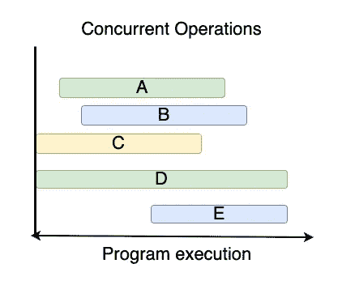
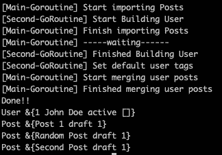
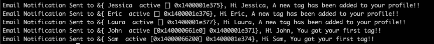
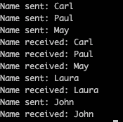

# Golang、Goroutines 和 Channels 中的并发性解释

> 原文：<https://levelup.gitconnected.com/concurrency-in-golang-goroutines-and-channels-explained-55ddb5e1881>

## Go 中的主并发


Go 是一种强大的语言，因为它有效地处理了几件事情，其中一件使它迷人和强大的事情是它如何处理并发。

在本文中，我将全面解释并发的核心概念，以及 Golang 完成并发程序所遵循的方法。

## **让我们从定义什么是并发开始:**

如果一个程序可以同时处理多个任务，那么它就被认为是并发的。并发性的概念包括程序同时运行几个操作的能力，即使这并不一定意味着这些操作同时明确运行，每个任务可以在不同的时间点开始。让我们看一张图来更好地理解并发操作是什么样子的。



这些操作可能不会同时开始，但它们会同时运行。这意味着一个任务不必等到另一个任务完成后才运行。

另一方面，如果你的程序同时运行多个操作，这意味着它们在相同的时间点开始，这将被认为是并行。当使用并发时，你的程序也可以实现并行，这取决于用例。

## Golang 并发模型

Golang 使用 **goroutines 来处理并发。** A goroutine 由 Go 运行时管理，与线程非常相似，但有几个优点。Goroutines 允许您同时运行多个操作。在多线程环境中，为了同时运行各种操作，操作系统必须创建新的线程，这涉及到大量的资源、内存和时间，因此使用线程同时运行多个操作对于操作系统来说成本更高。另一方面，goroutine 是轻量级的、高效的，并且创建它不需要太多的资源，在 Go 中创建数百个 Go routine 不成问题。

## 与 goroutines 共享资源

当运行多个 go routine 来完成不同的任务时，您通常会发现 go routine 需要访问和修改共享资源，如果多个 go routine 同时访问和修改相同的数据，这将导致几个问题、意想不到的结果和所谓的竞争条件。

让我们在并发程序的上下文中定义什么是竞争条件。

当同时运行的多个操作试图同时读取/写入相同的数据时，就会发生争用情况。

为了避免这种情况，golang 使用了锁，这样一次只有一个 goroutine 可以修改特定的数据。这是一个非常重要的话题
,因为实现并发性的一个关键因素是确保你的程序不会以意想不到的结果告终。

现在，让我们编写第一个并发程序，看看如何使用 go 关键字创建一个 goroutine:

在这个例子中，我们有一个 main 函数，它只在第 6 行打印一条消息，当程序运行时，它会创建一个所谓的主 goroutine，这个 goroutine 是在运行程序时自动创建的，它是执行所有代码的地方，但是如果您想在一个单独的 goroutine 中运行另一个操作，我们可以在我们想要并发运行的函数之前使用 **go** 关键字，这将有效地创建一个新的 goroutine 并运行那个函数。

在第 8 行，我们告诉程序为 **countNumbers** 函数创建一个新的 goroutine。然后回到主要的 goroutine，在第 10 行有另一个 print 语句。

那么，为什么我们看不到 **countNumbers** 函数中的打印语句呢？。这是因为主程序不会等待其他程序完成它们的工作，主程序会继续执行主程序，它会终止而不会等待其他程序完成。

为了让 **countNumbers** 函数结束，我们可以在第 9 行的主 go 例程中休眠 1 秒钟。

```
time.Sleep(1 * time.Second)
```

如果您再次运行该程序，您将看到现在的打印语句，这种解决方案在任何并发程序中都不理想，因此我们将在后面看到如何使用通道来实现这一点。

## **什么是渠道？**

通道是不同 goroutines 之间的一种通信方式。这是将一种数据类型的值发送到另一个 goroutine 的安全方式。通道是通过引用传递的，这意味着当创建一个通道并将其传递给其他函数时，这些函数将具有指向同一通道的相同引用。如果你理解指针是如何工作的，这对于理解通道来说可能很简单。

只有当通道具有相同的类型时，我们才能比较它们，正如我前面提到的，因为它们是通过引用传递的，如果两个通道都指向内存中的同一个引用，那么两个通道之间的比较将为 true。我们也可以将一个通道与 nil 进行比较。

通道的目的是允许 go routine 发送和接收信息，但通常它们也用于通知其他 go routine
某个进程已经完成，并且不一定通过通道发送任何信息。

一个通道也可以被关闭，这意味着它将不再接受任何发送或接收的消息，如果一个 goroutine 试图从一个关闭的通道发送或接收消息，程序将会崩溃，除非我们使用一个特殊的语法从通道中读取，或者我们使用一个范围循环。我们马上会看到这是如何工作的。

## **频道类型**

**无缓冲通道:**这种类型的通道只允许发送一条数据，并阻塞当前的 goroutine，直到另一条在通道上执行接收操作。如果在发送操作之前执行通道上的接收操作，也会发生同样的情况，执行接收操作的 goroutine 将被阻塞，直到另一个 goroutine 通过相同的通道发送消息。

为了演示使用无缓冲通道时的阻塞概念，我们来看下面的例子:

运行前面的示例将输出以下内容:



我们来了解一下输出。当程序启动时，会创建一个空的用户对象，并在第 36 行和第 37 行分别创建一个 boolean 类型的通道(无缓冲通道)，然后在第 39 行创建一个 goroutine，这意味着该函数中的这段代码将在一个单独的 goroutine 中运行。

主 goroutine 继续执行，在第 49 行我们有一个 print 语句，然后在第二个 goroutine 中，由于它此时正在并发运行，它到达第 40 行，也执行一个 print 语句。

主 goroutine 继续调用方法**import posts**并执行另外两个 print 语句，最后一个是`[Main-Goroutine] — — -waiting------`，这是我们之前讨论过的阻塞概念发挥作用的地方，在第 53 行我们看到主 goroutine 正在从`done`通道读取，这基本上意味着主 goroutine 不会继续执行，直到第二个 goroutine 向该通道发送消息。

在第二个 goroutine 中，调用 **buildUser** 函数并打印`[Second-GoRoutine] Finished Building User`，然后在下一行中，它向通道发送一条消息。此时，主 goroutine 将检测到这一点，并将继续执行，第二个 goroutine 也是如此。

方法 **mergeUserPosts** 和 **setDefaultTags** 分别在 main 和 second goroutine 中被调用，我们得到它们对应的日志。

当我们到达第 57 到 60 行时，用户和它的文章被打印出来，但是如果你检查用户结构中的标签数组是空的。原因是在第二个 goroutine 向主 goroutine 发送消息之后，两个 goroutine 继续并发执行，正如我前面提到的，主 goroutine 不会等到其他 goroutine 完成执行，也就是说，在主 go routine 完成之前，第二个 go routine 没有完成将用户标记附加到结构中的工作，这就是数组为空的原因。如果我们删除第 91 行，我们将能够看到标签数组现在已被填充。

通过这个例子，我们了解了如何使用内置的 make 函数创建一个无缓冲通道。

```
done := make(chan int)
```

以及如何从信道发送和接收数据

```
done <- true // send
<-done // receive ignorting value
resp := <-done // receive storing value in a variable
```

此外，我们还看到了如果没有其他 goroutine 通过通道发送/接收消息，goroutine 是如何阻塞执行的。

通过将一个 goroutine 的结果用作另一个 go routine 的参数，通道也被用作连接多个 go routine 的一种方式。

让我们看看下一个例子，这次使用多个 goroutines。

此示例的输出如下所示:



在这个例子中，我们有两个通道 **usersToUpdate** 和 **userToNotify** ，注意第一个通道是如何接受用户数组的，而第二个通道只接受一个用户对象。然后有两个用户数组，一个用于现有用户，一个用于新用户。

在第一个 goroutine 中，我们发送了**userstouupdate**通道和 **newUsers** 的片，所以当程序运行到第 40 行时，一个新的 goroutine 被创建。

注意 **filterNewUsersByStatus** 函数中 **usersToUpdate** 参数的语法。

```
usersToUpdate chan<- []*User
```

默认情况下，通道是**双向的**，这意味着您可以通过它们发送和接收信息，但是当将通道传递给函数时，您可以改变这种行为，并告诉通道在函数的上下文中它只服务于一个目的，要么接收信息，要么发送信息。

所以在这种情况下，我们告诉通道 **usersToUpdate** 在这个函数的上下文中，这个通道将只接受发送信息而不接收它。

该功能 **filterNewUsersByStatus** 在**新用户**的范围内，仅选择那些活动的并且启用了通知设置的用户。此后，在第 54 行中，通过信道发送经**过滤的用户**。

此时，该通道将不再用于发送数据，因此关闭该通道非常重要。在这种情况下，我们使用 **defer** 函数调用内置的 **close** 函数，关闭**userstouupdate**通道。

在第二个 goroutine 中，我们发送**用户更新**通道、**用户通知**通道和**现有用户**片。这就是使用一个通道的结果作为另一个 goroutine 的输入的概念发挥作用的地方。

在该功能中，我们还为每个通道定义了它是否将用于接收信息或发送信息， **usersToUpdate** 将仅用于接收数据，**userton notify**用于发送数据。

在第 59 行，该函数首先更新了现有的用户，为每个用户添加了一个新的标签。然后在第 63 行，它创建了一个新变量，并将其赋给了 **usersToUpdate** 通道的结果。该行将阻止这个 goroutine 的执行，直到通道发送消息。换句话说，如果 **filterNewUsersByStatus** 花费大量时间来发送 **filteredUsers** ，那么这个 goroutine 将不得不在这个队列中等待，然后才能继续。

一旦接收到数据，该 goroutine 将覆盖**新用户**并更新他们的标签，还会通过**usertonnotify**通道在线路 68 中发送用户。

在这个函数完成工作后， **userToNotify** 也需要被关闭，所以在第 58 行我们有一个**延迟**来关闭通道。

然后在第 42 行，有一个函数在主 goroutine 中被调用，它将通知用户，它将**usertonnotify**通道和 **existingUsers** 作为参数。

该函数首先初始化一个发送通知的服务，然后覆盖现有用户，并向每个用户发送电子邮件通知。

然后在第 78 行，它覆盖了 **userToNotify** 通道，对于通过该通道发送的每个用户，该函数向该用户发送一个电子邮件通知。这个语法允许我们接收通过这个通道发送的所有信息，一旦通道关闭，for 循环也将中断。这将阻止我们从一个封闭的通道中阅读，正如我之前提到的，这是确保你不从一个封闭的通道中阅读的一种方法。另一种语法如下:

```
resp, ok := <-userToNofity
```

如果我们从一个封闭的通道中读取，那么`ok`变量将为假，否则为真，但是它不会死机。

正如您在这个示例中看到的，这些函数将并发运行，它们使用通道相互通信，发送关于已过滤用户和要通知的用户的信息。

在本例中，我们学习了如何使用延迟和关闭功能关闭通道。

```
defer close(done)
```

另外，当一个通道被传递给一个函数时，如何使它单向

```
userToNotify <-chan *User // read-only channel
userToNotify chan<- *User // send-only channel
```

当我们不知道有多少项目将通过一个渠道发送，但我们想阅读所有的项目时，这是非常有用的。

```
for user := range userToNotify {}
```

**缓冲通道:**这种类型的通道允许您存储容量指定的多条数据，当达到该容量时，发送到该通道的后续消息将被阻塞，直到至少一条消息被读取，以便该通道重新具有容量。

要创建缓冲通道，我们只需向 make 函数传递一个附加参数:

```
ans := make(chan int, 5)
```

该通道将接受 5 个整数而不阻塞 goroutine，但是如果第 6 个整数被发送到该通道，那么它将阻塞，直到执行接收操作。如果通道为空并且执行了接收操作，也会发生同样的情况，它会一直阻塞，直到执行了发送操作。

用于跟踪信道容量的数据结构是队列，这意味着第一个进入队列的元素将是第一个离开队列的元素。

让我们使用下面的代码来研究这个问题:

在上面的场景中，我们创建了一个容量为 3 的缓冲通道，这意味着它一次可以容纳 3 个字符串，而不会阻塞 goroutine。在第 10 行中，创建了一个 goroutine 并传递了通道。该函数将向通道发送多个名称，每次发送之间的延迟为 1 秒，当发送完名称后，将使用 defer 关闭通道。

在主 goroutine 中，有一个 sleep 函数调用来模拟主 goroutine 在从通道读取值之前执行另一个耗时 5 秒的操作。

让我们看看这段代码的输出:



如您所见，前 3 个名称被无阻塞地发送到通道，因为缓冲区的大小是 3，但在此之后，第二个 goroutine 的执行将被阻塞，直到从通道中读取了至少一个元素，当主 goroutine 开始从通道中读取时，第二个 goroutine 将被解除阻塞，并继续发送其余的名称。

## 关键要点

*   使用 goroutines 加速你的围棋程序。
*   使用 make 关键字创建无缓冲通道。
*   使用 make 关键字指定创建缓冲通道的容量。
*   使用以下语法从通道读取数据`resp := <-names`。
*   使用以下语法向通道发送数据`numbers <- num`。
*   使用循环范围读取发送到通道的所有数据。
*   使用 defer 和 Close 内置函数关闭通道。
*   不同 goroutines 之间的阻塞概念。
*   将双向通道更改为函数上下文中的只发送或只读通道。
*   使用通道在不同的 goroutines 之间进行通信。

我们在 Golang 中看到了很多与并发相关的概念。我希望你喜欢它，并从这篇文章中学到东西！

感谢您的阅读。敬请关注。

## 资源

如果您有兴趣了解更多关于 Go 的知识，下面的文章可能会有所帮助。

[](https://betterprogramming.pub/implementing-interfaces-with-golang-51a3b7f527b4) [## 用 Golang 实现接口

### 了解如何利用接口的力量

better 编程. pub](https://betterprogramming.pub/implementing-interfaces-with-golang-51a3b7f527b4) [](https://betterprogramming.pub/go-api-design-with-protocol-buffers-and-grpc-991838e4852b) [## 使用协议缓冲区和 gRPC 的 Go API 设计

### 基于社交媒体应用的分步指南

better 编程. pub](https://betterprogramming.pub/go-api-design-with-protocol-buffers-and-grpc-991838e4852b)