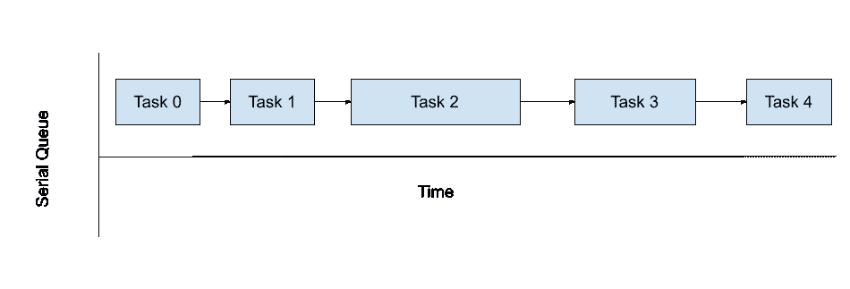
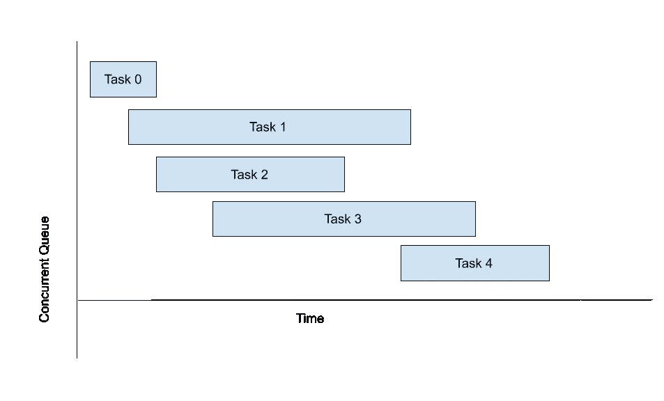

# iOS 中的并发性

> 原文：<https://levelup.gitconnected.com/concurrency-in-ios-feb653301d1a>

对于一个应用程序来说，性能非常重要，作为一个 iPhone 用户，没有人想在采取行动后等待回应，如果发生这种情况，你的应用程序可能会得到负面评价。

我们可以通过多种方式优化应用程序的性能，并发就是其中之一

**什么是并发？**

如果一个以上的任务同时发生，那么它被称为并发。自 2011 年以来，所有 iPhone 都支持同时执行多个任务。通过添加一些代码，我们可以同时运行多个任务。

这篇文章是关于提高应用程序的性能，我们可以通过两种方式在 iOS 中并发运行代码

1.  **中央车站**
2.  **操作类**

让我们深入研究一下-

**大中央调度**

Dispatch 也称为 Grand Central Dispatch (GCD ),包含语言特性、运行时库和系统增强功能，对 macOS、iOS、watchOS 和 tvOS 中多核硬件上的并发代码执行支持进行了系统、全面的改进。
BSD 子系统、Core Foundation 和 Cocoa APIs 都得到了扩展，以使用这些增强功能来帮助系统和您的应用程序更快、更高效地运行，并提高响应能力。想想看，单个应用程序有效使用多个内核有多困难，更不用说在具有不同数量计算内核的不同计算机上或在多个应用程序竞争这些内核的环境中这样做了。运行在系统级的 GCD 可以更好地适应所有正在运行的应用程序的需求，以平衡的方式将它们与可用的系统资源相匹配。—苹果文档。

**串行和并发队列**

串行队列只有一个与之关联的线程，因此在任何给定的时间点只允许执行一个任务。

串行队列图

一个并发队列可以利用系统资源所能利用的所有线程。将在并发队列中根据需要创建和释放一个线程。

并发队列图

**同步和异步任务**

如果我们在队列中有一些未完成的任务，我们可以同步完成**或者异步完成**或者**。**

当一个任务正在同步运行时，当前队列将被阻塞，直到该任务没有完成，然后才移动到另一个任务。

另一方面，当前队列上的异步任务将启动，但会立即将控制返回给当前队列。这样，当前队列将不会被阻塞，我们可以在当前队列上执行其他任务。

> 记住，如果一个任务是异步的，并不意味着它会并发运行。我们可以对串行或并发队列执行异步任务。同步和异步只是确定我们正在其上运行任务的队列是否必须等待任务完成，然后才能移动到下一个任务。
> 包含串行与并发识别队列是否有单线程或多线程可用于执行任务。

通过并行运行而不是串行运行，我们可以更快地完成任务。

**调度队列**

创建队列时，操作系统会将一个或多个线程分配给该队列。如果现有线程可用，它们可以被重用；如果没有，那么操作系统将相应地创建它们。创建调度队列-

就这样，已经创建了一个串行队列。:)

默认情况下，当应用程序启动时，会为您创建一个主调度队列。它是一个串行队列，主要负责 UI。你可以像这样访问它-

除非与 UI 无关，否则不应该在这里执行任何同步任务。否则，它将冻结您的用户界面，直到执行同步任务。

您可以通过将属性作为. concurrent 传递来创建并发队列

根据服务质量(QoS ),并发队列分为六个不同的全局并发队列类别。

**服务质量**

您可以使用 QoS 来确定任务的优先级。较高优先级的任务应该比较低优先级的任务执行得更快，因为它需要更多的系统资源。如果您想要一个并发队列，并且不想自己管理它，那么就使用预定义的全局队列。

这里有不同的服务质量-

1.  **。userInteractive -** 推荐用于用户直接交互的任务。主要与 UI 相关，如动画、事件处理或更新应用程序的用户界面。如果一个耗时的任务来了，那么它可能会冻结你的应用程序中的屏幕。
2.  **。用户启动-** 您可以执行在用户交互后启动的任务，如打开文档、获取数据等。这些任务可以异步执行，并反映到 UI 中。
3.  **。utility -** 可以执行用户不主动跟踪的任务。显示长时间运行的计算或下载的进度指示器。
4.  **。背景-** 你可以执行一个用户不知道的任务。例如维护数据库、执行备份等。
5.  **。默认-** 介于用户交互和用户发起之间。
6.  **。未指明的**

**。默认**和**。未指明的**是很少使用的 Qos。

您可以创建自己的具有 Qos 的并发调度队列，如下所示

您可以像这样向队列添加任务-

总是更新主队列中的 UI。如果你想使用同步方法，那么在这里要小心使用，否则会导致死锁。不要从主线程调用 sync 方法，它会阻塞主线程并导致死锁。

当您在应用程序中实现并发时，您应该小心，否则您可能会面临并发问题，如竞争条件、死锁或优先级反转。

有时你需要同时执行多个任务，但是哪个任务先完成并不重要，你只是想知道所有任务什么时候完成。对于这个场景，我们可以使用 **DispatchGroup。下面是 DispatchGroup 的一个基本实现。**

在某些情况下，你想要指定有多少线程可以访问一个共享资源，在这种情况下我们可以使用一个**信号量**。

**作战-**

通过使用 Grand Central Dispatch，我们可以同时提交任务，但是如果您想要对任务进行额外的定制，那么操作就成了问题。运营本身就是一个很大的话题。我将在本文的下一部分讨论这个问题。

感谢您阅读这篇文章。如果你觉得这篇文章有帮助，请不要忘记鼓掌。

如果您有任何问题或意见，请随时通过推特[联系我。](https://twitter.com/nomadicsheldon)