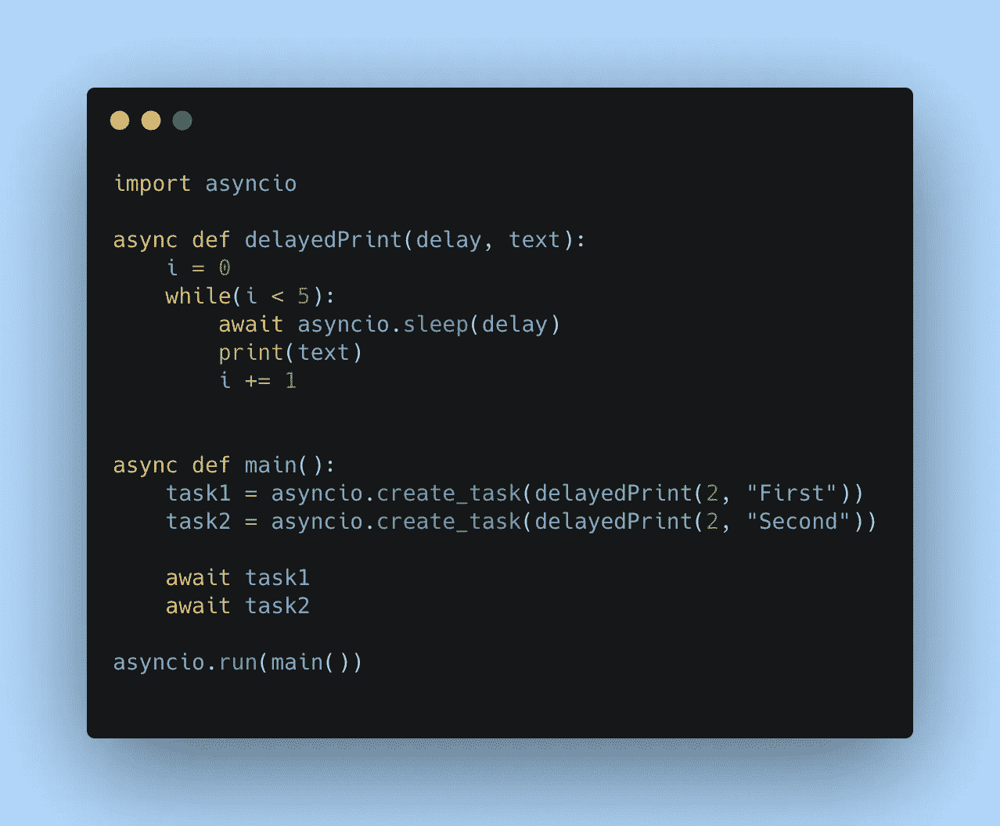

# 使用 Python 的异步 IO 进行并发编程

> 原文：<https://levelup.gitconnected.com/concurrent-programming-using-pythons-async-io-f3f83b0c7544>



很长一段时间，在 Python 中实现并发性是一项困难的任务。Python 开发人员经常不得不使用线程来并发运行任务。然而，随着异步 IO 的出现，Python 大大简化了并发性。

为了更好地理解异步 IO，我们举个例子。有一个函数将延迟和字符串作为参数。该函数在指定的延迟后每次打印字符串五次。如果我们将 2 和“First”作为参数传递，那么该函数应该在每次等待 2 秒后打印“First”五次。

# 同步运行这些功能

如果我们再次调用这个函数，传递 2 和" Second "作为参数，我们将首先打印" first "五次，然后" Second "将打印五次。这个程序总共需要 20 秒钟。我们现在的目标是同时运行这两个，这样“第一个”和“第二个”将几乎同时打印。该程序应该在 10 秒钟内完成打印。

让我们试着用 Python 实现这个函数。

```
def delayedPrint(delay, text): 
  i = 0 
  while(i<5): 
    sleep(delay) 
    print(text) 
    i+=1
```

如果我们调用`delayedPrint`,传递 2 和“First”作为参数，然后用 2 和“Second”再次调用它，输出将如下所示。


这表明程序正在顺序调用这些函数。现在，让我们试着同时运行它们。为了让它们并发运行，我们必须将`delayedPrint`变成一个异步函数。

# 使用异步 IO 异步运行这些函数

从 Python 3.7 开始，我们有了`async`和`await`关键字来异步运行函数。要将`delayedPrint`声明为异步函数，让我们使用`async`关键字。你必须进口。在能够使用`async`关键字之前，`asyncio`库。

```
async def delayedPrint(delay, text): 
  pass
```

我们称这样的函数为协程。

Python 使用事件循环异步运行函数。当调用异步函数时，事件循环运行它。当函数到达一个耗时的任务时，事件循环暂停该函数，并继续执行下一个函数。一旦耗时的任务完成，该功能将恢复运行。

# 异步 IO 中的可用资源

耗时的任务被称为“可预见的”。可评估对象可以是协程、任务或未来。`await`关键字与 awaitables 一起使用，告诉事件循环不要在该任务处阻塞，并继续执行下一个函数。

在我们的例子中，耗时的任务是睡眠功能。事件循环应该移动到下一个函数，并在两秒钟后返回，而不是在那里等待几秒钟。为了让 Python 做到这一点，我们需要在 sleep 函数中使用`await`关键字。

然而，不幸的是，原生睡眠功能不是一个可唤醒的。因此，我们将不得不使用“asyncio”库提供的睡眠功能。

```
def delayedPrint(delay, text): 
  i = 0 
  while(i<5): 
    await asyncio.sleep(delay) 
    print(text) 
    i+=1
```

现在，我们的异步函数(协程)已经准备好了。但是不能像调用普通函数一样直接调用。要么需要在另一个协程中用 awaitable 关键字调用它，要么我们应该使用`asyncio.run()`来运行它。

使用`asyncio.run()`,我们将只能调用协程一次。因为我们需要调用协程两次，所以我们必须在另一个协程中使用`await`关键字来调用它们。因此，让我们创建另一个名为`main`的协程，并在其中调用`delayedPrint`协程。

```
async def main(): 
  await delayedPrint(2, "First") 
  await delayedPrint(2, "Second")
```

现在，我们可以使用`asyncio.run()`来运行`main`协程。

```
asyncio.run(main())
```

如果你运行这个程序，你会发现它和我们之前运行的程序没有什么不同。首先，“第一”将被打印五次，然后是“第二”。

这是因为两个协程都在一个协程内被调用。当事件循环到达第一个`await`命令时，它没有另一个协程可以执行。因此，它在那里暂停，直到第一个协程完成，然后移动到下一个协程。这是同步发生的。

# 使用异步 IO 中的任务实现并发

为了让`delayedPrint`协程并发运行，我们需要将协程封装在任务中。任务用于并发调度协同程序。我们可以使用`asyncio.create_task()`方法在任务中包装一个协程。

```
async def main(): 
  task1=asyncio.create_task(delayedPrint(2, "First")) 
  task2=asyncio.create_task(delayedPrint(2, "Second"))
```

现在，当我们运行程序时，我们将在控制台中得不到任何输出！发生这种情况是因为这两行一执行完，`main`协程就退出了。任务一被调用就开始运行。在第二个任务被调用后，协程退出，结束程序。

为了防止这种情况，我们需要等到`task1`和`task2`完成。为此，我们可以使用`await`。

```
async def main(): 
  task1=asyncio.create_task(delayedPrint(0, "First")) 
  task2=asyncio.create_task(delayedPrint(0, "Second"))   await task1 
  await task2
```

现在，`main`协程不会退出，直到`task1`和`task2`完成。同时，这两项任务将同时运行。因此，控制台的输出如下所示。


与以前不同的是，这里“第一”和“第二”都是一个接一个打印出来的，整个程序只需要大约 10 秒钟。这是因为两个协同程序同时运行。

# 使用 asyncio.gather

我们可以使用`asyncio.gather`以更简单的方式编写相同的程序。

```
async def main(): 
  await asyncio.gather(delayedPrint(2, "First"), delayedPrint(2, "Second"))
```

`asyncio.gather`并发运行 awaitables。如果可调度的是一个协程，就像这里的情况一样，这个方法会自动将它们调度为任务。

你可以在 GitHub 的可用库[这里](https://github.com/thivi/pythonAsyncio)找到上面使用的代码。

*原载于 2020 年 8 月 19 日*[](https://www.thearmchaircritic.org/tech-journals/concurrent-programming-using-pythons-async-io)**。**