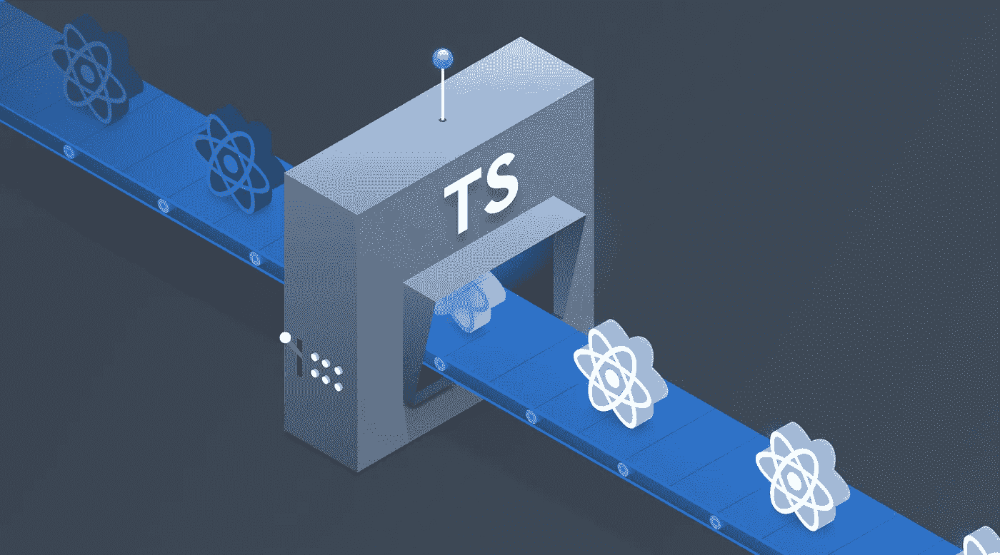
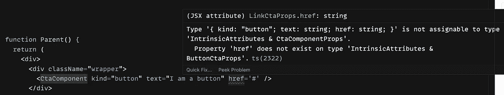
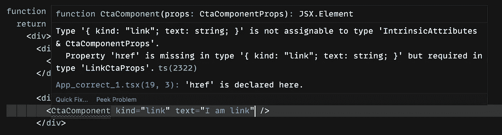

# 带打字稿的条件道具

> 原文：<https://levelup.gitconnected.com/conditional-props-with-typescript-78590139aa39>

我们将首先讨论我们需要使用 typescript 的条件道具的问题，然后我们将讨论它是如何为我们解决问题的。

> 仅当另一个属性具有特定值时才应设置的属性。

# **问题陈述:**

很多时候，我们将同一个组件用于多种不同的目的。

考虑 CTA 组件(行动号召)的例子，该组件可以充当

*   打开另一页的按钮
*   带有调用 API 的加载程序的按钮
*   在 web 中打开链接的按钮
*   带图标的按钮

还有更多…

当构建这样一个组件时，我们应该知道不是所有类型的道具组合都是有效的，并且应该避免开发人员在开发期间传递这样的组合。它可以被定义为**冲突属性**(你不能将 href 传递给一个普通的按钮或者禁用一个链接的属性)

这里，在上面的示例中，当您尝试为 CTA 组件传递 href prop 时，它不会引发任何错误。

现在，让我们看看如何使用 typescript 作为解决方案，以及它如何帮助我们避免这样的问题。

# **解决方案:**

让我们尝试为我们想要使用的特定组件分解 props 接口，如下所示:

首先，我们定义了公共 props 接口，用于我们想要支持的所有不同类型的 CTA 的所有公共属性，并且可以进一步扩展。

其次，我们为我们支持的不同 CTA 定义一组属性。

最后，为了避免用户传递所有的道具组合，我们使用了[联合类型](https://www.typescriptlang.org/docs/handbook/2/everyday-types.html#union-types)，这有助于我们为组件定义一组不同的有效道具，即 CTA 组件道具。

此外，从上面的示例中可以看出，我们在很久以后才基于 *kind* prop 的类型对 props 进行解结构，这被称为 t [ypescript 缩小](https://www.typescriptlang.org/docs/handbook/2/narrowing.html)，以帮助开发人员使用 IDE intellisense 并避免开发期间的错误。

> **在 typescript 缩小的情况下，** TypeScript 遵循可能的执行路径，我们的程序可以采用这些路径来分析给定位置的值的最具体的可能类型

正如你在下面的截图中看到的:

1.  这里，对于作为“button”的种类属性，如果您尝试传递 href 属性，它会给出一个错误，指出该类型不存在。

为按钮类型 CTA 传递额外属性时出错

2.在这里，对于作为“链接”的种类属性，它给出了一个错误，指出缺少 href 属性，并且它是一个必需的属性。

链接类型 CTA 缺少属性时出错

你可以看看[代码沙箱](https://codesandbox.io/s/condtional-props-with-typescript-forked-oue6il?file=/src/App_incorrect.tsx)并玩玩它。

# 结论

本文主要总结了条件属性如何帮助您为组件定义一组正确的属性，并帮助您提供更好的开发体验。