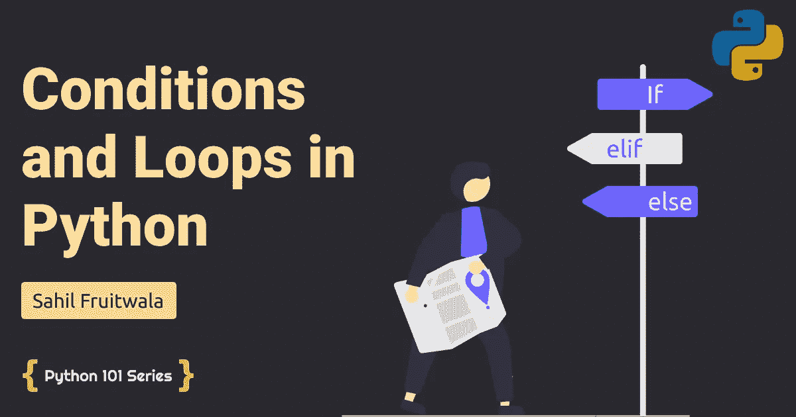

# Python 中的条件和循环

> 原文：<https://levelup.gitconnected.com/conditional-statements-and-loops-in-python-b8ac64f36faa>

## 了解 Python 中的条件语句和循环



如果你想在字符串为“Python”的时候做一些特定的任务，在字符串为“Java”的时候做一些其他的任务怎么办。为了实现这种条件，我们可以在 python 或任何其他语言中使用条件语句。当我们想要做一些任务 n 次或者我们想要循环通过一些特定的列表时，我们可以在这种情况下使用不同类型的循环。

# Python 中的条件语句

在 python 中，我们有两种类型的条件语句。

1.  如果-否则
2.  if-elif-else (if — else if — else)

这两个条件语句看起来几乎相似，实际上，它们是相似的。这两种说法之间只有微小的差别。我们将使用代码示例来理解这种差异。如果你知道任何其他语言，你可能想知道 python 是否有开关盒。不，python 没有开关盒。

# 如果-否则

语法:

```
if(conditional expresson):
    statement
else:
    statement
```

如果我用简单的英语解释了 if-else 语句，那么它就是“非此即彼”语句。

假设字符串是 java，我想做两个数的和，否则我想乘两个数。

```
num1 = 5
num2 = 2lang = 'java'if(lang=="java"): # check if value of lang variable is 'java'
    c = num1 + num2
    print(c)
else:
    c = num1 * num2
    print(c)# OUTPUT: 7num1 = 5
num2 = 2lang = 'java'if(lang!="java"): # check if value of lang variable is NOT 'java'
    c = num1 + num2
    print(c)
else:
    c = num1 * num2
    print(c)# OUTPUT: 10
```

使用 else 部分不是强制性的。也可以用 if part。例如，如果字符串“Python”或不执行任何操作，则将字符串“Programming”添加到现有字符串中。

```
lang = 'Python'if(lang=="Python"):
    lang = lang +" Programming"print(lang)
# Output: Python Programming lang = 'Java'if(lang=="Python"):
    lang = lang +" Programming"print(lang)
# Output: Java
```

有时，您也可以只使用变量进入 if 语句。举个例子，

```
lang = 'Python'
if(0):
    lang = lang +" Programming"
print(lang)
# OUTPUT: Pythonlang = 'Python'
if(1):
    lang = lang +" Programming"
print(lang)
# OUTPUT: Python Programminglang = 'Python'
if(True):
    lang = lang +" Programming"
print(lang)
# OUTPUT: Python Programminglang = 'Python'
if(False):
    lang = lang +" Programming"
print(lang)
# OUTPUT: Pythonlang = 'Python'
if(""):
    lang = lang +" Programming"
print(lang)
# OUTPUT: Pythonlang = 'Python'
if("random string"):
    lang = lang +" Programming"
print(lang)
# OUTPUT: Python Programminglang = 'Python'
if(None):
    lang = lang +" Programming"
print(lang)
# OUTPUT: Pythonlang = 'Python'
if([1]):
    lang = lang +" Programming"
print(lang)
# OUTPUT: Python Programminglang = 'Python'
if([]):
    lang = lang +" Programming"
print(lang)
# OUTPUT: Pythonlang = 'Python'
if({'a':1}):
    lang = lang +" Programming"
print(lang)
# OUTPUT: Python Programminglang = 'Python'
if({}):
    lang = lang +" Programming"
print(lang)
# OUTPUT: Python
```

如果我们想要组合多个条件，我们可以在 If 语句中使用'*和'*和'*或'*。

```
lang = 'PYTHON'if(lang.isupper() and len(lang) > 2):
    print("Worked!")
# OUTPUT: Worked!if(lang.islower() or len(lang) == 6):
    print("Worked again!")
# OUPUT: Worked again!
```

# if-elif-else

语法:

```
if(conditional expresson):
    statement
elif(conditional expresson):
    statement
else:
    statement
```

当我们想要测试多个场景时，我们使用这个条件语句。我们通过一个例子来理解这一点。

```
marks = 75if(marks >= 34 and marks <= 50):
    print("Grade C!")
elif(marks > 50 and marks <= 75):
    print("Grade B!")
elif(marks > 75 and marks <= 100):
    print("Grade A!")
elif(marks >= 0 and marks < 34):
    print("FAIL!")    
else:
    print("Something is wrong!")# OUTPUT: Grade A!
```

使用多个 *if* 和 *if-elif* 时要注意。逻辑和所有代码中的一个错误都可能引发错误。要理解这一点，请看下面的例子。

```
marks = 75if(marks > 75 and marks <= 100):
    print("Grade A!")
elif(marks > 50):
    print("Grade B!")
elif(marks >=34):
    print("Grade C!")
else:
    print("Something is wrong!")print("-----------------------------------")marks = 75if(marks > 75 and marks <= 100):
    print("Grade A!")
if(marks > 50):
    print("Grade B!")
if(marks >=34):
    print("Grade C!")"""    OUTPUT:
Grade B!
-----------------------------------
Grade B!
Grade C!
"""
```

# Python 中的循环

在 python 中，我们有两种循环。

1.  for 循环
2.  while 循环
3.  循环控制语句

# Python 中的 for 循环

语法:

```
for iterator in sequence:
    statement(s)
```

当我们想要遍历顺序数据类型时，使用 For 循环。例如遍历列表、元组、字符串等。

```
fruits = ['apple', 'banana', 'mango', 'grapes', 'peach']for fruit in fruits:
    print(fruit)""" OUTPUT:
apple
banana
mango
grapes
peach
"""for i in range(len(fruits)):
    print(fruits[I])""" OUTPUT:
apple
banana
mango
grapes
peach
"""
```

在上面的第一个例子中，在*水果*变量中，我们直接获取*水果列表*的每个元素。然而，在第二个例子中，我们通过索引引用来访问每个元素。range(n)函数返回一系列数字。语法:`range(start, stop, step)`。

```
for i in range(2, 13, 3):
    print(i)""" OUTPUT: 
2
5
8
11
"""
```

我们也可以在字典中使用 for 循环。

```
dict1 = {"lang": "python", "year": "2021", "month": "november"}for item in dict1:
    print(item, ":" , dict1[item])""" OUTPUT:
lang : python
year : 2021
month : november
"""
```

# Python 中的 while 循环

语法:

```
while expression:
    statement(s)
```

当你需要重复做一些工作直到某个条件满足时，在这种情况下你可以使用 while 循环。

假设我们需要打印“Hello World ”,直到 count 变量变为 5。

```
count = 0
while (count < 5):   
    print("Hello World")
    count = count + 1
```

# 循环控制语句

有时候，您需要中断循环，或者跳过循环中的一些迭代，或者什么都不做。这种事情可以使用循环控制语句来完成。在 python 中，我们有三个循环控制语句。

1.  break 语句
2.  连续语句
3.  Pass 语句

当某些条件匹配时，我们使用 break 语句来中断循环。举个例子，

```
fruits = ['apple', 'banana', 'mango', 'grapes', 'peach']for fruit in fruits:
    if(fruit == 'mango'):
        break
    print(fruit)""" OUTPUT: 
apple
banana
"""
```

当 break 语句中断循环时，continue 语句使循环跳过当前迭代，并强制循环进入下一次迭代。

```
fruits = ['apple', 'banana', 'mango', 'grapes', 'peach']for fruit in fruits:
    if(fruit == 'mango'):
        continue
    print(fruit)""" OUTPUT: 
apple
banana
grapes
peach
"""
```

Pass 语句是一段无意义的代码，它建议解释器不要做任何事情。它类似于注释，但是注释会被解释器忽略，而由解释器执行的 pass 语句按照名称什么也不做。Pass 语句也用于函数和类，我将在下一节解释。

```
fruits = ['apple', 'banana', 'mango', 'grapes', 'peach']for fruit in fruits:
    if(fruit == 'mango'):
        pass
    print(fruit)""" OUTPUT:
apple
banana
mango
grapes
peach
"""
```

# 为了…别的&而…别的

在开发过程中，有时您可能需要使用..else and while…else。对于特殊的 else 情况，这些只是普通的 for 和 while 循环。让我们看一个例子来理解它。

```
fruits = ['apple', 'banana', 'mango', 'grapes', 'peach']for fruit in fruits:
    if(fruit == 'mango'):
        break
    print(fruit)
else:
    print("Loop Did Not Break!")""" OUTPUT:
apple
banana
"""fruits = ['apple', 'banana', 'mango', 'grapes', 'peach']for fruit in fruits:
    if(fruit == 'abc'):
        break
    print(fruit)
else:
    print("Loop Did Not Break!")""" OUTPUT:
apple
banana
mango
grapes
peach
Loop Did Not Break!
"""
```

你可能已经猜到了。当循环没有中断或者循环没有中断地完成所有迭代时，执行 else 块。while 循环也是如此。

```
i = 1
while i < 6:
  if(i == 3):
    break
  print(i)
  i += 1
else:
  print("All iterations of While are executed successfully.")""" OUTPUT:
1
2
"""
```

# 结论

终于！我们已经到了这一节的末尾😁。

我知道，一次接受太多了。但是，你不需要记住我在这里提到的一切。我只是展示给你看，这样你就能回忆起什么是可能的，什么是不可能的。还有一些我在这里没有提到的其他方法。

如果你想了解更多关于 python 中的控制语句和循环，请查看 [Programiz](https://hashnode.com/draft/programiz.com/python-programming/if-elif-else) 。

如果你需要任何帮助或者想讨论什么，请告诉我。在 [Twitter](https://bit.ly/3KjwgZV) 或 [LinkedIn](https://bit.ly/3JbsPDm) 上联系我。请务必在下面的评论中留下你的想法、问题或担忧。我很想看看他们。

> *想了解更多信息？*
> 
> *注册我的* [*时事通讯*](https://bit.ly/3Menk8Q) *，把最好的文章放进你的收件箱。*

直到下一次👋

> **探索我的 Python 101 系列的其他博客。**

[](/create-and-use-functions-in-python-19b093f3ba9) [## 在 Python 中创建和使用函数

### 了解如何通过 Python 中的几个简单步骤来使用函数

levelup.gitconnected.com](/create-and-use-functions-in-python-19b093f3ba9) [](/dive-into-daunting-lists-and-dictionaries-in-python-2d22daf2c897) [## 深入 Python 中令人生畏的列表和字典

### 理解 Python 中的内置列表和字典方法

levelup.gitconnected.com](/dive-into-daunting-lists-and-dictionaries-in-python-2d22daf2c897)