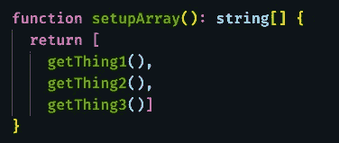
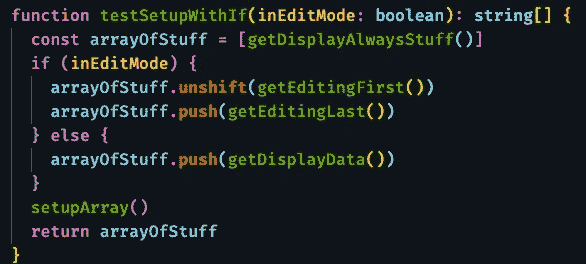
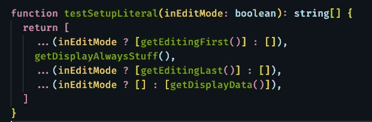

# 有条件地创建数组文字

> 原文：<https://levelup.gitconnected.com/conditionally-creating-array-literals-7d62facbb5ff>

## JavaScript 和类型脚本技巧

## 如果您发现自己在创建文字数组后有条件地使用 unshift()或 push()，有一个更好的解决方案。

操作数组的方法不止一种

# 创建文字数组

我发现我有时需要从函数的结果中创建数组。托管函数调用的文字数组创建工作得很好。最近，我需要在一个数组中以特定的顺序放置一些 react 元素。

简单、干净、文字数组

# 事情变得一团糟

不断变化的需求的真实世界使事情变得混乱。结果是，当程序处于编辑模式时，有些东西只属于数组，而有些东西只属于显示模式。最初，我将一个标志传递给函数，并返回所需的条目或`null`。这使事情井然有序，但是我必须过滤掉空值。它还向不属于那里的函数添加了逻辑。我的下一个解决方案是保持函数无参数，并在创建数组时使用条件逻辑。有些事情必须放在第一位，有些必须放在最后。第一遍看起来像这样:

使用带有 unshift 和 push 的 if 语句

这还不算太糟，但是它混淆了存储在比我想要的多一点的地方的内容。另外，你必须仔细观察才能注意到`unshift`被用来获取放在数组前面的东西。

# 为清晰而展开

扩展和三元运算符可用于返回到更接近原始值的位置。这是相同的逻辑，但是避免了`push`和`unshift.`注意到函数的结果被放在一个数组中或者我们返回一个空数组。无论哪种情况，我们都传播结果。这要么把函数的结果放到数组中，要么什么也不做，因为扩展一个空数组不会插入任何东西。

返回到文字数组

最终阵列中没有`undefined`或`null`。

就这样，一个简单的小提示。如果你想了解更多，我有[额外的 JavaScript 和打字技巧文章](https://gentille.us/typescript-tips-b74925485b78?sk=4c9067cf57be6406abc26e44cb7fb872)。

代码[在 GitHub](https://github.com/Rolias/blog-posts/blob/master/src/conditional-arrays/conditional-arrays.test.ts) 中可用

平静地编码。