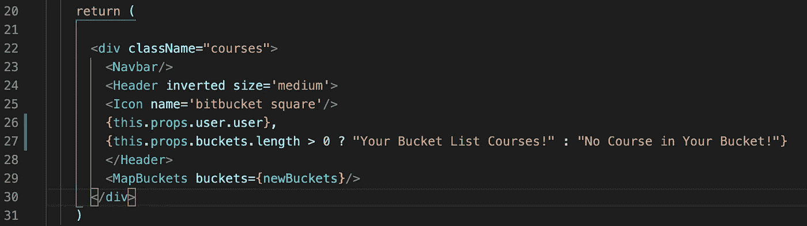
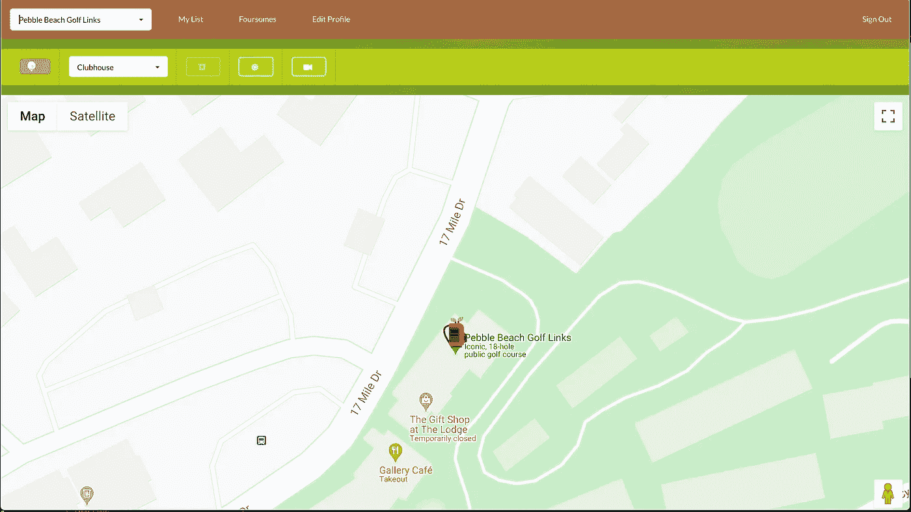
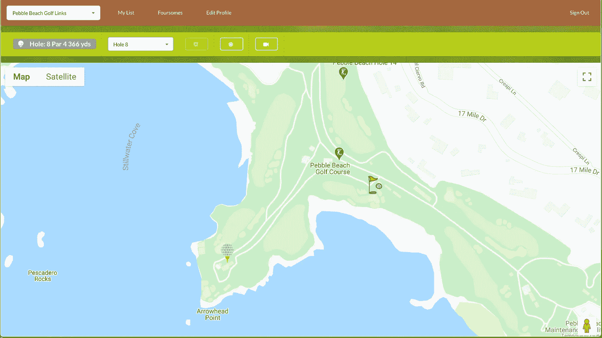
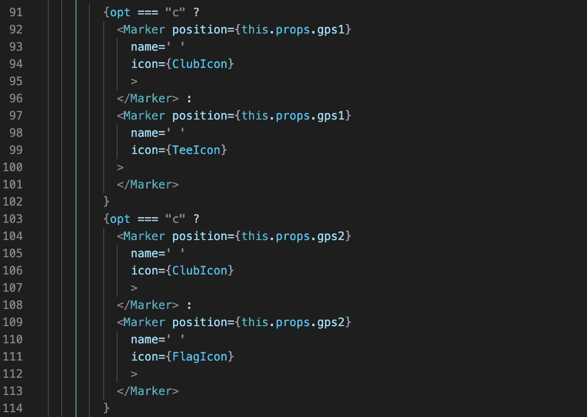
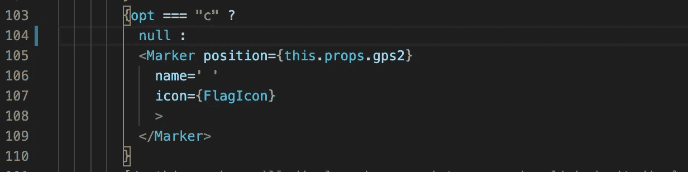

# JSX 的条件句

> 原文：<https://levelup.gitconnected.com/conditionals-in-jsx-b9837b5d86f0>

如果你正在编写 React 应用程序，你无疑会使用 JSX，因为它可能是向你的应用程序添加样式元素的最简单的方法。没有 JSX，使用 HTML 来写作和设计风格将是一件痛苦的事情。像 Semantic UI React 这样的工具提供了各种样式的组件，它们可以像 HTML 一样编码，但是样式化需要的代码要少得多。

然而，你可能会遇到的一个问题是条件句。一旦您在 return()语句中呈现了组件，如果您想让您的元素基于某种条件(例如，状态改变)，就不能真正使用 if-else 语句。一种选择是在 return()语句之前将您的条件放在 JSX 之外。然而，这可能太麻烦而无法跟踪。

这里有一个简单的例子。如果您想基于某些条件显示不同的标题消息。

列表中没有课程

列表中的课程

在这个例子中，我想用不同的消息问候用户，这取决于他/她的桶列表是否为空。

我可以使用 if-else 语句，在 JSX 之外创建一个文本变量，然后在语义 UI Header 元素中插入该变量。然而，在 JSX 内部有一种更直接的方法。是三元的！

如果你的条件是直接的 if-else 条件，那么就应该使用三元。在上面的例子中，我基于三元组对消息进行插值。条件是检查桶列表的大小(来自 Redux store)是否大于零(this.props.buckets.length > 0？).如果为真，则消息是“您的遗愿清单课程”(在？).如果为假，则消息为“您的桶中没有课程！”(在之后:)。

现在所有的代码都在 JSX 境内。没有必要转到代码库的其他部分来检查显示消息的情况。

不仅可以有条件地显示不同的消息内容，还可以有条件地呈现元素。

在我的遗愿清单应用程序中，我想根据是选择了俱乐部还是球洞，在地图上向用户显示一个标记。标记的图标也不同。

圆石滩高尔夫球场俱乐部

圆石滩高尔夫球场的第 8 洞

下面是我用来完成上述任务的代码。

我基本上总是基于三进制渲染两个标记。第一个标记是俱乐部会所(带有俱乐部图标)或球座(带有球座图标)。第二个标记是俱乐部会所(同一个俱乐部图标)或旗帜(带有旗帜图标)。标记的 GPS 位置是基于从父组件传递的属性设置的。在这种情况下，如果用户选择下拉菜单中的俱乐部会所，球场俱乐部会所的 GPS 将在 gps1 和 gps2 中传递。如果用户选择球场上的任何球洞，发球区的 gps 将在 gps1 中传递，而果岭(旗)的 GPS 将在 gps2 中传递。

如果用户从下拉列表中选择了俱乐部会所，我在上面的代码中实际上呈现了两个俱乐部会所标记。如果我想弄干我的代码，我可能会在俱乐部会所标记的第二个三元组中呈现一个 null。因为我知道一个标记已经被渲染了，所以没有必要在第二个标记中再做一次。

三元很棒吧？！