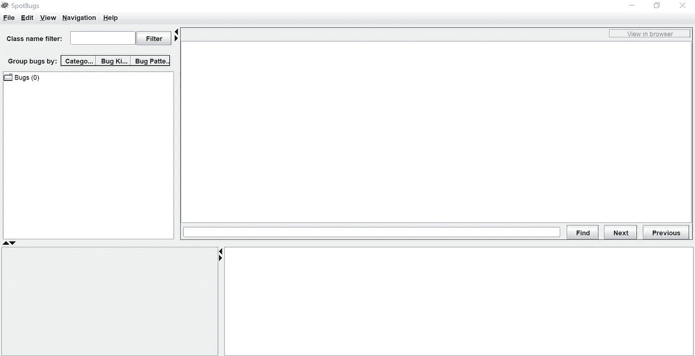
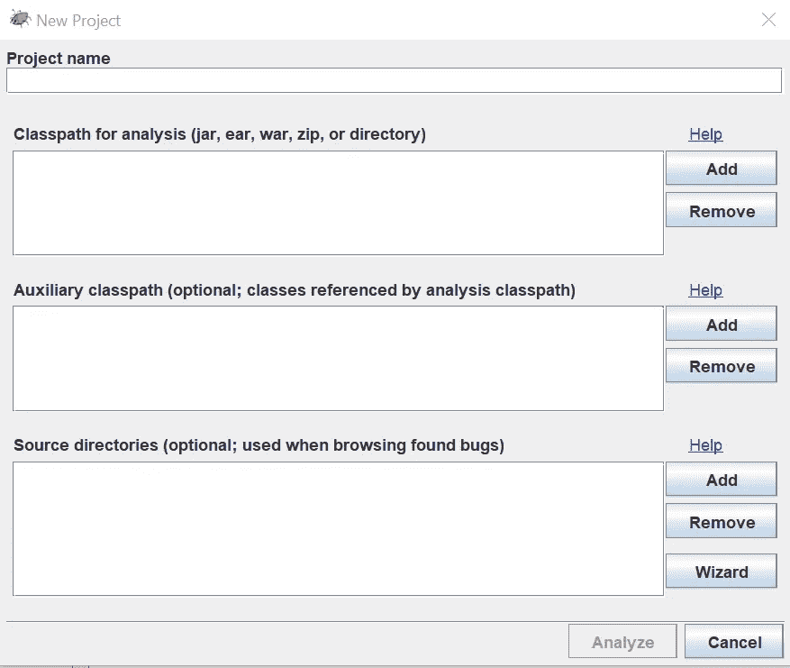
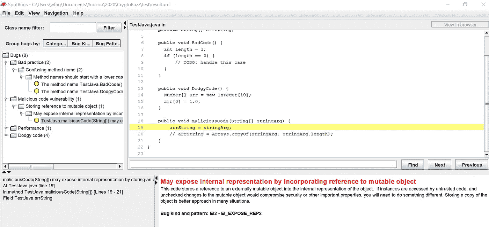

# 使用 SpotBugs 为 Java 应用程序进行 SAST

> 原文：<https://levelup.gitconnected.com/conducting-sast-for-java-applications-using-spotbugs-b40d3df29f27>

识别 Java 代码中的安全漏洞


摄影:[飞:D](https://unsplash.com/@flyd2069?utm_source=unsplash&utm_medium=referral&utm_content=creditCopyText) 上 [Unsplash](https://unsplash.com/s/photos/security?utm_source=unsplash&utm_medium=referral&utm_content=creditCopyText)

在本文中，您将学习使用 SpotBugs 在 Java 应用程序中执行 SAST(静态应用程序安全测试)。SAST 对于解决以下问题至关重要:

*   源代码漏洞
*   问题的后期诊断
*   缺乏根本原因分析

SpotBugs 是一个用于静态分析的开源工具。它有助于发现常见的不良和可疑代码以及常见的安全漏洞。

SpotBugs 的一个主要优势是它提供了对以下内容的强大集成支持:

*   黯然失色
*   蚂蚁
*   格拉德勒
*   专家

你可以把它作为一个独立的程序或者作为你的项目中的一个插件。这提高了灵活性，因为您可以根据自己的偏好在项目中运行它。

让我们进入下一部分，开始安装 SpotBugs。

# 设置

默认情况下，SpotBugs 是独立于平台的，可以在 GNU/Linux、Windows 和 MacOS X 上运行。它使用 JDK8 构建，可以在 JRE8 和更高版本上运行。

## 要求

确保您的机器满足以下要求:

*   与 Java 版本 1.8 或更新版本兼容的运行时环境
*   至少 512MB 内存(大型项目需要更多内存)

除此之外，SpotBugs 支持扫描由 JDK11 或更新版本生成的字节码(类文件)。

## 安装 SpotBugs

您可以通过下载二进制发行版轻松安装 SpotBugs。它有两种不同的格式:

*   [gzip tar](https://github.com/spotbugs/spotbugs/releases/download/4.2.1/spotbugs-4.2.1.tgz)
*   [zip](https://github.com/spotbugs/spotbugs/releases/download/4.2.1/spotbugs-4.2.1.zip)

然后，通过以下代码将压缩文件解压到一个文件夹中(相应地修改文件名):

```
# gzipped tar
gunzip -c spotbugs-4.2.1.tgz | tar xvf -# zip
unzip spotbugs-4.2.1.zip
```

根据您下载的版本，您应该有一个名为`spotbugs-4.2.1`的新文件夹。

# 为初学者构建自己的 Java 类

在本节中，您将学习构建自己的 Java 类的基础知识。如果您是一名经验丰富的 Java 开发人员，请跳到下一节，直接在您现有的项目中使用 SpotBugs。

## 创建 Java 文件

创建一个名为`TestJava.java`的新 Java 文件，并在其中添加以下代码(确保类名与文件名相同):

```
import java.util.Arrays;public class TestJava {

}
```

它将作为主 Java 文件，包含以下函数(一些函数名特意以标题形式书写):

*   条件语句的空语句块:

```
public void BadCode() {
    int length = 1;
    if (length == 0) {
        // TODO: handle this case
    }
}
```

*   令人困惑或以经常导致错误的方式编写的代码:

```
public void DodgyCode() {
    Number[] arr = new Integer[10];
    arr[0] = 1.0;
}
```

*   可变:

```
public void maliciousCode(String[] stringArg) {
    // bad
    arrString = stringArg;

    // good
    // arrString = Arrays.copyOf(stringArg, stringArg.length);
}
```

你可以在[下面的链接](https://gist.github.com/wfng92/0e8f52bdb805aa9f7f1bfc3e216de320)找到完整的代码。

## 构建 Java 类

接下来，让我们从您之前创建的代码中生成一个 Java 类文件。将工作目录更改为您的`TestJava.java`的根位置。

运行以下命令:

```
javac TestJava.java
```

它将生成一个名为`TestJava.class`的新文件。Java 类文件可以在命令提示符下直接调用，也可以编译成 Java 档案文件，比如`.jar`。

# 使用斑点虫子

本节涵盖了使用 SpotBugs 的基础知识。

## 运行 SpotBugs

运行 SpotBugs 的推荐方法是通过下面的命令行(假设您在包含`spotbugs-4.2.1`的根文件夹中):

```
java -jar spotbugs-4.2.1\lib\spotbugs.jar -gui
```

对于 Windows 用户，有一个通过双击`...\lib\spotbugs.jar`文件直接运行它的选项。

您应该会看到以下用户界面:



作者图片

## 创建新项目

现在点击位于左上角的`File > New Project`菜单。它将显示以下用户界面:



作者图片

需要填写最重要的字段是:

*   用于分析的类路径
*   源目录

您可以选择单个 Java 归档文件或目录。最新版本确实支持 Java 类文件，尽管在用户界面中没有说明。

让我们从填充用于分析的类路径开始。单击 add 并填写 Java 类所在的目录。对源目录重复相同的步骤。第二步很重要，因为如果不这样做，代码将无法显示在用户界面中。

## 分析结果

完成后，点击`Analyze`按钮，等待分析。大型项目可能需要相当长的时间。

当它完成运行时，您应该会看到以下结果:



作者图片

请注意，SpotBugs 总共发现了 8 个 bug:

*   2 个不良实践准则:

```
Method names should start with a lower case letterpublic void BadCode()
public void DodgyCode()
```

*   1 恶意代码漏洞:

```
May expose internal representation by incorporating reference to mutable objectline 19: arrString = stringArg;
```

*   1 性能问题:

```
Unread fieldline 19: arrString = stringArg;
```

*   4 个可疑代码:

```
Useless object createdline 14: Number[] arr = new Integer[10];Useless non-empty void methodpublic void BadCode()
public void DodgyCode()Useless control flowline 8: if (length == 0)
```

## 保存和打开结果

为了保存结果，进入菜单并点击`File > Save As`。填写所需的文件目录和文件名。接下来，点击`Save`，它将为您生成一个 XML 文件。

此外，SpotBugs 还提供了其他保存选项，例如:

*   仅项目文件(。fbp)
*   仅分析文件(。fba)
*   HTML 输出(。html)

您可以使用`File > Open`轻松地将输出结果加载回 SpotBugs。

# 结论

让我们回顾一下今天学过的内容。

本文首先简要介绍了 SAST 和 SpotBugs 的特性。

之后，它继续安装步骤，包括从官方链接下载二进制发行版，并将其解压缩到本地存储。

有一个关于创建自己的 Java 文件并将其构建成 Java 类的可选部分。

最后，本文总结了 SpotBugs 的基础知识，您分析了代码并获得了安全性和 bug 分析的输出。

感谢您阅读这篇文章。希望你回来看下一篇文章！

# 参考

1.  [Spotbugs — Github](https://github.com/spotbugs/spotbugs)
2.  [斑点虫子——文档](https://spotbugs.readthedocs.io/en/latest/)
3.  [斑点虫子— GUI](http://findbugs.sourceforge.net/manual/gui.html#d0e1087)