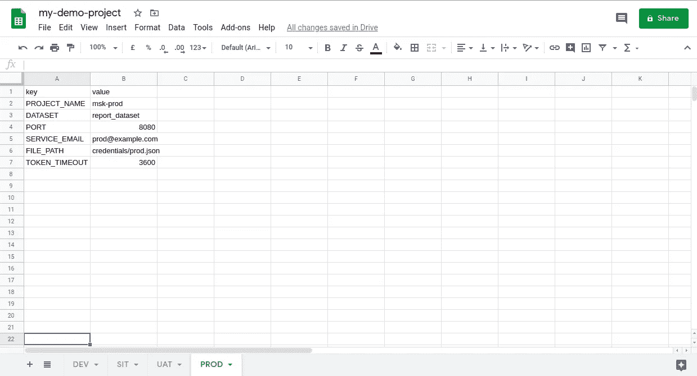

# 使用 Google Sheet 配置服务

> 原文：<https://levelup.gitconnected.com/config-service-using-google-sheet-6ac126b1c742>

从 Google Sheet 获取环境配置的简单服务。

按照下面的步骤在本地将该服务部署为 docker 容器。

## 启用 API

去 https://developers.google.com/console

启用工作表 API 和驱动 API

## 创建服务帐户

创建一个服务帐户，并下载 JSON 中的服务帐户密钥。将此密钥重命名为 client-secret.json。复制 client-email 以供将来参考。

## 创建 Google 工作表(sheet.new)

在多个工作表中创建条目。



示例配置数据

与上一步中创建的服务帐户的客户端电子邮件共享 Google 表单。

## 创建一个 Docker 容器。

创建文件夹凭据并复制服务帐户(client-secret.json)。

运行以下命令创建 docker 容器。

```
docker run -v $PWD/credentials:/app/credentials -p 8080:8080 vikramshinde/config-service-googlesheet:latest
```

## 触及 API 端点

```
localhost:8080/project/<<spreadsheet name>>/env/<<worksheet_name>>/key/<<config_key>>e.g.
localhost:8080/project/mskproject/env/PROD/key/PROJECT_NAME
```

# 背景

这个应用程序正在使用 [gspread](https://pypi.org/project/gspread/) python 库来连接 Google Sheet。

您也可以下载该代码的副本。

```
git clone [https://github.com/vikramshinde12/vikramshinde/config-service-googlesheet.git](https://github.com/vikramshinde12/config-service-googlesheet.git)
```

Dockerfile 文件

# 结论

这样，我们可以添加多个项目环境变量，并将它们共享到一个配置服务中。