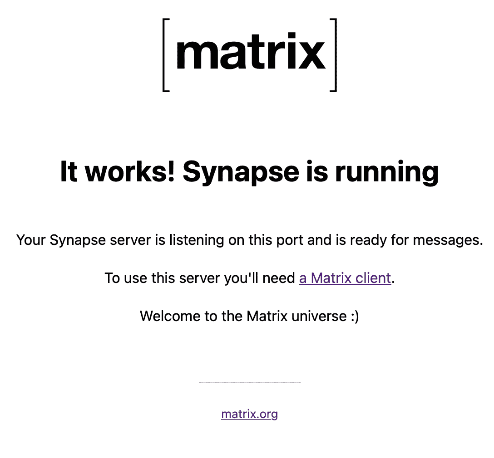

# 使用桥接配置自定义 matrix.org 服务器

> 原文：<https://levelup.gitconnected.com/configure-a-custom-matrix-org-server-with-bridging-d338fd607a13>


照片由[玛丽奥拉·格罗贝尔斯卡](https://unsplash.com/@mariolagr?utm_source=medium&utm_medium=referral)在 [Unsplash](https://unsplash.com?utm_source=medium&utm_medium=referral) 上拍摄

使用容器和 traefik

# 工具箱

按照我的步骤(也许这一页太不完整，不能被认为是一个教程)，你需要:

*   安装有 [**docker**](https://www.docker.com) 的连接到互联网的服务器；
*   [docker-compose](https://docs.docker.com/compose/install/)；
*   关于[https://hub.traefik.io/dashboard](https://hub.traefik.io/dashboard)的一个记述；
*   能够访问 **DNS 配置页面**的**自定义域**；
*   两个**子域**一个用于 synapse(*synapse.example.com*)，一个用于**联盟**我们的服务器(*matrix.example.com*)

# 最后的事情优先

在本文结束时，您将已经设置好运行您自己的 matrixdotorg 服务器所需的所有服务

这将只需要运行 *docker-compose up -d* 来启动所有你需要的东西

现在让我们一步一步地检查

# 突触

首先，我们需要为 synapse 服务器生成一个配置文件。这可以通过 docker 运行轻松完成

```
docker run -it --rm -v $PWD/matrix/synapse:/data -e SYNAPSE_SERVER_NAME=matrix.example.com -e SYNAPSE_REPORT_STATS=no matrixdotorg/synapse generate
```

这将在 *matrix/synapse* 目录中创建一个文件 *homeserver.yaml* 。

这里我们需要更新

```
server_name: "matrix.example.com"
```

添加一行以启用注册

```
enable_registration: true
```

# nginx 作为反向代理

现在我们需要正确地路由我们的流量，为此我们将使用 nginx

创建一个名为 *nginx* 的文件夹，并在其中创建一个名为 *www* 的文件夹

在 nginx 中，我们需要创建一个名为 *matrix.conf* 的文件

```
server {listen         80 default_server;server_name    matrix.example.com;# Traefik -> nginx -> synapselocation /_matrix {proxy_pass http://synapse:8008;proxy_set_header X-Forwarded-For $remote_addr;client_max_body_size 128m;}location /.well-known/matrix/ {root /var/www/;default_type application/json;add_header Access-Control-Allow-Origin  *;}}
```

文件夹内 *www/。知名/矩阵*我们需要创建两个文件

客户

```
{"m.homeserver": {"base_url": "https://matrix.example.com"}}
```

计算机网络服务器

```
{"m.server": "synapse.example.com:443"}
```

您应该有一个这样的目录树

```
nginx
|____www
| |____.well-known
| | |____matrix
| | | |____server
| | | |____client
|____matrix.conf
```

# 桥接 Whatsapp、电报和信号

 [## 毛特里克斯-布里奇斯

### 选择网桥:该页面包含通过自己运行可执行文件来设置网桥的说明。你可以…

docs.mau.fi](https://docs.mau.fi/bridges/go/setup.html) 

## Whatsapp

运行*docker-compose up-d ma utrix-whatsapp*会创建两个文件 *config-example.yaml* 和 *registration.yaml*

将 *config-example.yaml 移动到 config.yaml* 并将 *registration.yaml* 复制到 matrix/synapse/ folder，重命名为*ma utrix-whatsapp-registration . YAML*

更新 config.yaml 更改地址、域和权限

```
address: http://synapse:8008domain: matrix.example.com
```

## 电报

运行*docker-compose up-d ma utrix-telegram*将创建两个文件 *config-example.yaml* 和 *registration.yaml*

将 *config-example.yaml 移动到 config.yaml* 并将 *registration.yaml* 复制到 matrix/synapse/ folder，重命名为*ma utrix-telegram-registration . YAML*

更新 config.yaml 更改地址、域和权限

```
address: [http://synapse:8008](http://synapse:8008)domain: matrix.example.com
```

## 信号

运行*docker-compose up-d ma utrix-signal*将创建两个文件 *config-example.yaml* 和 *registration.yaml*

将 *config-example.yaml 移动到 config.yaml* 并将 *registration.yaml* 复制到矩阵/突触/文件夹，重命名为*ma utrix-signal-registration . YAML*

更新 config.yaml 更改地址、域和权限

```
address: [http://synapse:8008](http://synapse:8008)domain: matrix.example.com
```

最终文件夹树应该是这样的

```
matrix
|synapse
| |____mautrix-wa
| | |____registration.yaml
| | |____config.yaml
| | |____logs
| | |____database.db
| |____mautrix-signal
| | |____registration.yaml
| | |____config.yaml
| |____mautrix-telegram
| | |____registration.yaml
| | |____config.yaml
| |____matrix.fvalle.online.signing.key
| |____matrix.fvalle.online.log.config
| |____homeserver.yaml
| |____homeserver.db
| |____mautrix-whatsapp-registration.yaml
| |____mautrix-telegram-registration.yaml
| |____mautrix-signal-registration.yaml
```

# trfik

现在如果我们去 https://hub.traefik.io/dashboard，我们可以注册一个新的代理商。通过这个过程，我们获得一个令牌，并将其放入 docker 编写文件中

```
hub-agent:image: ghcr.io/traefik/hub-agent-traefik:v1.0.0pull_policy: alwayscontainer_name: hub-agentrestart: "on-failure"command:- run- --hub.token=......- --auth-server.advertise-url=http://hub-agent- --traefik.host=traefik- --traefik.tls.insecure=truevolumes:- /var/run/docker.sock:/var/run/docker.sockdepends_on:- traefik
```

从同一个 traefik hub 网站，我们可以发布服务。

我们需要发布***mautrixdotorg/nginx***和***mautrixdotorg/synapse***

# 域名服务器(Domain Name Server)

我们需要将*matrix.example.com*指向 **nginx** 服务，将*synapse.example.com*指向 **synapse** 服务。

这可以通过从 trfik hub 网站添加一个自定义域，并在我们的域名 DNS 设置中添加两个 CNAME 记录来完成。

# **检查**

此时，我们可以检查所有容器的运行情况。

将浏览器指向[https://matrix.example.com/_matrix/static/](https://matrix.example.com/_matrix/static/)我们应该会看到 synapse 静态网页工作正常。



矩阵正在工作

*https://matrix.example.com/.well-known/client*应该返回我们之前定义的 *json* 。

另外*https://matrix.example.com/.well-known/server*应该归还它的 json。

# 联邦测试

一旦它全部启动并运行，我们就可以使用**矩阵联合测试器**来检查我们的服务器是否正常工作，以及它是否准备好进行联合。

 [## 矩阵联合测试器

### 编辑描述

federationtester.matrix.org](https://federationtester.matrix.org/) 

# 客户

现在让我们尝试连接到我们的服务器，我们可以使用元素客户端。

[](http://app.element.io/) [## 元素

### 编辑描述

app .元素. io](http://app.element.io/) 

如果一切正常，你应该能够注册到自己的服务器，并开始聊天！

# 参考

[1][https://gist . github . com/matusnovak/37109 e 60 Abe 79 F4 b 59 fc 9 fbda 10896 da](https://gist.github.com/matusnovak/37109e60abe79f4b59fc9fbda10896da)

[2]https://github.com/mautrix/whatsapp

[3]https://github.com/mautrix/telegram

[https://github.com/mautrix/signal](https://github.com/mautrix/signal)