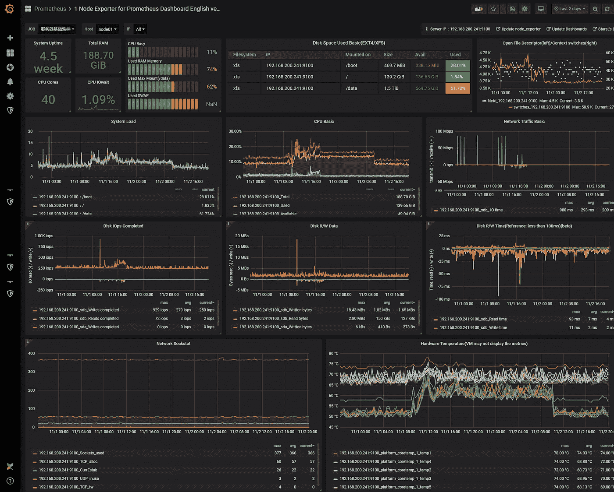
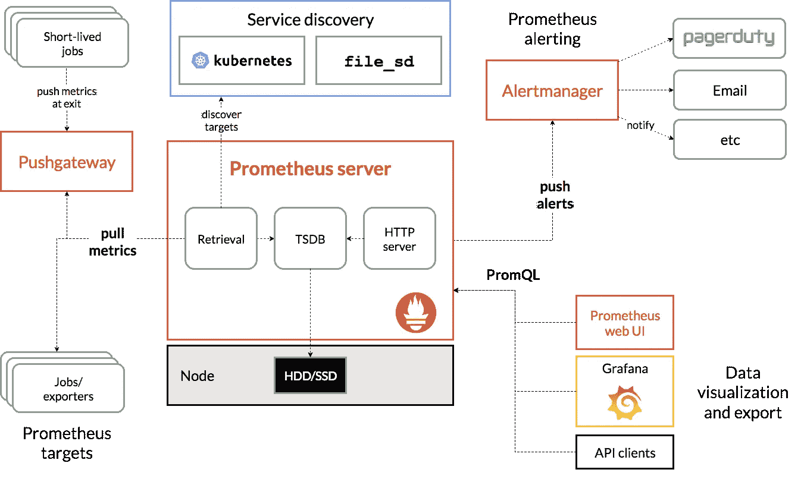
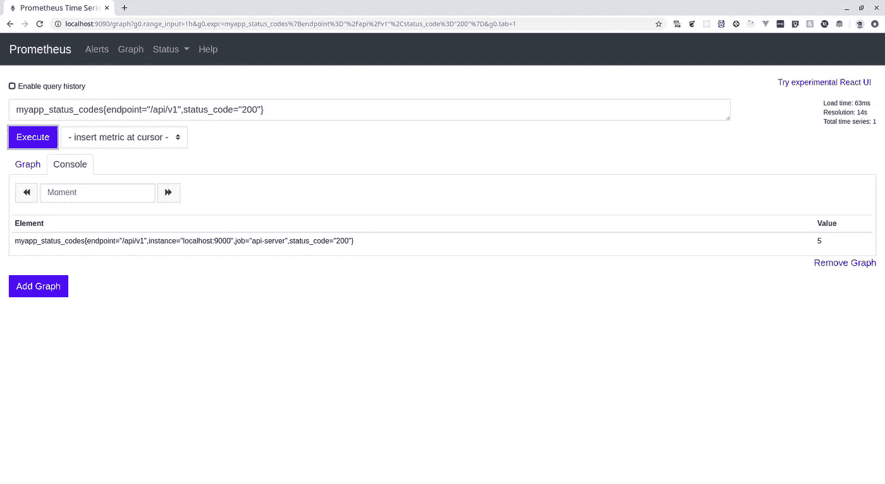
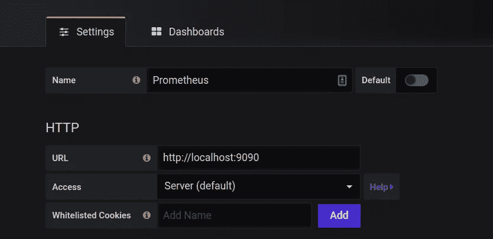
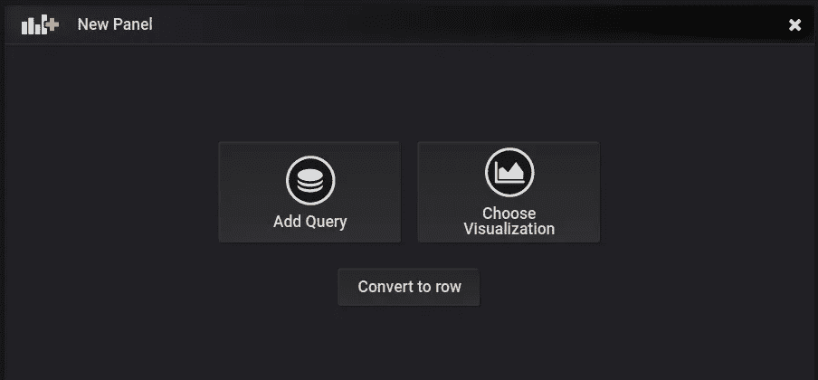
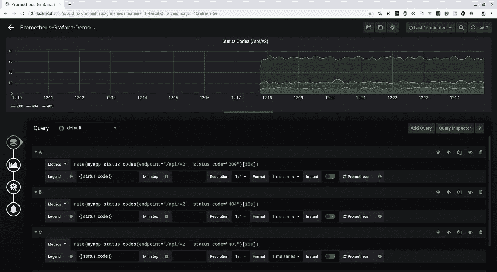
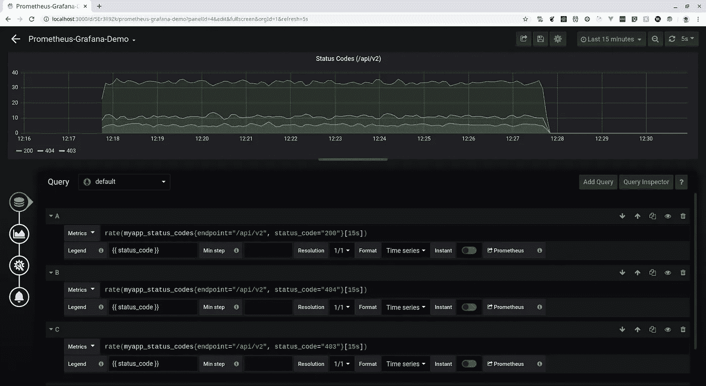
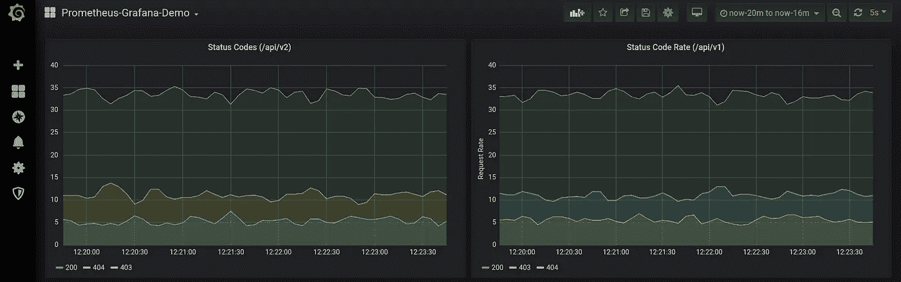

# 创建一个带有 Grafana 仪表板的 Prometheus 监控服务器

> 原文：<https://levelup.gitconnected.com/configure-a-prometheus-monitoring-server-with-a-grafana-dashboard-59faa4a42ef6>



*由* [starsliao](https://grafana.com/orgs/starsliao) 为普罗米修斯仪表盘导出节点

Prometheus 是一种用于系统和服务监控的工具。程序员编写的代码是要在实际的硬件上运行的，这意味着我们在利用一种物理资源，这种资源需要我们花钱来操作。因此，我们要以最有效的方式更好地利用这一资源。这就是系统监控发挥作用的地方。在实际的服务器上运行复杂的应用程序是很复杂的，而且事情可能会因为几个原因而失控。可能出现的一些潜在问题有:

*   磁盘已满->无法存储新数据
*   软件错误->请求错误
*   高温->硬件故障
*   网络中断->服务无法通信
*   内存利用率低->浪费金钱

这些问题发生的频率比您想象的要高，因此有必要监控您的系统和服务，以检查它们的健康状况。

监控意味着从你的系统中获取信息，获得洞察力并根据这些洞察力采取行动。你可以用不同的方式进行监控。

*   基于检查的监控->定期运行脚本以检查服务器的运行状况。非常静态。基于单个机器的非常局部的上下文。
*   日志/事件->记录每个事件的全部细节。它可以是结构化的和非结构化的。需要进一步分析。(Loki，InfluxDB)。缺乏军种间的关联。
*   指标/时间序列->数值，随时间采样。(OpenTSDB，Prometheus)，适用于聚合健康监控。但是需要日志来进行详细的分析。

对于服务间的关联，我们使用跟踪，通过整个堆栈跟踪单个请求。(耶格)。

Prometheus 是为动态云环境打造的基于指标的监控和警报堆栈。它不做日志记录或跟踪。

# 普罗米修斯的建筑:

Prometheus server 定期从称为目标的东西中提取时间序列指标，并将其存储在本地磁盘中。

这些目标可以有两种类型，一种是您可以控制源代码，如您的 web 应用程序或 API，这就是我们将要做的，在这里您可以使用 Prometheus 客户端库来执行一个端点，Prometheus 可以从该端点收集这些数据。

另一个目标是您不一定能控制的东西，比如 Linux VM 或 SQL DB 实例。在这种情况下，您使用一个叫做导出器的东西，它位于这个系统之上，向 Prometheus 发送指标。

然后，Prometheus server 被配置为从这些目标中提取或抓取数据，并将这些时间序列指标存储在本地磁盘上。



【https://prometheus.io/docs/introduction/overview/ 

关于 Prometheus 的内容和方式，已经给了您足够的解释，现在让我们使用 Prometheus 来创建我们的服务并监控它。您可以查看包含所有代码的 Github 资源库。

[](https://github.com/Jigar3/Prometheus-Grafana) [## .吉加尔 3/普罗米修斯-格拉法纳

### 一个关于如何在 Prometheus 中使用自定义指标并使用 Grafana 监控它们的简短演示…

github.com](https://github.com/Jigar3/Prometheus-Grafana) 

让我们从创建服务器开始。

所以我们在这段代码中所做的基本上是创建两个端点，分别是`/api/v1`和`/api/v2`。每当你到达这些终点，你就会得到一个`200-OK`或者`404-NOT FOUND`或者`403-FORBIDDEN`。该函数以这样的方式编码，即得到`200-OK`的概率大于`404-NOT FOUND`，而 T6 又大于`403-FORBIDDEN`。

我们将监控的指标显示在`/metrics`端点上，我们已经使用`promhttp.Handler()`填充了一些指标。这些预填充的指标包括 *go_goroutines:当前存在的 goroutines 的数量，go_memstats_alloc_bytes:已分配和仍在使用的字节数，go_threads:已创建的 OS 线程的数量*等等。

您可以使用四种度量类型，我使用的是`Counter`类型的度量。您可以点击查看其他指标[。每个时间序列都由它的*指标名*和可选的名为*标签*的键值对唯一标识。这里，我们使用了*指标名称* `myapp_status_codes`，并且使用了两个标签`endpoint`和`status_code`。`endpoint`将给出被点击的端点的名称，而`status_code`将返回状态代码。](https://prometheus.io/docs/concepts/metric_types/)

```
statusCodeProcess.With(prometheus.Labels{“endpoint”: r.URL.Path, “status_code”: strconv.Itoa(statusCode)}).Inc()
```

上面的代码行增加了计数器，并用适当的值设置标签。

现在，我们可以通过执行`go run main.go`来运行服务器。你可以访问`[http://localhost:9000/api/v1](http://localhost:9000/api/v1)`或`[http://localhost:9000/api/v](http://localhost:9000/api/v1)2`，查看回复。可以在`'http://localhost:9000/metrics`中搜索计数器值。您将看到类似这样的内容

```
# TYPE myapp_status_codes counter
myapp_status_codes{endpoint="/api/v1",status_code="200"} 1
```

这里`1`表示点击端点`/api/v1`并返回`200-OK`响应的次数。

现在我们的目标已经准备好了，我们需要创建一个 Prometheus 服务器来抓取我们的 API 服务器。要创建 Prometheus 服务器，我们需要创建一个配置文件。

写这个配置文件的格式可以在[这里](https://prometheus.io/docs/prometheus/latest/configuration/configuration/)找到。我们现在可以通过执行以下命令来运行服务器

```
prometheus --config.file=./prometheus.yml
```

现在，你可以去`[http://localhost:9090](http://localhost:9090.)`了。你将会在下面显示的屏幕上看到问候



现在，您可以输入 PromQL 表达式并查询指标。你可以在这里找到关于如何使用 PromQL [进行查询的指南。你可以单独在这里做很多有用的东西，但我们将继续前进，将 Prometheus 与 Grafana 联系起来，并制作漂亮的图表，这也将为我们的服务提供有用的见解。](https://prometheus.io/docs/prometheus/latest/querying/basics/)

**Grafana** 是一款开源可视化和分析软件。它允许您查询、可视化、提醒和探索您的指标，无论它们存储在哪里。用简单的英语来说，它为你提供了将你的时间序列数据库(TSDB)数据转化为漂亮的图表和可视化的工具。

您可以按照此处提到的[的说明安装 Grafana。安装后，您可以通过执行以下命令来运行 Grafana 服务器](https://grafana.com/docs/grafana/latest/installation/)

```
grafana-server
```

这将在`[http://localhost:3000](http://localhost:3000.)` [启动一个 Grafana 服务器。](http://localhost:3000.)默认用户名和密码都是 admin。在开始创建漂亮的图形之前，首先需要导入 Prometheus 作为数据源。您可以在主屏幕上找到添加数据源的选项。选择 **Prometheus** 作为数据源，它将引导您进入设置页面，您需要在此填写适当的详细信息，如下所示。



现在，点击**保存&测试**。您应该会看到一个通知，说明*数据源正在工作。*

在添加了作为数据源的 **Prometheus** 之后，我们将创建一个新的仪表板，为此，按下左侧窗格中的`+`图标并点击仪表板。你将会看到下面的屏幕。



点击*添加查询，*您将被带到新的仪表板屏幕，在这里我们可以使用上面讨论的 PromQL 查询制作这些漂亮的图表。

我们将执行的查询是我们在特定端点上被请求的速率以及返回的响应。`[15s]`意味着我们正在获取过去 15 秒内测量的速率。

```
rate(myapp_status_codes{endpoint="/api/v1", status_code="200"}[15s])
```



类似于上面对`200`响应的速率查询，我们对`403`和`404`也做了同样的事情。

您现在可以对另一个端点进行同样的操作，下面显示的是另一个端点的示例。



为了在我们的定制服务器上产生流量，我使用了一个叫做[贝吉塔](https://github.com/tsenart/vegeta)的工具。它是一种用于模拟给定端点上流量的工具。您可以从 Github 存储库中安装该工具。要使用*贝吉塔*来模拟交通，编写命令。

```
~ $ echo "GET [http://localhost:9000/api/v1](http://localhost:9000/api/v1)" | vegeta attack -duration=600s | tee results.bin | vegeta report~ $ echo "GET [http://localhost:9000/api/v](http://localhost:9000/api/v1)2" | vegeta attack -duration=600s | tee results.bin | vegeta report
```

这些命令将在 600 秒内击中服务器上的特定端点，您可以在刚刚创建的 Grafana 仪表板上看到相同的内容。

您可能会想，检查特定端点上返回的状态代码有什么必要，所以让我们以支付网关服务为例，当用户使用该服务支付时，跟踪返回的成功和不成功的响应是很重要的，不成功响应的突然增加意味着服务器有问题，无论出现什么问题，您都应该立即纠正。

最终的仪表板将如下所示。



我希望你能够理解并跟随普罗米修斯+ Grafana 制作一个监控仪表板。感谢阅读。如果你有任何问题，请随时回复。

## 进一步阅读的资源:

*   [https://www.youtube.com/watch?v=5O1djJ13gRU](https://www.youtube.com/watch?v=5O1djJ13gRU)(一段令人惊叹的视频让我们明白为什么需要普罗米修斯)
*   https://www.scaleway.com/en/docs/vegeta-load-testing/
*   [https://Tom Gregory . com/the-four-types-of-Prometheus-metrics/](https://tomgregory.com/the-four-types-of-prometheus-metrics/)
*   [https://medium . com/@ valy ala/promql-初学者教程-9ab455142085](https://medium.com/@valyala/promql-tutorial-for-beginners-9ab455142085)