# 如何为开发和部署配置 AWS

> 原文：<https://levelup.gitconnected.com/configure-aws-for-development-and-deployment-ad822097fc22>

## 如何创建和配置 AWS 凭据的分步指南


克里斯托夫·高尔在 [Unsplash](https://unsplash.com?utm_source=medium&utm_medium=referral) 上拍摄的照片

# **设置 AWS**

如果你在[https://portal.aws.amazon.com/billing/signup#/start](https://portal.aws.amazon.com/billing/signup#/start)还没有 AWS 自由层账户，第一步是创建一个

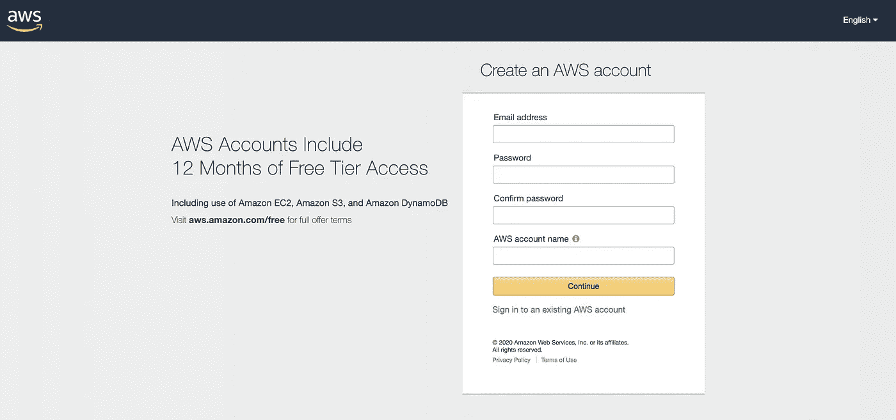

AWS 注册页面

注册帐户后，点击**登录现有 AWS 帐户**链接登录，并输入您的用户名和密码:

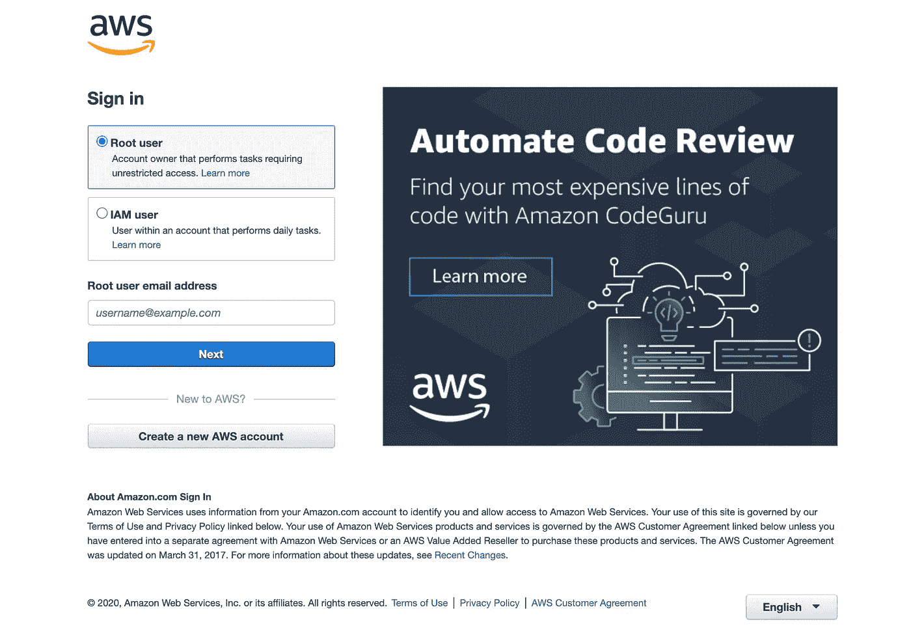

AWS 登录页面

登录后，您将被重定向到 AWS 管理控制台页面

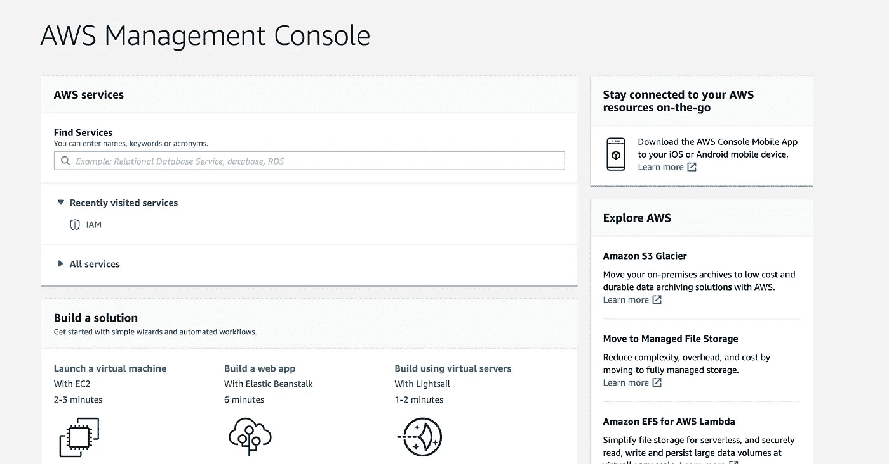

AWS 管理控制台

出于安全考虑，我建议去 https://console.aws.amazon.com/iam/home?[的安全证书页面#/security_credentials](https://console.aws.amazon.com/iam/home?#/security_credentials) 为您的帐户设置多因素身份验证(MFA):

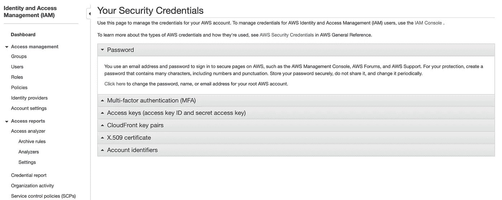

IAM 页面

用户密码很容易被泄露。通过启用 MFA，您可以在登录时要求多种形式的验证来证明您的身份，从而立即提高您的帐户安全性。你可以阅读更多关于[多因素认证](https://searchsecurity.techtarget.com/definition/multifactor-authentication-MFA)的信息。

接下来，我们需要创建一个 **IAM** 用户。IAM (AWS 身份和访问管理)用户使用 API 或 CLI 授予用户执行交互式任务或向 AWS 服务发出编程请求的权限。你可以阅读更多关于 [AWS 身份和访问管理(IAM)](https://aws.amazon.com/iam/) 和 [IAM 身份](https://docs.aws.amazon.com/IAM/latest/UserGuide/id.html)的信息。点击 **IAM** 页面左侧栏上的**用户**或者点击顶部菜单上的**服务**并搜索 **IAM。**

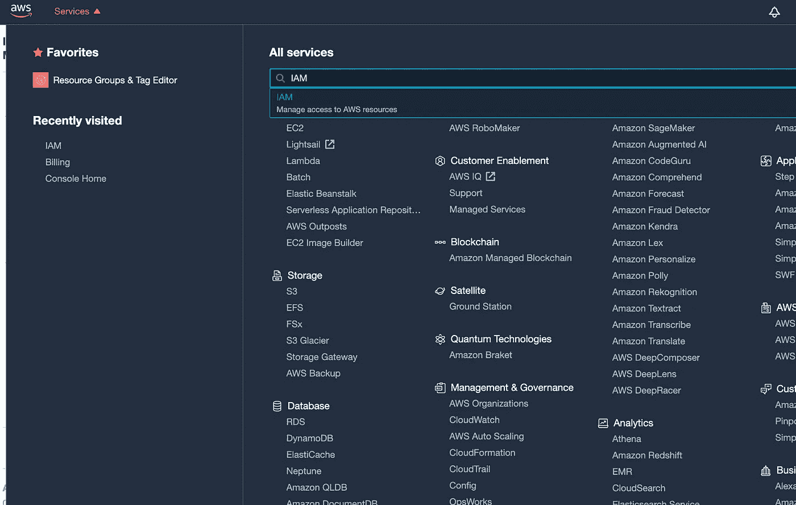

AWS 控制台

单击 IAM 将带您进入 IAM 页面仪表板。

接下来，通过点击**添加用户**创建一个用户，这将打开下面的表单:

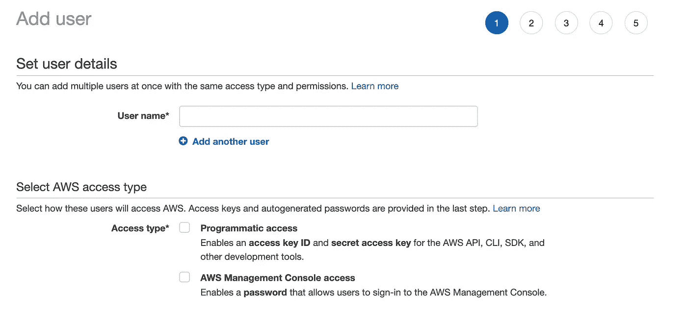

添加用户— IAM

您需要选择用户名和访问类型。选择**编程访问**，因为我们需要访问 AWS API、CLI 和开发工具。这将为每个新用户创建一个访问密钥。单击“下一步”为用户设置权限

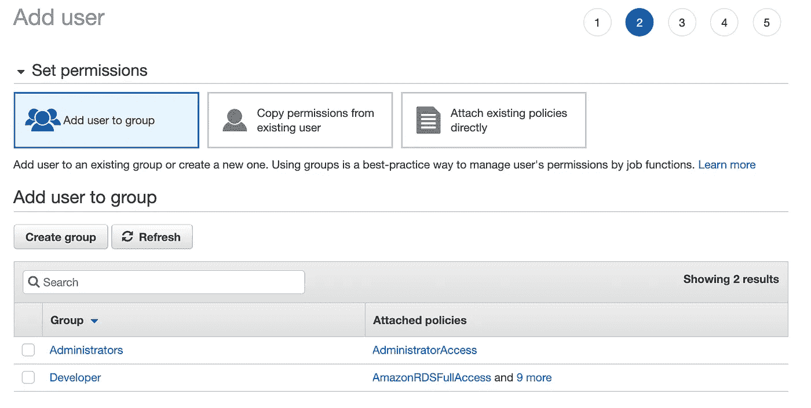

设置权限— IAM

我通常喜欢建立一个权限组，然后将用户添加到一个组中。我们可以使用组来为一组用户指定权限，这使得管理这些用户的权限更加容易。通过组，我们可以一次将策略附加到多个用户。

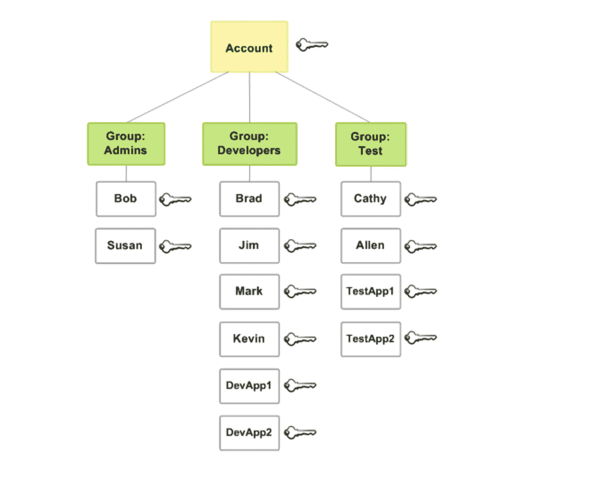

一家小公司— AWS 中的 IAM 组示例

在上面的例子中，每个用户属于一个组。但是，用户可以添加到多个组中。此外，组中的每个用户都自动拥有分配给该组的所有权限。

点按“继续”会将您带到可选标签设置。保留默认设置，然后单击“下一步”转到“查看”页面。

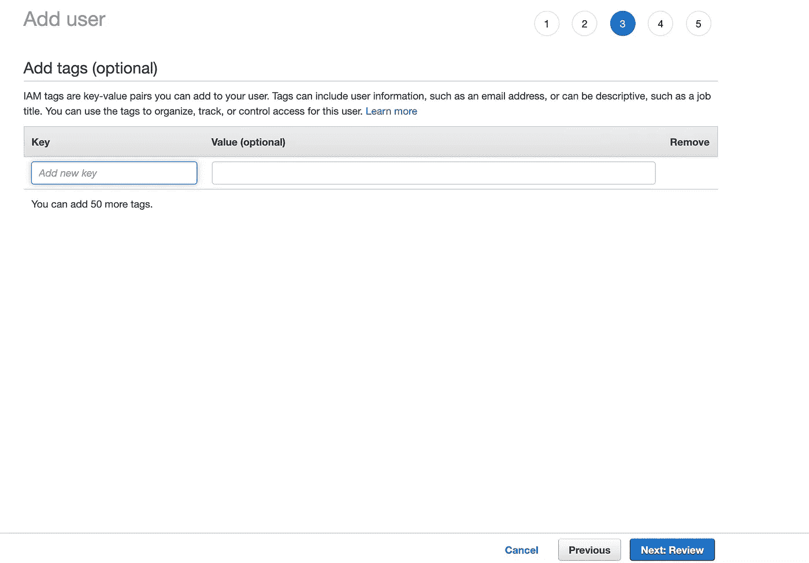

添加标签— IAM

在“查看”页面上，您可以查看您的选择，如果需要进行更改，可以返回到之前的步骤。单击“创建用户”以完成该过程并创建您的用户。

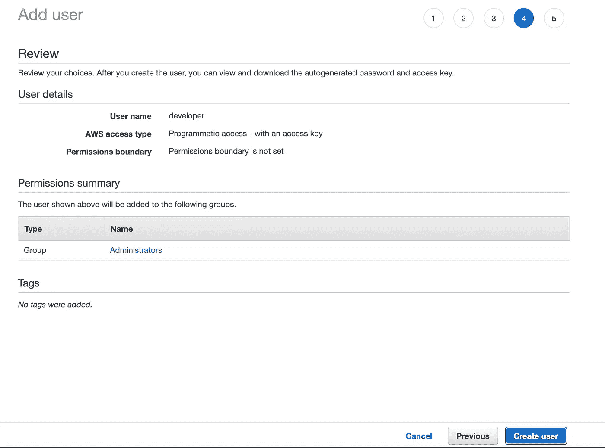

审查— IAM

当你进入**最终**页面时，你可以查看或下载访问密钥。

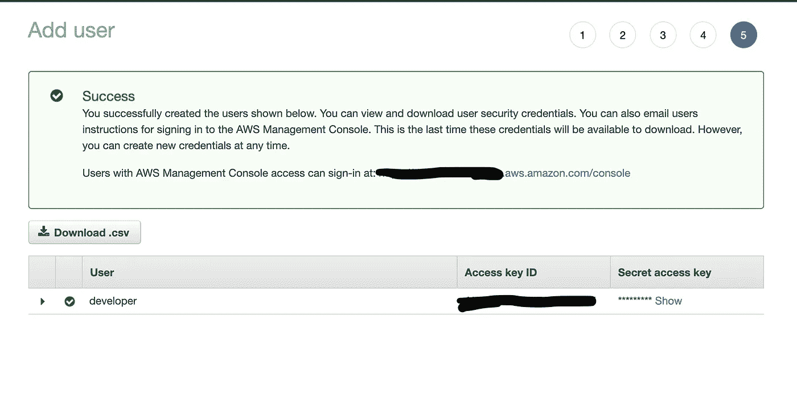

保存**访问密钥 ID** 和**秘密访问密钥**很重要，因为我们将需要它。关于如何创建 IAM 用户的更多细节。

接下来，我们还需要在本地机器上安装 AWS-SDK:

```
$ **npm install -g aws-sdk**
```

我们还需要安装 [AWS CLI](https://aws.amazon.com/cli/) 。在 macOS 上，我们可以通过在命令行上运行以下命令来安装:

```
$ **brew install awscli**
```

然而，AWS CLI 依赖于 [Python](https://www.python.org/downloads/) 或 [Pip](https://pypi.python.org/pypi/pip) 。请找到更多关于如何安装 Python 或 [Pip](https://pip.pypa.io/en/stable/installing/) 或 [AWS CLI](https://serverless-stack.com/chapters/configure-the-aws-cli.html) 的信息。

接下来，我们需要为 AWS 命令行界面(AWS CLI)配置设置，以使我们能够与 AWS 进行交互。我们需要之前保存的**访问密钥 ID** 和**秘密访问密钥。**在命令行上运行以下命令:

```
$ **aws configure**
```

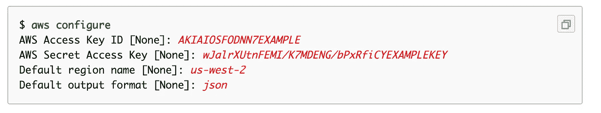

AWS 配置— [配置基础知识](https://docs.aws.amazon.com/cli/latest/userguide/cli-configure-quickstart.html)

并输入您的**访问密钥 ID、秘密访问密钥、区域**和首选**输出格式。**

当您运行命令`**aws configure**`时，`**credentials**`和`**config**`文件得到更新。`**credentials**`文件在 Linux 或 macOS 上位于`**~/.aws/credentials**`和`config`的`**~/.aws/config**`处，或者在 Windows 上位于`**C:\Users\*USERNAME*\.aws\credentials**`和`**C:\Users\*USERNAME*\.aws\config**`处。这些文件可以分别包含`**default**`概要文件和任何命名概要文件的凭证细节和配置设置。您可以通过添加其他配置文件来手动更新文件。参见[配置基础](https://docs.aws.amazon.com/cli/latest/userguide/cli-configure-quickstart.html)以及如何 [**设置 AWS —凭证**](https://www.serverless.com/framework/docs/providers/aws/guide/credentials/) 。

接下来发生的是，后台无服务器使用这些凭证和 AWS SDK 在凭证中指定的 AWS 帐户中创建必要的资源。

# 部署

有些情况下，我们可能希望为每个项目/阶段/环境指定不同的 AWS 概要文件。这使得我们项目中的每个环境都有自己的 API 端点、数据库表和 IAM 策略。我们可以通过使用 [**AWS 组织**](https://aws.amazon.com/organizations/) 将环境保存在单独的 AWS 帐户中来做到这一点。

## **创建新的 AWS 配置文件**

只有当您打算在部署期间使用一个不同的概要文件或者多个概要文件时，这才是必要的。

要创建一个新的 AWS 概要文件，请遵循本文开头概述的步骤— **设置 AWS** 并记下**访问密钥 ID** 和**秘密访问密钥**。接下来，在 AWS CLI 中配置新的概要文件，如下所示:

```
$ **aws configure --profile <NEW-PROFILE>**
```

其中`**<NEW-PROFILE>**`是您的新 AWS 配置文件的新版本。不需要改变**默认区域名称**和**默认输出格式**。

在本文的开始，我们使用了`**serverless invoke local**`命令，在本地运行我们未部署的 Lambda 函数，在`**[default]**`标签下的`**~/.aws/credentials**`中使用默认的 AWS 概要文件。我们可以在命令中切换配置文件，如下所示:

```
$ AWS_PROFILE**=**<NEW-PROFILE> serverless invoke local --function hello
```

通过在我们的`**serverless invoke local**`命令的开头添加`**AWS_PROFILE=<NEW-PROFILE>**`，我们设置了一个变量，AWS SDK 将使用这个变量来计算出您的默认 AWS 概要文件是什么。

我们还可以导出这个概要文件，这样我们就不需要每次都在命令行上指定:

```
$ export AWS_PROFILE**=**<NEW-PROFILE>
```

## **在部署时设置每个阶段的配置文件**

我们可以使用以下命令在每个阶段使用多个概要文件进行部署:

```
$ serverless deploy --stage <STAGE> --aws-profile <PROFILE>
```

其中`**<STAGE>**`可以是`**dev**`或`**prod**`，而`**<PROFILE>**`是 AWS 概要文件的名称。

为了简化这个过程，并使我们不需要在部署命令中指定这些变量，我们可以通过首先修改我们的`**custom**`对象来将概要文件添加到`**serverless.ts**`，如下所示:

```
custom: {
  region: '${opt:region, self:provider.region}',
  stage: '${opt:stage, self:provider.stage}',
  ......
  profile: {
    prod: 'prodAccount',
    dev: 'devAccount'
  }
},
```

然后是`**provider**`对象的`**profile**`属性如下:

```
provider: {
  name: 'aws',
  runtime: 'nodejs12.x',
  ...
  profile: '${self:custom.profile.${self:custom.stage}}'
},
```

这将根据`**custom.stage**`中定义的当前阶段分配我们的配置文件的值。

这意味着，当我们部署到试运行或生产时，无服务器框架将使用分配的配置文件，并在配置文件用户的 AWS 帐户中提供资源。现在我们可以这样做:

```
$ serverless deploy --stage <STAGE>
```

其中`**<STAGE>**`为环境阶段。我们不再需要设置`**--aws-profile**`选项。

## 部署到 AWS

为了进行部署，我们可以通过在您的工作目录中运行以下命令来使用默认的 AWS 概要文件:

```
$ serverless deploy
```

或者，如果您有多个概要文件，并且希望使用特定的概要文件进行部署，那么您必须运行以下命令:

```
$ serverless deploy --stage dev
```

它将使用为`dev`阶段设置的概要文件进行部署。

# 进一步阅读

*   [AWS 身份和访问管理(IAM)](https://aws.amazon.com/iam/)
*   [IAM 基础知识:无服务器管理权限](https://www.serverless.com/blog/abcs-of-iam-permissions)
*   [配置 AWS CLI](https://serverless-stack.com/chapters/configure-the-aws-cli.html)
*   [安装 Python](https://www.python.org/downloads/)
*   [安装 Pip](https://pip.pypa.io/en/stable/installing/)
*   [配置多个 AWS 配置文件](https://serverless-stack.com/chapters/configure-multiple-aws-profiles.html)
*   [IAM 中的安全最佳实践](https://docs.aws.amazon.com/IAM/latest/UserGuide/best-practices.html)