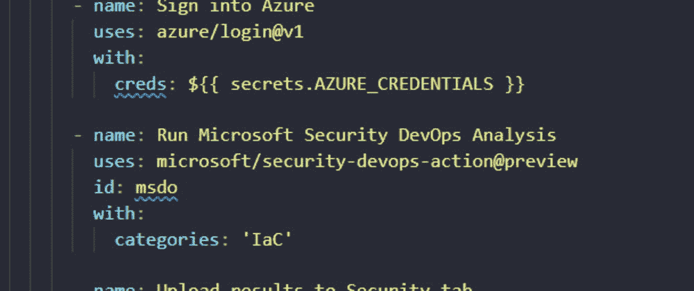
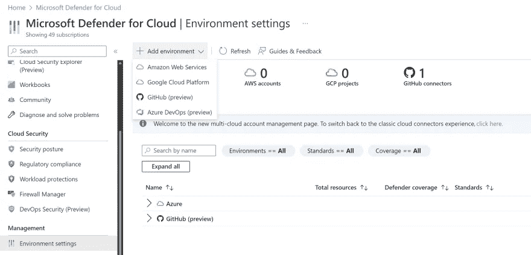
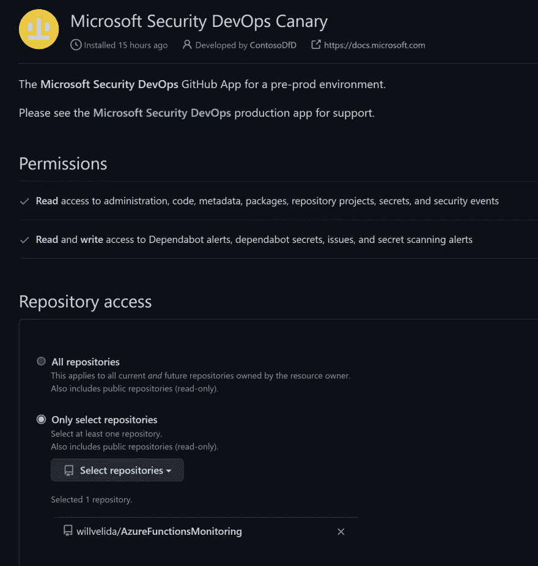
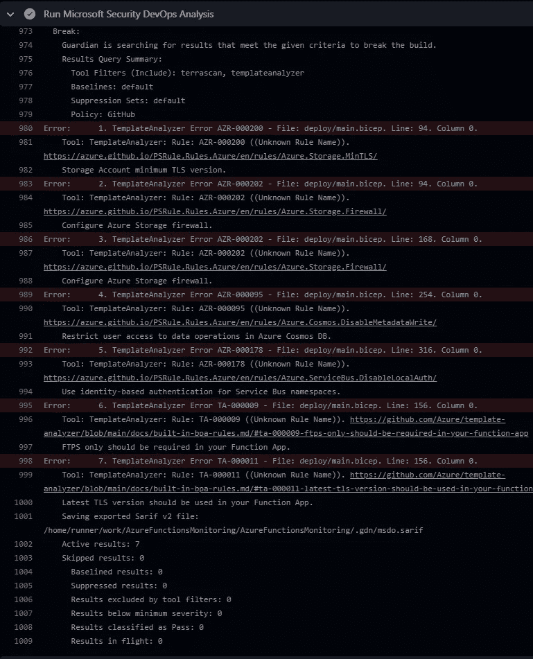
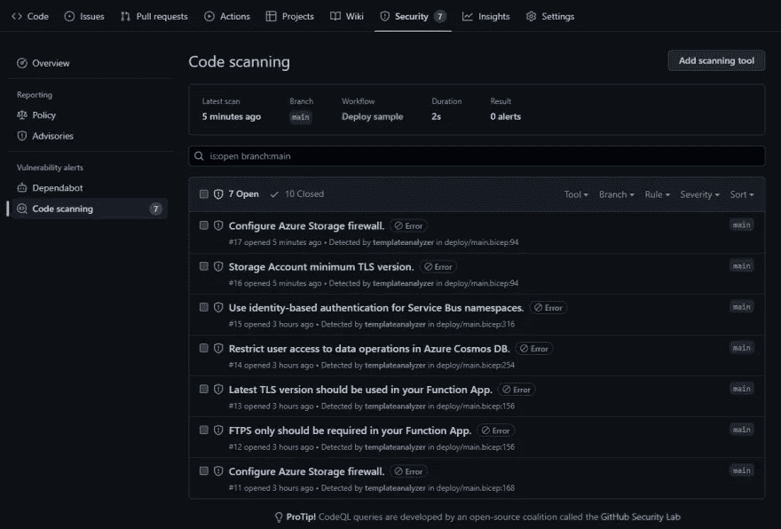
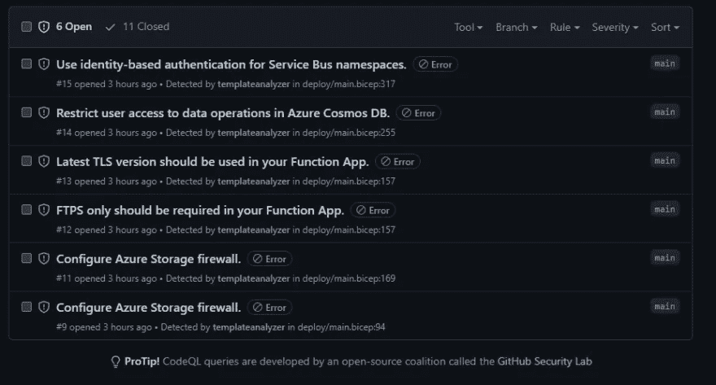

# 使用 Microsoft Defender for DevOps 在 GitHub 中配置 Bicep 代码扫描

> 原文：<https://levelup.gitconnected.com/configure-bicep-code-scanning-in-github-with-microsoft-defender-for-devops-bc17b413878>

## 使用 Microsoft Defender for DevOps，我们可以对我们的 Bicep 代码运行漏洞扫描



> 我在这里的个人博客上也发表过这篇文章:[用微软 Defender for DevOps 在 GitHub 中配置 Bicep 代码扫描| Will Velida](https://www.willvelida.com/posts/configuring-bicep-code-scanning-github/)

Microsoft Defender for DevOps 是 Defender for Cloud 中的一项新功能，它提供了跨多个 DevOps 环境的可见性，您可以使用它来集中管理 DevOps 安全性，加强您的代码基础架构，并帮助您确定跨管道和多个云环境的代码中的关键问题的优先级。

该功能目前处于预览版，支持 GitHub 和 AzureDevOps(不久将支持更多平台)。作为我在微软工作的一部分，我花了很多时间帮助工程师使用基础设施作为代码来向 Azure 提供他们的资源，并帮助他们建立自动化部署的管道。在以前的角色中，我已经在构建管道中使用静态代码分析来扫描我的应用程序代码中的漏洞，所以自然地，我渴望尝试一下这个特性，并将其应用到我的 Bicep 代码中。

我非常喜欢像对待应用程序部署一样对待您的基础架构部署。类似的原则也适用，例如验证和测试您的代码，在环境中应用部署门等。因此，对基础设施代码运行静态代码分析来扫描漏洞是有意义的。

在本文中，我将向您展示如何设置 Defender for DevOps，将您的 GitHub 帐户连接到 Defender for DevOps，设置您的 GitHub 操作工作流以运行扫描，然后将扫描结果发布到 GitHub，以便您可以修复问题。

# 为 DevOps 设置 Defender

第一步是将我们的 GitHub 帐户连接到 Microsoft Defender for Cloud。前往 Azure 门户，导航至 Microsoft Defender for Cloud。

一旦你在那里，点击**环境设置**，点击**添加环境**。从下拉菜单中选择 **GitHub(预览)**。



在撰写本文时，该功能还处于预览阶段。据我所知，定价细节还没有发布，但现在它是免费的！

预览版的一个限制是底层资源只能提供给美国中部地区。

要创建 GitHub 连接，您需要给它一个名称，资源组，设置区域为美国中部，选择免费计划，然后授权连接到 GitHub。

一旦您授权了 Defender for DevOps，您将需要在您的存储库上安装 Defender for DevOps 应用程序。这里的巧妙之处在于，你可以选择将应用程序安装在你所有的存储库上，或者只选择其中的一个。

我只选择了一个库来测试这个，但是我可能会在将来向更多的库开放。



现在您已经安装了应用程序，您可以开始在您的 GitHub Actions 工作流中使用它(在您安装应用程序的存储库中)。

# 设置 GitHub 操作工作流程

我们将在这里使用的 GitHub 动作是[Microsoft/security-devo PS-Action](https://github.com/microsoft/security-devops-action)。这是一个 CLI 应用程序，它将静态分析工具集成到开发生命周期中。

Security DevOps 使用了一些开源工具，包括[模板分析器](https://github.com/Azure/template-analyzer)，我们将使用它来扫描我们的 Bicep 文件。

看看微软安全开发操作中的 [action.yml](https://github.com/microsoft/security-devops-action/blob/main/action.yml) 文件，我们可以对我们在应用程序、应用程序代码、构建工件、容器和基础设施代码中使用的秘密运行该操作。

通过这一操作，我们希望能够扫描我们的基础架构代码以发现漏洞，然后发布任何漏洞，以便我们可以开始修复它们。

在 GitHub 动作工作流文件中，您可以这样设置:

```
scan-bicep-code:
    needs: [validate]
    runs-on: ubuntu-latest
    steps:
      - uses: actions/checkout@v3
      - name: Sign into Azure
        uses: azure/login@v1
        with:
          creds: ${{ secrets.AZURE_CREDENTIALS }}

      - name: Run Microsoft Security DevOps Analysis
        uses: microsoft/security-devops-action@preview
        id: msdo
        with:
          categories: 'IaC'

      - name: Upload results to Security tab
        uses: github/codeql-action/upload-sarif@v1
        with:
          sarif_file: ${{ steps.msdo.outputs.sarifFile }}
```

在上面的代码片段中，我们正在运行 Microsoft Security DevOps 分析工具，并将其配置为仅扫描我们的基础架构代码，然后我们将结果上传到一个 [SARIF](https://sarifweb.azurewebsites.net/) 结果文件，该文件将在 GitHub 存储库中的 Security 选项卡中可见。

# 查看结果并修复问题

一旦任务在您的管道中完成，您可以在 runner 日志中看到结果，如下所示:



此任务会生成一个 SARIF 文件，该文件会上传到我们存储库中的 Security 选项卡。因此，与其在 GitHub Action runners 中查看某个步骤的输出日志，不如在 Security 选项卡中查看，如下所示:



现在我们的扫描结果已经发布，我们可以开始修改我们的 Bicep 代码来解决这些问题。例如，我应该在我的存储帐户上设置最低 TLS 版本，如下所示:

```
resource orderGeneratorStorage 'Microsoft.Storage/storageAccounts@2022-05-01' = {
  name: orderGeneratorStorageName
  location: location
  tags: tags
  sku: {
    name: 'Standard_LRS'
  }
  kind: 'StorageV2'
  properties: {
    supportsHttpsTrafficOnly: true
    accessTier: 'Hot'
    allowBlobPublicAccess: false
    minimumTlsVersion: 'TLS1_2'
  }
}
```

当我将代码上传到 GitHub 并让管道运行时，这个问题现在将被修复，并且不会在我的安全选项卡中显示为未解决的问题:



# 结论

在本文中，我们为 GitHub 帐户设置了 Microsoft Defender for DevOps，并在 GitHub 操作工作流文件中包含了一项任务，该任务扫描 Bicep 代码中的漏洞，并上传扫描结果，以便我们可以修复它们。

我喜欢这个特性，因为它允许我们像对应用程序代码一样，对我们的基础设施代码向左移动并运行漏洞扫描。我希望在未来看到的一件事是能够根据扫描报告的严重性来使构建失败。我今天找不到这样做的方法，所以希望它能在未来出现！

如果您想了解更多关于上述内容的信息，请查阅以下文章:

[](https://learn.microsoft.com/en-us/azure/defender-for-cloud/defender-for-devops-introduction) [## Microsoft Defender for DevOps -优势和功能

### Microsoft Defender for Cloud 支持全面的可见性、态势管理和威胁防护，涵盖…

learn.microsoft.com](https://learn.microsoft.com/en-us/azure/defender-for-cloud/defender-for-devops-introduction) [](https://learn.microsoft.com/en-us/azure/defender-for-cloud/github-action) [## 配置 Microsoft Security DevOps GitHub 操作

### Microsoft Security DevOps 是一个命令行应用程序，它将静态分析工具集成到开发中…

learn.microsoft.com](https://learn.microsoft.com/en-us/azure/defender-for-cloud/github-action) [](https://learn.microsoft.com/en-us/azure/defender-for-cloud/iac-vulnerabilities) [## 作为云的代码卫士，发现基础架构中的错误配置

### 一旦您设置了 Microsoft Security DevOps GitHub 操作或 Azure DevOps 扩展，您就可以配置 YAML…

learn.microsoft.com](https://learn.microsoft.com/en-us/azure/defender-for-cloud/iac-vulnerabilities) 

如果你有任何问题，欢迎在推特上联系我: [@willvelida](http://twitter.com/willvelida)

下次见，编码快乐！🤓🖥️