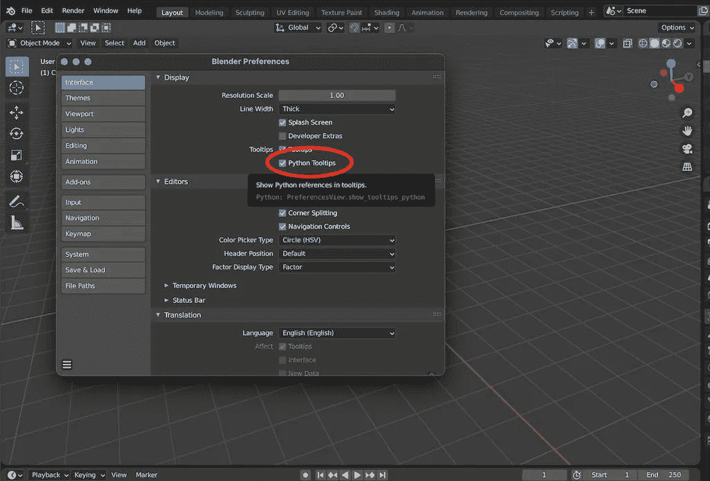
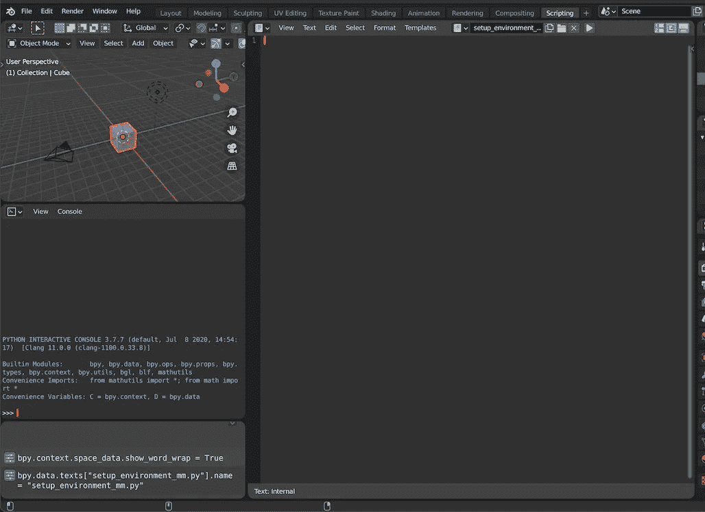
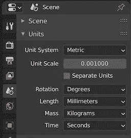
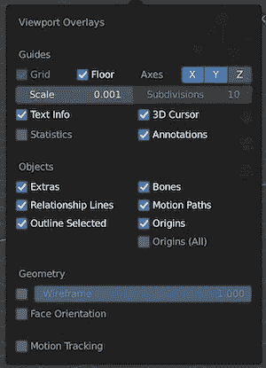
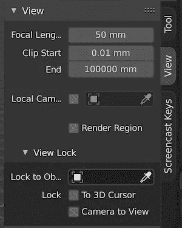

# 通过 Python 启动 3D 打印搅拌机

> 原文：<https://levelup.gitconnected.com/configure-blender-for-3d-printing-via-python-ecf729e4099b>

写教程很好——而且我一直没有做；事情很糟糕，我已经做得太多了。是时候开始改变这两种状况了。此外，编写这种样板有用的代码是我 1000%倾向于做的事情，然后忘记我是如何做的。我想我不是唯一的一个，但即使是这样，写下这些笔记来帮助未来的吉姆仍然是值得的。

Blender 非常适合 3D 打印，但每次配置环境都很繁琐——在 Blender 和 YouTube 之间来回点击试图记住所有要更改的设置并没有成功。最后，事实证明这是开始学习 Blender Python API 的一个非常好的方法。

要完全访问 Python 脚本中生成的调试输出，请从命令行启动 Blender。因为这将随着操作系统的不同而不同，所以请查看 Blender 的文档:从命令行启动。

为了方便起见，我包括的所有截图都展示了 Blender 脚本环境——但是任何文本编辑器都可以工作。

同样值得进入*编辑>偏好设置>界面*并启用 *Python 工具提示*复选框。



GUI 中的一切都符合 Blender Python API

从这里开始，一切都可以通过脚本工作区来完成，要么创建一个新的。py 文件，或者通过文件浏览器导入一个。



默认工作空间包括一个控制台和一个信息面板，信息面板反映了在 GUI 中采取的操作所执行的底层 Python。要进行全面调试，您必须切换到启动 Blender 的 CLI。

现在进行实际的编码。有 5 个小步骤:

1.  定义导入和常量

2.将场景比例和单位从米更改为毫米

3.配置视口以更新的比例显示

4.确保正式的 3D 打印工具加载项已启用

5.移除默认场景对象

```
import bpy
from addon_utils import check, enable
C = bpy.context
D = bpy.dataSCALE_LENGTH = 0.001
LENGTH_UNIT = ‘MILLIMETERS’
MASS_UNIT = 'GRAMS'
CLIP_END = 100000
PRINT_UTIL = “object_print3d_utils”
```

“导入 bpy”加载 Blender Python。“addon_utils”功能将用于启用 3D 打印工具。“C”和“D”是 Blender Python 标准，用来给“bpy.context”和“bpy.data”起别名，它们是经常使用的对象。

```
def config_units():
    C.scene.unit_settings.scale_length = SCALE_LENGTH
    C.scene.unit_settings.length_unit = LENGTH_UNIT
    C.scene.unit_settings.mass_unit = MASS_UNIT
```

直白。相当于在“场景属性”面板上更新“单位比例”、“长度”和“质量”。例如，如果您正在对运动零件，齿轮进行建模，并计划使用动画来检查它们的平滑操作，则设置“质量”很有帮助。



场景属性->单位->下拉菜单…

```
def config_viewports():
    screens = D.screens
    viewareas = [
        area for screen in screens 
        for area in screen.areas 
        if area.type == ‘VIEW_3D’
       ]
    for area in viewareas:
        area.spaces.active.overlay.grid_scale = SCALE_LENGTH
        area.spaces.active.clip_end = CLIP_END
```

这一步有点有趣:使用 List Comprehension，该函数遍历每个工作空间，并过滤以仅选择 3D 视口编辑器。从那里，这只是一个为网格比例和剪辑结束设置新值的情况，相当于在“覆盖”下拉菜单和“查看”侧栏中进行调整。



视口覆盖-比例:1 -> .001



查看侧边栏:剪辑结束有单位重视。1000 米-> 1000 毫米-> 100000 毫米

```
def enable_print_util():
    is_enabled, is_loaded = check(PRINT_UTIL)
    if is_enabled and is_loaded:
        return
    try:
        bpy.ops.preferences.addon_enable(module=PRINT_UTIL)
    except:
        print(f"ERR: Error loading {PRINT_UTIL}")
    finally:
        return
```

这是使用“addon_utils”模块导入的地方。该函数检查官方 Blender Mesh 3D-Print Toolbox 附加组件是否已经加载并启用。如果是，函数返回，否则，启用模块。bpy 方法被包装在一个 try-catch 中，以便在处理依赖关系时安全起见。

```
def remove_default_objects():
    bpy.ops.object.select_all(action=’SELECT’)
    if len(C.selected_objects) <= 3:
        bpy.ops.object.delete(use_global=True)
```

长期受苦的默认立方体再次得到它。这个辅助函数是可选的，但是工作起来非常简单——选择场景中的所有对象(包括默认灯光和默认相机)并删除它们。作为一种安全措施，如果在已经创建了更多对象的文件上调用这个脚本，对 delete 方法的调用被包装在一个条件后面，并且如果选择了 3 个以上的对象，将不会触发。

最后，剩下的就是调用函数了:

```
config_units()
config_viewports()
enable_print_util()
remove_default_objects()
```

现在，这个脚本可以在任何项目中运行，它将设置导出到 3D 打印的模型。但是这仍然意味着点击进入脚本工作区，加载并执行它。幸运的是，Blender 使得在启动时执行 Python 脚本变得很容易。从 CLI 运行，只需传入'-P '标志和脚本的相对路径:

```
blender -P ./setup_environment_mm.py
```

这可以作为一个单词命令的别名出现在它自己的 shell 脚本中，但是这似乎是一个很好的地方。以下是整个剧本的要点: