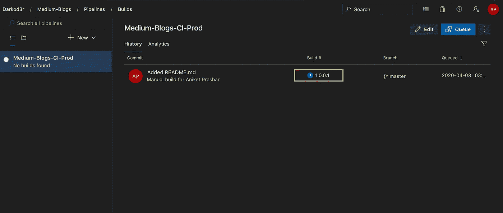

# 使用 Azure DevOps 为 NodeJs 应用程序配置 CI/CD 管道

> 原文：<https://levelup.gitconnected.com/configure-ci-cd-pipelines-for-nodejs-applications-with-azure-devops-44e7425f5a99>

使用 Azure DevOps 管道来构建和测试 Node.js 应用，然后部署或发布到 Azure 应用服务。以下是完整 CI/CD 工作流要执行的步骤。

1.  在开发分支中开发并提交您的代码。
2.  从开发分支推代码到→测试分支→主分支。
3.  在不同的环境中部署您的代码；在 Azure DevOps 中使用 CI/CD 管道进行开发→测试→生产。

用于 NodeJs/Javascript 应用程序的 0.1 Azure DevOps CI/CD 工作流

# 创建生成管道

*   前往[dev.azure.com/](http://dev.azure.com/$){组织名称} →选择项目→管道

1.1 转到项目→管道

*   创建新管道→使用 Azure Git Repos (YAML)创建管道作为代码，或者使用**经典编辑器**从可视化设计器创建管道。对于本教程，我们将使用经典编辑器。
*   选择源存储库→选择项目名称→选择存储库→选择分支名称→单击继续。
*   选择模板作为**空工单。**

1.2 使用经典编辑器创建新管道

*   根据您组织的命名约定更改构建管道的名称→根据需求选择**代理池**{ Hosted vs 2017-win 2016 for Windows Environment&Hosted Ubuntu 18.04 for Linux based Environment }。
*   将这些代理想象成具有不同操作系统风格的虚拟机。
*   除非您知道自己在做什么，否则最好使用 Microsoft 托管代理，而不是自托管代理😕
*   选择 Tag Sources → on success，以便在构建成功时创建 [git 标记](https://git-scm.com/book/en/v2/Git-Basics-Tagging)。您可以将标记格式保持为 **$(build.buildNumber)或 v$(build.buildNumber)。**

1.3 选择代理池

*   点击添加任务(+) →搜索任务→添加任务
*   您可以添加多个任务。
*   如果任务在您的组织中不可用，您可以从 Marketplace 安装它。

# 任务详细信息

*   **NodeJS 工具安装器**——查找或下载并缓存 Node.js 的指定版本规范，并将其添加到 PATH 中
*   最新的 LTS 节点版本已安装在代理上，由 Microsoft 管理。如果您在项目中使用特定版本的 Node，则使用此任务指定您想要使用的确切版本。

1.4 节点。Js 工具安装程序任务

*   **npm 任务-** 安装并发布 NPM 软件包，或者运行 NPM 命令。支持 npmjs.com 和认证注册中心，如 Azure 工件。
*   可用命令:CI、安装、发布、自定义。
*   对于自定义命令，不需要预先考虑 npm。
*   包含包文件夹的根目录: **${Build。SourcesDirectory}-** 它是一个预定义的变量。代理上下载源代码文件的本地路径。例如:c:\agent\_work\1\s .这些变量由系统自动设置，只读。
*   关于预定义变量的更多信息:转到[预定义变量](https://docs.microsoft.com/en-us/azure/devops/pipelines/build/variables?view=azure-devops&tabs=yaml)
*   一项任务可以有多个版本。确保使用稳定版本，避免使用预览版本。

1.5 安装盖茨比命令行界面

*   npm **install** 命令将在开发环境(默认)中的包目录内运行时安装 **devDependencies** 以及其他**依赖项**。
*   每次触发新的构建时，都会有一个新的代理实例，它不包含任何 npm 缓存。
*   避免在生产环境中安装 **devDependencies** 。使用自定义命令→ **install — only=prod**
*   我们可以为单元测试、林挺等添加 npm 任务。如果测试成功，那么唯一的管道将会成功。

1.6 安装节点模块

*   使用环境变量来参数化命令。使用**运行构建-$(变量名)→** 转到**变量选项卡** → **添加变量** → **变量名→值**

1.7 构建解决方案

1.8 添加环境变量

*   **归档文件:**将文件压缩成. 7z、. tar.gz 或. zip。
*   我们将进行 zip 部署以减少部署时间。我们也可以使用复制任务来创建工件，但是由于将会有大量的文件，所以与 zip 部署相比，它将会更慢。在这里找到更多关于 zip 部署的信息。
*   指定要存档的文件夹/目录。公开的/公开的。
*   指定将创建的归档文件名。
*   **添加根文件夹名称**→该复选框将创建一个具有存档名称的文件夹，并在存档前将所有文件放入该文件夹。
*   替换现有的档案库 -这个复选框将在每次新构建时创建新的档案库之前删除以前的档案库。

1.9 归档可部署的组件

*   **发布构建工件:**将构建工件发布到 Azure 管道或 Windows 文件共享。
*   保留默认设置。
*   您可以给出一个定制的工件名称。

1.10 发布构建工件

*   启用持续集成，以便在过滤器分支发生任何变化时触发构建管道。

1.11 实现持续集成

*   内部版本号格式将创建内部版本号作为**专业。minor . patch . uniqueid**→1.0.0.1(语义版本化)
*   buildId 的语义版本将更有意义🤔而不仅仅是一个唯一的编号作为 buildId。
*   建造。BuildId 是一个预定义的变量，每当一个新的构建被赋予组织级别的范围(1，2，3…n)。

1.12 自定义内部版本号格式以使用语义版本化

*   在变量选项卡中添加变量 Major、Minor 和 Patch。
*   Major- 1，Minor- 0，Patch-**$[counter(format(' { 0 })。“{1}”，变量['大调']，变量['小调']，0)]**
*   补丁变量将从 0 开始，并在每次触发新构建时递增。当主要或次要值改变/增加时，它将重置为 0。
*   保持这两个变量在运行时可设置，以便应用程序团队可以在运行时更改主/次版本。

1.13 为主要变量、次要变量和补丁变量添加计数器

1.14 自定义 BuildId-语义版本化

*   我们还可以安排构建时间

1.15 构建调度程序

*   **History 选项卡:**查看对构建管道所做更改的历史，并比较差异。
*   使用 **Revert Pipeline** 选项，也可以将管道恢复到之前的状态。

1.16 历史选项卡，用于比较和恢复更改

# 如果您必须在您的项目中创建许多将使用同一组任务的管道，该怎么办🤔

**任务组:**如果在不同的管道中有相似的任务，无论是在同一个项目中还是在不同的项目中，您都可以从现有的管道任务中创建任务组，如图所示。选择所有任务，右键单击→选择创建任务组。

1.17 任务组

*   如果任务中的参数不同，那么您可以将其编写为 variable $(variable-name ),当您将其添加为任务组时，它会要求您提供值，如下图所示。

1.18 任务组中的参数

*   我们可以导出和导入任务组，以便在多个 Azure DevOps 项目中使用它。

1.19 出口任务组

1.20 导入任务组

# 创建发布管道

*   转到[dev.azure.com/](http://dev.azure.com/$){组织名称} →选择项目→管道→发布。

2.1 创建发布渠道

*   新管道→选择**空作业**
*   重命名阶段
*   点击添加工件→选择源构建管道→默认版本:最新→工件别名:默认→添加
*   **源别名:**它将在代理中创建一个具有相同名称源别名的文件夹(在我们的例子中为 *_Medium-Blogs-CI-Prod* )。工件将存储在代理的这个文件夹中。

2.2 发布管道中的阶段

*   启用**连续部署。**每当与此管道相关的新版本可用时，都会触发新版本。
*   启用分支筛选器，仅从选定的分支触发释放。

2.3 持续部署触发器

*   编辑管道名称→添加任务:Azure 应用服务部署

2.4 在代理作业中添加任务

*   转到代理作业→根据要求选择**代理池**{用于 Windows 环境的托管 vs 2017-win 2016&用于基于 Linux 的环境的托管 Ubuntu 18.04。
*   除非您知道自己在做什么，否则最好使用 Microsoft 托管代理，而不是自托管代理😕

2.5 代理规格

*   为基于 windows 的计算机选择应用服务类型作为 Windows 上的 Web 应用(任务版本 4) / Web 应用(任务版本 3)。
*   仅对生产管道选中“部署到插槽”
*   包或文件夹: **$(系统。DefaultWorkingDirectory)/**/*。zip** →该选项将在默认工作目录中查找任何 zip 文件。示例位置:-链接的工件→工件别名→工件名称→ ${BuildId}。活力

2.6 Azure 应用服务部署任务

*   **附加部署选项**:如果未选中，它将根据您的应用类型、包格式和其他参数自动检测最佳部署方法。选择选项以查看支持的部署方法，并选择一种方法来部署您的应用程序。
*   **使应用程序离线**:在同步操作开始之前，通过将 app_offline.htm 文件放在应用程序服务的根目录中，选择使 Azure 应用程序服务离线的选项。同步操作成功完成后，该文件将被删除。
*   **删除目标位置的其他文件**:选择该选项可删除 Azure 应用服务上的文件，这些文件在应用服务包或文件夹中没有匹配的文件。注意:这还将删除与此 Azure 应用服务上安装的任何扩展相关的所有文件。要防止这种情况，请选择“从 App_Data 文件夹中排除文件”复选框。
*   **从 App_Data 文件夹中排除文件**:选择该选项可防止 App_Data 文件夹中的文件被部署到 Azure App Service 或从 Azure App Service 中删除。

2.7 其他部署选项

# 如果 web 应用程序不是静态的呢🤔

我们将不得不在 Azure 应用服务上启动一个节点服务器来服务这些请求。

*   要在 windows 应用服务中启动节点服务器，我们必须在目录的根目录中包含一个 web.config 文件。
*   要在发布期间创建 web.config 文件，请转到**文件转换&变量替换选项→检查生成 web。Config** 复选框，提供 web.config 文件的参数，如服务器文件名、app 类型等。它将生成一个 web.config 文件，该文件将在 web 应用程序中启动 node.exe 服务器
*   web.config 文件可能因应用程序而异。因此，使用一个自定义的 web.config 文件，并将其保存在源代码中，而不是在运行时生成。当它生成 web.config 文件时，它首先尝试在一个临时位置(有限的内存)解压缩工件 zip 文件，然后将配置文件放入其中，然后再次压缩。这需要很多时间，如果 zip 文件包含太多文件，那么它可能会由于内存限制而失败。它使用一个节点包来压缩和解压缩文件。我在有大量文件的多个应用程序中遇到过这个问题。一种解决方法是在构建管道中使用复制任务，而不是归档任务，但这会降低管道的速度。
*   **部署后选项:**这些脚本将在成功部署软件包后运行。您可以在设计器本身中给出一个内联脚本，或者可以使用工件目录中的脚本文件。

2.8 生成 web.config 文件

## 对于生产流水线，我们将不得不为插槽交换增加一个阶段。

*   在生产管道中添加一个新阶段用于插槽交换。
*   首先需要在 app service 中创建一个名为 Inactive/canary(取决于部署类型)的新插槽。
*   在第一个插槽(非活动插槽)中，选中复选框- **部署到插槽或应用服务环境→** 提供插槽名称(非活动/淡黄色)。
*   它将首先在非活动/淡黄色插槽中部署程序包，然后将其与活动插槽交换。这将确保生产部署中的零停机时间。

2.9 检查→部署到插槽或 App 服务环境→非活动插槽

*   由于一个插槽也托管一个应用程序，所以它也将消耗 ASP 的内存，这可能会降低生产应用程序的性能。
*   因此，我们将在不使用时停止金丝雀/非活动插槽，即在插槽交换后，并在金丝雀/非活动插槽中部署之前启动插槽。
*   在 Azure App Service Deploy 任务之前添加 **Azure App Service Manage** 任务，并将 Action 设置为 **Start App Service**

2.10 此任务将在部署前启动非活动插槽

2.11 添加插槽交换阶段

*   **预部署条件:**选择此选项为插槽交换阶段添加批准者。您可以添加多个批准人或一组批准人。

2.12 部署前批准

*   添加任务- **Azure 应用服务管理器**，它可以启动、停止、重启、插槽交换、安装站点扩展或启用对 Azure 应用服务的持续监控

2.13 插槽交换

*   在插槽交换完成后，我们将停止非活动/金丝雀插槽，以减少不必要的资源消耗。

2.14 部署前启动插槽

# 改进的余地

1.  IaC(作为代码的基础设施)——这篇文章是为初学者准备的。如果你已经熟悉 CI/CD 管道，那么多级 YAML 管道是一个不错的选择。
2.  通过使用 npm 缓存❗❓提高构建管道性能
3.  在构建管道中使用像 SonarQube 这样的静态代码分析工具。
4.  构建对拉请求的验证。

**如果您需要任何帮助或有任何建议，请通过** [**LinkedIn**](https://www.linkedin.com/in/aniketprashar) 与我联系