# 像专业人士一样为您的 React 项目配置 Eslint 和更漂亮的

> 原文：<https://levelup.gitconnected.com/configure-eslint-and-prettier-for-your-react-project-like-a-pro-2022-10287986a1b6>


## [⚛️](https://emojipedia.org/atom-symbol/)第一步

创建 react 应用程序并在终端中输入您的应用程序。(我的应用程序是您的应用程序的名称，您可以随意使用)

```
npx create-react-app my-app
cd my-app
```

## [🌋](https://emojipedia.org/volcano/)第二步

使用以下内容将 Eslint 初始化到您的应用程序:

```
npm init [@eslint/config](http://twitter.com/eslint/config)
```

之后这个配置开始问一些你让我们一起回答的问题。

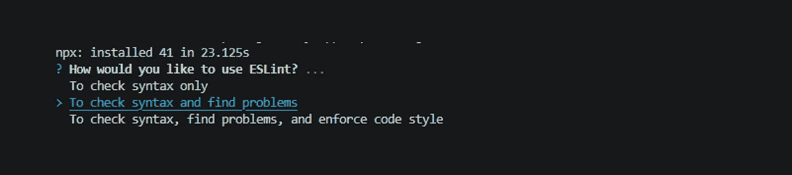

选择 ***【检查语法，查找问题】*** 。当您选择此选项时，下一步它将询问(使用导入和导出，这就是为什么使用 Javascript 模块(导入/导出):

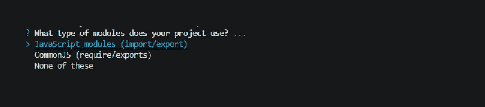

接下来的问题是关于框架的。我们选择 React，因为我们现在使用 React)。

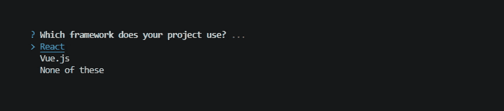

如果你使用 react with typescript，你可以选择“是”,它会自动为林挺 typescript 创建和下载插件。

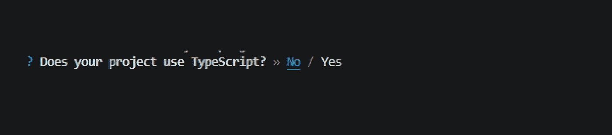

我们在浏览器中运行我们的代码，这就是为什么我们应该选择浏览器。

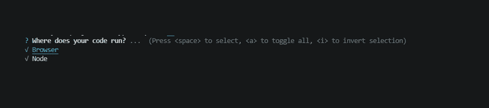

我们还可以选择 Eslint 文件的格式(eslint.json 或 esling.js)。我更喜欢 JSON。

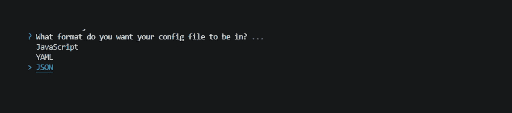

最后一步 Eslint init 要求我们现在下载 Eslint 插件，以及使用哪个包管理器。

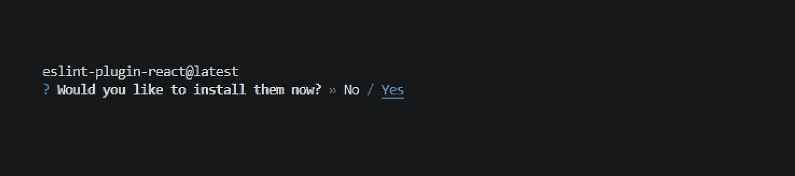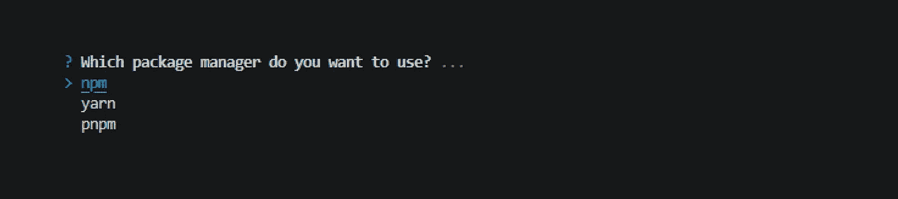

下载完软件包后，Eslint 配置已经为我们的模板准备好了，我们有了一个新文件。

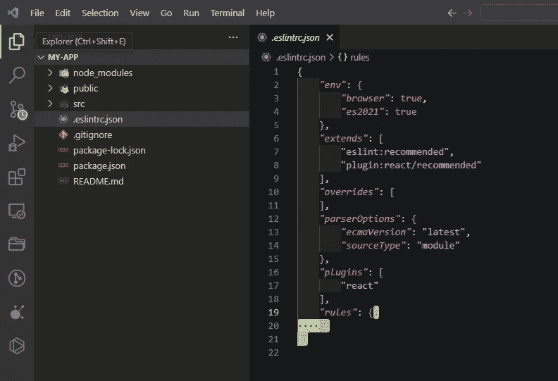

# [🎀让我们为我们的模板添加更漂亮的。](https://emojipedia.org/ribbon/)

根据您的软件包管理器，您可以使用这两个选项。

```
npm install --save-dev --save-exact prettier
yarn add --dev --exact prettier
```

安装后，转到. eslintrc.JSON 文件，在“扩展”中添加“漂亮”插件。

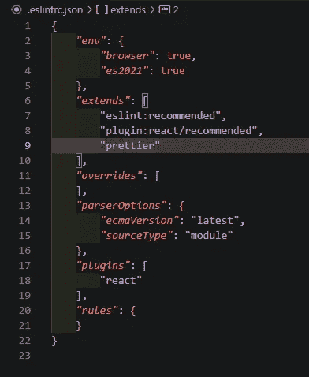

# [❓](https://emojipedia.org/question-mark/) 问题:我们在项目中实现了 Eslint 和 prettier，但是我们如何运行它呢？

我们以两种方式运行林挺和格式化。

1.  *将其添加到 package.json 中，并通过向终端写入 npm run 命令来运行它。*
2.  *为 VSCode 添加设置，以便在我们保存它时自动运行。*

**对于第一个，我们需要将这些行添加到 package.json 文件中。**

```
*"lint"*: "eslint src/**/*.{js,jsx,ts,tsx,json}",*"lint:fix"*: "eslint --fix src/**/*.{js,jsx,ts,tsx,json}",*"format"*: "prettier --write src/**/*.{js,jsx,ts,tsx,css,md,json,scss} --config ./.prettierrc"
```

创建`.prettierrc`文件，并在其中写入以下代码行(这是 prettier 的基本设置):

```
{*"semi"*: true,*"tabWidth"*: 2,*"printWidth"*: 100,*"singleQuote"*: true,*"trailingComma"*: "all",*"jsxSingleQuote"*: true,*"bracketSpacing"*: true}
```

你可以从[这里](https://prettier.io/docs/en/configuration.html)找到很多关于 prettier 的信息和配置。

最终，我们可以将它们用于:

```
npm run lint - lint our project
npm run lint:fix - lint and also fix errors in our project
npm run format - format our codes with using prettier
```

**对于第二个，我们创建一个. vscode 文件夹，并在该文件夹中创建 settings.json。**

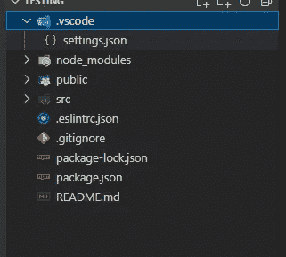

并将这些行添加到 setting.json 文件中。

```
{*"editor.codeActionsOnSave"*: { *"source.fixAll.eslint"*: true },*"editor.defaultFormatter"*: "esbenp.prettier-vscode",*"editor.formatOnSave"*: true}
```

这就是你保存林挺和格式将为您的项目工作。