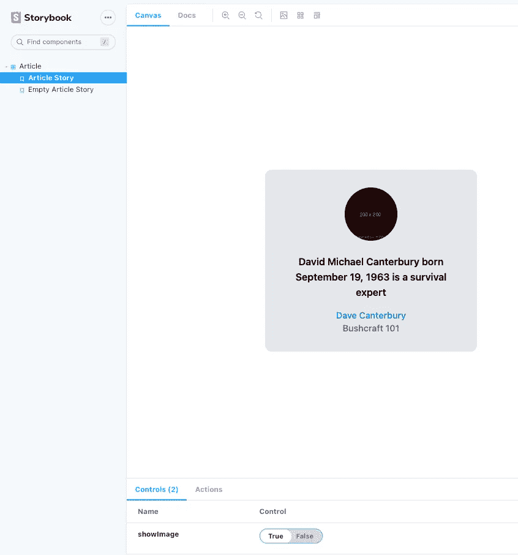
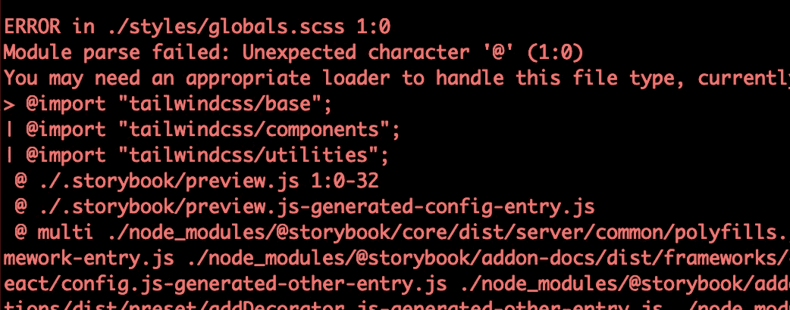

# 用 Storybook 和 TailwindCSS 配置 NextJS

> 原文：<https://levelup.gitconnected.com/configure-nextjs-with-storybook-and-tailwindcss-by-andrea-vassallo-21786844ebdd>

*最初发布于*[*https://nebulab . it*](https://nebulab.it/blog/nextjs-tailwind-storybook/)*。*


在本文中，我们将展示如何使用 [Storybook](https://storybook.js.org/) 和 [TailwindCSS](https://tailwindcss.com/) 创建一个 [NextJs](https://nextjs.org/) 项目。

在开始之前，我想解释谁是参与者，以及为什么将他们添加到我们的前端应用程序会更好。

# NextJS

[NextJS](https://nextjs.org/) 不需要很多演示。如果你在这里，你可能已经知道什么是 NextJS，以及为什么我们应该用它来构建健壮的应用程序。

NextJS 是一个很棒的 [React](https://it.reactjs.org/) 前端框架，它主要用于构建 SEO 友好的应用程序，因为你可以使用三种不同类型的渲染/预渲染方法:

*   SSG(静态站点生成)HTML 是在构建时生成的，将在每个请求中重用
*   SSR(服务器端呈现)使用节点服务器为每个请求生成 HTML，因此响应是 SEO 友好的
*   CSR(客户端渲染)normale [React](https://it.reactjs.org/) 行为，响应只是客户端运行的 Javascript

# 尾翼 CSS

Tailwind 是使用 HTML 类构建应用程序风格的最强大的库之一。TailwindCSS 实现了大量的动态类，这些类将不同的样式规则应用到你的应用程序中，并且它完全可以使用配置文件进行定制！

最初，你需要花时间去理解哪些是你需要用来构建你的界面的正确的类，但是在 Tailwind 中最酷的事情之一是它的超级文档。

顺便说一下，2.0 版本最近发布了许多新功能。

# 故事书

[Storybook](https://storybook.js.org/) 是一个很棒的库，主要用于在 [NextJs](https://nextjs.org/) 环境之外呈现我们的应用程序组件。这意味着您可以检查您的组件 UI，而无需进行真正的查询或获取数据。您还可以根据传递的属性判断出应用程序组件是如何变化的。

[Storybook](https://storybook.js.org/) 在使用组织良好的组件时更加强大，例如，使用[原子设计](https://bradfrost.com/blog/post/atomic-web-design/)。

**示例**

您可能会在您的项目中创建自定义的`Button`组件，该组件将基于传递的属性或获取的数据以不同的方式呈现。有了[故事书](https://storybook.js.org/)，你可以通过应用[故事书](https://storybook.js.org/)面板中的自定义道具或者删除你所有的请求来检查所有的 UI 更改。

# TL；速度三角形定位法(dead reckoning)

在这里你可以找到完整配置的[项目](https://github.com/nebulab/nextjs-storybook-tailwindcss)

# 开始吧！

对于本文，为了更直接，我不会将应用程序分成组件。最好在真实的应用程序中这样做，以避免直接使用`index.js`页面。

最佳实践是编写组件，使用一个很好的文件结构按上下文将它们分开:

*   关于组件的 React 文档:[链接](https://it.reactjs.org/docs/components-and-props.html#extracting-components)
*   关于组件结构的原子设计模式:[链接](https://bradfrost.com/blog/post/atomic-web-design/)

# 创建 NextJS 应用程序

首先，运行这个命令来创建您的 [NextJS](https://nextjs.org/) 项目:

```
npx create-next-app --use-npm nextjs-storybook-tailwindcss
```

并使用`cd nextjs-storybook-tailwindcss`在项目目录中导航。

# 运行应用程序

```
npm run dev
```

# 重构默认代码

因为我们将使用 [TailwindCSS](https://tailwindcss.com/) 来构建我们的风格，所以`create-next-app`命令创建了带有一些不必要配置的项目。

将`pages/index.js`中的内容替换为:

```
**const** Home **=** ({ article, showImage }) **=>** {
  **if** (**!**article) **return** "The article wasn't found!"

  **const** {author, company, image_url, content} **=** article

  **const** Image **=** showImage ? () : ''

  **return** (
    <div className="w-96 mx-auto">
      <div className="h-screen flex items-center">
        <figure className="lg:flex bg-gray-200 rounded-xl p-8 lg:p-4">
          {Image}
          <div className="pt-6 lg:p-4 text-center lg:text-left space-y-4">
            <p className="text-lg font-semibold">{content}</p>
            <figcaption className="font-medium">
              <div className="text-blue-600">{author}</div>
              <div className="text-gray-500">{company}</div>
            </figcaption>
          </div>
        </figure>
      </div>
    </div>
  )
}

Home.defaultProps **=** {
  showImage: **true**
}

**export** **const** getServerSideProps **=** async () **=>** {
  **const** response **=** await fetch('http://localhost:3000/api/article')
  **const** data **=** await response.json()

  **if** (**!**data) **return** { props: {}}

  **return** {
    props: {
      article: data
    }
  }
}

**export** **default** Home
```

添加创建该文件的第一个 API`pages/api/article.js`:

```
**const** Article **=** (_, res) **=>** {
  res.statusCode **=** 200
  res.json({
    id: 1,
    author: 'Andrea Vassallo',
    company: 'Nebulab',
    image_url: 'http://placekitten.com/200/200',
    content: 'The cat is a domestic species of small carnivorous mammal.'
  })
}

**export** **default** Article
```

删除 CSS 文件:`styles/Home.module.css`:

```
rm styles/Home.module.css
```


结果是一个丑陋和无聊的 HTML 页面。

## **我们去应用我们牛逼的风格吧。**

# 安装尾翼 CSS

*为什么在这种情况下文档不够？*

*因为*[*next js*](https://nextjs.org/)*想出了一堆预先配置好的服务比如巴别塔*[*PostCSS*](https://postcss.org/)*我们还得*[*TailwindCSS*](https://tailwindcss.com/)*跟他们一起*。

阅读 [TailwindCSS](https://tailwindcss.com/) 文档，您会发现我们需要三个不同的库来完成安装:

我们不需要安装`postcss`和`autoprefixer`库，因为它们已经安装在 [NextJs](https://nextjs.org/) 中。

运行这些命令来安装 [TailwindCSS](https://tailwindcss.com/)

```
npm install --save-dev tailwindcss
```

不幸的是，我们不能使用`npx tailwind init`来创建配置文件，因为它会检查你是否安装了`autoprefixer`库。

让我们创建添加了`tailwind.config.js`文件的配置文件

```
touch tailwind.config.js
```

使用默认配置:

```
module.exports **=** {
  purge: [
    *// This is not present inside the default configuration*
    *// but it's good to build your production application*
    *// Read more about this here: https://tailwindcss.com/docs/installation#building-your-css*
    './pages/**/*.js',
  ],
  darkMode: **false**,
  theme: {
    extend: {},
  },
  variants: {
    extend: {},
  },
  plugins: [],
}
```

# 配置 PostCSS

要配置 PostCSS，我们必须覆盖 [NextJs 默认设置](https://nextjs.org/docs/advanced-features/customizing-postcss-config):

安装依赖项:

```
npm install --save-dev postcss-flexbugs-fixes postcss-preset-env
```

创建`postcss.config.js`文件

```
touch postcss.config.js
```

并用默认配置填充它:

```
module.exports **=** {
  plugins: {
    'postcss-flexbugs-fixes': {},
    'postcss-preset-env': {
      autoprefixer: {
        flexbox: 'no-2009',
      },
      stage: 3,
      features: {
        'custom-properties': **false**,
      },
    },
  },
}
```

将`tailwindcss`插件添加到插件列表的顶部:

```
module.exports **=** {
  plugins: {
    tailwindcss: {},
    ...
  },
}
```

# 在你的 CSS 中包含顺风

将这三行代码添加到这个文件的顶部:`styles/globals.css`

```
**@tailwind** base;
**@tailwind** components;
**@tailwind** utilities;
```

# 我们成功了

查看你的申请主页；结果应该与此类似:


# 心情

从现在开始，利用顺风构建漂亮的组件将变得轻而易举，但是我们需要回答几个关于测试的问题:

1.  当没有找到文章数据时，这个组件是如何呈现的？
2.  我们如何在不改变代码的情况下随时检查所有的组件变量？

故事书将帮助我们实现这两个目标。

# 安装故事书

官方文档中使用的默认命令`npx sb init`安装了我们不需要的库，并添加了一堆我们不使用的文件。

出于这个原因，我通常更喜欢使用`from scratch`配置。

```
npm install --save-dev @storybook/addon-actions @storybook/addon-essentials @storybook/addon-links @storybook/react
```

在`package.json`T3 内添加[故事书](https://storybook.js.org/)命令:

```
"scripts": {
  "dev": "next dev",
  "build": "next build",
  "start": "next start",
  "storybook": "start-storybook -p 6006",
  "storybook:build": "build-storybook"
}
```

将这段代码复制到`.storybook/main.js`文件中

```
module.exports **=** {
  "stories": [
    *// Paths to the story files*
    "../pages/*.stories.mdx",
    "../pages/*.stories.js",
  ],
  "addons": [
    "@storybook/addon-links",
    "@storybook/addon-essentials"
  ]
}
```

将这段代码复制到`.storybook/preview.js`文件中

```
*// Import the global style enabling tailwind classes*
**import** '../styles/globals.css'

**export** **const** parameters **=** {
  actions: { argTypesRegex: "^on[A-Z].*" },
}
```

# 添加一个故事

对于我们希望使用`story`来`tell`的每个页面或组件，我们需要创建一个名为`component-name.stories.js`的文件。

在这种情况下，我们希望在`pages`目录中创建`index.stories.js`:

```
**import** Article from './index';

**const** articleMock **=** {
  id: 3,
  author: 'Dave Canterbury',
  company: 'Bushcraft 101',
  image_url: 'https://via.placeholder.com/200/200',
  content: 'David Michael Canterbury born September 19, 1963 is a survival expert'
}

**const** Story **=** (props) **=>** **<**Article {...props} />

*// Here we export a variant of the default template passing props*
**export** **const** ArticleStory **=** Story.bind({})
ArticleStory.args **=** {
  article: articleMock,
};

*// Here we export a variant of the default template passing props*
**export** **const** EmptyArticleStory **=** Story.bind({})
EmptyArticleStory.args **=** {
  article: **null**,
};

*// Here we export the default component that*
*// will be used by Storybook to show it inside the sidebar*
**export** **default** {
  title: 'Article',
  component: Article,
  argTypes: {
    showImage: { control: 'boolean' },
  },
};
```

# 运行故事书服务器

```
npm run storybook
```



在写这篇文章的时候，你可能会碰到这个[错误](https://github.com/storybookjs/storybook/issues/12668)。你可以用这个[解决方案](https://tailwindcss.com/docs/installation#post-css-7-compatibility-build)解决。

# 就这样

您的项目已经准备好使用一个健壮的框架和漂亮的风格来构建，并且有一个简单的方法来单独检查组件的行为！

我希望这篇文章对你有所帮助，并且易于阅读。

需要[打字稿](https://www.typescriptlang.org/)版本吗？请留言告诉我们。

# 跟进故事——与 SCSS 一起使用 TailwindCSS 和故事书

这不是问题，你只需要使用`npm`安装`scss`库。

```
npm install sass
```

将`styles/globals.css`重命名为`styles/globals.scss`并修复`_app.js`和`.storybook/preview.js`样式导入。

并替换由此导入的 TailwindCSS 样式:

```
**@tailwind** base;
**@tailwind** components;
**@tailwind** utilities;
```

对此:

```
**@import** "tailwindcss/base";
**@import** "tailwindcss/components";
**@import** "tailwindcss/utilities";
```

## **还有故事书？**



看来[故事书](https://storybook.js.org/)不识别 SCSS 语法，为此，我们需要扩展库 [Webpack](https://webpack.js.org/) 配置，添加`sass loader`。

从末尾开始使用 [Webpack](https://webpack.js.org/) 加载器，这意味着`sass-loader`应该添加到加载器列表的末尾。

在这里您可以找到带有正确配置的`.storybook/main.js`文件:

```
module.exports **=** {
  stories: [
    *// Paths to the story files*
    "../pages/*.stories.mdx",
    "../pages/*.stories.js",
  ],
  addons: ["@storybook/addon-links", "@storybook/addon-essentials"],
  webpackFinal: async (config) **=>** {
    config.module.rules.push({
      test: /\.scss$/,
      use: [
        "style-loader",
        "css-loader",
        "postcss-loader",
        *// Add the sass loader to process scss files*
        "sass-loader",
      ],
    })

    **return** config
  },
};
```