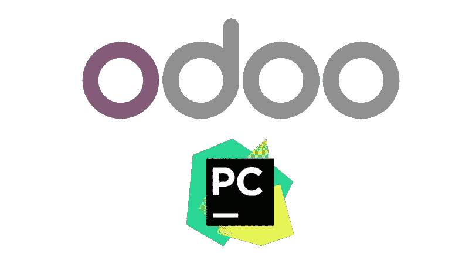
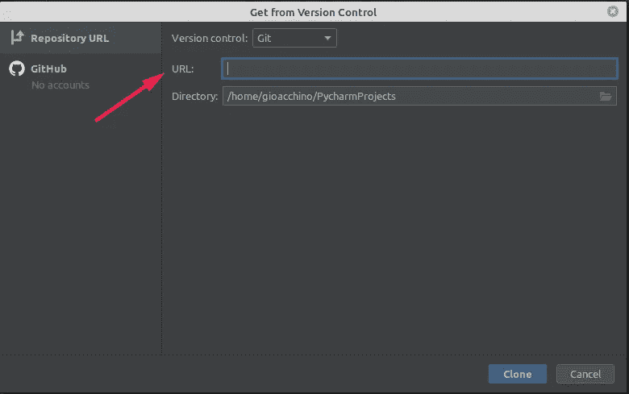
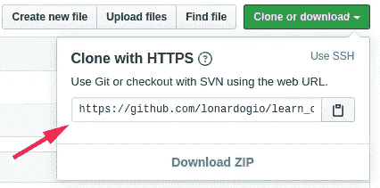
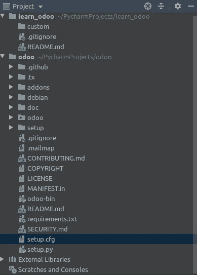
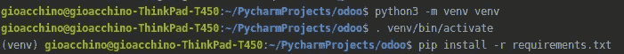
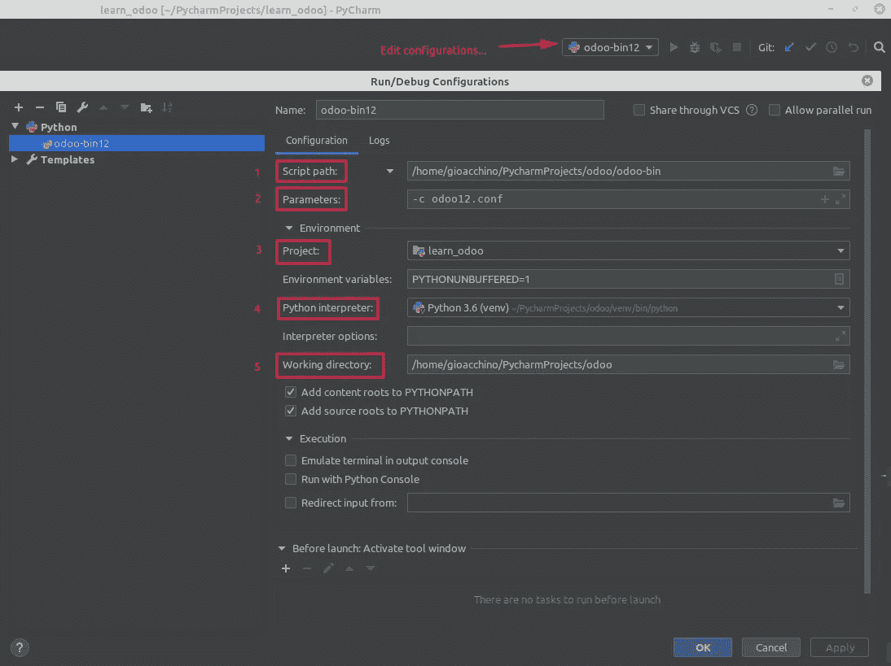
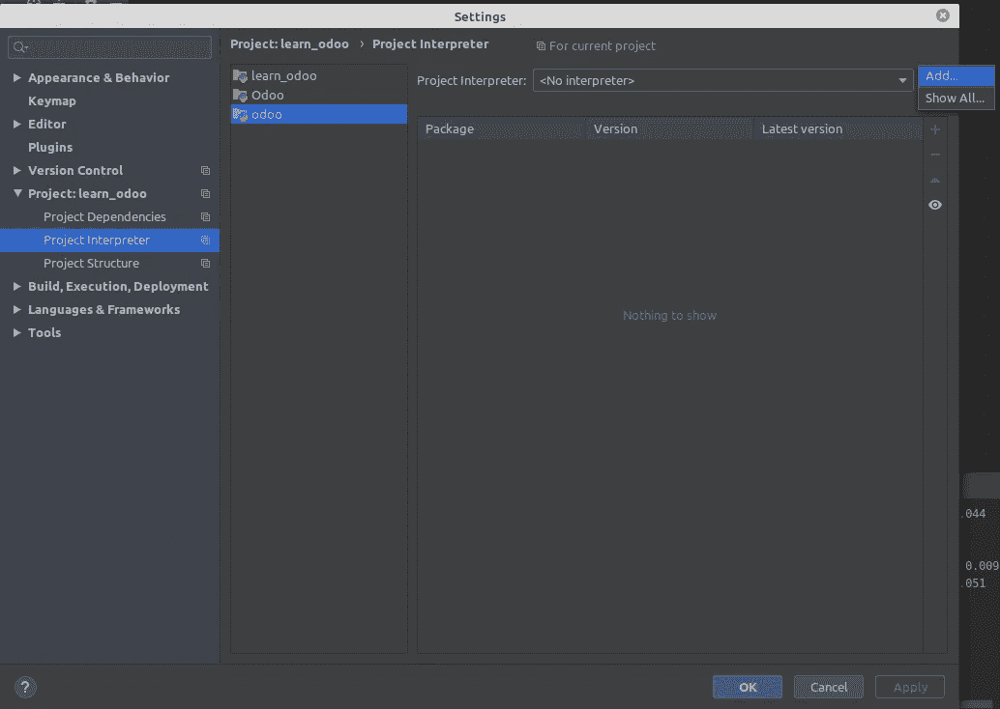
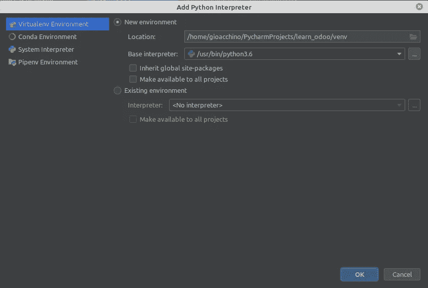

# 配置 PyCharm 用 Odoo 开发

> 原文：<https://levelup.gitconnected.com/configure-pycharm-to-develop-with-odoo-9cd80a73a68c>



让我们从这样一种情况开始，我们在 Github 上有一个存储库，我们想在那里开发我们的定制 Odoo 模块。

在 *VCS* 菜单中，有“*从版本控制中获取”*项



输入地址的 URL 以克隆您的存储库。比如 GitHub 是这样的:



# 安装 Odoo

现在我们需要奥多的密码！让我们在 PyCharm 中创建一个名为 Odoo 的新项目，并选择 attach 按钮。现在我们克隆奥多的仓库。你可以选择不同的分支，每个分支代表 Odoo 的一个版本。对于这个例子，我选择版本 12。

在~/PycharmProjects/中打开终端，并在所选分支上克隆项目 Odoo:

```
git clone --single-branch --branch 12.0 [https://github.com/odoo/odoo.git](https://github.com/odoo/odoo.git)
```

用 Pycharm 打开一个文件夹 *~/PycharmProjects/odoo* ，选择 *Attach* ，这样情况就发生了:



## 计算机编程语言

Odoo 要求 Python 版本≥ 3.5，请查看:

```
 python3 --version
```

还要验证是否为此版本安装了 [**pip**](https://pip.pypa.io/) :

```
pip3 --version
```

如果你还没有 python3 和/或 pip3，要设置 python3、pip3 和虚拟环境，请遵循这个[中的故事](https://medium.com/@hendrasj/how-to-run-odoo-12-with-virtualenv-53edbf0f47b9)。例如对于虚拟环境。一个是:



# 部署 Odoo

在*~/PycharmProjects*/*odoo*文件夹中添加 *odoo12.conf* 文件:

*   端口 *5432* ( **db_port** )上*localhost*(**db _ host**)的 PostgreSQL 服务器的连接参数；
*   使用 *user_test* 作为数据库的用户( **db_user** )，使用 *pass_test* 作为数据库密码(**DB _ password**)；
*   **addons_path** 插入包含自定义模块的文件夹，用逗号分隔；

更多信息见[部署 Odoo](https://www.odoo.com/documentation/12.0/setup/deploy.html) 。

# PyCharm 构型



进入下拉菜单，然后进入*编辑配置…* ，这将打开一个新窗口。

在**脚本路径**中，你必须插入包含 odoo-bin 的路径。作为一个**参数**我们会给他-c 和配置文件。作为**项目**，我们选择一个我们将插入自定义模块的项目，在本例中是 learn odoo。 **Python 解释器**必须是您之前在 odoo 文件夹中创建的那个。**工作目录**一般是有 odoo 配置文件的地方。

## Python 解释器



如果你在前一个窗口中找不到 python 解释器，那么你必须创建或添加它。只需进入文件→设置→项目→Python 解释器→添加。



# 结论

通过这种方法，我们使用一个存储库来存储定制模块，另一个存储库来克隆我们想要使用的 Odoo 的分支和版本。如果你从零开始，没有 Odoo 和 PostgreSQL，推荐一个非常有趣的链接和例子。它展示了如何配置 IDE。现在你所要做的就是播放或激活调试模式！