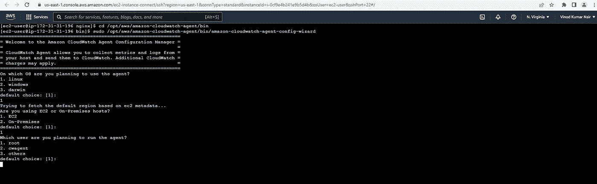
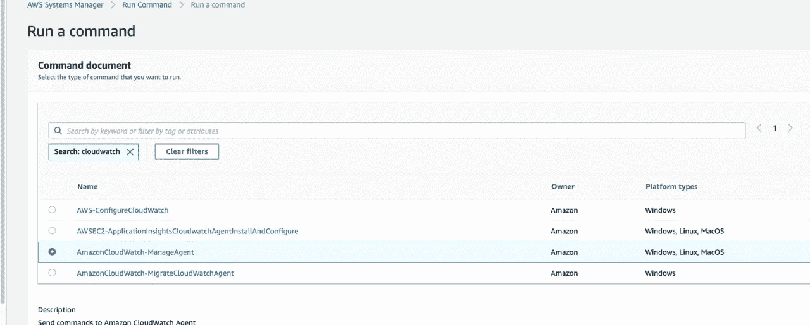
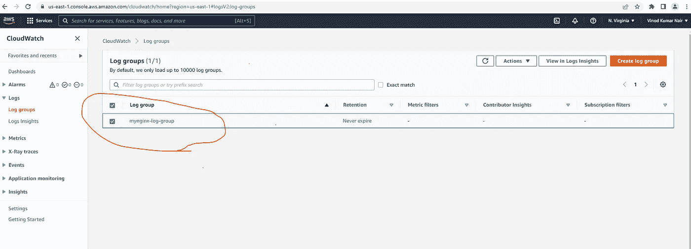

# 使用系统管理器和参数存储配置 CloudWatch 代理以从 EC2 收集日志

> 原文：<https://levelup.gitconnected.com/configuring-cloudwatch-agent-using-systems-manager-parameter-store-to-collect-logs-from-ec2-c6a0ef6060a0>

*您是否有任何运行在 EC2 上的传统/非容器化应用程序需要从其自定义日志位置收集日志并发送到 CloudWatch 日志服务？*

有许多运行在 EC2 上的应用程序可能在 EC2 上的一些自定义路径中生成日志和其他度量。如果不备份，我们可能会丢失这些日志，因为它们的生命周期与底层 EC2 实例的生命周期紧密相关。因此，出于审计和调试目的，将这些指标和日志保存在一些持久存储和服务上是最重要的。

有很多方法可以解决这个问题，其中一个方法是在由 **AWS 系统管理器**管理的 EC2 实例中安装 **CloudWatch** 代理，配置(如**自定义日志路径、日志组等**)存储在**参数存储**中，以收集日志数据并将其发送到 **AWS CloudWatch Logs** 服务，以实现其持久性。

# 建筑:-

**第一步:**创建一个自定义的 IAM 角色(名为 **AmazonEC2Role** ),策略为**amazonec 2 roleforsm**、**cloudwatchagentamponicy**和**CloudWatchAgentServerPolicy**。这允许系统管理员管理 EC2 实例，也允许 CloudWatch 代理将配置写入参数存储。

**步骤 2:** 将该角色附加到现有/新的 EC2 实例。

**第三步**:进入**系统管理器** → **车队管理器**，选择需要安装 CloudWatchAgent 的 EC2 实例，点击**执行运行命令**。

AWS 系统经理—车队经理

**第四步**:选择“**AWS-configureawsspackage**，输入需要安装在 EC2 中的包名 **AmazonCloudWatchAgent** ，最后点击“ **Run** ”。检查运行命令的状态。

AWS 系统经理

AWS 系统经理

AWS 系统经理

这将在 EC2 中安装 CloudWatch 代理。

**第五步**:使用 KeyPair 连接 EC2 实例，转到这个位置，**/opt/AWS/Amazon-cloud watch-agent/bin，**，执行`sudo /opt/aws/amazon-cloudwatch-agent/bin/amazon-cloudwatch-agent-config-wizard`，按照提示操作。您需要提供详细信息，如**日志组名称**、**任何自定义路径**，服务器在那里生成日志(您想要收集的日志)等。

云监控代理

一旦满意，代理将把配置推送到**参数存储器**。现在，从 EC2 实例中退出。

**步骤 6** :进入**系统管理器** → **参数存储**，记下创建的参数存储的名称。在我们的例子中，它是如下所示的 **AmazonCloudWatch-linux** 。在接下来的步骤中需要用到它。另外，请注意，现在您可以从这个 IAM 角色 **AmazonEC2Role** 中删除这个名为**cloudwatchagentadminipolicy**的策略，因为不再需要它了。

**步骤 7** :最后，进入**系统管理器** → **车队管理器**，选择所需 EC2 实例，点击**执行运行命令**。这一次选择命令为'**AmazonCloudWatch-manage agent**，在可选配置位置(如下所示)给出相同的参数存储名称，即 **AmazonCloudWatch-linux** ，并运行它。

AWS 系统经理

这将使用配置，并开始从 EC2 实例收集指标和日志，并将它们推送到 AWS CloudWatch 日志服务。

瞧:)都完成了！！！

*或者，您可以创建自定义 AMI (Amazon 机器映像),并使用启动模板和自动缩放组从一组 EC2 实例生成日志，并使用 Systems Manager 服务管理它们。*

## 演示:-

转到 CloudWatch 服务→日志→日志组，您会看到一个新创建的日志组。单击它以查看日志流，然后单击日志事件以查看详细的日志。

## 摘要:-

在本文中，我们看到了如何在 EC2 上安装 CloudWatchAgent，使用系统管理器从 EC2 上的自定义位置收集日志，并将它们发送到 CloudWatch Logs 服务。此外，我们可以创建定制的 AMI (Amazon 机器映像)以及启动模板和自动缩放组，以便从一组 EC2 实例中收集日志。

希望你喜欢。请分享您的宝贵反馈，并让我知道下次我应该涵盖哪个主题，谢谢:-)。