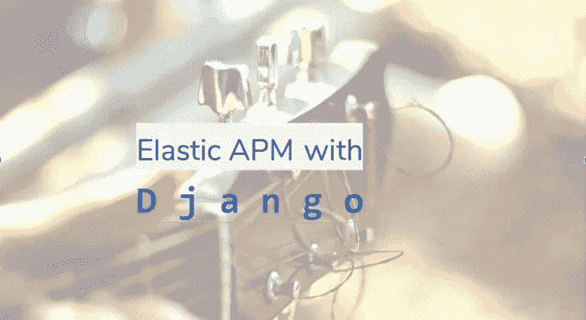
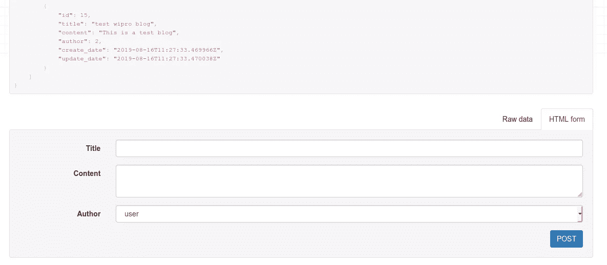
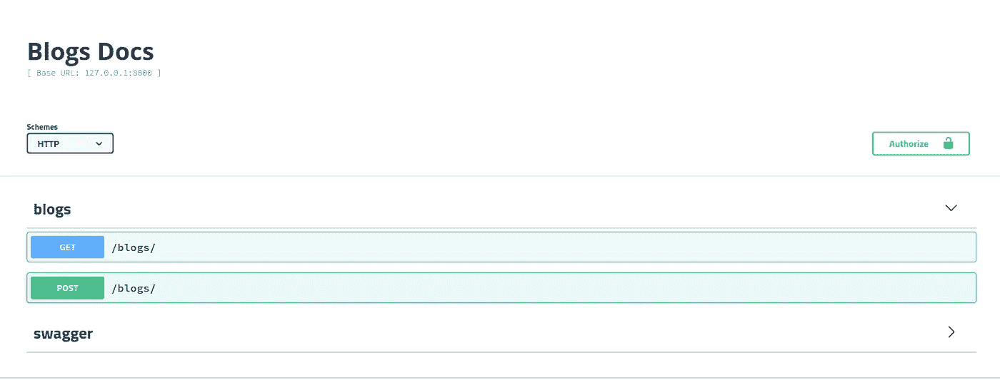
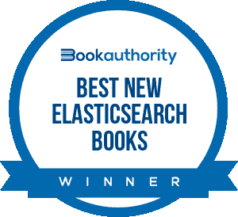

# 用弹性 APM 配置 Django 应用程序

> 原文：<https://levelup.gitconnected.com/configuring-django-application-with-elastic-apm-4d5d07277536>



在之前的博客“[Elastic APM 简介](https://bqstack.com/b/detail/106/Introduction-to-Elastic-APM)”中，我介绍了 Elastic APM，讨论了 APM 的不同组件，以及它们如何协同工作来监控应用程序性能。现在我们将学习如何为 Django 博客 API 应用程序设置配置 APM。我会在 Ubuntu 操作系统 ver 上解释这个过程。19.04.所以让我们开始为 Python Django APIs 配置弹性 APM。

> *如果您想了解更多关于监控的知识，请参考“* [*为什么监控很重要？*](https://bqstack.com/b/detail/105/Why-monitoring-is-important%3F) *“博客。你可能也喜欢博客上关于如何做“* [*日志分析与弹性堆栈*](https://bqstack.com/b/detail/1/Log-analysis-with-Elastic-stack) *”。*

正如我在以前的博客中提到的，我们需要 APM 服务器来接收应用指标，APM 代理在配置了应用程序后将指标发送到 APM 服务器，最后是我们要监控的正在运行的应用程序。所以第一步是安装 APM 服务器。

**安装 APM 服务器:**
在这里，我将解释如何在 Ubuntu 上完成这项工作，但在 Kibana 的 APM 页面上，您可以单击“安装说明”链接，并可以看到在不同平台上安装 APM 服务器的步骤，所以不要担心，并在您的系统上安装它。但是在 APM 之前，你需要安装 Elasticsearch 和 Kibana，因为这是 APM 设置之前所必需的。因此，要安装 APM 服务器，我们需要执行以下操作:

1)您可以使用以下命令下载并解压缩 APM 服务器:

```
curl -L -O [https://artifacts.elastic.co/downloads/apm-server/apm-server-7.5.1-amd64.deb](https://artifacts.elastic.co/downloads/apm-server/apm-server-7.5.1-amd64.deb)
sudo dpkg -i apm-server-7.5.1-amd64.deb
```

2)安装完成后，您可以编辑 apm-server.yml 文件，并根据您的 elasticsearch 凭证更改“ *output.elasticsearch* ”设置:

```
output.elasticsearch:
 hosts: ["<es_url>"]
 username: <username>
 password: <password>
```

3)更改配置后，您可以使用以下命令启动 APM 服务器:

```
service apm-server start
```

4)您可以通过检查服务状态来验证服务是否启动并运行:

```
service apm-server status.
```

5)它通常在 8200 端口上运行，因此，如果您尝试在浏览器上打开它，您会得到以下响应:

```
{
 "build_date": "2019-12-16T20:57:59Z",
 "build_sha": "348d8d83c3c823b64fc0692be607b1a5a8fac775",
 "version": "7.5.1"
}
```

这样我们就可以安装和配置 APM 服务器，现在我们应该运行 Django 应用程序，以便用该应用程序配置 APM 代理。

**运行您的 Python Django 应用程序:**

您可以从我的 GitHub 资源库([https://github.com/anubioinfo/django_blog_api](https://github.com/anubioinfo/django_blog_api))获得一个测试 Django 博客应用程序。
你可以使用自己的 Django 应用程序，也可以参考我的测试博客应用程序。如果您正在尝试我的测试应用程序，那么您需要执行以下操作来运行博客应用程序:

1.您需要从 GitHub 页面下载这个应用程序，然后在主目录中导航以执行以下命令:

```
# git clone the project
git clone [https://github.com/anubioinfo/django_blog_api.git](https://github.com/anubioinfo/django_blog_api.git)# move inside the project directory
cd django_blog_api/# make migrations
python3 manage.py makemigrations# migrate the tables
python3 manage.py migrate# run the server
python3 manage.py runserver
```

2.成功执行上述命令后，您可以使用以下 URL 运行 Django 应用程序:

```
[http://127.0.0.1:8000/blogs](http://127.0.0.1:8000/blogs)
```

这个应用程序非常简单，用户可以使用 API 添加博客并列出它们。下面的截图显示了 Django 添加博客的默认用户界面:



3.您可以使用以下链接访问 swagger 页面:
http://127 . 0 . 0 . 1:8000/swagger/



**Django 超级管理员帐号:**
您可以使用以下命令创建 Django 超级管理员:

```
python manage.py createsuperuser
```

创建超级管理员帐户后，您可以使用以下 URL 访问 Django 管理员界面:

```
[http://127.0.0.1:8000/admin](http://127.0.0.1:8000/admin)
```

因此，随着 Django 应用程序成功运行，我们现在可以配置弹性 APM 代理了。

**用 Django 应用程序配置 APM 代理:**
因为这里我们处理的是 Python Django 应用程序，所以我们必须为 Django 安装 APM 代理。但是如果你正在处理其他语言或工具，那么你可以参考 Kibana 的 APM 页面上的“设置说明”链接。在这里，您可以获得 Java、RUM(JS)、Node.js、Flask、Ruby in Rails、Rack、Go 和. NET 的 APM 代理的安装步骤。

1)在 Django 中，要运行 Python 的 APM 代理，我们需要使用以下命令安装 elastic-apm 模块:

```
pip install elastic-apm
```

2)现在我们需要用这个 Django 应用程序配置代理和配置 APM。我们需要在 settings.py 文件中进行以下更改:

```
# Add the agent to the installed apps
INSTALLED_APPS = (
'elasticapm.contrib.django',
# ...
)
ELASTIC_APM = {
# Set required service name. Allowed characters:
# a-z, A-Z, 0-9, -, _, and space
'SERVICE_NAME': 'django application',
# Use if APM Server requires a token
'SECRET_TOKEN': 'mysecrettoken',
# Set custom APM Server URL (default: [http://localhost:8200)](http://localhost:8200))
'SERVER_URL': 'http://localhost:8200',
}
# To send performance metrics, add our tracing middleware:
MIDDLEWARE = (
'elasticapm.contrib.django.middleware.TracingMiddleware',
#...
)
```

使用 settings.py 文件中的上述更改，可以将 APM 代理配置到 Python Django 应用程序。

3)在 settings.py 文件中完成这些更改后，我们可以启动 Django 应用程序，然后从 Kibana 的“**设置说明**”页面验证一切是否如我们预期的那样工作。

一旦在 Django 中完成了配置，我们就可以重启 Django 应用程序，并开始在 APM 下的 Kibana 中获取指标。我们可以使用内置的 APM UI 监控 APM 数据，也可以在 Kibana 中创建我们的仪表板。所以在这篇博客中，我们已经介绍了如何使用 Django 应用程序配置弹性 APM。在下一篇博客中，我将解释我们如何使用 Kibana 仪表板来监控 APM 数据。

[如何创建 Elasticsearch 集群
Elastic Search 中的桶聚合](https://bqstack.com/b/detail/90/Bucket-Aggregation-in-Elasticsearch)
[Elastic Search 中的度量聚合](https://bqstack.com/b/detail/89/Metrics-Aggregation-in-Elasticsearch)
[配置 Logstash 将 MySQL 数据推入 Elastic Search](https://bqstack.com/b/detail/76/Configure-Logstash-to-push-MySQL-data-into-Elasticsearch)
[Elastic Search 中的通配符和布尔搜索](https://bqstack.com/b/detail/87/Wildcard-and-Boolean-Search-in-Elasticsearch)
[Elastic Search Rest API](https://bqstack.com/b/detail/83/Elasticsearch-Rest-API)
[Elastic Search 中数据搜索的基础知识](https://bqstack.com/b/detail/84/Basics-of-Data-Search-in-Elasticsearch)
[Elastic Search Rest API](https://bqstack.com/b/detail/83/Elasticsearch-Rest-API) [](http://bqstack.com/b/detail/1/Log-analysis-with-Elastic-stack) 

**Learning Kibana 7** 本书被评为最佳新弹性搜索书籍



我很高兴地宣布，我的书《学习 Kibana 7:用 Kibana 的数据可视化功能构建强大的弹性仪表板，第二版》获得了 [BookAuthority 最佳新弹性搜索书籍](https://bookauthority.org/books/new-elasticsearch-books?t=11vp86&s=award&book=1838550364):
[https://bookauthority.org/books/new-elasticsearch-books?t = 11vp 86&s = award&book = 1838550364](https://bookauthority.org/books/new-elasticsearch-books?t=11vp86&s=award&book=1838550364)
book authority 收集并排名世界上最好的书籍，能得到这种认可是莫大的荣幸。谢谢大家的支持！这本书在亚马逊上[有售。](https://www.amazon.com/dp/1838550364?tag=uuid10-20)

如有任何疑问，请留下您的意见。你也可以在推特上关注我:[https://twitter.com/anu4udilse](https://twitter.com/anu4udilse)

*如果你觉得这篇文章很有意思，那么你可以探索“* [*【掌握基巴纳 6.0】*](https://www.amazon.com/Mastering-Kibana-6-x-Visualize-histograms/dp/1788831039/ref=olp_product_details?_encoding=UTF8&me=)*”、“* [*基巴纳 7 快速入门指南*](https://www.amazon.com/Kibana-Quick-Start-Guide-Elasticsearch/dp/1789804035) *”、“* [*学习基巴纳 7*](https://www.amazon.com/Learning-Kibana-dashboards-visualization-capabilities-ebook/dp/B07V4SQR6T) *”、“* [*Elasticsearch 7 快速入门指南*](https://www.amazon.com/gp/product/1789803322?pf_rd_p=2d1ab404-3b11-4c97-b3db-48081e145e35)**书籍获取更多**

*原载于*[*https://bqstack.com*](https://bqstack.com/b/detail/108/Configuring-Django-application-with-Elastic-APM)*。*