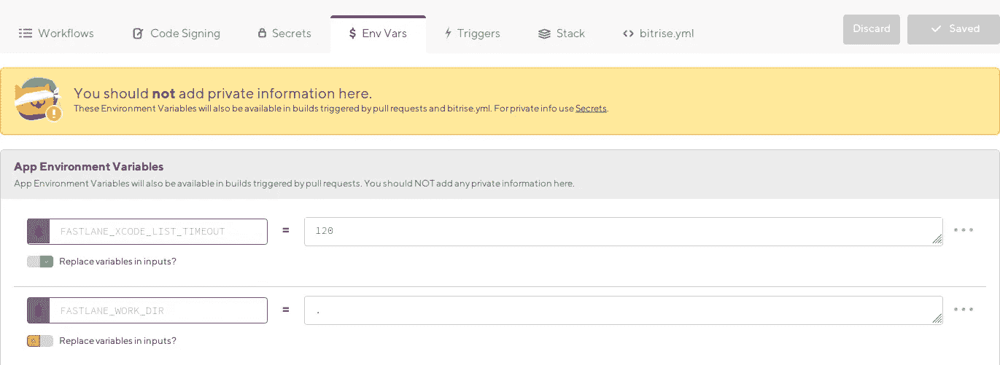
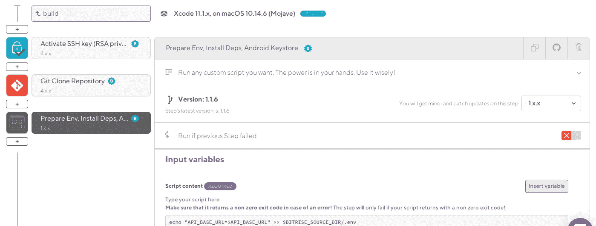

# 在 Bitrise 上为 React 本机应用程序配置环境变量

> 原文：<https://levelup.gitconnected.com/configuring-env-vars-for-react-native-apps-on-bitrise-601362d602f9>


谈论环境

你可能听说过甚至使用过这个很酷的包来管理 React Native 中的环境变量，名为 [react-native-config](https://github.com/luggit/react-native-config) 。它允许您在一个`.env`文件上定义应用程序的环境变量，并将这些值注入 Javascript 代码库。

默认情况下，react-native-config 只从项目根的`.env`中读取值。您还可以指定它应该读取哪个文件。但是`.env`文件被排除在 git 之外，因为不同的机器通常需要不同的值，这取决于它们的环境，这在构建 CI 工具(在我的例子中是 [Bitrise](https://www.bitrise.io/) )时出现了问题，在 CI 工具中，值只作为变量提供。下面是我如何配置我的 Bitrise 构建工作流来让 react-native-config 读取环境值。

典型的`.env`文件通常如下所示:

```
API_BASE_URL=https://myapi.test
API_CLIENT_ID=1234
API_CLIENT_SECRET=my-secret
```

然后在 Javascript 文件中，这些值将像这样被访问:

```
import Config from 'react-native-config'console.log(Config.API_BASE_URL);     // [https://myapi.test](https://myapi.test)
console.log(Config.API_CLIENT_ID);    // 1234
console.log(Config.API_CLIENT_SECRET) // my-secret
```

然而，`.env`文件不会提交给 git，因此 Bitrise 在构建时无法访问这些值。所以我去了工作流编辑器:环境变量部分…



工作流编辑器中的 Bitrise 环境变量选项卡

所以我想“嘿！这太棒了。我可以把值放在这里，然后 Bitrise 和 react-native-config 将协同工作，神奇地读取这些值，对吗？”。**错了**。像我这样天真的“devops”工程师，我粘贴了值并开始构建。毫无疑问，构建成功了(耶！)，然而一旦我运行这个应用程序，我就会遇到一个熟悉的崩溃。

经过调查，我发现崩溃是由未定义的 env 值引起的。“这怎么可能呢？我非常确定……”——不，我不确定，我从来不确定。原来，我粘贴的那些 env 变量只是为了给构建“工作流”提供值。因此，为了解决这个问题，我在工作流中的“Git Clone Repository”步骤之后添加了一个“Script”步骤，以读取 env 值并将它们写入一个新的`.env`文件。



克隆后添加“脚本”步骤

在脚本内容中，我放了一组这样的命令:

```
echo "API_BASE_URL=$API_BASE_URL" >> $BITRISE_SOURCE_DIR/.env
echo "API_CLIENT_ID=$API_CLIENT_ID" >> $BITRISE_SOURCE_DIR/.env
echo "API_CLIENT_SECRET=$API_CLIENT_SECRET" >> $BITRISE_SOURCE_DIR/.envcat $BITRISE_SOURCE_DIR/.env
```

简而言之，它所做的就是读取工作流环境变量中提供的值，以标准的 dotenv 格式逐行将其回显到根目录下的新的`.env`文件中。它还将新的`.env`文件的内容回显到日志中，以便更好地测量。现在 react-native-config 实际上将有一个文件来查找值！

相当方便，虽然我无法实现我最初想要的。我只需要记住在脚本步骤中添加新的变量。

另一方面，在实现我的特定案例时，这是一个相当草率的尝试，因为我还没有从性能和安全性方面进行彻底的检查。如果你碰巧知道更好的方法，请告诉我:)