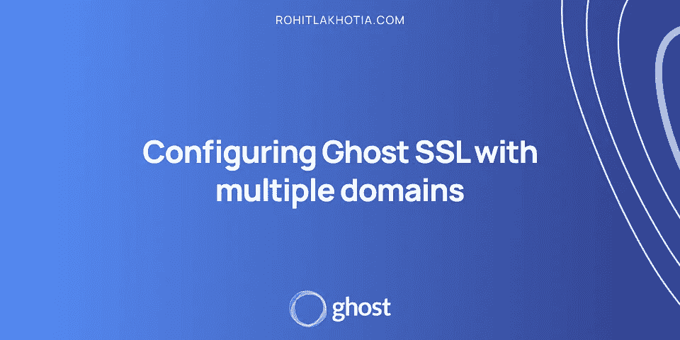
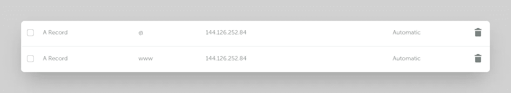
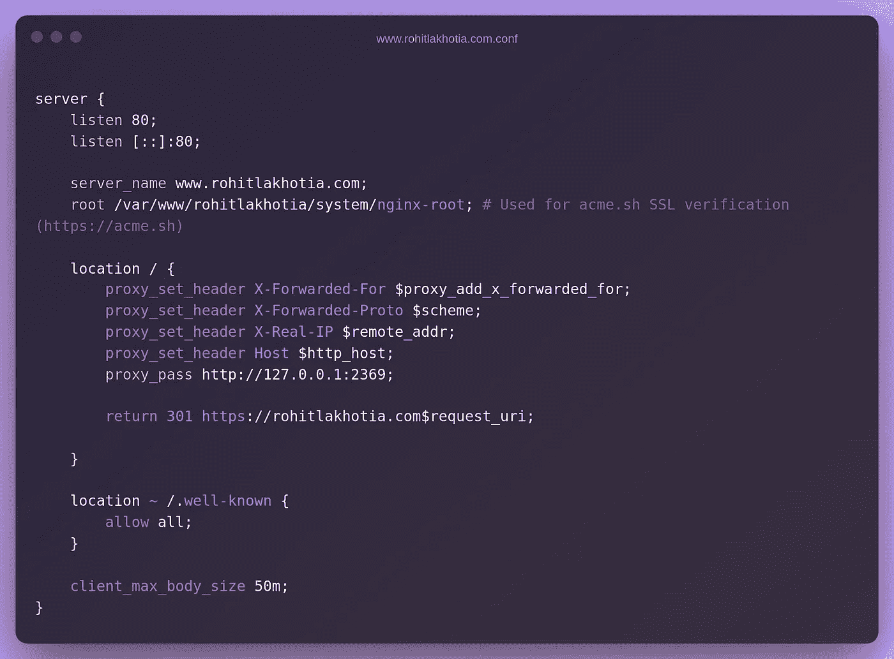
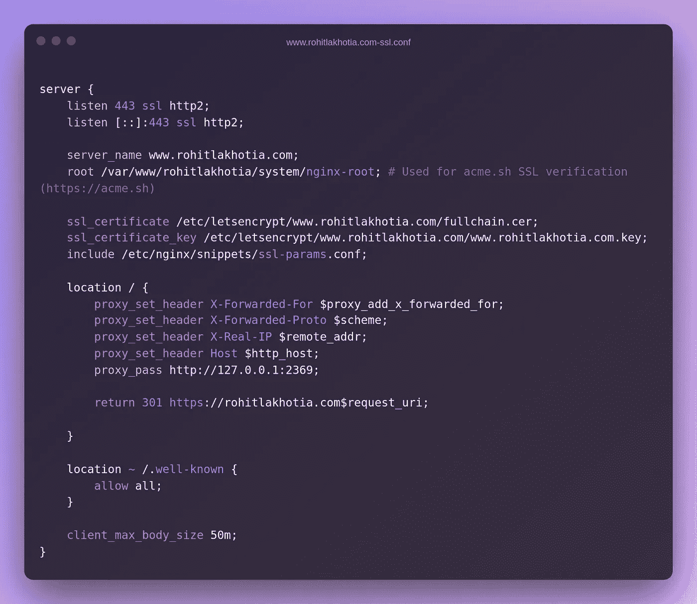

# 使用多个域配置 Ghost SSL

> 原文：<https://levelup.gitconnected.com/configuring-ghost-ssl-with-multiple-domains-2fc182d4552f>



*本帖最初发表于*[*【rohitlakhotia.com】*](https://rohitlakhotia.com/)

本教程假设您已经启动并运行了自托管 ghost 安装。

Ghost 每次只在一个域上提供服务器内容，因此为了提供来自其他域的内容，您需要将该域重定向( [301 对 302](https://www.seoclarity.net/resources/knowledgebase/use-301-redirect-vs-302-redirect-15683/) )到托管 ghost CMS 的域。

你可能希望有多个域名重定向到你的网站，例如，有一个额外的 TLD 或支持 www。域。这是出于 SEO 的目的，但是，您可以使用 Nginx 将额外的域重定向到您的 Ghost 安装。

如果您想重定向 HTTPS 域，您必须有它的证书。

# 基本设置

我们在这里试图实现的是让**www.rohitlakhotia.com**用一个 SSL 证书指向根域**rohitlakhotia.com**，这样浏览器在访问上述任何一个时都不会显示警告。

*这也将包括 HTTP 版本，以重定向到 HTTPS 版本，这样搜索引擎就不会认为它们是重复的页面。*

# 配置您的辅助域

我们需要配置域名 DNS 记录，以便让浏览器知道在发出请求时去哪里。

# 用正确的记录配置您的域



仔细看的话 **www** 版本和 **@ (root)** 版本都指向**同一个 IP(服务器)**。

基本上，指向这两个版本的每个请求都将由该 IP 地址的服务器处理。这正是我们想要的。所以我们可以适当地处理它们。

现在我们需要 SSH 到服务器来安装证书并正确地重定向域。

访问服务器后，转到 ghost 的安装目录。多半会是 **/var/www/ <你的鬼装>**

于是**光盘**进入目录然后

```
ghost config url https://www.rohitlakhotia.com
```

代替**www.rohitlakhotia.com**，添加你的**域(二级域)**，你**想要重定向到根域**。

***在继续下一个命令之前，只需确保 A 记录被成功更新，否则 SSL 证书不会被安装。***

```
ghost setup nginx ssl
```

这将为您刚刚添加的域(对我来说是 www.rohitlakhotia.com)生成 SSL 证书，并且为 HTTP 和 HTTPS 版本生成 Nginx 配置文件。(简单！)

现在，我们将再次改变鬼安装网址回到旧的，对我来说是 https://rohitlakhotia.com

```
ghost config url https://rohitlakhotia.com
```

现在我们需要更新新创建的 Nginx 配置文件，这样我们就可以将用户重定向到根域。

Nginx 配置文件大多位于**/etc/Nginx/sites-available**

```
cd /etc/nginx/sites-available
```

在这里你会找到所有的 Nginx 配置文件。应该至少有 4 个文件。每个域都有带 <domain>-ssl.conf(针对 HTTPS)和<domain>的文件。conf(用于 HTTP)。</domain></domain>

所以我们有 4 个文件:

1.  rohitlakhotia.com-ssl.conf
2.  rohitlakhotia.com.conf
3.  www.rohitlakhotia.com-ssl.conf
4.  www.rohitlakhotia.com.conf

现在我们需要编辑辅助域的文件。

所以我需要编辑的文件是**www . rohitlakhotia . com-SSL . conf**和**www . rohitlakhotia . com . conf**

我们需要将这一行代码添加到位置块的内部，但要放在末尾。

```
return 301 https://rohitlakhotia.com$request_uri;
```

您可以根据您的使用情况将 301 更改为 302([301 与 302](https://www.seoclarity.net/resources/knowledgebase/use-301-redirect-vs-302-redirect-15683/) )。您将用您的主域替换 rohitlakhotia.com。

这一行要做的是，无论何时向二级域发出请求，它都会将其重定向(301/302)到特定的 URL。

所以这两个文件应该是这样的



www.rohitlakhotia.com.conf



www.rohitlakhotia.com-ssl.conf

现在，通过以下方式检查配置文件是否有效

```
sudo nginx -t
```

如果成功，那么重新加载 Nginx 服务器

```
sudo nginx -s reload
```

仅此而已。

您刚刚在 ghost 中将辅助域指向了主域。

*更多内容，可以查看我的* [*博客*](https://rohitlakhotia.com/blog)