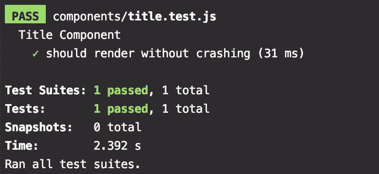
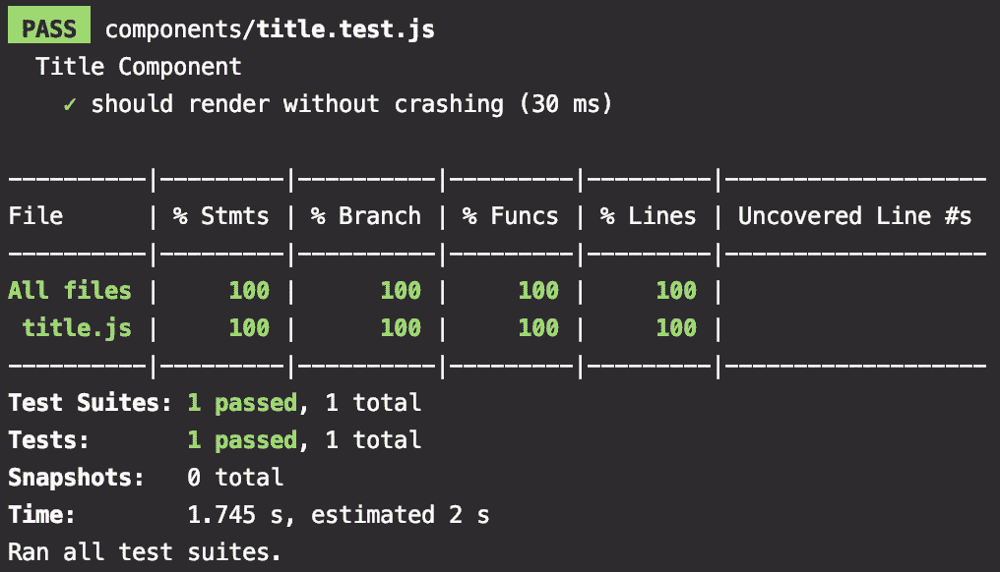
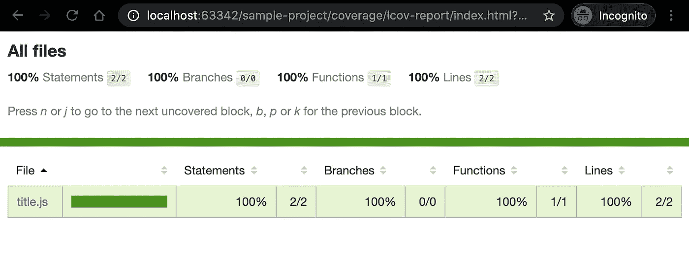
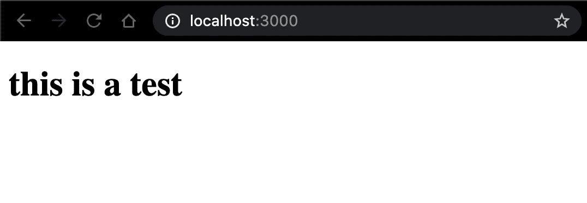

# 正在为下一个配置 Jest。JS (React)和 Babel 从零开始

> 原文：<https://levelup.gitconnected.com/configuring-jest-for-next-js-react-and-babel-from-scratch-bb3b7751329b>

## 为下一步工作构建您的 Jest、Babel 和 package.json 配置文件。JS 环境


弗勒在 [Unsplash](https://unsplash.com?utm_source=medium&utm_medium=referral) 上的照片


Jest，用于测试 Javascript 的库。

毫无疑问，今天建立一个合适的前端项目将包括拥有一个好的**框架来测试你的代码**。

现在有许多好的软件模块来运行你的单元测试。其中最受欢迎的是 [Jest](https://jestjs.io/) 。

有许多方法可以设置您的环境。在这里，我将向你展示一个适合我的方法，它变得非常灵活，适用于任何小型、中型甚至大型项目。


下一个。JS，一个 web 应用框架。

为此，我们接下来将使用[。JS](https://nextjs.org/) web 应用框架。在引擎盖下，它将安装许多迄今为止最流行和最强大的工具和库，如 [React](https://reactjs.org/) 、 [Webpack](https://webpack.js.org/) 、样式表预处理程序和 [more](https://nextjs.org/docs) 。

**第一步**:新建一个项目。在我们的例子中，我们把它命名为' **sample-project** '。

```
mkdir **sample-project**
cd sample-project
npm init
```

此时，您将看到 NPM 创建 package.json 的实用程序。

第二步:安装需要的库。首先我们将安装我们的常规依赖项:**下一个**、 **React** 和 **React DOM** 。

```
npm i --save **next react react-dom**
```

接下来我们安装开发依赖: **@babel/preset-env、@babel/preset-react** 、 **babel-jest** 、**酵素**、**酵素-适配器-react-16** 、 **jest** 。

```
npm i --save-dev **@babel/preset-env @babel/preset-react babel-jest enzyme enzyme-adapter-react-16 jest**
```

**第三步**:创建配置文件。

让我们从' **package.json** '开始。您将在“**脚本**”下添加以下节点:**测试**、**测试:覆盖率**、**开发**。

您的' **package.json** '将如下所示:

```
{
  "name": "sample-project",
  "version": "1.0.0",
  "description": "Your project description",
  "scripts": {
    "dev": "next dev",
    "test": "jest",
    "test:coverage": "jest --coverage"
  },
  "author": "Your name",
  "license": "ISC",
  "dependencies": {
    "next": "^9.3.6",
    "react": "^16.13.1",
    "react-dom": "^16.13.1"
  },
  "devDependencies": {
    "@babel/preset-env": "^7.9.6",
    "@babel/preset-react": "^7.9.4",
    "babel-jest": "^26.0.1",
    "enzyme": "^3.11.0",
    "enzyme-adapter-react-16": "^1.15.2",
    "jest": "^26.0.1"
  }
}
```

接下来，我们将使用 **Jest** 配置文件。在项目的根目录下创建一个“ **jest.config.js** ”文件。您最终得到的文件将如下所示:

```
*module*.exports = {
  collectCoverageFrom: [
    '**/*.{js,jsx}',
    '!**/node_modules/**',
    '!**/tests/**',
    '!**/coverage/**',
    '!jest.config.js',
  ],
  coverageThreshold: {
    global: {
      branches: 100,
      functions: 100,
      lines: 100,
      statements: 100,
    },
  },
  moduleNameMapper: {
    '\\.(css|less)$': '<rootDir>/__mocks__/styleMock.js',
    '\\.(jpg|jpeg|png|gif|eot|otf|webp|svg|ttf|woff|woff2|mp4|webm|wav|mp3|m4a|aac|oga)$': '<rootDir>/__mocks__/fileMock.js',
  },
  setupFiles: [
    '<rootDir>/tests/setup.js',
  ],
  setupFilesAfterEnv: [
    '<rootDir>/tests/setupAfterEnv.js',
  ],
  testMatch: [
    '**/?(*.)+(spec|test).[jt]s?(x)',
  ],
  testPathIgnorePatterns: [
    '/.next/',
    '/node_modules/',
    '/tests/',
    '/coverage/'
  ],
  transform: {
    '^.+\\.jsx?$': 'babel-jest',
  },
};
```

该文件引用了另外两个配置文件。在“**/测试/** ”目录下创建两个文件。第一个是“ **/tests/setup.js** ”，第二个是“ **/tests/setupAfterEnv.js** ”。

这就是你的' **setup.js** '的样子。通常在 it 中，您会有测试的配置或设置代码。这段代码将在每次测试之前和测试框架执行之前运行一次**。**

```
process.env.NODE_ENV = 'test';
```

**接下来，' **setupAfterEnv.js** '，这段代码也将在每次测试之前运行**，但是在测试框架执行之后运行**:**

```
*const* Adapter = *require*('enzyme-adapter-react-16');

*require*('enzyme').configure({ adapter: *new* Adapter() });
```

**最后，让我们创建 **Babel** 配置文件。为此，您将在项目的根目录下创建一个“ **babel.config.js** ”文件。**

```
{
  "env": {
    "test": {
      "presets": [
        "@babel/preset-env",
        "@babel/react",
        "next/babel"
      ]
    },
    "development": {
      "presets": [
        "next/babel"
      ]
    }
  }
}
```

**第四步:创建一个简单的测试。遵循“测试优先开发”的范例，让我们先创建一个测试。在项目的根目录下创建一个' **/components/** '目录。在其中创建一个' **title.spec.js** '文件。这个简单的测试文件如下所示:**

```
*import* { mount } *from* 'enzyme';

*import* Title *from* './title';

*/*** ***@test*** *{Title Component} */* describe('Title Component', () => {
  it('should render without crashing', () => {
    *const* wrapper = mount(<Title *label*="test" />);

    expect(wrapper.find('h1')).toHaveLength(1);
  });
});
```

**该测试将实例化一个“**标题**组件，该组件接收一个“**标签**属性。断言该组件将呈现一个 **< h1 >** 标签。**

****第五步**:创建一个简单的组件。遵循上一步中的“蓝图”,我们可以创建简单的组件。在同一个' **/components/** '目录下我们可以创建文件' **title.js** ':**

```
*const* Title = ({ *label* }) => (
  <h1>{*label*}</h1>
);

*export default* Title;
```

****第 6 步**:运行您的测试并验证您的覆盖率。此时，您已经准备好了，您需要做的就是执行您的测试。我们可以通过从我们的' **package.json** '文件中执行' **test** '脚本来做到这一点。**

```
npm run **test**
```

**如果一切顺利，您应该会看到一条消息，通知您所有测试(在本例中只有一个)都通过了。**

****

**测试成功执行。**

**Jest 最强大的特性之一是它还可以显示测试如何覆盖所有代码的详细统计数据。为此，我们可以运行脚本' **test:coverage** ':**

```
npm run **test:coverage**
```

**这将产生两件事。第一个是你将会看到所有测试覆盖率的百分比摘要，来自语句、分支、函数和行。**

****

**执行“npm *运行测试:覆盖率*”后的覆盖率报告。**

**但是你还会注意到在你的项目的根目录下有一个'**/coverage/【T1]'目录，它会向你显示你的测试的详细分析。你可以通过打开文件'**/coverage/lcov-report/index . html**，在浏览器中看到这一点。****

****

**覆盖报告。**

**一旦你掌握了这些简单的基础知识，你就可以**相当容易地扩展你的项目**。但是，请记住，单元测试并不能保证您的代码完全没有错误。单元测试将**自动化特定的案例和任务，这将有助于在集成软件遇到故障**时进行隔离。**

**同样，单元测试可以为你的项目提供一个**伪文档**。一旦你回过头来检查你很久以前创建的组件的测试，这些测试将会给你一种“T10”x 射线，这是你或者你的同事在第一次编码时想要的。**

**同样，单元测试**使得在重构**可能改变组件当前测试套件的现有代码时更难引入错误。**

**如果你很好奇，想在接下来的**中看到你的 **Title** 组件。JS** 页面，只需遵循这些最后的步骤:**

*   **创建一个“ **/page/** ”目录，并在里面创建一个“ **index.js** 文件。该文件将如下所示:**

```
*import* Title *from* '../components/title';

*const* Home = () => (
  <Title *label*="this is a test" />
);

*export default* Home;
```

*   **最后，要启动**服务器**，它将呈现包含“ **Title** ”组件的页面，运行以下脚本:**

```
npm run **dev**
```

**您可以导航到 [http://localhost:3000](http://localhost:3000) 并查看您呈现的页面。**

****

**您的最终渲染页面。**

**当然，请记住，如果您现在运行测试，您将需要在' **index.spec.js** '测试脚本中包含这个' **index.js** '文件。**

# **下一步和进一步阅读是什么**

**下一个。Js 为扩展和增强 React 应用程序提供了很好的机会。请进一步阅读该系列的这些文章:**

**[](https://medium.com/@pablo.delvalle.cr/new-features-introduced-in-next-js-9-4-and-real-world-applications-53d6b8f81570) [## 接下来引入的新功能。JS 9.4 和现实世界的应用程序

### 对环境变量的支持，内置的获取支持，集成的 Web 生命分析，改进的包导入

medium.com](https://medium.com/@pablo.delvalle.cr/new-features-introduced-in-next-js-9-4-and-real-world-applications-53d6b8f81570) [](https://medium.com/@pablo.delvalle.cr/an-opinionated-basic-next-js-files-and-directories-structure-88fefa2aa759) [## 一个固执己见的基本 Next。JS 文件和目录结构

### 下一个。JS 在如何组织文件和目录方面相当宽松；如果你从…建立了一个好的结构

medium.com](https://medium.com/@pablo.delvalle.cr/an-opinionated-basic-next-js-files-and-directories-structure-88fefa2aa759) [](https://medium.com/@pablo.delvalle.cr/fetching-and-hydrating-a-next-js-app-using-getserversideprops-and-getstaticprops-65bfe42afed8) [## 接下来是获取和补水。使用“getServerSideProps”和“getStaticProps”的 JS 应用程序

### 接下来学习如何以及何时使用“getStaticProps”、“getServerSideProps”和“getInitialProps”。JS 项目

medium.com](https://medium.com/@pablo.delvalle.cr/fetching-and-hydrating-a-next-js-app-using-getserversideprops-and-getstaticprops-65bfe42afed8) [](https://medium.com/@pablo.delvalle.cr/dockerize-your-next-js-application-91ade32baa6) [## 记录下你的下一个。JS 应用程序

### 学习使用 Docker 来包装你的下一个。用于测试或部署试运行或生产的 JS 应用程序

medium.com](https://medium.com/@pablo.delvalle.cr/dockerize-your-next-js-application-91ade32baa6) 

延伸阅读:

*   [接下来。JS 文档](https://nextjs.org/docs/getting-started)
*   [笑话文档](https://jestjs.io/docs/en/getting-started)

# 感谢阅读！

在 [LinkedIn](https://www.linkedin.com/in/pablo-del-valle) 、 [Medium](https://medium.com/@pablo.delvalle.cr) 、 [GitHub](https://github.com/delvalle) 上找我。**