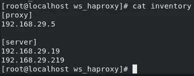
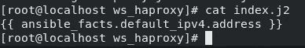

# 使用 Ansible 动态配置负载平衡器(HAProxy)

> 原文：<https://levelup.gitconnected.com/configuring-load-balancer-haproxy-dynamically-with-ansible-9de3923a67b4>

**任务 Part1** :使用 Ansible playbook 配置反向代理，即 HAProxy，并在每次新的管理节点(配置有 Apache Webserver)加入清单时自动更新其配置文件。

**第 2 部分:**在 AWS 上使用实例配置与第 1 部分相同的设置。

那么让我们来了解一下什么是 HAProxy… **HAProxy** 是一个免费的、非常快速和可靠的解决方案，它为基于 TCP 和 HTTP 的应用程序提供了[高可用性](http://en.wikipedia.org/wiki/High_availability)、[负载平衡](http://en.wikipedia.org/wiki/Load_balancer)和代理。它特别适用于高流量的网站，并为世界上许多访问量最大的网站提供支持。我们特别要用它来实现后端 Apache 服务器之间的反向代理和负载平衡。

现在，在我们开始之前，我们必须首先了解如何集成 Apache Webserver 和 HAProxy。如果你知道如何使用 Apache Webserver，HAProxy 只是另一个配置文件。HAProxy 的典型配置文件如下所示:


haproxy.cfg 示例片段

片段中突出显示的部分是必须更改的部分。`bind`是告诉 HAProxy 必须绑定到哪个端口才能工作。`server`是我们必须告诉 HAProxy 我们的后端服务器在哪里工作的部分，也是 HAProxy 识别它们的名称，即`app1`和`app2.`

但是每当调用一个新的后端时，手动配置将会非常非常乏味，因此我们需要 [Ansible](https://divya-kurothe.medium.com/automation-with-ansible-6661c61a3cee) 的自动化能力。因此，为了执行这个任务，我们必须编写一个[可理解的剧本](https://prithvirajsingh1604.medium.com/configuring-hadoop-with-ansible-how-to-write-a-play-book-24bd9a3648bc)，这样我们就可以一次又一次地重复完整的任务，只需点击一个按钮或发出一个命令。

我们这里的剧本可以很容易地创建。那么，挑战是什么？有人可能会问，执行这样一项任务的挑战是，我们必须为我们添加的每 *n* 个后端服务器添加 *n* 个行。在开发环境中，web 服务器的数量是可以管理的，但是当我们转向测试、生产前以及最终的生产环境时，web 服务器的数量会变得太多，一个人无法单独管理。虽然我们可以雇用许多人来完成这项任务，但这在金钱和时间方面会非常昂贵，因为人类比计算机慢得多。因此，我们希望我们的计算机也能做到这一点，在计算机开始执行所需的工作后，无需任何人工干预。

因此，为了帮助我们管理数量不断变化的后端服务器，我们必须借助**模板**特别是**Jinja 2……**Jinja 是一个快速、富于表现力、可扩展的模板引擎。模板中的特殊占位符允许编写类似 Python 语法的代码。但是怎么做呢？如前所述，特殊的占位符允许我们编写类似 python 的代码。Ansible 预装了使用 Jinja(Jinja2)模板将内容从一个地方(在控制器节点中)动态复制到另一个地方(在目标节点中)的功能。因此，我们可以简单地应用一个`for`循环，同时将我们的配置文件从模板复制到它的原始位置，这将是解决我们问题的最简单的方法…

下面是我们为此任务创建的行动手册:

```
- hosts: proxy
  vars:
    - s_port: 80
  tasks:

    - name: installing HaProxy...
      package:
        name: haproxy
        state: present

    - name: copying the configuration file...
      template:
        src: haproxy.j2
        dest: /etc/haproxy/haproxy.cfg
      notify: restarting haproxy... 

    - name: starting the service...
      service:
        name: haproxy
        state: started
        enabled: yes
      register: started

    - name: setting up facts...
      set_fact:
        condition_restart: "{{ started.changed==False }}"

  handlers:
    - name: restarting haproxy...
      service: 
        name: haproxy
        state: restarted
      when: condition_restart

- hosts: server
  tasks:
    - name: installing httpd...
      package:
        name: httpd
        state: present

    - name: starting service...
      service:
        name: httpd
        state: started
        enabled: yes

    - name: copying content...
      template:
        src: index.j2
        dest: /var/www/html/index.html
```

剧本有两个剧本。第一个在主机`proxy`上运行，我们将在那里安装 HAProxy，配置 HAProxy，启动或重启 HAProxy 的服务。为了配置 HAProxy，我们将使用模板模块，它将把 Jinja2 代码转换成可用的格式，然后将其复制到所需的位置。我们使用的模板如下所示:


haproxy.j2 片段

`s_port` 是一个变量，其值由剧本本身定义。第二部分是 Jinja2 for 循环，通过它我们将为我们在库存文件中添加的每个后端服务器打印`server app<n> <IP> check`。该任务的清单文件如下所示:



其中`proxy`是 HAProxy 服务器组，而`server`是 Apache 服务器组，我们将使用它作为我们的后端服务器。

第二个脚本将`server`作为目标节点，我们将在这里下载 Apache Webserver(HTTPD)，使用模板来更改根文档，这样我们的网页就只是系统本身的 IP 地址，最后启动 HTTPD 的服务。这个剧本的模板如下所示:



这里我们使用 [ansible_facts](https://docs.ansible.com/ansible/latest/user_guide/playbooks_vars_facts.html) 获取 IP 并打印到所需的位置。让我们测试剧本并检查我们是否得到了合适的结果(使用 curl)。


为我们的剧本运行输出

剧本运行良好，现在让我们使用 curl 命令测试设置…


卷曲试验

这就是我们想要的设置功能…

**第 2 部分:**对于这一部分，我们需要做的唯一更改是对我们的库存(更改为适当的 IP 集)和 ansible.cfg 文件(用于[权限提升](https://docs.ansible.com/ansible/latest/user_guide/become.html))。

清单不会有太大变化，我们只需要将 IP 地址更改为所需系统的 IP 地址。此外，由于我们在这里不能使用密码，我们将对 SSH 使用私钥文件。


新库存

ansible.cfg 将被改为如下形式:


这里我们必须将 remote_user 改为 ec2-user，因为 AWS 不允许我们通过 SSH 直接使用 root，因此我们需要额外的`[privilege_escalation]`部分。现在你既可以自己创建所有需要的文件，也可以使用 GitHub，如下所示:

从 GitHub 复制文件时可以运行的命令

现在，您可以使用复制的文件作为基础进行构建。

另外，要在您的 ec2 实例(Amazon Linux)中安装 Ansible，您可以遵循以下步骤:


安装 Ansible

***边注:*** *亚马逊 Linux 不支持 HAProxy，所以用 RedHat 代替。*

现在让我们测试我们的剧本和我们新的 Ansible 配置…


Play1 运行成功


Play2 运行成功

因此，行动手册运行成功…

现在让我们做一个卷曲测试:


**这项任务是与@Prithviraj Singh 合作完成的，我要感谢他的指导和支持。**