# Git 术语中令人困惑的术语

> 原文：<https://levelup.gitconnected.com/confusing-terms-in-the-git-terminology-c7115d6febc7>

**Git** 和[GitHub是当今编程界开源的核心。然而，有许多令人困惑的术语看起来很相似，但却有着相互冲突的含义和用法。让我们通过解读这些令人困惑的术语的潜在含义来揭开它们的神秘面纱。](http://github.com/)

**注** : *本文期望对 Git 和 GitHub 有所了解。*

来源:[https://dribbble.com/](https://cdn.dribbble.com/)

# **起点和上游**

来自 [Git 文档](https://git-scm.com/doc):

> 当您派生一个 repo 并在本地克隆它时，会有一个名为 origin 的默认遥控器指向您在 GitHub 上的派生，而不是派生它的原始 repo。
> 
> 为了跟踪原始回购，您需要添加另一个名为 upstream 的远程

当你在克隆一个分叉的回购协议时，就会产生这种困惑。**上游**是您将用来**从原始回购**中获取的内容，以保持您的本地副本与您想要参与的项目同步。同时， **Origin** 是您将用来**拉和推代码到您的 fork** 的地方，然后您可以通过发出拉请求向上游回购做出贡献。

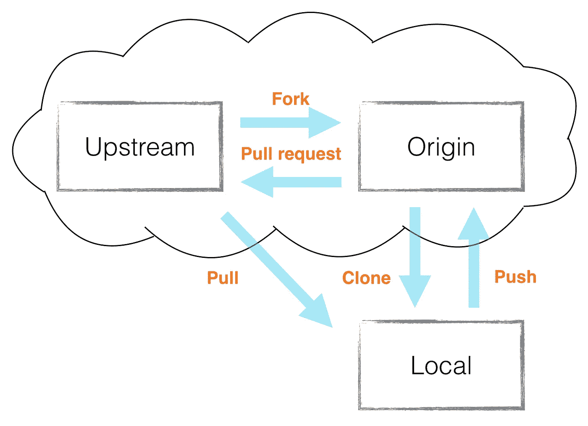

资料来源:https://github.com/sf-wdi-21/notes

*   ***记住**** :像“upstream”和“origin”这样的远程只是存储存储库 URL 的别名。它们可以被命名为任何名称，但是将原始回购的远程设置为上游是一个惯例。

# **取和拉**

来自 [Git 文档](https://git-scm.com/doc):

> git fetch 可以从单个命名的存储库或 URL 获取，也可以同时从几个存储库获取。
> 
> git pull 将远程存储库中的更改合并到当前分支中。

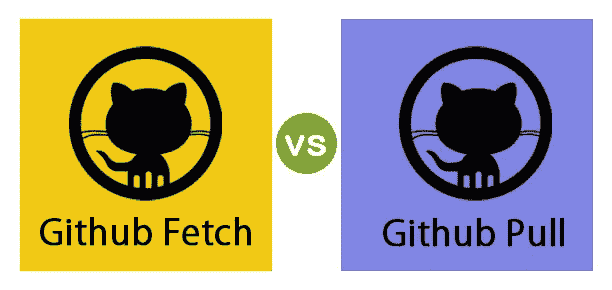

来源:[https://educba.com/](https://educba.com/)

**git fetch** 命令告诉您的本地 git 从原始文件中检索最新的元数据信息，但不进行任何文件传输。这更像是检查是否有任何可用的更改。 **git pull** ，另一方面， **git fetch** 和**将变更从远程库应用到本地库**。

*** *记住**** : git pull 是 git fetch 后跟 git merge FETCH_HEAD 的简写。

简单地说， **git fetch** 可用于了解自上次拉操作以来远程回购/分支中发生的变化。这有助于在执行 **git pull** 之前进行检查，这可能会更改您当前分支和工作副本中的文件，并可能丢失您的更改，等等。

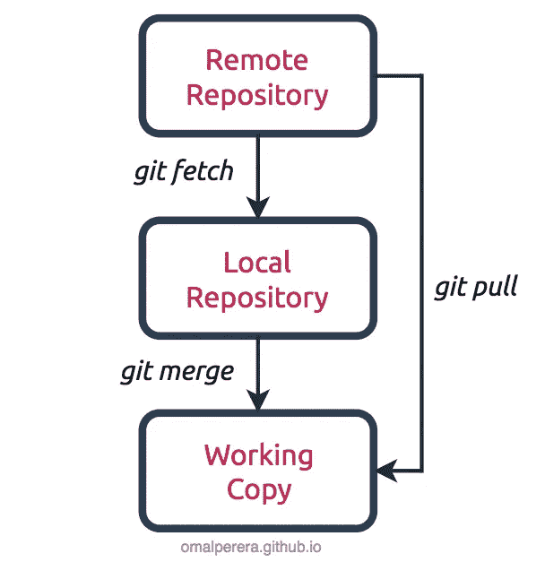

git fetch 在几个场景中会有帮助，其中之一就是稍微优化你的工作流以减少网络访问。每个 git pull 都涉及一个 git fetch，所以如果您想在五个不同的分支上获得 pull，您有四个多余的 git fetch 调用。

此外， **git fetch** 通常可以在您离线工作或在旅途中工作(可能是在火车上)的情况下节省您的时间，但是您希望确保在远程工作时可以获得每个分支的所有更改。当你在网络上时，你可以简单地获取一次，然后离开。以后，在没有网络连接的情况下，可以手动 git 结帐分支；git merge origin/branch 合并您之前获取的更改。

# **开关和检测**

来自 [Git 文档](https://git-scm.com/doc):

> git switch 切换到指定的分支。工作树和索引被更新以匹配分支。
> 
> git checkout 更新工作树中的文件，以匹配索引或指定树中的版本。

git switch 不是一个新特性，而是一个额外的切换/更改分支特性的命令，在重载的 git checkout 命令中已经有了。因此，为了分离功能， **Git 2.23** 引入了新的 git switch branch 命令，试图在不破坏向后兼容性的情况下开始缩减责任。

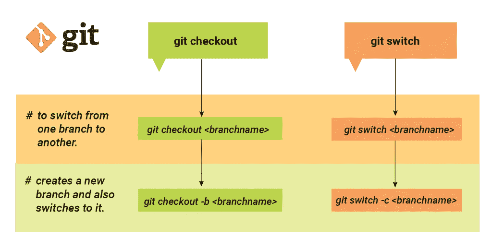

来源: [https://bluecast.tech](https://bluecast.tech)

git checkout 命令对三个不同的实体进行操作:文件、提交和分支。简而言之，如果你修改了一个文件，但没有进行修改，那么**git check out<filename>**将放弃修改，你将留在同一个分支上，而**git check out<commit hash>**让你回滚到旧的提交，而**git check out<branch>**将切换分支，因此，为了避免这种混淆，引入了 **git switch** 。

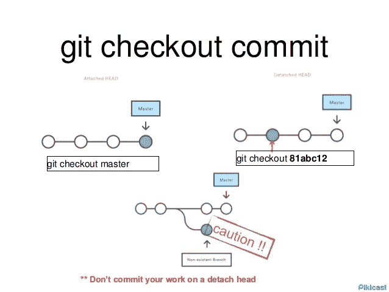

来源:[https://slideshare.net/](https://www.slideshare.net/)

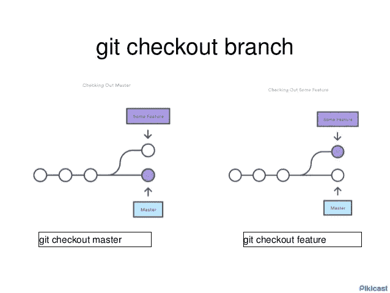

来源:https://slideshare.net/

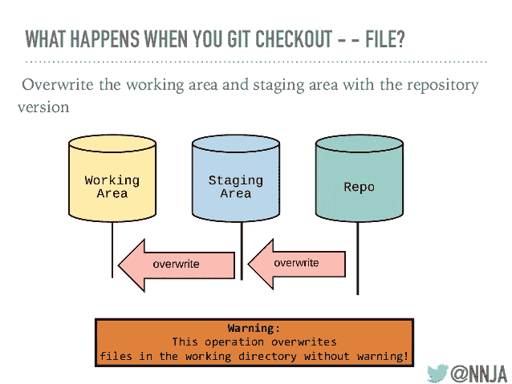

来源:https://slideshare.net/

*   **头~和 HEAD^**

**~(波浪号)**和 **^(caret)** 符号用于指向相对于特定提交的位置。这些符号与提交引用一起使用，通常是**头**(表示分支的当前快照)或提交散列。

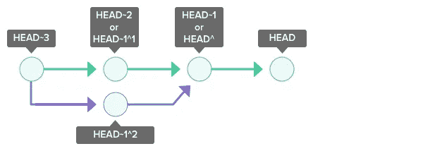

来源:[https://backlog.com](https://backlog.com)

~n 指第 n 个祖父母。HEAD~1 指的是提交的第一个父级。HEAD~2 指的是提交的第一个父对象的第一个父对象。

^n 指的是第 n 个父母。HEAD 是指提交的第一个父级。HEAD 是指提交的第二个父级。在合并提交中，一个提交可以有两个父提交。

# **恢复和复位**

来自 [Git 文档](https://git-scm.com/doc):

> git revert 用于记录一些新的提交，以逆转一些早期提交的影响(通常只是一个错误的提交)。
> 
> git-reset 将当前磁头复位到指定状态。

**git revert** 命令用于撤销对存储库提交历史的更改。它用于反转由特定提交引入的更改，并将结果反转内容附加到新的提交中。这对于跟踪由单次提交引入的 bug 非常有用，这样可以通过 git revert 命令自动修复它。

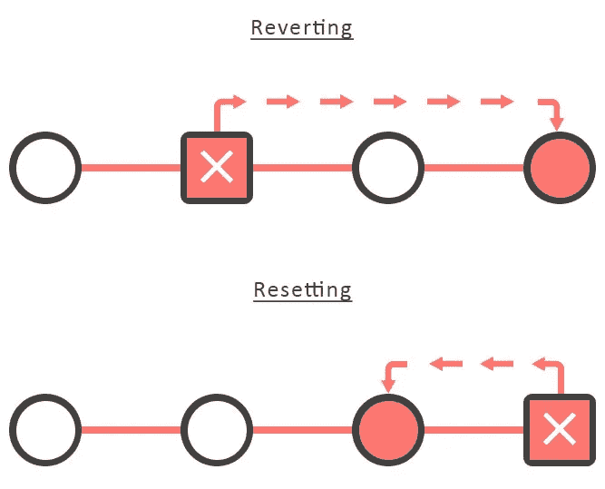

来源:[https://blog.nakulrajput.com/](https://blog.nakulrajput.com/)

**git reset** 是另一个用于撤销更改的复杂且通用的 git 命令，然而，git reset 会移动 HEAD ref 指针和当前分支 ref 指针，而 **git revert** 命令不会移动 HEAD ref 指针。

简而言之，如果你已经把你的分支推到了某个地方，或者有人从你的分支中撤出，你唯一的选择就是 **git revert** 来撤销更改。同时，如果您已经将提交完全保持在本地和私有，您可以简单地使用 **git reset** 来撤销更改。

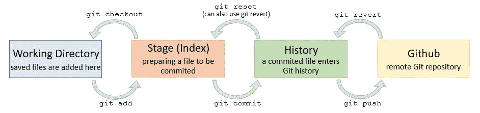

来源:[https://ohi-science.org/](https://ohi-science.org/)

# **合并和重设基础**

来自 [Git 文档](https://git-scm.com/doc):

> git merge 将来自命名提交的更改(自从它们的历史从当前分支中分离出来)合并到当前分支中。
> 
> git-rebase 在另一个基础技巧之上重新应用提交。

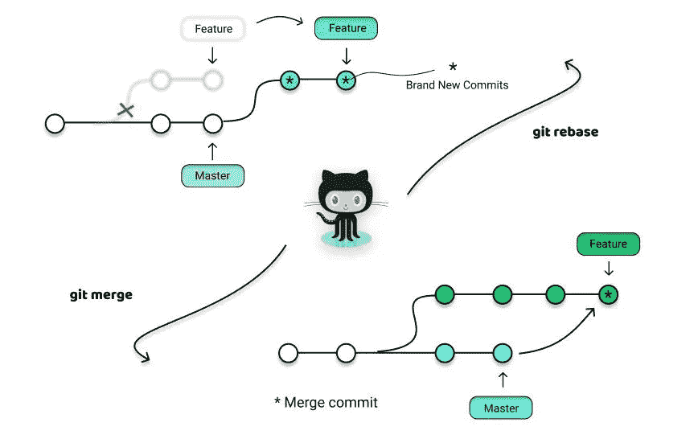

来源:https://miro.medium.com/

这两个命令都是为了将一个分支中的变更集成到另一个分支中而设计的，不同之处在于它们执行的方式。**重设基础**是将一系列提交移动或合并到一个新的基础提交的过程，而**合并**绑定了两个分支的历史，并且总是一个向前移动的变更记录，因此，不会以任何方式改变现有的分支。

重定基础的主要好处是您可以获得一个更加清晰的项目历史，因为它消除了 git merge 所需要的不必要的合并提交。

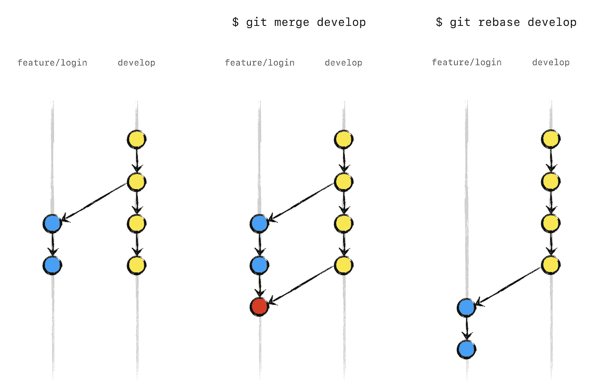

来源:[https://jeffkreeftmeijer.com/](https://jeffkreeftmeijer.com/)

通过将每个本地提交一次一个地转移到更新后的主分支，来进行重新定基。这意味着您在逐个提交的基础上捕获合并冲突，而不是在一次大规模的合并提交中解决所有冲突。

此外，重定基础可以更容易地找出哪里引入了 bug，如果有必要，可以回滚对项目影响最小的更改。

来源:[https://dribbble.com/](https://cdn.dribbble.com/)

本文到此为止。我希望它能帮助你解开与 git 和 GitHub 相关的一些令人困惑的术语。请提出您的宝贵建议和反馈。

如果你想和我联系，请点击下面的链接:

[LinkedIn](https://www.linkedin.com/in/pragati-verma-b22a1b17b/)|[GitHub](https://github.com/PragatiVerma18)|[Twitter](https://twitter.com/Pragati56242726)|[Medium](https://medium.com/@itispragativerma)